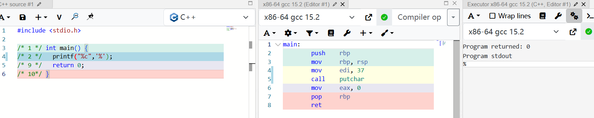
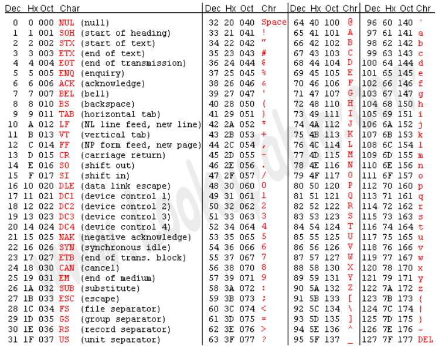

# 第 1 章 程序的基本概念

## 1. 程序和编程语言

> 1、解释执行的语言相比编译执行的语言有什么优缺点？
>
> 这是我们的第一个思考题。本书的思考题通常要求读者系统地总结当前小节的知识，结合以前的知识，并经过一定的推理，然后作答。本书强调的是基本概念，读者应该抓住概念的定义和概念之间的关系来总结，比如本节介绍了很多概念：*程序*由*语句*或*指令*组成，计算机只能执行*低级语言*中的*指令*（汇编语言的指令要先转成机器码才能执行），*高级语言*要执行就必须先翻译成低级语言，翻译的方法有两种－－*编译*和*解释*，虽然有这样的不便，但高级语言有一个好处是*平台无关性*。什么是*平台*？一种平台，就是一种*体系结构*，就是一种*指令集*，就是一种*机器语言*，这些都可看作是一一对应的，上文并没有用“一一对应”这个词，但读者应该能推理出这个结论，而高级语言和它们不是一一对应的，因此高级语言是*平台无关*的，概念之间像这样的数量对应关系尤其重要。那么编译和解释的过程有哪些不同？主要的不同在于什么时候翻译和什么时候执行。
>
> 现在回答这个思考题，根据编译和解释的不同原理，你能否在执行效率和平台无关性等方面做一下比较？

解释执行的优点：首先它只有在准备执行的时候才调用解释器进行翻译，更灵活，对于超长的程序也可以立即开始执行，且跨平台时不会有无用的功能，比如说编译执行的语言，在这个平台编译后，更换平台必须全部重新编译，解释执行语言就不用。

解释执行的缺点：对于要频繁执行且不常更改的程序，效率会低，每次执行都必须每条指令都进行解释，而编译执行程序，在一次编译后，之后的执行都可以一直直接使用机器码执行了。

## 2. 自然语言和形式语言

自然语言（Natural Language）就是人类讲的语言，比如汉语、英语和法语。这类语言不是人为设计（虽然有人试图强加一些规则）而是自然进化的。形式语言（Formal Language）是为了特定应用而人为设计的语言。例如数学家用的数字和运算符号、化学家用的分子式等。编程语言也是一种形式语言，是专门设计用来表达计算过程的形式语言。

## 3. 程序的调试

调试的过程可能会让你感到一些沮丧，但调试也是编程中最需要动脑的、最有挑战和乐趣的部分。从某种角度看调试就像侦探工作，根据掌握的线索来推断是什么原因和过程导致了你所看到的结果。调试也像是一门实验科学，每次想到哪里可能有错，就修改程序然后再试一次。如果假设是对的，就能得到预期的正确结果，就可以接着调试下一个Bug，一步一步逼近正确的程序；如果假设错误，只好另外再找思路再做假设。“**当你把不可能的全部剔除，剩下的——即使看起来再怎么不可能——就一定是事实。**”。

编程和调试是一回事，编程的过程就是逐步调试直到获得期望的结果为止。你应该总是从一个能正确运行的小规模程序开始，每做一步小的改动就立刻进行调试，这样的好处是总有一个正确的程序做参考：如果正确就继续编程，如果不正确，那么一定是刚才的小改动出了问题。

## 4. 第一个程序

将这个程序保存成`main.c`，然后编译执行：

```
$ gcc main.c
$ ./a.out
Hello, world.
```

`gcc`是Linux平台的C编译器，编译后在当前目录下生成可执行文件`a.out`，直接在命令行输入这个可执行文件的路径就可以执行它。如果不想把文件名叫`a.out`，可以用`gcc`的`-o`参数自己指定文件名：

```
$ gcc main.c -o main
$ ./main
Hello, world.
```

*一个好的习惯是打开`gcc`的`-Wall`选项，也就是让`gcc`提示所有的警告信息，不管是严重的还是不严重的，然后把这些问题从代码中全部消灭*。

```
$ gcc -Wall main.c
```

> 1、尽管编译器的错误提示不够友好，但仍然是学习过程中一个很有用的工具。你可以像上面那样，从一个正确的程序开始每次改动一小点，然后编译看是什么结果，如果出错了，就尽量记住编译器给出的错误提示并把改动还原。因为错误是你改出来的，你已经知道错误原因是什么了，所以能很容易地把错误原因和错误提示信息对应起来记住，这样下次你在毫无防备的情况下撞到这个错误提示时就会很容易想到错误原因是什么了。这样反复练习，有了一定的经验积累之后面对编译器的错误提示就会从容得多了。


# 第 2 章 常量、变量和表达式

## 1. 继续Hello World

**例 2.1. 带更多注释的Hello World**

```
#include <stdio.h>

/* 
 * comment1
 * main: generate some simple output
 */

int main(void)
{
	printf(/* comment2 */"Hello, world.\n"); /* comment3 */
	return 0;
}
```


第一个注释跨了四行，头尾两行是注释的界定符（Delimiter）/*和*/，中间两行开头的*号（Asterisk）并没有特殊含义，只是为了看起来整齐，这不是语法规则而是大家都遵守的**C代码风格**（Coding Style）之一。*好的代码风格要求缩进整齐，每个语句一行，适当留空行。

使用注释需要注意两点：

1. 注释不能嵌套（Nest）使用，就是说一个注释的文字中不能再出现/*和*/了，例如`/* text1 /* text2 */ text3 */`是错误的，编译器只把`/* text1 /* text2 */`看成注释，后面的` text3 */`无法解析，因而会报错。
2. 有的C代码中有类似`// comment`的注释，两个/斜线（Slash）表示从这里直到该行末尾的所有字符都属于注释，这种注释不能跨行，也不能穿插在一行代码中间。这是从C++借鉴的语法，在C99中被标准化。

**表 2.1. C标准规定的转义字符**

| \'   | 单引号'（Single Quote或Apostrophe） |
| ---- | ----------------------------------- |
| \"   | 双引号"                             |
| \?   | 问号?（Question Mark）              |
| \\   | 反斜线\（Backslash）                |
| \a   | 响铃（Alert或Bell）                 |
| \b   | 退格（Backspace）                   |
| \f   | 分页符（Form Feed）                 |
| \n   | 换行（Line Feed）                   |
| \r   | 回车（Carriage Return）             |
| \t   | 水平制表符（Horizontal Tab）        |
| \v   | 垂直制表符（Vertical Tab）          |

可见转义序列有两个作用：一是把普通字符转义成特殊字符，例如把字母n转义成换行符；二是把特殊字符转义成普通字符，例如\和"是特殊字符，转义后取它的字面值。

## 2. 常量

`printf`中的第一个字符串称为格式化字符串（Format String），它规定了后面几个常量以何种格式插入到这个字符串中，在格式化字符串中%号（Percent Sign）后面加上字母c、d、f分别表示字符型、整型和浮点型的转换说明（Conversion Specification），转换说明只在格式化字符串中占个位置，并不出现在最终的打印结果中，这种用法通常叫做占位符（Placeholder）。这也是一种字面意思与真实意思不同的情况，但是转换说明和转义序列又有区别：*转义序列是编译时处理的，而转换说明是在运行时调用`printf`函数处理的*。源文件中的字符串字面值是`"character: %c\ninteger: %d\nfloating point: %f\n"`，`\n`占两个字符，而编译之后保存在可执行文件中的字符串是`character： %c换行integer: %d换行floating point: %f换行`，`\n`已经被替换成一个换行符，而`%c`不变，然后在运行时这个字符串被传给`printf`，`printf`再把其中的`%c`、`%d`、`%f`解释成转换说明。

> 1、总结前面介绍的转义序列的规律，想想在`printf`的格式化字符串中怎么表示一个%字符？写个小程序试验一下。



## 3. 变量

常量有不同的类型，因此变量也有不同的类型，变量的类型也决定了它所占的存储空间的大小。

### 声明和定义

C语言中的声明（Declaration）有变量声明、函数声明和类型声明三种。如果一个变量或函数的声明要求编译器为它分配存储空间，那么也可以称为定义（Definition），因此定义是声明的一种。在接下来几章的示例代码中变量声明都是要分配存储空间的，因而都是定义，等学到[第 2 节 “定义和声明”](http://akaedu.github.io/book/ch20s02.html#link.defdecl)我们会看到哪些变量声明不分配存储空间因而不是定义。在下一章我们会看到函数的定义和声明也是这样区分的，分配存储空间的函数声明可以称为函数定义。从[第 7 章 *结构体*](http://akaedu.github.io/book/ch07.html#struct)开始我们会看到类型声明，声明一个类型是不分配存储空间的，但似乎叫“类型定义”听起来也不错，所以在本书中“类型定义”和“类型声明”表示相同的含义。声明和语句类似，也是以;号结尾的，但是在语法上声明和语句是有区别的，语句只能出现在{}括号中，而声明既可以出现在{}中也可以出现在所有{}之外。

浮点型有三种，`float`是单精度浮点型，`double`是双精度浮点型，`long double`是精度更高的浮点型。

要注意，***一般来说应避免使用以下划线开头的标识符***，以下划线开头的标识符只要不和C语言关键字冲突的都是合法的，但是往往被编译器用作一些功能扩展，C标准库也定义了很多以下划线开头的标识符，所以除非你对编译器和C标准库特别清楚，一般应避免使用这种标识符，以免造成命名冲突。

## 4. 赋值

在初始化语句中，等号右边的值叫做Initializer。注意，**初始化是一种特殊的声明，而不是一种赋值语句**。就目前来看，先定义一个变量再给它赋值和定义这个变量的同时给它初始化所达到的效果是一样的，C语言的很多语法规则既适用于赋值也适用于初始化，但在以后的学习中你也会了解到它们之间的不同，请在学习过程中注意总结赋值和初始化的相同和不同之处。

## 5. 表达式

常量和变量都可以参与加减乘除运算，例如`1+1`、`hour-1`、`hour * 60 + minute`、`minute/60`等。这里的+ - * /称为运算符（Operator），而参与运算的常量和变量称为操作数（Operand），上面四个由运算符和操作数所组成的算式称为表达式（Expression）。

运算符是有优先级（Precedence）的，如果不希望按默认的优先级计算则要加()括号

*任何表达式都有值和类型两个基本属性*

等号运算符还有一个和+ - * /不同的特性，如果一个表达式中出现多个等号，不是从左到右计算而是从右到左计算，例如：

```
int total_minute, total;
total = total_minute = hour * 60 + minute;
```

计算顺序是先算`hour * 60 + minute`得到一个结果，然后算右边的等号，就是把`hour * 60 + minute`的结果赋给变量`total_minute`，这个结果同时也是整个表达式`total_minute = hour * 60 + minute`的值，再算左边的等号，即把这个值再赋给变量`total`。同样优先级的运算符是从左到右计算还是从右到左计算称为运算符的结合性（Associativity）。+ - * /是左结合的，等号是右结合的。

等号左边的表达式要求表示一个存储位置而不是一个值，这是等号运算符和+ - * /运算符的又一个显著不同。有的表达式既可以表示一个存储位置也可以表示一个值，而有的表达式只能表示值，不能表示存储位置，例如`minute + 1`这个表达式就不能表示存储位置，放在等号左边是语义错误。表达式所表示的存储位置称为左值（lvalue）（允许放在等号左边），而以前我们所说的表达式的值也称为右值（rvalue）（只能放在等号右边）。上面的话换一种说法就是：**有的表达式既可以做左值也可以做右值，而有的表达式只能做右值**。目前我们学过的表达式中只有变量可以做左值，可以做左值的表达式还有几种，以后会讲到。

我们看一个有意思的例子，如果定义三个变量`int a, b, c;`，表达式`a = b = c`是合法的，先求`b = c`的值，再把这个值赋给`a`，而表达式`(a = b) = c`是不合法的，先求`(a = b)`的值没问题，但`(a = b)`这个表达式不能再做左值了，因此放在`= c`的等号左边是错的。

在C语言中整数除法取的既不是Floor也不是Ceiling，无论操作数是正是负总是把小数部分截掉，在数轴上向零的方向取整（Truncate toward Zero），或者说当操作数为正的时候相当于Floor，当操作符为负的时候相当于Ceiling。

> 1、假设变量`x`和`n`是两个正整数，我们知道`x/n`这个表达式的结果要取Floor，例如`x`是17，`n`是4，则结果是4。如果希望结果取Ceiling应该怎么写表达式呢？例如`x`是17，`n`是4，则结果是5；`x`是16，`n`是4，则结果是4。

可以写为 (x+n-1)/n

## 6. 字符类型与字符编码

字符常量或字符型变量也可以当作整数参与运算，例如：

```
printf("%c\n", 'a'+1);
```

执行结果是`b`。

我们知道，符号在计算机内部也用数字表示，每个字符在计算机内部用一个整数表示，称为字符编码（Character Encoding），目前最常用的是ASCII码



之前我们说“整型”是指`int`型，而现在我们知道`char`型本质上就是整数，只不过取值范围比`int`型小，所以*以后我们把`char`型和`int`型统称为整数类型（Integer Type）或简称整型*，以后我们还要学习几种类型也属于整型，将在[第 1 节 “整型”](http://akaedu.github.io/book/ch15s01.html#type.integertype)详细介绍。

字符`'a'`\~`'z'`、`'A'`\~`'Z'`、`'0'`\~`'9'`的ASCII码都是连续的，因此表达式`'a'+25`和`'z'`的值相等，`'0'+9`和`'9'`的值也相等。注意`'0'`\~`'9'`的ASCII码是十六进制的30\~39，和整数值0\~9是不相等的。

字符也可以用ASCII码转义序列表示，这种转义序列由\加上1\~3个八进制数字组成，或者由`\x`或大写`\X`加上1\~2个十六进制数字组成，可以用在字符常量或字符串字面值中。例如`'\0'`表示NUL字符（Null Character），`'\11'`或`'\x9'`表示Tab字符，`"\11"`或`"\x9"`表示由Tab字符组成的字符串。注意`'0'`的ASCII码是48，而`'\0'`的ASCII码是0，两者是不同的。

# 第 3 章 简单函数

## 1. 数学函数

现在我们可以完全理解`printf`语句了：原来`printf`也是一个函数，上例中的`printf("sin(pi/2)=%f\nln1=%f\n", sin(pi/2), log(1.0))`是带三个参数的函数调用，而函数调用也是一种表达式，因此`printf`语句也是表达式语句的一种。但是`printf`感觉不像一个数学函数，为什么呢？因为像`log`这种函数，我们传进去一个参数会得到一个返回值，我们调用`log`函数就是为了得到它的返回值，至于`printf`，我们并不关心它的返回值（事实上它也有返回值，表示实际打印的字符数），我们调用`printf`不是为了得到它的返回值，而是为了利用它所产生的副作用（Side Effect）－－打印。**C语言的函数可以有Side Effect，这一点是它和数学函数在概念上的根本区别**。

Side Effect这个概念也适用于运算符组成的表达式。比如`a + b`这个表达式也可以看成一个函数调用，把运算符`+`看作函数，它的两个参数是`a`和`b`，返回值是两个参数的和，传入两个参数，得到一个返回值，并没有产生任何Side Effect。而赋值运算符是有Side Effect的，如果把`a = b`这个表达式看成函数调用，返回值就是所赋的值，既是`b`的值也是`a`的值，但除此之外还产生了Side Effect，就是变量`a`被改变了，改变计算机存储单元里的数据或者做输入输出操作都算Side Effect。

使用`math.h`中声明的库函数还有一点特殊之处，`gcc`命令行必须加`-lm`选项，因为数学函数位于`libm.so`库文件中（这些库文件通常位于`/lib`目录下），`-lm`选项告诉编译器，我们程序中用到的数学函数要到这个库文件里找。本书用到的大部分库函数（例如`printf`）位于`libc.so`库文件中，使用`libc.so`中的库函数在编译时不需要加`-lc`选项，当然加了也不算错，因为这个选项是`gcc`的默认选项。关于头文件和库函数目前理解这么多就可以了，到[第 20 章 *链接详解*](http://akaedu.github.io/book/ch20.html#link)再详细解释。

### C标准库和glibc

C标准主要由两部分组成，一部分描述C的语法，另一部分描述C标准库。C标准库定义了一组标准头文件，每个头文件中包含一些相关的函数、变量、类型声明和宏定义。要在一个平台上支持C语言，不仅要实现C编译器，还要实现C标准库，这样的实现才算符合C标准。不符合C标准的实现也是存在的，例如很多单片机的C语言开发工具中只有C编译器而没有完整的C标准库。

在Linux平台上最广泛使用的C函数库是`glibc`，其中包括C标准库的实现，也包括本书第三部分介绍的所有系统函数。几乎所有C程序都要调用`glibc`的库函数，所以`glibc`是Linux平台C程序运行的基础。`glibc`提供一组头文件和一组库文件，最基本、最常用的C标准库函数和系统函数在`libc.so`库文件中，几乎所有C程序的运行都依赖于`libc.so`，有些做数学计算的C程序依赖于`libm.so`，以后我们还会看到多线程的C程序依赖于`libpthread.so`。以后我说`libc`时专指`libc.so`这个库文件，而说`glibc`时指的是`glibc`提供的所有库文件。

`glibc`并不是Linux平台唯一的基础C函数库，也有人在开发别的C函数库，比如适用于嵌入式系统的`uClibc`。


## 2. 自定义函数

函数定义 → 返回值类型 函数名(参数列表) 函数体
函数体 → { 语句列表 }
语句列表 → 语句列表项 语句列表项 ...
语句列表项 → 语句
语句列表项 → 变量声明、类型声明或非定义的函数声明
非定义的函数声明 → 返回值类型 函数名(参数列表);

给函数命名也要遵循上一章讲过的标识符命名规则。由于我们定义的`main`函数不带任何参数，参数列表应写成`void`。函数体可以由若干条语句和声明组成，C89要求所有声明写在所有语句之前（本书的示例代码都遵循这一规定），而C99的新特性允许语句和声明按任意顺序排列，只要每个标识符都遵循先声明后使用的原则就行。`main`函数的返回值是`int`型的，`return 0;`这个语句表示返回值是0，`main`函数的返回值是返回给操作系统看的，因为`main`函数是被操作系统调用的，通常程序执行成功就返回0，在执行过程中出错就返回一个非零值。比如我们将`main`函数中的`return`语句改为`return 4;`再执行它，执行结束后可以在Shell中看到它的退出状态（Exit Status）：

```
$ ./a.out 
11 and 0 hours
$ echo $?
4
```

`$?`是Shell中的一个特殊变量，表示上一条命令的退出状态。

1. [[K&R\]](http://akaedu.github.io/book/bi01.html#bibli.kr)书上的`main`函数定义写成`main(){...}`的形式，不写返回值类型也不写参数列表，这是Old Style C的风格。Old Style C规定不写返回值类型就表示返回`int`型，不写参数列表就表示参数类型和个数没有明确指出。这种宽松的规定使编译器无法检查程序中可能存在的Bug，增加了调试难度，不幸的是现在的C标准为了兼容旧的代码仍然保留了这种语法，**但读者绝不应该继续使用这种语法**。
2. 其实操作系统在调用`main`函数时是传参数的，`main`函数最标准的形式应该是`int main(int argc, char *argv[])`，在[第 6 节 “指向指针的指针与指针数组”](http://akaedu.github.io/book/ch23s06.html#pointer.parray)详细介绍。C标准也允许`int main(void)`这种写法，如果不使用系统传进来的两个参数也可以写成这种形式。但除了这两种形式之外，定义`main`函数的其它写法都是错误的或不可移植的。

现在澄清一下函数声明、函数定义、函数原型（Prototype）这几个概念。比如`void threeline(void)`这一行，声明了一个函数的名字、参数类型和个数、返回值类型，这称为函数原型。在代码中可以单独写一个函数原型，后面加`;`号结束，而不写函数体，例如：

```
void threeline(void);
```

这种写法只能叫函数声明而不能叫函数定义，只有带函数体的声明才叫定义。上一章讲过，只有分配存储空间的变量声明才叫变量定义，其实函数也是一样，编译器只有见到函数定义才会生成指令，而指令在程序运行时当然也要占存储空间。那么没有函数体的函数声明有什么用呢？它为编译器提供了有用的信息，编译器在翻译代码的过程中，只有见到函数原型（不管带不带函数体）之后才知道这个函数的名字、参数类型和返回值，这样碰到函数调用时才知道怎么生成相应的指令，所以函数原型必须出现在函数调用之前，这也是遵循“先声明后使用”的原则。

由于有Old Style C语法的存在，并非所有函数声明都包含完整的函数原型，例如`void threeline();`这个声明并没有明确指出参数类型和个数，所以不算函数原型，这个声明提供给编译器的信息只有函数名和返回值类型。如果在这样的声明之后调用函数，编译器不知道参数的类型和个数，就不会做语法检查，所以很容易引入Bug。读者需要了解这个知识点以便维护别人用Old Style C风格写的代码，但**绝不应该按这种风格写新的代码**。

如果在调用函数之前没有声明会怎么样呢？有的读者也许碰到过这种情况，我可以解释一下，**但绝不推荐这种写法**。比如按上面的顺序定义这三个函数，但是把开头的两行声明去掉：

```
#include <stdio.h>

int main(void)
{
	printf("Three lines:\n");
	threeline();
	printf("Another three lines.\n");
	threeline();
	return 0;
}

void newline(void)
{
	printf("\n");
}

void threeline(void)
{
	newline();
	newline();
	newline();
}
```

编译时会报警告：

```
$ gcc main.c
main.c:17: warning: conflicting types for ‘threeline’
main.c:6: warning: previous implicit declaration of ‘threeline’ was here
```

但仍然能编译通过，运行结果也对。这里涉及到的规则称为函数的隐式声明（Implicit Declaration），在`main`函数中调用`threeline`时并没有声明它，编译器认为此处隐式声明了`int threeline(void);`，隐式声明的函数返回值类型都是`int`，由于我们调用这个函数时没有传任何参数，所以编译器认为这个隐式声明的参数类型是`void`，这样函数的参数和返回值类型都确定下来了，编译器根据这些信息为函数调用生成相应的指令。然后编译器接着往下看，看到`threeline`函数的原型是`void threeline(void)`，和先前的隐式声明的返回值类型不符，所以报警告。好在我们也没用到这个函数的返回值，所以执行结果仍然正确。

```
如果函数`newline`没有返回值，那么表达式`newline()`不就没有值了吗？然而上一章讲过任何表达式都有值和类型两个基本属性。其实这正是设计`void`这么一个关键字的原因：首先从语法上规定没有返回值的函数调用表达式有一个`void`类型的值，这样任何表达式都有值，不必考虑特殊情况，编译器的语法解析比较容易实现；然后从语义上规定`void`类型的表达式不能参与运算，因此`newline() + 1`这样的表达式不能通过语义检查，从而兼顾了语法上的一致和语义上的不矛盾。
```

## 3. 形参和实参

定义一个带参数的函数，我们需要在函数定义中指明参数的个数和每个参数的类型，定义参数就像定义变量一样，需要为每个参数指明类型，参数的命名也要遵循标识符命名规则。

需要注意的是，定义变量时可以把相同类型的变量列在一起，而定义参数却不可以

记住这条基本原理：**形参相当于函数中定义的变量，调用函数传递参数的过程相当于定义形参变量并且用实参的值来初始化**。

为什么我们每次调用`printf`传的实参个数都不一样呢？因为C语言规定了一种特殊的参数列表格式，用命令`man 3 printf`可以查看到`printf`函数的原型：

```
int printf(const char *format, ...);
```

第一个参数是`const char *`类型的，后面的...可以代表0个或任意多个参数，这些参数的类型也是不确定的，这称为可变参数（Variable Argument），[第 6 节 “可变参数”](http://akaedu.github.io/book/ch24s06.html#interface.va)将会详细讨论这种格式。总之，每个函数的原型都明确规定了返回值类型以及参数的类型和个数，即使像`printf`这样规定为“不确定”也是一种明确的规定，调用函数时要严格遵守这些规定，有时候我们把函数叫做接口（Interface），调用函数就是使用这个接口，使用接口的前提是必须和接口保持一致。

### Man Page

Man Page是Linux开发最常用的参考手册，由很多页面组成，每个页面描述一个主题，这些页面被组织成若干个Section。FHS（Filesystem Hierarchy Standard）标准规定了Man Page各Section的含义如下：


**表 3.1. Man Page的Section**

| Section | 描述                                                         |
| ------- | ------------------------------------------------------------ |
| 1       | 用户命令，例如`ls(1)`                                        |
| 2       | 系统调用，例如`_exit(2)`                                     |
| 3       | 库函数，例如`printf(3)`                                      |
| 4       | 特殊文件，例如`null(4)`描述了设备文件`/dev/null`、`/dev/zero`的作用 |
| 5       | 系统配置文件的格式，例如`passwd(5)`描述了系统配置文件`/etc/passwd`的格式 |
| 6       | 游戏                                                         |
| 7       | 其它杂项，例如`bash-builtins(7)`描述了`bash`的各种内建命令   |
| 8       | 系统管理命令，例如`ifconfig(8)`                              |


注意区分用户命令和系统管理命令，用户命令通常位于`/bin`和`/usr/bin`目录，系统管理命令通常位于`/sbin`和`/usr/sbin`目录，一般用户可以执行用户命令，而执行系统管理命令经常需要`root`权限。系统调用和库函数的区别将在[第 2 节 “`main`函数和启动例程”](http://akaedu.github.io/book/ch19s02.html#asmc.main)说明。

Man Page中有些页面有重名，比如敲`man printf`命令看到的并不是C函数`printf`，而是位于第1个Section的系统命令`printf`，要查看位于第3个Section的`printf`函数应该敲`man 3 printf`，也可以敲`man -k printf`命令搜索哪些页面的主题包含`printf`关键字。本书会经常出现类似`printf(3)`这样的写法，括号中的3表示Man Page的第3个Section，或者表示“我这里想说的是`printf`库函数而不是`printf`命令”。

> 1、定义一个函数`increment`，它的作用是把传进来的参数加1。例如：
>
> ```
> void increment(int x)
> {
> 	x = x + 1;
> }
> 
> int main(void)
> {
> 	int i = 1, j = 2;
> 	increment(i); /* i now becomes 2 */
> 	increment(j); /* j now becomes 3 */
> 	return 0;
> }
> ```
>
> 我们在`main`函数中调用`increment`增加变量`i`和`j`的值，这样能奏效吗？为什么？
>
> 2、如果在一个程序中调用了`printf`函数却不包含头文件，例如`int main(void) { printf("\n"); }`，编译时会报警告：`warning: incompatible implicit declaration of built-in function ‘printf’`。请分析错误原因。

1、不能奏效，因为实参传入到increment的形参后并没有返回，只是在函数内部给形参加了1，函数也没有返回值，并没有赋给i，j所以外部的i，j都不会变化的

2、因为没有头文件，系统会以为这个printf是一个自定义函数，前面也没有声明，所以编译器会默认使用隐式声明 int printf()，然后没有库函数，编译器也可能会认为其它重名系统函数里的printf，然后发现与预期的不符

## 4. 全局变量、局部变量和作用域

我们把函数中定义的变量称为局部变量（Local Variable），由于形参相当于函数中定义的变量，所以形参也是一种局部变量。在这里“局部”有两层含义：

1、一个函数中定义的变量不能被另一个函数使用。例如`print_time`中的`hour`和`minute`在`main`函数中没有定义，不能使用，同样`main`函数中的局部变量也不能被`print_time`函数使用。

2、每次调用函数时局部变量都表示不同的存储空间。**局部变量在每次函数调用时分配存储空间，在每次函数返回时释放存储空间。**

与局部变量的概念相对的是全局变量（Global Variable），全局变量定义在所有的函数体之外，它们在程序开始运行时分配存储空间，在程序结束时释放存储空间，在任何函数中都可以访问全局变量。

正因为全局变量在任何函数中都可以访问，所以在程序运行过程中全局变量被读写的顺序从源代码中是看不出来的，源代码的书写顺序并不能反映函数的调用顺序。程序出现了Bug往往就是因为在某个不起眼的地方对全局变量的读写顺序不正确，如果代码规模很大，这种错误是很难找到的。而对局部变量的访问不仅局限在一个函数内部，而且局限在一次函数调用之中，从函数的源代码很容易看出访问的先后顺序是怎样的，所以比较容易找到Bug。因此，**虽然全局变量用起来很方便，但一定要慎用，能用函数传参代替的就不要用全局变量**。

如果全局变量和局部变量重名了会怎么样呢？

会优先找局部变量，没有再找全局变量

**局部变量可以用类型相符的任意表达式来初始化，而全局变量只能用常量表达式（Constant Expression）初始化**。例如，全局变量`pi`这样初始化是合法的：

```
double pi = 3.14 + 0.0016;
```

但这样初始化是不合法的：

```
double pi = acos(-1.0);
```

然而局部变量这样初始化却是可以的。程序开始运行时要用适当的值来初始化全局变量，所以初始值必须保存在编译生成的可执行文件中，因此初始值在**编译时**就要计算出来，然而上面第二种Initializer的值必须在程序**运行时**调用`acos`函数才能得到，所以不能用来初始化全局变量。请注意区分编译时和运行时这两个概念。为了简化编译器的实现，C语言从语法上规定全局变量只能用常量表达式来初始化，因此下面这种全局变量初始化是不合法的：

```
int minute = 360;
int hour = minute / 60;
```

虽然在编译时计算出`hour`的初始值是可能的，但是`minute / 60`不是常量表达式，不符合语法规定，所以编译器不必想办法去算这个初始值。

如果全局变量在定义时不初始化则初始值是0，如果局部变量在定义时不初始化则初始值是不确定的。所以，**局部变量在使用之前一定要先赋值**，如果基于一个不确定的值做后续计算肯定会引入Bug。

# 第 4 章 分支语句

## 1. if语句

> 1、以下程序段编译能通过，执行也不出错，但是执行结果不正确（根据[第 3 节 “程序的调试”](http://akaedu.github.io/book/ch01s03.html#intro.debug)的定义，这是一个语义错误），请分析一下哪里错了。还有，既然错了为什么编译能通过呢？
>
> ```
> int x = -1;
> if (x > 0);
> 	printf("x is positive.\n");
> ```

这是因为if(x>0)后面是;，会被认为是空语句，所以x不论何值，对后面的printf都不会有影响的

## 2. if/else语句

`if`语句还可以带一个`else`子句（Clause），例如：

```
if (x % 2 == 0)
	printf("x is even.\n");
else
	printf("x is odd.\n");
```

这里的%是取模（Modulo）运算符，`x%2`表示`x`除以2所得的余数（Remainder），C语言规定%运算符的两个操作数必须是整型的。两个正数相除取余数很好理解，如果操作数中有负数，结果应该是正是负呢？C99规定，如果`a`和`b`是整型，`b`不等于0，则表达式`(a/b)*b+a%b`的值总是等于`a`，再结合[第 5 节 “表达式”](http://akaedu.github.io/book/expr.expression.html)讲过的整数除法运算要Truncate Toward Zero，可以得到一个结论：**%运算符的结果总是与被除数同号**（想一想为什么）。其它编程语言对取模运算的规定各不相同，也有规定结果和除数同号的，也有不做明确规定的。

%运算符的结果总是与被除数同号是因为，整除总是向靠近0的方向舍，为了让上面的表达式值依旧为a，则舍掉的小数的b倍需要靠a%b补回来，那么就要求%的结果一定是和被除数同号啦

C语言规定，**`else`总是和它上面最近的一个`if`配对**

顺便提一下，浮点型的精度有限，不适合用==运算符做精确比较。以下代码可以说明问题：

```
double i = 20.0;
double j = i / 7.0;
if (j * 7.0 == i)
	printf("Equal.\n");
else
	printf("Unequal.\n");
```

不同平台的浮点数实现有很多不同之处，在我的平台上运行这段程序结果为`Unequal`，即使在你的平台上运行结果为`Equal`，你再把`i`改成其它值试试，总有些值会使得结果为`Unequal`。等学习了[第 4 节 “浮点数”](http://akaedu.github.io/book/ch14s04.html#number.float)你就知道为什么浮点型不能做精确比较了。

但是我在[Compiler Explorer](https://godbolt.org/)选择x86-64 gcc15.2试了好多值都是Equal。。

> 1、写两个表达式，分别取整型变量`x`的个位和十位。
>
> 2、写一个函数，参数是整型变量`x`，功能是打印`x`的个位和十位。

```c
int one = x % 10;
x /= 10;
int ten = x % 10;
```

```c
void printX(int x){
	int one = x % 10;
	x /= 10;
	int ten = x % 10;
	printf("x的个位是%d，十位是%d",one,ten);
}
```

## 3. 布尔代数

目前为止介绍的这些运算符的优先级顺序是：!高于* / %，高于+ -，高于> < >= <=，高于== !=，高于&&，高于||，高于=。写一个控制表达式很可能同时用到这些运算符中的多个，如果记不清楚运算符的优先级一定要多套括号。我们将在[第 4 节 “运算符总结”](http://akaedu.github.io/book/ch16s04.html#op.summary)总结C语言所有运算符的优先级和结合性。

> 1、把代码段
>
> ```c
> if (x > 0 && x < 10);
> else
> 	printf("x is out of range.\n");
> ```
>
> 改写成下面这种形式：
>
> ```c
> if (____ || ____)
> 	printf("x is out of range.\n");
> ```
>
> ____应该怎么填？
>
> 2、把代码段：
>
> ```c
> if (x > 0)
> 	printf("Test OK!\n");
> else if (x <= 0 && y > 0)
> 	printf("Test OK!\n");
> else
> 	printf("Test failed!\n");
> ```
>
> 改写成下面这种形式：
>
> ```c
> if (____ && ____)
> 	printf("Test failed!\n");
> else
> 	printf("Test OK!\n");
> ```
>
> ____应该怎么填？
>
> 3、有这样一段代码：
>
> ```c
> if (x > 1 && y != 1) {
> 	...
> } else if (x < 1 && y != 1) {
> 	...
> } else {
> 	...
> }
> ```
>
> 要进入最后一个`else`，x和y需要满足条件____ || ____。这里应该怎么填？
>
> 4、以下哪一个if判断条件是多余的可以去掉？这里所谓的“多余”是指，某种情况下如果本来应该打印`Test OK!`，去掉这个多余条件后仍然打印`Test OK!`，如果本来应该打印`Test failed!`，去掉这个多余条件后仍然打印`Test failed!`。
>
> ```c
> if (x<3 && y>3)
> 	printf("Test OK!\n");
> else if (x>=3 && y>=3)
> 	printf("Test OK!\n");
> else if (z>3 && x>=3)
> 	printf("Test OK!\n");
> else if (z<=3 && y>=3)
> 	printf("Test OK!\n");
> else
> 	printf("Test failed!\n");
> ```

1、

```c
if (x <= 0 || x >= 10)
	printf("x is out of range.\n");
```

2、

```c
if (x <= 0 && y <= 0)
	printf("Test failed!\n");
else
	printf("Test OK!\n");
```

3、

```c
x == 1 || y == 1
```

4、

当y>3时，不论x是何值，都会输出Test OK!，所以后面比较y=3即可

```c
if (y>3)
	printf("Test OK!\n");
else if (x>=3 && y=3)
	printf("Test OK!\n");
else if (z>3 && x>=3)
	printf("Test OK!\n");
else if (z<=3 && y=3)
	printf("Test OK!\n");
else
	printf("Test failed!\n");
```

## 4. switch语句

`switch`语句可以产生具有多个分支的控制流程。它的格式是：

switch (控制表达式) {
case 常量表达式： 语句列表
case 常量表达式： 语句列表
...
default： 语句列表
}

注意switch是从对应case开始执行，如果只想执行对应的一个case，一定要在语句后面放break;

`switch`语句不是必不可缺的，显然可以用一组`if ... else if ... else if ... else ...`代替，但是一方面用`switch`语句会使代码更清晰，另一方面，有时候编译器会对`switch`语句进行整体优化，使它比等价的`if/else`语句所生成的指令效率更高。

# 第 5 章 深入理解函数

## 1. return语句

之前我们一直在`main`函数中使用`return`语句，现在是时候全面深入地学习一下了。在有返回值的函数中，`return`语句的作用是提供整个函数的返回值，并结束当前函数返回到调用它的地方。在没有返回值的函数中也可以使用`return`语句，作用是直接返回。

函数的返回值应该这样理解：**函数返回一个值相当于定义一个和返回值类型相同的临时变量并用`return`后面的表达式来初始化**。

**函数的返回值不是左值，或者说函数调用表达式不能做左值**

> ### 习题
>
> 1、编写一个布尔函数`int is_leap_year(int year)`，判断参数`year`是不是闰年。如果某年份能被4整除，但不能被100整除，那么这一年就是闰年，此外，能被400整除的年份也是闰年。
>
> 2、编写一个函数`double myround(double x)`，输入一个小数，将它四舍五入。例如`myround(-3.51)`的值是-4.0，`myround(4.49)`的值是4.0。可以调用`math.h`中的库函数`ceil`和`floor`实现这个函数。

```c
int is_leap_year(int year){
    if( year % 4 == 0 && year % 100 != 0 || year % 400 == 0){
        return 1;
    } else {
        return 0;
    }
}
```

```c
double myround(double x){
	if(x >= 0){
        return floor(x+0.5);
    } else {
        return ceil(x-0.5);
    }
}
```

## 2. 增量式开发

增量式开发非常适合初学者，每写一行代码都编译运行，确保没问题了再写一下行，一方面在写代码时更有信心，另一方面也方便了调试：总是有一个先前的正确版本做参照，改动之后如果出了问题，几乎可以肯定就是刚才改的那行代码出的问题，这样就避免了必须从很多行代码中查找分析到底是哪一行出的问题。在这个过程中`printf`功不可没，你怀疑哪一行代码有问题，就插一个`printf`进去看看中间的计算结果，任何错误都可以通过这个办法找出来。以后我们会介绍程序调试工具`gdb`，它提供了更强大的调试功能帮你分析更隐蔽的错误。但即使有了`gdb`，`printf`这个最原始的办法仍然是最直接、最有效的。
**尽可能复用（Reuse）以前写的代码，避免写重复的代码**。封装就是为了复用，把解决各种小问题的代码封装成函数，在解决第一个大问题时可以用这些函数，在解决第二个大问题时可以复用这些函数。

## 3. 递归

如果定义一个概念需要用到这个概念本身，我们称它的定义是递归的（Recursive）

自己直接或间接调用自己的函数称为递归函数。

**写递归函数时一定要记得写Base Case**，否则即使递推关系正确，整个函数也不正确。

到目前为止我们只学习了全部C语法的一个小的子集，但是现在应该告诉你：这个子集是完备的，它本身就可以作为一门编程语言了，以后还要学习很多C语言特性，但全部都可以用已经学过的这些特性来代替。也就是说，以后要学的C语言特性会使代码写起来更加方便，但不是必不可少的，现在学的这些已经完全覆盖了[第 1 节 “程序和编程语言”](http://akaedu.github.io/book/intro.program.html)讲的五种基本指令了。有的读者会说循环还没讲到呢，是的，循环在下一章才讲，但有一个重要的结论就是*递归和循环是等价的*，用循环能做的事用递归都能做，反之亦然，事实上有的编程语言（比如某些LISP实现）只有递归而没有循环。

> 1、编写递归函数求两个正整数`a`和`b`的最大公约数（GCD，Greatest Common Divisor），使用Euclid算法：
>
> 1. 如果`a`除以`b`能整除，则最大公约数是`b`。
> 2. 否则，最大公约数等于`b`和`a%b`的最大公约数。
>
> Euclid算法是很容易证明的，请读者自己证明一下为什么这么算就能算出最大公约数。最后，修改你的程序使之适用于所有整数，而不仅仅是正整数。
>
> 2、编写递归函数求Fibonacci数列的第`n`项，这个数列是这样定义的：
>
> fib(0)=1
> fib(1)=1
> fib(n)=fib(n-1)+fib(n-2)
>
> 上面两个看似毫不相干的问题之间却有一个有意思的联系：
>
> - Lamé定理
>
>   如果Euclid算法需要k步来计算两个数的GCD，那么这两个数之中较小的一个必然大于等于Fibonacci数列的第k项。
>
> 感兴趣的读者可以参考[[SICP\]](http://akaedu.github.io/book/bi01.html#bibli.sicp)第1.2节的简略证明。

```c
int GCD(int a, int b){
	if(a % b == 0){
        return b;
    } else {
        return GCD(b, a % b);
    }
}
```

首先1是显然的，若a除以b能整除，那b就是最大公约数了 12 15

来看2，当不能整除时，假如c是最大公约数，那a或b除以c余数都为0，所以说a%b除以c余数也为0，因此c就是a%b和b的最大公约数了，所以说a和b的最大公约数就是a%b和b的最大公约数了。

对于所有整数，将负数转为正数即可

```c
int GCD2(int a, int b){
    a = abs(a);
    b = abs(b);
	if(a % b == 0){
        return b;
    } else {
        return GCD(b, a % b);
    }
}
```


```c
int Fibonacci(int n){
    if(n == 0 || n == 1){
        return 1;
    } else {
        return Fibonacci(n-1) + Fibonacci(n-2);
    }
}
```


# 第 6 章 循环语句

## 1. while语句

和`if`语句类似，`while`语句由一个控制表达式和一个子语句组成，子语句可以是由若干条语句组成的语句块。

语句 → while (控制表达式) 语句

如果控制表达式的值为真，子语句就被执行，然后再次测试控制表达式的值，如果还是真，就把子语句再执行一遍，再测试控制表达式的值……这种控制流程称为循环（Loop），子语句称为循环体。如果某次测试控制表达式的值为假，就跳出循环执行后面的`return`语句，如果第一次测试控制表达式的值就是假，那么直接跳到`return`语句，循环体一次都不执行。

此外还有一点不同：看[图 5.2 “factorial(3)的调用过程”](http://akaedu.github.io/book/ch05s03.html#func2.factorial)，在整个递归调用过程中，虽然分配和释放了很多变量，但所有变量都只在初始化时赋值，没有任何变量的值发生过改变，而上面的循环程序则通过对`n`和`result`这两个变量多次赋值来达到同样的目的。前一种思路称为函数式编程（Functional Programming），而后一种思路称为命令式编程（Imperative Programming），这个区别类似于[第 1 节 “程序和编程语言”](http://akaedu.github.io/book/intro.program.html)讲的Declarative和Imperative的区别。

> 1、用循环解决[第 3 节 “递归”](http://akaedu.github.io/book/ch05s03.html#func2.recursion)的所有习题，体会递归和循环这两种不同的思路。
>
> 2、编写程序数一下1到100的所有整数中出现多少次数字9。在写程序之前先把这些问题考虑清楚：
>
> 1. 这个问题中的循环变量是什么？
> 2. 这个问题中的累加器是什么？用加法还是用乘法累积？
> 3. 在[第 2 节 “if/else语句”](http://akaedu.github.io/book/ch04s02.html#cond.ifelse)的习题1写过取一个整数的个位和十位的表达式，这两个表达式怎样用到程序中？

1、

```c
int GCD(int a, int b){
    a = abs(a);
    b = abs(b);
	int c = a%b;
    while(c != 0){
        a = b;
        b = c;
        c = a%b;
    }
    return b;
}
```

```c
int Fibonacci(int n){
    int a = 1;
    int b = 1;
    if(n <= 2){
        return 1;
    } else {
        int c;
        n = n-2;
        while(n--){
			c = a+b;
            a = b;
            b = c;
        }
        return c;
    }
    
}
```

2、

循环变量是当前的数字，用怒骂表示

累加器是9的个数，用cnt表示，用加法累加

对每个数判断个位和10位是不是有9，是了就cnt++

```c
int countNine(void){
    int num = 1;
    int cnt = 0;
    while(num < 100){
        int one = num%10;
		int t = num/10;
		int ten = t%10;
        if(one == 9){
            cnt++;
        }
        if(ten == 9){
            cnt++;
        }
        num++；
    }//因为100里没有9，所以不用考虑100，也不用管百位
    return cnt;
}
```

输出为20


## 2. do/while语句

`while`语句先测试控制表达式的值再执行循环体，而`do/while`语句先执行循环体再测试控制表达式的值。如果控制表达式的值一开始就是假，`while`语句的循环体一次都不执行，而`do/while`语句的循环体仍然要执行一次再跳出循环。其实只要有`while`循环就足够了，`do/while`循环和后面要讲的`for`循环都可以改写成`while`循环，只不过有些情况下用`do/while`或`for`循环写起来更简便，代码更易读。

## 3. for语句

使用循环变量最见的是`for`循环这种形式。`for`语句的语法是：

for (控制表达式1; 控制表达式2; 控制表达式3) 语句

如果不考虑循环体中包含`continue`语句的情况（稍后介绍`continue`语句），这个`for`循环等价于下面的`while`循环：

```c
控制表达式1;
while (控制表达式2) {
	语句
	控制表达式3;
}
```

从这种等价形式来看，控制表达式1和3都可以为空，但控制表达式2是必不可少的，例如`for (;1;) {...}`等价于`while (1) {...}`死循环。C语言规定，如果控制表达式2为空，则认为控制表达式2的值为真，因此死循环也可以写成`for (;;) {...}`。

使用++、--运算符会使程序更加简洁，但也会影响程序的可读性，[[K&R\]](http://akaedu.github.io/book/bi01.html#bibli.kr)中的示例代码大量运用++、--和其它表达式的组合使得代码非常简洁。为了让初学者循序渐进，在接下来的几章中++、--运算符总是单独组成一个表达式而不跟其它表达式组合，从[第 11 章 *排序与查找*](http://akaedu.github.io/book/ch11.html#sortsearch)开始将采用[[K&R\]](http://akaedu.github.io/book/bi01.html#bibli.kr)的简洁风格。

我们看一个有意思的问题：`a+++++b`这个表达式如何理解？应该理解成`a++ ++ +b`还是`a++ + ++b`，还是`a + ++ ++b`呢？应该按第一种方式理解。编译的过程分为词法解析和语法解析两个阶段，在词法解析阶段，编译器总是从前到后找最长的合法Token。把这个表达式从前到后解析，变量名`a`是一个Token，`a`后面有两个以上的+号，在C语言中一个+号是合法的Token（可以是加法运算符或正号），两个+号也是合法的Token（可以是自增运算符），根据最长匹配原则，编译器绝不会止步于一个+号，而一定会把两个+号当作一个Token。再往后解析仍然有两个以上的+号，所以又是一个++运算符。再往后解析只剩一个+号了，是加法运算符。再往后解析是变量名`b`。词法解析之后进入下一阶段语法解析，`a`是一个表达式，表达式++还是表达式，表达式再++还是表达式，表达式再+b还是表达式，语法上没有问题。最后编译器会做一些基本的语义分析，这时就有问题了，++运算符要求操作数能做左值，`a`能做左值所以`a++`没问题，但表达式`a++`的值只能做右值，不能再++了，所以最终编译器会报错。

C99规定了一种新的`for`循环语法，在控制表达式1的位置可以有变量定义。例如上例的循环变量`i`可以只在`for`循环中定义：

```
int factorial(int n)
{
	int result = 1;
	for(int i = 1; i <= n; i++)
		result = result * i;
	return result;
}
```

如果这样定义，那么变量`i`只是`for`循环中的局部变量而不是整个函数的局部变量，相当于[第 1 节 “if语句”](http://akaedu.github.io/book/ch04s01.html#cond.if)讲过的语句块中的局部变量，在循环结束后就不能再使用`i`这个变量了。这个程序用`gcc`编译要加上选项`-std=c99`。这种语法也是从C++借鉴的，考虑到兼容性不建议使用这种写法。

## 4. break和continue语句

在[第 4 节 “switch语句”](http://akaedu.github.io/book/ch04s04.html#cond.switch)中我们见到了`break`语句的一种用法，用来跳出`switch`语句块，这个语句也可以用来跳出循环体。`continue`语句也会终止当前循环，和`break`语句不同的是，`continue`语句终止当前循环后又回到循环体的开头准备执行下一次循环。对于`while`循环和`do/while`循环，执行`continue`语句之后测试控制表达式，如果值为真则继续执行下一次循环；对于`for`循环，执行`continue`语句之后首先计算控制表达式3，然后测试控制表达式2，如果值为真则继续执行下一次循环。例如下面的代码打印1到100之间的素数：


**例 6.1. 求1-100的素数**

```c
#include <stdio.h>

int is_prime(int n)
{
	int i;
	for (i = 2; i < n; i++)
		if (n % i == 0)
			break;
	if (i == n)
		return 1;
	else
		return 0;
}

int main(void)
{
	int i;
	for (i = 1; i <= 100; i++) {
		if (!is_prime(i))
			continue;
		printf("%d\n", i);
	}
	return 0;
}
```

> 1、求素数这个程序只是为了说明`break`和`continue`的用法才这么写的，其实完全可以不用`break`和`continue`，请读者修改一下控制流程，去掉`break`和`continue`而保持功能不变。
>
> 2、上一节讲过怎样把`for`循环改写成等价的`while`循环，但也提到如果循环体中有`continue`语句这两种形式就不等价了，想一想为什么不等价了？

1、

```c
#include <stdio.h>

int is_prime(int n)
{
	int i;
	for (i = 2; i < n; i++){
        if (n % i == 0)
			return 0;
    }
	return 1;
}

int main(void)
{
	int i;
	for (i = 1; i <= 100; i++) {
		if (is_prime(i))
			printf("%d\n", i);
	}
	return 0;
}
```

2、因为如果有continue语句的话，for循环不一定会执行完内部语句才执行控制表达式3，可能不执行语句就直接执行3，想改成等价的需要加一些if判断

## 5. 嵌套循环

在循环中调用一个函数，而那个函数里面又有一个循环，这其实是一种嵌套循环。

在有多层循环或`switch`嵌套的情况下，`break`只能跳出最内层的循环或`switch`，`continue`也只能终止最内层循环并回到该循环的开头。

> 1、上面打印的小九九有一半数据是重复的，因为8*9和9*8的结果一样。请修改程序打印这样的小九九：
>
> ```
> 1	
> 2	4	
> 3	6	9	
> 4	8	12	16	
> 5	10	15	20	25	
> 6	12	18	24	30	36	
> 7	14	21	28	35	42	49	
> 8	16	24	32	40	48	56	64	
> 9	18	27	36	45	54	63	72	81
> ```
>
> 2、编写函数`diamond`打印一个菱形。如果调用`diamond(3, '*')`则打印：
>
> ```
> 	*
> *	*	*
> 	*
> ```
>
> 如果调用`diamond(5, '+')`则打印：
>
> ```
> 		+
> 	+	+	+
> +	+	+	+	+
> 	+	+	+
> 		+
> ```
>
> 如果用偶数做参数则打印错误提示。

1、

```c
void print_99(void){
    for(int i = 1; i <= 9; i++){
        for(int j = 1; j <= i; j++){
            printf("%d\t");
        }
        printf("\n");
    }
}
```


2、

```c
void diamond(int n, char c){
    if(n % 2 == 0){
        printf("n必须为奇数才可以打印！");
        return;
    }
    for(int i = 1; i <= n; i+=2){
        for(int k = 0; k < (n-i)/2; k++){
                printf("\t");
            }
        for(int j = 0; j < i; j++){
            printf("%c\t",c);
        }
        printf("\n");
    }
    for(int i = n-2; i >= 0; i-=2){
        for(int k = 0; k < (n-i)/2; k++){
                printf("\t");
            }
        for(int j = 0; j < i; j++){
            printf("%c\t",c);
        }
        printf("\n");
    }
}
```


## 6. goto语句和标号

分支、循环都讲完了，现在只剩下最后一种影响控制流程的语句了，就是`goto`语句，实现无条件跳转。我们知道`break`只能跳出最内层的循环，如果在一个嵌套循环中遇到某个错误条件需要立即跳出最外层循环做出错处理，就可以用`goto`语句，例如：

```
for (...)
	for (...) {
		...
		if (出现错误条件)
			goto error;
	}
error:
	出错处理;
```

这里的`error:`叫做标号（Label），任何语句前面都可以加若干个标号，每个标号的命名也要遵循标识符的命名规则。

`goto`语句过于强大了，从程序中的任何地方都可以无条件跳转到任何其它地方，只要在那个地方定义一个标号就行，唯一的限制是`goto`只能跳转到同一个函数中的某个标号处，而不能跳到别的函数中[[11](http://akaedu.github.io/book/ch06s06.html#ftn.id2727782)]。**滥用`goto`语句会使程序的控制流程非常复杂，可读性很差**。著名的计算机科学家Edsger W. Dijkstra最早指出编程语言中`goto`语句的危害，提倡取消`goto`语句。`goto`语句不是必须存在的，显然可以用别的办法替代，比如上面的代码段可以改写为：

```c
int cond = 0; /* bool variable indicating error condition */
for (...) {
	for (...) {
		...
		if (出现错误条件) {
			cond = 1;
			break;
		}
	}
	if (cond)
		break;
}
if (cond)
	出错处理;
```

通常`goto`语句只用于这种场合，一个函数中任何地方出现了错误条件都可以立即跳转到函数末尾做出错处理（例如释放先前分配的资源、恢复先前改动过的全局变量等），处理完之后函数返回。比较用`goto`和不用`goto`的两种写法，用`goto`语句还是方便很多。但是除此之外，在任何其它场合都不要轻易考虑使用`goto`语句。有些编程语言（如C++）中有异常（Exception）处理的语法，可以代替`goto`和`setjmp/longjmp`的这种用法。

### 标号

回想一下，我们在[第 4 节 “switch语句”](http://akaedu.github.io/book/ch04s04.html#cond.switch)学过`case`和`default`后面也要跟冒号（:号，Colon），事实上它们是两种特殊的标号。和标号有关的语法规则如下：

语句 → 标识符: 语句
语句 → case 常量表达式: 语句
语句 → default: 语句

反复应用这些语法规则进行组合可以在一条语句前面添加多个标号，例如在[例 4.2 “缺break的switch语句”](http://akaedu.github.io/book/ch04s04.html#cond.switch2)的代码中，有些语句前面有多个`case`标号。现在我们再看`switch`语句的格式：

switch (控制表达式) {
case 常量表达式： 语句列表
case 常量表达式： 语句列表
...
default： 语句列表
}

{}里面是一组语句列表，其中每个分支的第一条语句带有`case`或`default`标号，从语法上来说，`switch`的语句块和其它分支、循环结构的语句块没有本质区别：

语句 → switch (控制表达式) 语句
语句 → { 语句列表 }

有兴趣的读者可以在网上查找有关Duff's Device的资料，Duff's Device是一段很有意思的代码，正是利用“`switch`的语句块和循环结构的语句块没有本质区别”这一点实现了一个巧妙的代码优化。

> ## 关于Duff's Device
>
> 对于下面这段代码
>
> ```c
> void send( int * to, int * from, int count) {
> 	for (int i = 0; i < count; i++) {
> 		*to++ = *from++;
> 	}
> }
> ```
>
> 如果count 是10000，那么就需要循环10000次。这么多次数的循环，每次循环都要进行一次判断，对CPU利用率并不高。
>
> 用Duff's device 方法改写后的代码，展示如下：
>
> ```c
> void send( int * to, int * from, int count) {
>     int n = (count + 7 ) / 8;
>     switch (count % 8 ) {
>     case 0 :    do { * to ++ = * from ++ ;
>     case 7 :          * to ++ = * from ++ ;
>     case 6 :          * to ++ = * from ++ ;
>     case 5 :          * to ++ = * from ++ ;
>     case 4 :          * to ++ = * from ++ ;
>     case 3 :          * to ++ = * from ++ ;
>     case 2 :          * to ++ = * from ++ ;
>     case 1 :          * to ++ = * from ++ ;
>            } while (--n > 0);
>     }  
> }
> ```
>
> 如果count为10000，那么之前的代码需要循环10000次，而用Duff' device改写后，只需要 1250次循环即可。
>
> 哪怕count不能被8整除也没关系，第一次循环会先执行余数次，之后每次都是8次，纸质执行完毕
>
> 这样，while的判断次数就大大减少了
>
> 虽然switch的判断次数会增加，但是编译器会对间隔很小的switch做优化，降低开销


# 第 7 章 结构体

## 1. 复合类型与结构体

如果用实部和虚部表示一个复数，我们可以写成由两个`double`型组成的结构体：

```c
struct complex_struct {
	double x, y;
};
```

这一句定义了标识符`complex_struct`（同样遵循标识符的命名规则），这种标识符在C语言中称为Tag，`struct complex_struct { double x, y; }`整个可以看作一个类型名[[12](http://akaedu.github.io/book/ch07s01.html#ftn.id2730268)]，就像`int`或`double`一样，只不过它是一个复合类型，如果用这个类型名来定义变量，可以这样写：

```c
struct complex_struct {
	double x, y;
} z1, z2;
```

这样`z1`和`z2`就是两个变量名，变量定义后面带个;号是我们早就习惯的。但即使像先前的例子那样只定义了`complex_struct`这个Tag而不定义变量，}后面的;号也不能少。这点一定要注意，类型定义也是一种声明，声明都要以;号结尾，结构体类型定义的}后面少;号是初学者常犯的错误。不管是用上面两种形式的哪一种定义了`complex_struct`这个Tag，以后都可以直接用`struct complex_struct`来代替类型名了。例如可以这样定义另外两个复数变量：

```c
struct complex_struct z3, z4;
```

如果在定义结构体类型的同时定义了变量，也可以不必写Tag，例如：

```c
struct {
	double x, y;
} z1, z2;
```

但这样就没办法再次引用这个结构体类型了，因为它没有名字。每个复数变量都有两个成员（Member）x和y，可以用.运算符（.号，Period）来访问，这两个成员的存储空间是相邻的[[13](http://akaedu.github.io/book/ch07s01.html#ftn.id2730413)]，合在一起组成复数变量的存储空间。

看下面的例子：

```c
#include <stdio.h>

int main(void)
{
	struct complex_struct { double x, y; } z;
	double x = 3.0;	
	z.x = x;
	z.y = 4.0;
	if (z.y < 0)
		printf("z=%f%fi\n", z.x, z.y);
	else
		printf("z=%f+%fi\n", z.x, z.y);

	return 0;
}
```

注意上例中变量`x`和变量`z`的成员`x`的名字并不冲突，因为变量`z`的成员`x`只能通过表达式`z.x`来访问，编译器可以从语法上区分哪个`x`是变量`x`，哪个`x`是变量`z`的成员`x`，[第 3 节 “变量的存储布局”](http://akaedu.github.io/book/ch19s03.html#asmc.layout)会讲到这两个标识符`x`属于不同的命名空间。结构体Tag也可以定义在全局作用域中，这样定义的Tag在其定义之后的各函数中都可以使用。

结构体变量也可以在定义时初始化，例如：

```c
struct complex_struct z = { 3.0, 4.0 };
```

Initializer中的数据依次赋给结构体的各成员。如果Initializer中的数据比结构体的成员多，编译器会报错，但如果只是末尾多个逗号则不算错。如果Initializer中的数据比结构体的成员少，未指定的成员将用0来初始化，就像未初始化的全局变量一样。例如以下几种形式的初始化都是合法的：

```c
double x = 3.0;
struct complex_struct z1 = { x, 4.0, }; /* z1.x=3.0, z1.y=4.0 */
struct complex_struct z2 = { 3.0, }; /* z2.x=3.0, z2.y=0.0 */
struct complex_struct z3 = { 0 }; /* z3.x=0.0, z3.y=0.0 */
```

注意，`z1`必须是局部变量才能用另一个变量`x`的值来初始化它的成员，如果是全局变量就只能用常量表达式来初始化。这也是C99的新特性，C89只允许在{}中使用常量表达式来初始化，无论是初始化全局变量还是局部变量。

**{}这种语法不能用于结构体的赋值**，例如这样是错误的：

```c
struct complex_struct z1;
z1 = { 3.0, 4.0 };
```

**以前我们初始化基本类型的变量所使用的Initializer都是表达式，表达式当然也可以用来赋值，但现在这种由{}括起来的Initializer并不是表达式，所以不能用来赋值**[[14](http://akaedu.github.io/book/ch07s01.html#ftn.id2730593)]。Initializer的语法总结如下：

Initializer → 表达式
Initializer → { 初始化列表 } 
初始化列表 → Designated-Initializer, Designated-Initializer, ...
（最后一个Designated-Initializer末尾可以有一个多余的,号）
Designated-Initializer → Initializer
Designated-Initializer → .标识符 = Initializer
Designated-Initializer → [常量表达式] = Initializer

Designated Initializer是C99引入的新特性，用于初始化稀疏（Sparse）结构体和稀疏数组很方便。有些时候结构体或数组中只有某一个或某几个成员需要初始化，其它成员都用0初始化即可，用Designated Initializer语法可以针对每个成员做初始化（Memberwise Initialization），很方便。例如：

```
struct complex_struct z1 = { .y = 4.0 }; /* z1.x=0.0, z1.y=4.0 */
```

结构体类型用在表达式中有很多限制，不像基本类型那么自由，比如+ - * /等算术运算符和&& || !等逻辑运算符都不能作用于结构体类型，`if`语句、`while`语句中的控制表达式的值也不能是结构体类型。

结构体变量之间使用赋值运算符是允许的，用一个结构体变量初始化另一个结构体变量也是允许的，例如：

```c
struct complex_struct z1 = { 3.0, 4.0 };
struct complex_struct z2 = z1;
z1 = z2;
```

既然结构体变量之间可以相互赋值和初始化，也就可以当作函数的参数和返回值来传递：

```c
struct complex_struct add_complex(struct complex_struct z1, struct complex_struct z2)
{
	z1.x = z1.x + z2.x;
	z1.y = z1.y + z2.y;
	return z1;
}
```

## 2. 数据抽象

现在我们来实现一个完整的复数运算程序。在上一节我们已经定义了复数的结构体类型，现在需要围绕它定义一些函数。复数可以用直角座标或极座标表示，直角座标做加减法比较方便，极座标做乘除法比较方便。如果我们定义的复数结构体是直角座标的，那么应该提供极座标的转换函数，以便在需要的时候可以方便地取它的模和辐角：

```c
#include <math.h>

struct complex_struct {
	double x, y;
};

double real_part(struct complex_struct z)
{
	return z.x;
}

double img_part(struct complex_struct z)
{
	return z.y;
}

double magnitude(struct complex_struct z)
{
	return sqrt(z.x * z.x + z.y * z.y);
}

double angle(struct complex_struct z)
{
	return atan2(z.y, z.x);
}
```

此外，我们还提供两个函数用来构造复数变量，既可以提供直角座标也可以提供极座标，在函数中自动做相应的转换然后返回构造的复数变量：

```c
struct complex_struct make_from_real_img(double x, double y)
{
	struct complex_struct z;
	z.x = x;
	z.y = y;
	return z;
}

struct complex_struct make_from_mag_ang(double r, double A)
{
	struct complex_struct z;
	z.x = r * cos(A);
	z.y = r * sin(A);
	return z;
}
```

在此基础上就可以实现复数的加减乘除运算了：

```c
struct complex_struct add_complex(struct complex_struct z1, struct complex_struct z2)
{
	return make_from_real_img(real_part(z1) + real_part(z2),
				  img_part(z1) + img_part(z2));
}

struct complex_struct sub_complex(struct complex_struct z1, struct complex_struct z2)
{
	return make_from_real_img(real_part(z1) - real_part(z2),
				  img_part(z1) - img_part(z2));
}

struct complex_struct mul_complex(struct complex_struct z1, struct complex_struct z2)
{
	return make_from_mag_ang(magnitude(z1) * magnitude(z2),
				 angle(z1) + angle(z2));
}

struct complex_struct div_complex(struct complex_struct z1, struct complex_struct z2)
{
	return make_from_mag_ang(magnitude(z1) / magnitude(z2),
				 angle(z1) - angle(z2));
}
```

可以看出，复数加减乘除运算的实现并没有直接访问结构体`complex_struct`的成员`x`和`y`，而是把它看成一个整体，通过调用相关函数来取它的直角座标和极座标。这样就可以非常方便地替换掉结构体`complex_struct`的存储表示，例如改为用极座标来存储：

```c
#include <math.h>

struct complex_struct {
	double r, A;
};

double real_part(struct complex_struct z)
{
	return z.r * cos(z.A);
}

double img_part(struct complex_struct z)
{
	return z.r * sin(z.A);
}

double magnitude(struct complex_struct z)
{
	return z.r;
}

double angle(struct complex_struct z)
{
	return z.A;
}

struct complex_struct make_from_real_img(double x, double y)
{
	struct complex_struct z;
	z.A = atan2(y, x);
	z.r = sqrt(x * x + y * y);
}

struct complex_struct make_from_mag_ang(double r, double A)
{
	struct complex_struct z;
	z.r = r;
	z.A = A;
	return z;
}
```

虽然结构体`complex_struct`的存储表示做了这样的改动，`add_complex`、`sub_complex`、`mul_complex`、`div_complex`这几个复数运算的函数却不需要做任何改动，仍然可以用，原因在于这几个函数只把结构体`complex_struct`当作一个整体来使用，而没有直接访问它的成员，因此也不依赖于它有哪些成员。

在我们的复数运算程序中，复数有可能用直角座标或极座标来表示，我们把这个有可能变动的因素提取出来组成复数存储表示层：`real_part`、`img_part`、`magnitude`、`angle`、`make_from_real_img`、`make_from_mag_ang`。这一层看到的数据是结构体的两个成员`x`和`y`，或者`r`和`A`，如果改变了结构体的实现就要改变这一层函数的实现，但函数接口不改变，因此调用这一层函数接口的复数运算层也不需要改变。复数运算层看到的数据只是一个抽象的“复数”的概念，知道它有直角座标和极座标，可以调用复数存储表示层的函数得到这些座标。再往上看，其它使用复数运算的程序看到的数据是一个更为抽象的“复数”的概念，只知道它是一个数，像整数、小数一样可以加减乘除，甚至连它有直角座标和极座标也不需要知道。

这里的复数存储表示层和复数运算层称为抽象层（Abstraction Layer），从底层往上层来看，复数越来越抽象了，把所有这些层组合在一起就是一个完整的系统。**组合使得系统可以任意复杂，而抽象使得系统的复杂性是可以控制的，任何改动都只局限在某一层，而不会波及整个系统**。

> 1、在本节的基础上实现一个打印复数的函数，打印的格式是x+yi，如果实部或虚部为0则省略，例如：1.0、-2.0i、-1.0+2.0i、1.0-2.0i。最后编写一个`main`函数测试本节的所有代码。想一想这个打印函数应该属于上图中的哪一层？
>
> 2、实现一个用分子分母的格式来表示有理数的结构体`rational`以及相关的函数，`rational`结构体之间可以做加减乘除运算，运算的结果仍然是`rational`。测试代码如下：
>
> ```
> int main(void)
> {
> 	struct rational a = make_rational(1, 8); /* a=1/8 */
> 	struct rational b = make_rational(-1, 8); /* b=-1/8 */
> 	print_rational(add_rational(a, b));
> 	print_rational(sub_rational(a, b));
> 	print_rational(mul_rational(a, b));
> 	print_rational(div_rational(a, b));
> 
> 	return 0;
> }
> ```
>
> 注意要约分为最简分数，例如1/8和-1/8相减的打印结果应该是1/4而不是2/8，可以利用[第 3 节 “递归”](http://akaedu.github.io/book/ch05s03.html#func2.recursion)练习题中的Euclid算法来约分。在动手编程之前先思考一下这个问题实现了什么样的数据抽象，抽象层应该由哪些函数组成。

1、

```c
#include <math.h>

struct complex_struct {
	double x, y;
};

double real_part(struct complex_struct z)
{
	return z.x;
}

double img_part(struct complex_struct z)
{
	return z.y;
}

double magnitude(struct complex_struct z)
{
	return sqrt(z.x * z.x + z.y * z.y);
}

double angle(struct complex_struct z)
{
	return atan2(z.y, z.x);
}
struct complex_struct make_from_real_img(double x, double y)
{
	struct complex_struct z;
	z.x = x;
	z.y = y;
	return z;
}

struct complex_struct make_from_mag_ang(double r, double A)
{
	struct complex_struct z;
	z.x = r * cos(A);
	z.y = r * sin(A);
	return z;
}
struct complex_struct add_complex(struct complex_struct z1, struct complex_struct z2)
{
	return make_from_real_img(real_part(z1) + real_part(z2),
				  img_part(z1) + img_part(z2));
}

struct complex_struct sub_complex(struct complex_struct z1, struct complex_struct z2)
{
	return make_from_real_img(real_part(z1) - real_part(z2),
				  img_part(z1) - img_part(z2));
}

struct complex_struct mul_complex(struct complex_struct z1, struct complex_struct z2)
{
	return make_from_mag_ang(magnitude(z1) * magnitude(z2),
				 angle(z1) + angle(z2));
}

struct complex_struct div_complex(struct complex_struct z1, struct complex_struct z2)
{
	return make_from_mag_ang(magnitude(z1) / magnitude(z2),
				 angle(z1) - angle(z2));
}
void print_complex(struct complex_struct z1){
    if(z1.x != 0.0){
        printf("%lf",z1.x);
        if(z1.y > 0.0){
            printf("+");
        }
    }
    if(z1.y != 0.0){
            printf("%lfi\n",z1.y);
        }
}
```

