# 第 1 章 程序的基本概念

## 1. 程序和编程语言

> 1、解释执行的语言相比编译执行的语言有什么优缺点？
>
> 这是我们的第一个思考题。本书的思考题通常要求读者系统地总结当前小节的知识，结合以前的知识，并经过一定的推理，然后作答。本书强调的是基本概念，读者应该抓住概念的定义和概念之间的关系来总结，比如本节介绍了很多概念：*程序*由*语句*或*指令*组成，计算机只能执行*低级语言*中的*指令*（汇编语言的指令要先转成机器码才能执行），*高级语言*要执行就必须先翻译成低级语言，翻译的方法有两种－－*编译*和*解释*，虽然有这样的不便，但高级语言有一个好处是*平台无关性*。什么是*平台*？一种平台，就是一种*体系结构*，就是一种*指令集*，就是一种*机器语言*，这些都可看作是一一对应的，上文并没有用“一一对应”这个词，但读者应该能推理出这个结论，而高级语言和它们不是一一对应的，因此高级语言是*平台无关*的，概念之间像这样的数量对应关系尤其重要。那么编译和解释的过程有哪些不同？主要的不同在于什么时候翻译和什么时候执行。
>
> 现在回答这个思考题，根据编译和解释的不同原理，你能否在执行效率和平台无关性等方面做一下比较？

解释执行的优点：首先它只有在准备执行的时候才调用解释器进行翻译，更灵活，对于超长的程序也可以立即开始执行，且跨平台时不会有无用的功能，比如说编译执行的语言，在这个平台编译后，更换平台必须全部重新编译，解释执行语言就不用。

解释执行的缺点：对于要频繁执行且不常更改的程序，效率会低，每次执行都必须每条指令都进行解释，而编译执行程序，在一次编译后，之后的执行都可以一直直接使用机器码执行了。

## 2. 自然语言和形式语言

自然语言（Natural Language）就是人类讲的语言，比如汉语、英语和法语。这类语言不是人为设计（虽然有人试图强加一些规则）而是自然进化的。形式语言（Formal Language）是为了特定应用而人为设计的语言。例如数学家用的数字和运算符号、化学家用的分子式等。编程语言也是一种形式语言，是专门设计用来表达计算过程的形式语言。

## 3. 程序的调试

调试的过程可能会让你感到一些沮丧，但调试也是编程中最需要动脑的、最有挑战和乐趣的部分。从某种角度看调试就像侦探工作，根据掌握的线索来推断是什么原因和过程导致了你所看到的结果。调试也像是一门实验科学，每次想到哪里可能有错，就修改程序然后再试一次。如果假设是对的，就能得到预期的正确结果，就可以接着调试下一个Bug，一步一步逼近正确的程序；如果假设错误，只好另外再找思路再做假设。“**当你把不可能的全部剔除，剩下的——即使看起来再怎么不可能——就一定是事实。**”。

编程和调试是一回事，编程的过程就是逐步调试直到获得期望的结果为止。你应该总是从一个能正确运行的小规模程序开始，每做一步小的改动就立刻进行调试，这样的好处是总有一个正确的程序做参考：如果正确就继续编程，如果不正确，那么一定是刚才的小改动出了问题。

## 4. 第一个程序

将这个程序保存成`main.c`，然后编译执行：

```
$ gcc main.c
$ ./a.out
Hello, world.
```

`gcc`是Linux平台的C编译器，编译后在当前目录下生成可执行文件`a.out`，直接在命令行输入这个可执行文件的路径就可以执行它。如果不想把文件名叫`a.out`，可以用`gcc`的`-o`参数自己指定文件名：

```
$ gcc main.c -o main
$ ./main
Hello, world.
```

*一个好的习惯是打开`gcc`的`-Wall`选项，也就是让`gcc`提示所有的警告信息，不管是严重的还是不严重的，然后把这些问题从代码中全部消灭*。

```
$ gcc -Wall main.c
```

> 1、尽管编译器的错误提示不够友好，但仍然是学习过程中一个很有用的工具。你可以像上面那样，从一个正确的程序开始每次改动一小点，然后编译看是什么结果，如果出错了，就尽量记住编译器给出的错误提示并把改动还原。因为错误是你改出来的，你已经知道错误原因是什么了，所以能很容易地把错误原因和错误提示信息对应起来记住，这样下次你在毫无防备的情况下撞到这个错误提示时就会很容易想到错误原因是什么了。这样反复练习，有了一定的经验积累之后面对编译器的错误提示就会从容得多了。


# 第 2 章 常量、变量和表达式

## 1. 继续Hello World

**例 2.1. 带更多注释的Hello World**

```
#include <stdio.h>

/* 
 * comment1
 * main: generate some simple output
 */

int main(void)
{
	printf(/* comment2 */"Hello, world.\n"); /* comment3 */
	return 0;
}
```


第一个注释跨了四行，头尾两行是注释的界定符（Delimiter）/*和*/，中间两行开头的*号（Asterisk）并没有特殊含义，只是为了看起来整齐，这不是语法规则而是大家都遵守的**C代码风格**（Coding Style）之一。*好的代码风格要求缩进整齐，每个语句一行，适当留空行。

使用注释需要注意两点：

1. 注释不能嵌套（Nest）使用，就是说一个注释的文字中不能再出现/*和*/了，例如`/* text1 /* text2 */ text3 */`是错误的，编译器只把`/* text1 /* text2 */`看成注释，后面的` text3 */`无法解析，因而会报错。
2. 有的C代码中有类似`// comment`的注释，两个/斜线（Slash）表示从这里直到该行末尾的所有字符都属于注释，这种注释不能跨行，也不能穿插在一行代码中间。这是从C++借鉴的语法，在C99中被标准化。

**表 2.1. C标准规定的转义字符**

| \'   | 单引号'（Single Quote或Apostrophe） |
| ---- | ----------------------------------- |
| \"   | 双引号"                             |
| \?   | 问号?（Question Mark）              |
| \\   | 反斜线\（Backslash）                |
| \a   | 响铃（Alert或Bell）                 |
| \b   | 退格（Backspace）                   |
| \f   | 分页符（Form Feed）                 |
| \n   | 换行（Line Feed）                   |
| \r   | 回车（Carriage Return）             |
| \t   | 水平制表符（Horizontal Tab）        |
| \v   | 垂直制表符（Vertical Tab）          |

可见转义序列有两个作用：一是把普通字符转义成特殊字符，例如把字母n转义成换行符；二是把特殊字符转义成普通字符，例如\和"是特殊字符，转义后取它的字面值。

## 2. 常量

`printf`中的第一个字符串称为格式化字符串（Format String），它规定了后面几个常量以何种格式插入到这个字符串中，在格式化字符串中%号（Percent Sign）后面加上字母c、d、f分别表示字符型、整型和浮点型的转换说明（Conversion Specification），转换说明只在格式化字符串中占个位置，并不出现在最终的打印结果中，这种用法通常叫做占位符（Placeholder）。这也是一种字面意思与真实意思不同的情况，但是转换说明和转义序列又有区别：*转义序列是编译时处理的，而转换说明是在运行时调用`printf`函数处理的*。源文件中的字符串字面值是`"character: %c\ninteger: %d\nfloating point: %f\n"`，`\n`占两个字符，而编译之后保存在可执行文件中的字符串是`character： %c换行integer: %d换行floating point: %f换行`，`\n`已经被替换成一个换行符，而`%c`不变，然后在运行时这个字符串被传给`printf`，`printf`再把其中的`%c`、`%d`、`%f`解释成转换说明。

> 1、总结前面介绍的转义序列的规律，想想在`printf`的格式化字符串中怎么表示一个%字符？写个小程序试验一下。


## 3. 变量

常量有不同的类型，因此变量也有不同的类型，变量的类型也决定了它所占的存储空间的大小。

### 声明和定义

C语言中的声明（Declaration）有变量声明、函数声明和类型声明三种。如果一个变量或函数的声明要求编译器为它分配存储空间，那么也可以称为定义（Definition），因此定义是声明的一种。在接下来几章的示例代码中变量声明都是要分配存储空间的，因而都是定义，等学到[第 2 节 “定义和声明”](http://akaedu.github.io/book/ch20s02.html#link.defdecl)我们会看到哪些变量声明不分配存储空间因而不是定义。在下一章我们会看到函数的定义和声明也是这样区分的，分配存储空间的函数声明可以称为函数定义。从[第 7 章 *结构体*](http://akaedu.github.io/book/ch07.html#struct)开始我们会看到类型声明，声明一个类型是不分配存储空间的，但似乎叫“类型定义”听起来也不错，所以在本书中“类型定义”和“类型声明”表示相同的含义。声明和语句类似，也是以;号结尾的，但是在语法上声明和语句是有区别的，语句只能出现在{}括号中，而声明既可以出现在{}中也可以出现在所有{}之外。

浮点型有三种，`float`是单精度浮点型，`double`是双精度浮点型，`long double`是精度更高的浮点型。

要注意，***一般来说应避免使用以下划线开头的标识符***，以下划线开头的标识符只要不和C语言关键字冲突的都是合法的，但是往往被编译器用作一些功能扩展，C标准库也定义了很多以下划线开头的标识符，所以除非你对编译器和C标准库特别清楚，一般应避免使用这种标识符，以免造成命名冲突。

## 4. 赋值

在初始化语句中，等号右边的值叫做Initializer。注意，**初始化是一种特殊的声明，而不是一种赋值语句**。就目前来看，先定义一个变量再给它赋值和定义这个变量的同时给它初始化所达到的效果是一样的，C语言的很多语法规则既适用于赋值也适用于初始化，但在以后的学习中你也会了解到它们之间的不同，请在学习过程中注意总结赋值和初始化的相同和不同之处。

## 5. 表达式

常量和变量都可以参与加减乘除运算，例如`1+1`、`hour-1`、`hour * 60 + minute`、`minute/60`等。这里的+ - * /称为运算符（Operator），而参与运算的常量和变量称为操作数（Operand），上面四个由运算符和操作数所组成的算式称为表达式（Expression）。

运算符是有优先级（Precedence）的，如果不希望按默认的优先级计算则要加()括号

*任何表达式都有值和类型两个基本属性*

等号运算符还有一个和+ - * /不同的特性，如果一个表达式中出现多个等号，不是从左到右计算而是从右到左计算，例如：

```
int total_minute, total;
total = total_minute = hour * 60 + minute;
```

计算顺序是先算`hour * 60 + minute`得到一个结果，然后算右边的等号，就是把`hour * 60 + minute`的结果赋给变量`total_minute`，这个结果同时也是整个表达式`total_minute = hour * 60 + minute`的值，再算左边的等号，即把这个值再赋给变量`total`。同样优先级的运算符是从左到右计算还是从右到左计算称为运算符的结合性（Associativity）。+ - * /是左结合的，等号是右结合的。

等号左边的表达式要求表示一个存储位置而不是一个值，这是等号运算符和+ - * /运算符的又一个显著不同。有的表达式既可以表示一个存储位置也可以表示一个值，而有的表达式只能表示值，不能表示存储位置，例如`minute + 1`这个表达式就不能表示存储位置，放在等号左边是语义错误。表达式所表示的存储位置称为左值（lvalue）（允许放在等号左边），而以前我们所说的表达式的值也称为右值（rvalue）（只能放在等号右边）。上面的话换一种说法就是：**有的表达式既可以做左值也可以做右值，而有的表达式只能做右值**。目前我们学过的表达式中只有变量可以做左值，可以做左值的表达式还有几种，以后会讲到。

我们看一个有意思的例子，如果定义三个变量`int a, b, c;`，表达式`a = b = c`是合法的，先求`b = c`的值，再把这个值赋给`a`，而表达式`(a = b) = c`是不合法的，先求`(a = b)`的值没问题，但`(a = b)`这个表达式不能再做左值了，因此放在`= c`的等号左边是错的。

在C语言中整数除法取的既不是Floor也不是Ceiling，无论操作数是正是负总是把小数部分截掉，在数轴上向零的方向取整（Truncate toward Zero），或者说当操作数为正的时候相当于Floor，当操作符为负的时候相当于Ceiling。

> 1、假设变量`x`和`n`是两个正整数，我们知道`x/n`这个表达式的结果要取Floor，例如`x`是17，`n`是4，则结果是4。如果希望结果取Ceiling应该怎么写表达式呢？例如`x`是17，`n`是4，则结果是5；`x`是16，`n`是4，则结果是4。

可以写为 (x+n-1)/n

## 6. 字符类型与字符编码

字符常量或字符型变量也可以当作整数参与运算，例如：

```
printf("%c\n", 'a'+1);
```

执行结果是`b`。

我们知道，符号在计算机内部也用数字表示，每个字符在计算机内部用一个整数表示，称为字符编码（Character Encoding），目前最常用的是ASCII码


之前我们说“整型”是指`int`型，而现在我们知道`char`型本质上就是整数，只不过取值范围比`int`型小，所以*以后我们把`char`型和`int`型统称为整数类型（Integer Type）或简称整型*，以后我们还要学习几种类型也属于整型，将在[第 1 节 “整型”](http://akaedu.github.io/book/ch15s01.html#type.integertype)详细介绍。

字符`'a'`\~`'z'`、`'A'`\~`'Z'`、`'0'`\~`'9'`的ASCII码都是连续的，因此表达式`'a'+25`和`'z'`的值相等，`'0'+9`和`'9'`的值也相等。注意`'0'`\~`'9'`的ASCII码是十六进制的30\~39，和整数值0\~9是不相等的。

字符也可以用ASCII码转义序列表示，这种转义序列由\加上1\~3个八进制数字组成，或者由`\x`或大写`\X`加上1\~2个十六进制数字组成，可以用在字符常量或字符串字面值中。例如`'\0'`表示NUL字符（Null Character），`'\11'`或`'\x9'`表示Tab字符，`"\11"`或`"\x9"`表示由Tab字符组成的字符串。注意`'0'`的ASCII码是48，而`'\0'`的ASCII码是0，两者是不同的。

# 第 3 章 简单函数

## 1. 数学函数

现在我们可以完全理解`printf`语句了：原来`printf`也是一个函数，上例中的`printf("sin(pi/2)=%f\nln1=%f\n", sin(pi/2), log(1.0))`是带三个参数的函数调用，而函数调用也是一种表达式，因此`printf`语句也是表达式语句的一种。但是`printf`感觉不像一个数学函数，为什么呢？因为像`log`这种函数，我们传进去一个参数会得到一个返回值，我们调用`log`函数就是为了得到它的返回值，至于`printf`，我们并不关心它的返回值（事实上它也有返回值，表示实际打印的字符数），我们调用`printf`不是为了得到它的返回值，而是为了利用它所产生的副作用（Side Effect）－－打印。**C语言的函数可以有Side Effect，这一点是它和数学函数在概念上的根本区别**。

Side Effect这个概念也适用于运算符组成的表达式。比如`a + b`这个表达式也可以看成一个函数调用，把运算符`+`看作函数，它的两个参数是`a`和`b`，返回值是两个参数的和，传入两个参数，得到一个返回值，并没有产生任何Side Effect。而赋值运算符是有Side Effect的，如果把`a = b`这个表达式看成函数调用，返回值就是所赋的值，既是`b`的值也是`a`的值，但除此之外还产生了Side Effect，就是变量`a`被改变了，改变计算机存储单元里的数据或者做输入输出操作都算Side Effect。

使用`math.h`中声明的库函数还有一点特殊之处，`gcc`命令行必须加`-lm`选项，因为数学函数位于`libm.so`库文件中（这些库文件通常位于`/lib`目录下），`-lm`选项告诉编译器，我们程序中用到的数学函数要到这个库文件里找。本书用到的大部分库函数（例如`printf`）位于`libc.so`库文件中，使用`libc.so`中的库函数在编译时不需要加`-lc`选项，当然加了也不算错，因为这个选项是`gcc`的默认选项。关于头文件和库函数目前理解这么多就可以了，到[第 20 章 *链接详解*](http://akaedu.github.io/book/ch20.html#link)再详细解释。

### C标准库和glibc

C标准主要由两部分组成，一部分描述C的语法，另一部分描述C标准库。C标准库定义了一组标准头文件，每个头文件中包含一些相关的函数、变量、类型声明和宏定义。要在一个平台上支持C语言，不仅要实现C编译器，还要实现C标准库，这样的实现才算符合C标准。不符合C标准的实现也是存在的，例如很多单片机的C语言开发工具中只有C编译器而没有完整的C标准库。

在Linux平台上最广泛使用的C函数库是`glibc`，其中包括C标准库的实现，也包括本书第三部分介绍的所有系统函数。几乎所有C程序都要调用`glibc`的库函数，所以`glibc`是Linux平台C程序运行的基础。`glibc`提供一组头文件和一组库文件，最基本、最常用的C标准库函数和系统函数在`libc.so`库文件中，几乎所有C程序的运行都依赖于`libc.so`，有些做数学计算的C程序依赖于`libm.so`，以后我们还会看到多线程的C程序依赖于`libpthread.so`。以后我说`libc`时专指`libc.so`这个库文件，而说`glibc`时指的是`glibc`提供的所有库文件。

`glibc`并不是Linux平台唯一的基础C函数库，也有人在开发别的C函数库，比如适用于嵌入式系统的`uClibc`。


## 2. 自定义函数

函数定义 → 返回值类型 函数名(参数列表) 函数体
函数体 → { 语句列表 }
语句列表 → 语句列表项 语句列表项 ...
语句列表项 → 语句
语句列表项 → 变量声明、类型声明或非定义的函数声明
非定义的函数声明 → 返回值类型 函数名(参数列表);

给函数命名也要遵循上一章讲过的标识符命名规则。由于我们定义的`main`函数不带任何参数，参数列表应写成`void`。函数体可以由若干条语句和声明组成，C89要求所有声明写在所有语句之前（本书的示例代码都遵循这一规定），而C99的新特性允许语句和声明按任意顺序排列，只要每个标识符都遵循先声明后使用的原则就行。`main`函数的返回值是`int`型的，`return 0;`这个语句表示返回值是0，`main`函数的返回值是返回给操作系统看的，因为`main`函数是被操作系统调用的，通常程序执行成功就返回0，在执行过程中出错就返回一个非零值。比如我们将`main`函数中的`return`语句改为`return 4;`再执行它，执行结束后可以在Shell中看到它的退出状态（Exit Status）：

```
$ ./a.out 
11 and 0 hours
$ echo $?
4
```

`$?`是Shell中的一个特殊变量，表示上一条命令的退出状态。

1. [[K&R\]](http://akaedu.github.io/book/bi01.html#bibli.kr)书上的`main`函数定义写成`main(){...}`的形式，不写返回值类型也不写参数列表，这是Old Style C的风格。Old Style C规定不写返回值类型就表示返回`int`型，不写参数列表就表示参数类型和个数没有明确指出。这种宽松的规定使编译器无法检查程序中可能存在的Bug，增加了调试难度，不幸的是现在的C标准为了兼容旧的代码仍然保留了这种语法，**但读者绝不应该继续使用这种语法**。
2. 其实操作系统在调用`main`函数时是传参数的，`main`函数最标准的形式应该是`int main(int argc, char *argv[])`，在[第 6 节 “指向指针的指针与指针数组”](http://akaedu.github.io/book/ch23s06.html#pointer.parray)详细介绍。C标准也允许`int main(void)`这种写法，如果不使用系统传进来的两个参数也可以写成这种形式。但除了这两种形式之外，定义`main`函数的其它写法都是错误的或不可移植的。

现在澄清一下函数声明、函数定义、函数原型（Prototype）这几个概念。比如`void threeline(void)`这一行，声明了一个函数的名字、参数类型和个数、返回值类型，这称为函数原型。在代码中可以单独写一个函数原型，后面加`;`号结束，而不写函数体，例如：

```
void threeline(void);
```

这种写法只能叫函数声明而不能叫函数定义，只有带函数体的声明才叫定义。上一章讲过，只有分配存储空间的变量声明才叫变量定义，其实函数也是一样，编译器只有见到函数定义才会生成指令，而指令在程序运行时当然也要占存储空间。那么没有函数体的函数声明有什么用呢？它为编译器提供了有用的信息，编译器在翻译代码的过程中，只有见到函数原型（不管带不带函数体）之后才知道这个函数的名字、参数类型和返回值，这样碰到函数调用时才知道怎么生成相应的指令，所以函数原型必须出现在函数调用之前，这也是遵循“先声明后使用”的原则。

由于有Old Style C语法的存在，并非所有函数声明都包含完整的函数原型，例如`void threeline();`这个声明并没有明确指出参数类型和个数，所以不算函数原型，这个声明提供给编译器的信息只有函数名和返回值类型。如果在这样的声明之后调用函数，编译器不知道参数的类型和个数，就不会做语法检查，所以很容易引入Bug。读者需要了解这个知识点以便维护别人用Old Style C风格写的代码，但**绝不应该按这种风格写新的代码**。

如果在调用函数之前没有声明会怎么样呢？有的读者也许碰到过这种情况，我可以解释一下，**但绝不推荐这种写法**。比如按上面的顺序定义这三个函数，但是把开头的两行声明去掉：

```
#include <stdio.h>

int main(void)
{
	printf("Three lines:\n");
	threeline();
	printf("Another three lines.\n");
	threeline();
	return 0;
}

void newline(void)
{
	printf("\n");
}

void threeline(void)
{
	newline();
	newline();
	newline();
}
```

编译时会报警告：

```
$ gcc main.c
main.c:17: warning: conflicting types for ‘threeline’
main.c:6: warning: previous implicit declaration of ‘threeline’ was here
```

但仍然能编译通过，运行结果也对。这里涉及到的规则称为函数的隐式声明（Implicit Declaration），在`main`函数中调用`threeline`时并没有声明它，编译器认为此处隐式声明了`int threeline(void);`，隐式声明的函数返回值类型都是`int`，由于我们调用这个函数时没有传任何参数，所以编译器认为这个隐式声明的参数类型是`void`，这样函数的参数和返回值类型都确定下来了，编译器根据这些信息为函数调用生成相应的指令。然后编译器接着往下看，看到`threeline`函数的原型是`void threeline(void)`，和先前的隐式声明的返回值类型不符，所以报警告。好在我们也没用到这个函数的返回值，所以执行结果仍然正确。

```
如果函数`newline`没有返回值，那么表达式`newline()`不就没有值了吗？然而上一章讲过任何表达式都有值和类型两个基本属性。其实这正是设计`void`这么一个关键字的原因：首先从语法上规定没有返回值的函数调用表达式有一个`void`类型的值，这样任何表达式都有值，不必考虑特殊情况，编译器的语法解析比较容易实现；然后从语义上规定`void`类型的表达式不能参与运算，因此`newline() + 1`这样的表达式不能通过语义检查，从而兼顾了语法上的一致和语义上的不矛盾。
```

## 3. 形参和实参

定义一个带参数的函数，我们需要在函数定义中指明参数的个数和每个参数的类型，定义参数就像定义变量一样，需要为每个参数指明类型，参数的命名也要遵循标识符命名规则。

需要注意的是，定义变量时可以把相同类型的变量列在一起，而定义参数却不可以

记住这条基本原理：**形参相当于函数中定义的变量，调用函数传递参数的过程相当于定义形参变量并且用实参的值来初始化**。

为什么我们每次调用`printf`传的实参个数都不一样呢？因为C语言规定了一种特殊的参数列表格式，用命令`man 3 printf`可以查看到`printf`函数的原型：

```
int printf(const char *format, ...);
```

第一个参数是`const char *`类型的，后面的...可以代表0个或任意多个参数，这些参数的类型也是不确定的，这称为可变参数（Variable Argument），[第 6 节 “可变参数”](http://akaedu.github.io/book/ch24s06.html#interface.va)将会详细讨论这种格式。总之，每个函数的原型都明确规定了返回值类型以及参数的类型和个数，即使像`printf`这样规定为“不确定”也是一种明确的规定，调用函数时要严格遵守这些规定，有时候我们把函数叫做接口（Interface），调用函数就是使用这个接口，使用接口的前提是必须和接口保持一致。

### Man Page

Man Page是Linux开发最常用的参考手册，由很多页面组成，每个页面描述一个主题，这些页面被组织成若干个Section。FHS（Filesystem Hierarchy Standard）标准规定了Man Page各Section的含义如下：


**表 3.1. Man Page的Section**

| Section | 描述                                                         |
| ------- | ------------------------------------------------------------ |
| 1       | 用户命令，例如`ls(1)`                                        |
| 2       | 系统调用，例如`_exit(2)`                                     |
| 3       | 库函数，例如`printf(3)`                                      |
| 4       | 特殊文件，例如`null(4)`描述了设备文件`/dev/null`、`/dev/zero`的作用 |
| 5       | 系统配置文件的格式，例如`passwd(5)`描述了系统配置文件`/etc/passwd`的格式 |
| 6       | 游戏                                                         |
| 7       | 其它杂项，例如`bash-builtins(7)`描述了`bash`的各种内建命令   |
| 8       | 系统管理命令，例如`ifconfig(8)`                              |


注意区分用户命令和系统管理命令，用户命令通常位于`/bin`和`/usr/bin`目录，系统管理命令通常位于`/sbin`和`/usr/sbin`目录，一般用户可以执行用户命令，而执行系统管理命令经常需要`root`权限。系统调用和库函数的区别将在[第 2 节 “`main`函数和启动例程”](http://akaedu.github.io/book/ch19s02.html#asmc.main)说明。

Man Page中有些页面有重名，比如敲`man printf`命令看到的并不是C函数`printf`，而是位于第1个Section的系统命令`printf`，要查看位于第3个Section的`printf`函数应该敲`man 3 printf`，也可以敲`man -k printf`命令搜索哪些页面的主题包含`printf`关键字。本书会经常出现类似`printf(3)`这样的写法，括号中的3表示Man Page的第3个Section，或者表示“我这里想说的是`printf`库函数而不是`printf`命令”。

> 1、定义一个函数`increment`，它的作用是把传进来的参数加1。例如：
>
> ```
> void increment(int x)
> {
> 	x = x + 1;
> }
> 
> int main(void)
> {
> 	int i = 1, j = 2;
> 	increment(i); /* i now becomes 2 */
> 	increment(j); /* j now becomes 3 */
> 	return 0;
> }
> ```
>
> 我们在`main`函数中调用`increment`增加变量`i`和`j`的值，这样能奏效吗？为什么？
>
> 2、如果在一个程序中调用了`printf`函数却不包含头文件，例如`int main(void) { printf("\n"); }`，编译时会报警告：`warning: incompatible implicit declaration of built-in function ‘printf’`。请分析错误原因。

1、不能奏效，因为实参传入到increment的形参后并没有返回，只是在函数内部给形参加了1，函数也没有返回值，并没有赋给i，j所以外部的i，j都不会变化的

2、因为没有头文件，系统会以为这个printf是一个自定义函数，前面也没有声明，所以编译器会默认使用隐式声明 int printf()，然后没有库函数，编译器也可能会认为其它重名系统函数里的printf，然后发现与预期的不符

## 4. 全局变量、局部变量和作用域

我们把函数中定义的变量称为局部变量（Local Variable），由于形参相当于函数中定义的变量，所以形参也是一种局部变量。在这里“局部”有两层含义：

1、一个函数中定义的变量不能被另一个函数使用。例如`print_time`中的`hour`和`minute`在`main`函数中没有定义，不能使用，同样`main`函数中的局部变量也不能被`print_time`函数使用。

2、每次调用函数时局部变量都表示不同的存储空间。**局部变量在每次函数调用时分配存储空间，在每次函数返回时释放存储空间。**

与局部变量的概念相对的是全局变量（Global Variable），全局变量定义在所有的函数体之外，它们在程序开始运行时分配存储空间，在程序结束时释放存储空间，在任何函数中都可以访问全局变量。

正因为全局变量在任何函数中都可以访问，所以在程序运行过程中全局变量被读写的顺序从源代码中是看不出来的，源代码的书写顺序并不能反映函数的调用顺序。程序出现了Bug往往就是因为在某个不起眼的地方对全局变量的读写顺序不正确，如果代码规模很大，这种错误是很难找到的。而对局部变量的访问不仅局限在一个函数内部，而且局限在一次函数调用之中，从函数的源代码很容易看出访问的先后顺序是怎样的，所以比较容易找到Bug。因此，**虽然全局变量用起来很方便，但一定要慎用，能用函数传参代替的就不要用全局变量**。

如果全局变量和局部变量重名了会怎么样呢？

会优先找局部变量，没有再找全局变量

**局部变量可以用类型相符的任意表达式来初始化，而全局变量只能用常量表达式（Constant Expression）初始化**。例如，全局变量`pi`这样初始化是合法的：

```
double pi = 3.14 + 0.0016;
```

但这样初始化是不合法的：

```
double pi = acos(-1.0);
```

然而局部变量这样初始化却是可以的。程序开始运行时要用适当的值来初始化全局变量，所以初始值必须保存在编译生成的可执行文件中，因此初始值在**编译时**就要计算出来，然而上面第二种Initializer的值必须在程序**运行时**调用`acos`函数才能得到，所以不能用来初始化全局变量。请注意区分编译时和运行时这两个概念。为了简化编译器的实现，C语言从语法上规定全局变量只能用常量表达式来初始化，因此下面这种全局变量初始化是不合法的：

```
int minute = 360;
int hour = minute / 60;
```

虽然在编译时计算出`hour`的初始值是可能的，但是`minute / 60`不是常量表达式，不符合语法规定，所以编译器不必想办法去算这个初始值。

如果全局变量在定义时不初始化则初始值是0，如果局部变量在定义时不初始化则初始值是不确定的。所以，**局部变量在使用之前一定要先赋值**，如果基于一个不确定的值做后续计算肯定会引入Bug。

# 第 4 章 分支语句

## 1. if语句

> 1、以下程序段编译能通过，执行也不出错，但是执行结果不正确（根据[第 3 节 “程序的调试”](http://akaedu.github.io/book/ch01s03.html#intro.debug)的定义，这是一个语义错误），请分析一下哪里错了。还有，既然错了为什么编译能通过呢？
>
> ```
> int x = -1;
> if (x > 0);
> 	printf("x is positive.\n");
> ```

这是因为if(x>0)后面是;，会被认为是空语句，所以x不论何值，对后面的printf都不会有影响的

## 2. if/else语句

`if`语句还可以带一个`else`子句（Clause），例如：

```
if (x % 2 == 0)
	printf("x is even.\n");
else
	printf("x is odd.\n");
```

这里的%是取模（Modulo）运算符，`x%2`表示`x`除以2所得的余数（Remainder），C语言规定%运算符的两个操作数必须是整型的。两个正数相除取余数很好理解，如果操作数中有负数，结果应该是正是负呢？C99规定，如果`a`和`b`是整型，`b`不等于0，则表达式`(a/b)*b+a%b`的值总是等于`a`，再结合[第 5 节 “表达式”](http://akaedu.github.io/book/expr.expression.html)讲过的整数除法运算要Truncate Toward Zero，可以得到一个结论：**%运算符的结果总是与被除数同号**（想一想为什么）。其它编程语言对取模运算的规定各不相同，也有规定结果和除数同号的，也有不做明确规定的。

%运算符的结果总是与被除数同号是因为，整除总是向靠近0的方向舍，为了让上面的表达式值依旧为a，则舍掉的小数的b倍需要靠a%b补回来，那么就要求%的结果一定是和被除数同号啦

C语言规定，**`else`总是和它上面最近的一个`if`配对**

顺便提一下，浮点型的精度有限，不适合用==运算符做精确比较。以下代码可以说明问题：

```
double i = 20.0;
double j = i / 7.0;
if (j * 7.0 == i)
	printf("Equal.\n");
else
	printf("Unequal.\n");
```

不同平台的浮点数实现有很多不同之处，在我的平台上运行这段程序结果为`Unequal`，即使在你的平台上运行结果为`Equal`，你再把`i`改成其它值试试，总有些值会使得结果为`Unequal`。等学习了[第 4 节 “浮点数”](http://akaedu.github.io/book/ch14s04.html#number.float)你就知道为什么浮点型不能做精确比较了。

但是我在[Compiler Explorer](https://godbolt.org/)选择x86-64 gcc15.2试了好多值都是Equal。。

> 1、写两个表达式，分别取整型变量`x`的个位和十位。
>
> 2、写一个函数，参数是整型变量`x`，功能是打印`x`的个位和十位。

```c
int one = x % 10;
x /= 10;
int ten = x % 10;
```

```c
void printX(int x){
	int one = x % 10;
	x /= 10;
	int ten = x % 10;
	printf("x的个位是%d，十位是%d",one,ten);
}
```

## 3. 布尔代数

目前为止介绍的这些运算符的优先级顺序是：!高于* / %，高于+ -，高于> < >= <=，高于== !=，高于&&，高于||，高于=。写一个控制表达式很可能同时用到这些运算符中的多个，如果记不清楚运算符的优先级一定要多套括号。我们将在[第 4 节 “运算符总结”](http://akaedu.github.io/book/ch16s04.html#op.summary)总结C语言所有运算符的优先级和结合性。

> 1、把代码段
>
> ```c
> if (x > 0 && x < 10);
> else
> 	printf("x is out of range.\n");
> ```
>
> 改写成下面这种形式：
>
> ```c
> if (____ || ____)
> 	printf("x is out of range.\n");
> ```
>
> ____应该怎么填？
>
> 2、把代码段：
>
> ```c
> if (x > 0)
> 	printf("Test OK!\n");
> else if (x <= 0 && y > 0)
> 	printf("Test OK!\n");
> else
> 	printf("Test failed!\n");
> ```
>
> 改写成下面这种形式：
>
> ```c
> if (____ && ____)
> 	printf("Test failed!\n");
> else
> 	printf("Test OK!\n");
> ```
>
> ____应该怎么填？
>
> 3、有这样一段代码：
>
> ```c
> if (x > 1 && y != 1) {
> 	...
> } else if (x < 1 && y != 1) {
> 	...
> } else {
> 	...
> }
> ```
>
> 要进入最后一个`else`，x和y需要满足条件____ || ____。这里应该怎么填？
>
> 4、以下哪一个if判断条件是多余的可以去掉？这里所谓的“多余”是指，某种情况下如果本来应该打印`Test OK!`，去掉这个多余条件后仍然打印`Test OK!`，如果本来应该打印`Test failed!`，去掉这个多余条件后仍然打印`Test failed!`。
>
> ```c
> if (x<3 && y>3)
> 	printf("Test OK!\n");
> else if (x>=3 && y>=3)
> 	printf("Test OK!\n");
> else if (z>3 && x>=3)
> 	printf("Test OK!\n");
> else if (z<=3 && y>=3)
> 	printf("Test OK!\n");
> else
> 	printf("Test failed!\n");
> ```

1、

```c
if (x <= 0 || x >= 10)
	printf("x is out of range.\n");
```

2、

```c
if (x <= 0 && y <= 0)
	printf("Test failed!\n");
else
	printf("Test OK!\n");
```

3、

```c
x == 1 || y == 1
```

4、

当y>3时，不论x是何值，都会输出Test OK!，所以后面比较y=3即可

```c
if (y>3)
	printf("Test OK!\n");
else if (x>=3 && y=3)
	printf("Test OK!\n");
else if (z>3 && x>=3)
	printf("Test OK!\n");
else if (z<=3 && y=3)
	printf("Test OK!\n");
else
	printf("Test failed!\n");
```

## 4. switch语句

`switch`语句可以产生具有多个分支的控制流程。它的格式是：

switch (控制表达式) {
case 常量表达式： 语句列表
case 常量表达式： 语句列表
...
default： 语句列表
}

注意switch是从对应case开始执行，如果只想执行对应的一个case，一定要在语句后面放break;

`switch`语句不是必不可缺的，显然可以用一组`if ... else if ... else if ... else ...`代替，但是一方面用`switch`语句会使代码更清晰，另一方面，有时候编译器会对`switch`语句进行整体优化，使它比等价的`if/else`语句所生成的指令效率更高。

# 第 5 章 深入理解函数

## 1. return语句

之前我们一直在`main`函数中使用`return`语句，现在是时候全面深入地学习一下了。在有返回值的函数中，`return`语句的作用是提供整个函数的返回值，并结束当前函数返回到调用它的地方。在没有返回值的函数中也可以使用`return`语句，作用是直接返回。

函数的返回值应该这样理解：**函数返回一个值相当于定义一个和返回值类型相同的临时变量并用`return`后面的表达式来初始化**。

**函数的返回值不是左值，或者说函数调用表达式不能做左值**

> ### 习题
>
> 1、编写一个布尔函数`int is_leap_year(int year)`，判断参数`year`是不是闰年。如果某年份能被4整除，但不能被100整除，那么这一年就是闰年，此外，能被400整除的年份也是闰年。
>
> 2、编写一个函数`double myround(double x)`，输入一个小数，将它四舍五入。例如`myround(-3.51)`的值是-4.0，`myround(4.49)`的值是4.0。可以调用`math.h`中的库函数`ceil`和`floor`实现这个函数。

```c
int is_leap_year(int year){
    if( year % 4 == 0 && year % 100 != 0 || year % 400 == 0){
        return 1;
    } else {
        return 0;
    }
}
```

```c
double myround(double x){
	if(x >= 0){
        return floor(x+0.5);
    } else {
        return ceil(x-0.5);
    }
}
```

## 2. 增量式开发

增量式开发非常适合初学者，每写一行代码都编译运行，确保没问题了再写一下行，一方面在写代码时更有信心，另一方面也方便了调试：总是有一个先前的正确版本做参照，改动之后如果出了问题，几乎可以肯定就是刚才改的那行代码出的问题，这样就避免了必须从很多行代码中查找分析到底是哪一行出的问题。在这个过程中`printf`功不可没，你怀疑哪一行代码有问题，就插一个`printf`进去看看中间的计算结果，任何错误都可以通过这个办法找出来。以后我们会介绍程序调试工具`gdb`，它提供了更强大的调试功能帮你分析更隐蔽的错误。但即使有了`gdb`，`printf`这个最原始的办法仍然是最直接、最有效的。
**尽可能复用（Reuse）以前写的代码，避免写重复的代码**。封装就是为了复用，把解决各种小问题的代码封装成函数，在解决第一个大问题时可以用这些函数，在解决第二个大问题时可以复用这些函数。

## 3. 递归

如果定义一个概念需要用到这个概念本身，我们称它的定义是递归的（Recursive）

自己直接或间接调用自己的函数称为递归函数。

**写递归函数时一定要记得写Base Case**，否则即使递推关系正确，整个函数也不正确。

到目前为止我们只学习了全部C语法的一个小的子集，但是现在应该告诉你：这个子集是完备的，它本身就可以作为一门编程语言了，以后还要学习很多C语言特性，但全部都可以用已经学过的这些特性来代替。也就是说，以后要学的C语言特性会使代码写起来更加方便，但不是必不可少的，现在学的这些已经完全覆盖了[第 1 节 “程序和编程语言”](http://akaedu.github.io/book/intro.program.html)讲的五种基本指令了。有的读者会说循环还没讲到呢，是的，循环在下一章才讲，但有一个重要的结论就是*递归和循环是等价的*，用循环能做的事用递归都能做，反之亦然，事实上有的编程语言（比如某些LISP实现）只有递归而没有循环。

> 1、编写递归函数求两个正整数`a`和`b`的最大公约数（GCD，Greatest Common Divisor），使用Euclid算法：
>
> 1. 如果`a`除以`b`能整除，则最大公约数是`b`。
> 2. 否则，最大公约数等于`b`和`a%b`的最大公约数。
>
> Euclid算法是很容易证明的，请读者自己证明一下为什么这么算就能算出最大公约数。最后，修改你的程序使之适用于所有整数，而不仅仅是正整数。
>
> 2、编写递归函数求Fibonacci数列的第`n`项，这个数列是这样定义的：
>
> fib(0)=1
> fib(1)=1
> fib(n)=fib(n-1)+fib(n-2)
>
> 上面两个看似毫不相干的问题之间却有一个有意思的联系：
>
> - Lamé定理
>
>   如果Euclid算法需要k步来计算两个数的GCD，那么这两个数之中较小的一个必然大于等于Fibonacci数列的第k项。
>
> 感兴趣的读者可以参考[[SICP\]](http://akaedu.github.io/book/bi01.html#bibli.sicp)第1.2节的简略证明。

```c
int GCD(int a, int b){
	if(a % b == 0){
        return b;
    } else {
        return GCD(b, a % b);
    }
}
```

首先1是显然的，若a除以b能整除，那b就是最大公约数了 12 15

来看2，当不能整除时，假如c是最大公约数，那a或b除以c余数都为0，所以说a%b除以c余数也为0，因此c就是a%b和b的最大公约数了，所以说a和b的最大公约数就是a%b和b的最大公约数了。

对于所有整数，将负数转为正数即可

```c
int GCD2(int a, int b){
    a = abs(a);
    b = abs(b);
	if(a % b == 0){
        return b;
    } else {
        return GCD(b, a % b);
    }
}
```


```c
int Fibonacci(int n){
    if(n == 0 || n == 1){
        return 1;
    } else {
        return Fibonacci(n-1) + Fibonacci(n-2);
    }
}
```


# 第 6 章 循环语句

## 1. while语句

和`if`语句类似，`while`语句由一个控制表达式和一个子语句组成，子语句可以是由若干条语句组成的语句块。

语句 → while (控制表达式) 语句

如果控制表达式的值为真，子语句就被执行，然后再次测试控制表达式的值，如果还是真，就把子语句再执行一遍，再测试控制表达式的值……这种控制流程称为循环（Loop），子语句称为循环体。如果某次测试控制表达式的值为假，就跳出循环执行后面的`return`语句，如果第一次测试控制表达式的值就是假，那么直接跳到`return`语句，循环体一次都不执行。

此外还有一点不同：看[图 5.2 “factorial(3)的调用过程”](http://akaedu.github.io/book/ch05s03.html#func2.factorial)，在整个递归调用过程中，虽然分配和释放了很多变量，但所有变量都只在初始化时赋值，没有任何变量的值发生过改变，而上面的循环程序则通过对`n`和`result`这两个变量多次赋值来达到同样的目的。前一种思路称为函数式编程（Functional Programming），而后一种思路称为命令式编程（Imperative Programming），这个区别类似于[第 1 节 “程序和编程语言”](http://akaedu.github.io/book/intro.program.html)讲的Declarative和Imperative的区别。

> 1、用循环解决[第 3 节 “递归”](http://akaedu.github.io/book/ch05s03.html#func2.recursion)的所有习题，体会递归和循环这两种不同的思路。
>
> 2、编写程序数一下1到100的所有整数中出现多少次数字9。在写程序之前先把这些问题考虑清楚：
>
> 1. 这个问题中的循环变量是什么？
> 2. 这个问题中的累加器是什么？用加法还是用乘法累积？
> 3. 在[第 2 节 “if/else语句”](http://akaedu.github.io/book/ch04s02.html#cond.ifelse)的习题1写过取一个整数的个位和十位的表达式，这两个表达式怎样用到程序中？

1、

```c
int GCD(int a, int b){
    a = abs(a);
    b = abs(b);
	int c = a%b;
    while(c != 0){
        a = b;
        b = c;
        c = a%b;
    }
    return b;
}
```

```c
int Fibonacci(int n){
    int a = 1;
    int b = 1;
    if(n <= 2){
        return 1;
    } else {
        int c;
        n = n-2;
        while(n--){
			c = a+b;
            a = b;
            b = c;
        }
        return c;
    }
    
}
```

2、

循环变量是当前的数字，用怒骂表示

累加器是9的个数，用cnt表示，用加法累加

对每个数判断个位和10位是不是有9，是了就cnt++

```c
int countNine(void){
    int num = 1;
    int cnt = 0;
    while(num < 100){
        int one = num%10;
		int t = num/10;
		int ten = t%10;
        if(one == 9){
            cnt++;
        }
        if(ten == 9){
            cnt++;
        }
        num++；
    }//因为100里没有9，所以不用考虑100，也不用管百位
    return cnt;
}
```

输出为20

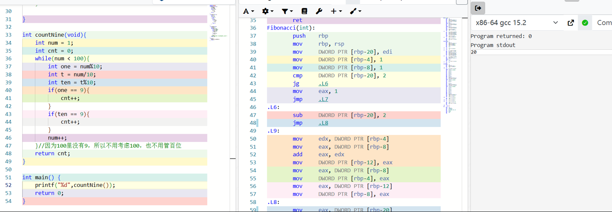


## 2. do/while语句

`while`语句先测试控制表达式的值再执行循环体，而`do/while`语句先执行循环体再测试控制表达式的值。如果控制表达式的值一开始就是假，`while`语句的循环体一次都不执行，而`do/while`语句的循环体仍然要执行一次再跳出循环。其实只要有`while`循环就足够了，`do/while`循环和后面要讲的`for`循环都可以改写成`while`循环，只不过有些情况下用`do/while`或`for`循环写起来更简便，代码更易读。

## 3. for语句

使用循环变量最见的是`for`循环这种形式。`for`语句的语法是：

for (控制表达式1; 控制表达式2; 控制表达式3) 语句

如果不考虑循环体中包含`continue`语句的情况（稍后介绍`continue`语句），这个`for`循环等价于下面的`while`循环：

```c
控制表达式1;
while (控制表达式2) {
	语句
	控制表达式3;
}
```

从这种等价形式来看，控制表达式1和3都可以为空，但控制表达式2是必不可少的，例如`for (;1;) {...}`等价于`while (1) {...}`死循环。C语言规定，如果控制表达式2为空，则认为控制表达式2的值为真，因此死循环也可以写成`for (;;) {...}`。

使用++、--运算符会使程序更加简洁，但也会影响程序的可读性，[[K&R\]](http://akaedu.github.io/book/bi01.html#bibli.kr)中的示例代码大量运用++、--和其它表达式的组合使得代码非常简洁。为了让初学者循序渐进，在接下来的几章中++、--运算符总是单独组成一个表达式而不跟其它表达式组合，从[第 11 章 *排序与查找*](http://akaedu.github.io/book/ch11.html#sortsearch)开始将采用[[K&R\]](http://akaedu.github.io/book/bi01.html#bibli.kr)的简洁风格。

我们看一个有意思的问题：`a+++++b`这个表达式如何理解？应该理解成`a++ ++ +b`还是`a++ + ++b`，还是`a + ++ ++b`呢？应该按第一种方式理解。编译的过程分为词法解析和语法解析两个阶段，在词法解析阶段，编译器总是从前到后找最长的合法Token。把这个表达式从前到后解析，变量名`a`是一个Token，`a`后面有两个以上的+号，在C语言中一个+号是合法的Token（可以是加法运算符或正号），两个+号也是合法的Token（可以是自增运算符），根据最长匹配原则，编译器绝不会止步于一个+号，而一定会把两个+号当作一个Token。再往后解析仍然有两个以上的+号，所以又是一个++运算符。再往后解析只剩一个+号了，是加法运算符。再往后解析是变量名`b`。词法解析之后进入下一阶段语法解析，`a`是一个表达式，表达式++还是表达式，表达式再++还是表达式，表达式再+b还是表达式，语法上没有问题。最后编译器会做一些基本的语义分析，这时就有问题了，++运算符要求操作数能做左值，`a`能做左值所以`a++`没问题，但表达式`a++`的值只能做右值，不能再++了，所以最终编译器会报错。

C99规定了一种新的`for`循环语法，在控制表达式1的位置可以有变量定义。例如上例的循环变量`i`可以只在`for`循环中定义：

```
int factorial(int n)
{
	int result = 1;
	for(int i = 1; i <= n; i++)
		result = result * i;
	return result;
}
```

如果这样定义，那么变量`i`只是`for`循环中的局部变量而不是整个函数的局部变量，相当于[第 1 节 “if语句”](http://akaedu.github.io/book/ch04s01.html#cond.if)讲过的语句块中的局部变量，在循环结束后就不能再使用`i`这个变量了。这个程序用`gcc`编译要加上选项`-std=c99`。这种语法也是从C++借鉴的，考虑到兼容性不建议使用这种写法。

## 4. break和continue语句

在[第 4 节 “switch语句”](http://akaedu.github.io/book/ch04s04.html#cond.switch)中我们见到了`break`语句的一种用法，用来跳出`switch`语句块，这个语句也可以用来跳出循环体。`continue`语句也会终止当前循环，和`break`语句不同的是，`continue`语句终止当前循环后又回到循环体的开头准备执行下一次循环。对于`while`循环和`do/while`循环，执行`continue`语句之后测试控制表达式，如果值为真则继续执行下一次循环；对于`for`循环，执行`continue`语句之后首先计算控制表达式3，然后测试控制表达式2，如果值为真则继续执行下一次循环。例如下面的代码打印1到100之间的素数：


**例 6.1. 求1-100的素数**

```c
#include <stdio.h>

int is_prime(int n)
{
	int i;
	for (i = 2; i < n; i++)
		if (n % i == 0)
			break;
	if (i == n)
		return 1;
	else
		return 0;
}

int main(void)
{
	int i;
	for (i = 1; i <= 100; i++) {
		if (!is_prime(i))
			continue;
		printf("%d\n", i);
	}
	return 0;
}
```

> 1、求素数这个程序只是为了说明`break`和`continue`的用法才这么写的，其实完全可以不用`break`和`continue`，请读者修改一下控制流程，去掉`break`和`continue`而保持功能不变。
>
> 2、上一节讲过怎样把`for`循环改写成等价的`while`循环，但也提到如果循环体中有`continue`语句这两种形式就不等价了，想一想为什么不等价了？

1、

```c
#include <stdio.h>

int is_prime(int n)
{
	int i;
	for (i = 2; i < n; i++){
        if (n % i == 0)
			return 0;
    }
	return 1;
}

int main(void)
{
	int i;
	for (i = 1; i <= 100; i++) {
		if (is_prime(i))
			printf("%d\n", i);
	}
	return 0;
}
```

2、因为如果有continue语句的话，for循环不一定会执行完内部语句才执行控制表达式3，可能不执行语句就直接执行3，想改成等价的需要加一些if判断

## 5. 嵌套循环

在循环中调用一个函数，而那个函数里面又有一个循环，这其实是一种嵌套循环。

在有多层循环或`switch`嵌套的情况下，`break`只能跳出最内层的循环或`switch`，`continue`也只能终止最内层循环并回到该循环的开头。

> 1、上面打印的小九九有一半数据是重复的，因为8*9和9*8的结果一样。请修改程序打印这样的小九九：
>
> ```
> 1	
> 2	4	
> 3	6	9	
> 4	8	12	16	
> 5	10	15	20	25	
> 6	12	18	24	30	36	
> 7	14	21	28	35	42	49	
> 8	16	24	32	40	48	56	64	
> 9	18	27	36	45	54	63	72	81
> ```
>
> 2、编写函数`diamond`打印一个菱形。如果调用`diamond(3, '*')`则打印：
>
> ```
> 	*
> *	*	*
> 	*
> ```
>
> 如果调用`diamond(5, '+')`则打印：
>
> ```
> 		+
> 	+	+	+
> +	+	+	+	+
> 	+	+	+
> 		+
> ```
>
> 如果用偶数做参数则打印错误提示。

1、

```c
void print_99(void){
    for(int i = 1; i <= 9; i++){
        for(int j = 1; j <= i; j++){
            printf("%d\t");
        }
        printf("\n");
    }
}
```

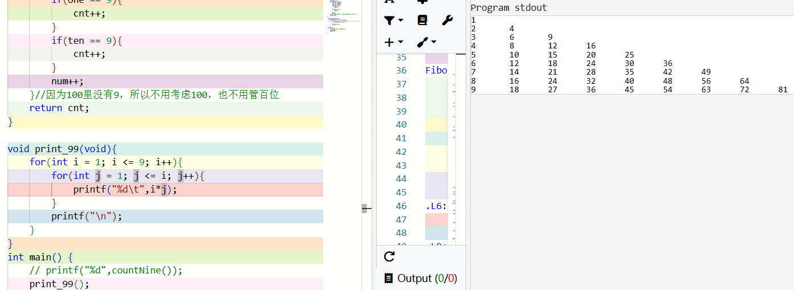

2、

```c
void diamond(int n, char c){
    if(n % 2 == 0){
        printf("n必须为奇数才可以打印！");
        return;
    }
    for(int i = 1; i <= n; i+=2){
        for(int k = 0; k < (n-i)/2; k++){
                printf("\t");
            }
        for(int j = 0; j < i; j++){
            printf("%c\t",c);
        }
        printf("\n");
    }
    for(int i = n-2; i >= 0; i-=2){
        for(int k = 0; k < (n-i)/2; k++){
                printf("\t");
            }
        for(int j = 0; j < i; j++){
            printf("%c\t",c);
        }
        printf("\n");
    }
}
```

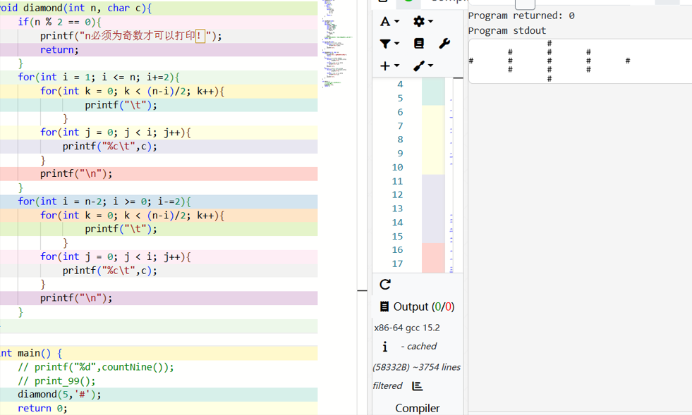

## 6. goto语句和标号

分支、循环都讲完了，现在只剩下最后一种影响控制流程的语句了，就是`goto`语句，实现无条件跳转。我们知道`break`只能跳出最内层的循环，如果在一个嵌套循环中遇到某个错误条件需要立即跳出最外层循环做出错处理，就可以用`goto`语句，例如：

```
for (...)
	for (...) {
		...
		if (出现错误条件)
			goto error;
	}
error:
	出错处理;
```

这里的`error:`叫做标号（Label），任何语句前面都可以加若干个标号，每个标号的命名也要遵循标识符的命名规则。

`goto`语句过于强大了，从程序中的任何地方都可以无条件跳转到任何其它地方，只要在那个地方定义一个标号就行，唯一的限制是`goto`只能跳转到同一个函数中的某个标号处，而不能跳到别的函数中[[11](http://akaedu.github.io/book/ch06s06.html#ftn.id2727782)]。**滥用`goto`语句会使程序的控制流程非常复杂，可读性很差**。著名的计算机科学家Edsger W. Dijkstra最早指出编程语言中`goto`语句的危害，提倡取消`goto`语句。`goto`语句不是必须存在的，显然可以用别的办法替代，比如上面的代码段可以改写为：

```c
int cond = 0; /* bool variable indicating error condition */
for (...) {
	for (...) {
		...
		if (出现错误条件) {
			cond = 1;
			break;
		}
	}
	if (cond)
		break;
}
if (cond)
	出错处理;
```

通常`goto`语句只用于这种场合，一个函数中任何地方出现了错误条件都可以立即跳转到函数末尾做出错处理（例如释放先前分配的资源、恢复先前改动过的全局变量等），处理完之后函数返回。比较用`goto`和不用`goto`的两种写法，用`goto`语句还是方便很多。但是除此之外，在任何其它场合都不要轻易考虑使用`goto`语句。有些编程语言（如C++）中有异常（Exception）处理的语法，可以代替`goto`和`setjmp/longjmp`的这种用法。

### 标号

回想一下，我们在[第 4 节 “switch语句”](http://akaedu.github.io/book/ch04s04.html#cond.switch)学过`case`和`default`后面也要跟冒号（:号，Colon），事实上它们是两种特殊的标号。和标号有关的语法规则如下：

语句 → 标识符: 语句
语句 → case 常量表达式: 语句
语句 → default: 语句

反复应用这些语法规则进行组合可以在一条语句前面添加多个标号，例如在[例 4.2 “缺break的switch语句”](http://akaedu.github.io/book/ch04s04.html#cond.switch2)的代码中，有些语句前面有多个`case`标号。现在我们再看`switch`语句的格式：

switch (控制表达式) {
case 常量表达式： 语句列表
case 常量表达式： 语句列表
...
default： 语句列表
}

{}里面是一组语句列表，其中每个分支的第一条语句带有`case`或`default`标号，从语法上来说，`switch`的语句块和其它分支、循环结构的语句块没有本质区别：

语句 → switch (控制表达式) 语句
语句 → { 语句列表 }

有兴趣的读者可以在网上查找有关Duff's Device的资料，Duff's Device是一段很有意思的代码，正是利用“`switch`的语句块和循环结构的语句块没有本质区别”这一点实现了一个巧妙的代码优化。

> ## 关于Duff's Device
>
> 对于下面这段代码
>
> ```c
> void send( int * to, int * from, int count) {
> 	for (int i = 0; i < count; i++) {
> 		*to++ = *from++;
> 	}
> }
> ```
>
> 如果count 是10000，那么就需要循环10000次。这么多次数的循环，每次循环都要进行一次判断，对CPU利用率并不高。
>
> 用Duff's device 方法改写后的代码，展示如下：
>
> ```c
> void send( int * to, int * from, int count) {
>     int n = (count + 7 ) / 8;
>     switch (count % 8 ) {
>     case 0 :    do { * to ++ = * from ++ ;
>     case 7 :          * to ++ = * from ++ ;
>     case 6 :          * to ++ = * from ++ ;
>     case 5 :          * to ++ = * from ++ ;
>     case 4 :          * to ++ = * from ++ ;
>     case 3 :          * to ++ = * from ++ ;
>     case 2 :          * to ++ = * from ++ ;
>     case 1 :          * to ++ = * from ++ ;
>            } while (--n > 0);
>     }  
> }
> ```
>
> 如果count为10000，那么之前的代码需要循环10000次，而用Duff' device改写后，只需要 1250次循环即可。
>
> 哪怕count不能被8整除也没关系，第一次循环会先执行余数次，之后每次都是8次，纸质执行完毕
>
> 这样，while的判断次数就大大减少了
>
> 虽然switch的判断次数会增加，但是编译器会对间隔很小的switch做优化，降低开销


# 第 7 章 结构体

## 1. 复合类型与结构体

如果用实部和虚部表示一个复数，我们可以写成由两个`double`型组成的结构体：

```c
struct complex_struct {
	double x, y;
};
```

这一句定义了标识符`complex_struct`（同样遵循标识符的命名规则），这种标识符在C语言中称为Tag，`struct complex_struct { double x, y; }`整个可以看作一个类型名[[12](http://akaedu.github.io/book/ch07s01.html#ftn.id2730268)]，就像`int`或`double`一样，只不过它是一个复合类型，如果用这个类型名来定义变量，可以这样写：

```c
struct complex_struct {
	double x, y;
} z1, z2;
```

这样`z1`和`z2`就是两个变量名，变量定义后面带个;号是我们早就习惯的。但即使像先前的例子那样只定义了`complex_struct`这个Tag而不定义变量，}后面的;号也不能少。这点一定要注意，类型定义也是一种声明，声明都要以;号结尾，结构体类型定义的}后面少;号是初学者常犯的错误。不管是用上面两种形式的哪一种定义了`complex_struct`这个Tag，以后都可以直接用`struct complex_struct`来代替类型名了。例如可以这样定义另外两个复数变量：

```c
struct complex_struct z3, z4;
```

如果在定义结构体类型的同时定义了变量，也可以不必写Tag，例如：

```c
struct {
	double x, y;
} z1, z2;
```

但这样就没办法再次引用这个结构体类型了，因为它没有名字。每个复数变量都有两个成员（Member）x和y，可以用.运算符（.号，Period）来访问，这两个成员的存储空间是相邻的[[13](http://akaedu.github.io/book/ch07s01.html#ftn.id2730413)]，合在一起组成复数变量的存储空间。

看下面的例子：

```c
#include <stdio.h>

int main(void)
{
	struct complex_struct { double x, y; } z;
	double x = 3.0;	
	z.x = x;
	z.y = 4.0;
	if (z.y < 0)
		printf("z=%f%fi\n", z.x, z.y);
	else
		printf("z=%f+%fi\n", z.x, z.y);

	return 0;
}
```

注意上例中变量`x`和变量`z`的成员`x`的名字并不冲突，因为变量`z`的成员`x`只能通过表达式`z.x`来访问，编译器可以从语法上区分哪个`x`是变量`x`，哪个`x`是变量`z`的成员`x`，[第 3 节 “变量的存储布局”](http://akaedu.github.io/book/ch19s03.html#asmc.layout)会讲到这两个标识符`x`属于不同的命名空间。结构体Tag也可以定义在全局作用域中，这样定义的Tag在其定义之后的各函数中都可以使用。

结构体变量也可以在定义时初始化，例如：

```c
struct complex_struct z = { 3.0, 4.0 };
```

Initializer中的数据依次赋给结构体的各成员。如果Initializer中的数据比结构体的成员多，编译器会报错，但如果只是末尾多个逗号则不算错。如果Initializer中的数据比结构体的成员少，未指定的成员将用0来初始化，就像未初始化的全局变量一样。例如以下几种形式的初始化都是合法的：

```c
double x = 3.0;
struct complex_struct z1 = { x, 4.0, }; /* z1.x=3.0, z1.y=4.0 */
struct complex_struct z2 = { 3.0, }; /* z2.x=3.0, z2.y=0.0 */
struct complex_struct z3 = { 0 }; /* z3.x=0.0, z3.y=0.0 */
```

注意，`z1`必须是局部变量才能用另一个变量`x`的值来初始化它的成员，如果是全局变量就只能用常量表达式来初始化。这也是C99的新特性，C89只允许在{}中使用常量表达式来初始化，无论是初始化全局变量还是局部变量。

**{}这种语法不能用于结构体的赋值**，例如这样是错误的：

```c
struct complex_struct z1;
z1 = { 3.0, 4.0 };
```

**以前我们初始化基本类型的变量所使用的Initializer都是表达式，表达式当然也可以用来赋值，但现在这种由{}括起来的Initializer并不是表达式，所以不能用来赋值**[[14](http://akaedu.github.io/book/ch07s01.html#ftn.id2730593)]。Initializer的语法总结如下：

Initializer → 表达式
Initializer → { 初始化列表 } 
初始化列表 → Designated-Initializer, Designated-Initializer, ...
（最后一个Designated-Initializer末尾可以有一个多余的,号）
Designated-Initializer → Initializer
Designated-Initializer → .标识符 = Initializer
Designated-Initializer → [常量表达式] = Initializer

Designated Initializer是C99引入的新特性，用于初始化稀疏（Sparse）结构体和稀疏数组很方便。有些时候结构体或数组中只有某一个或某几个成员需要初始化，其它成员都用0初始化即可，用Designated Initializer语法可以针对每个成员做初始化（Memberwise Initialization），很方便。例如：

```
struct complex_struct z1 = { .y = 4.0 }; /* z1.x=0.0, z1.y=4.0 */
```

结构体类型用在表达式中有很多限制，不像基本类型那么自由，比如+ - * /等算术运算符和&& || !等逻辑运算符都不能作用于结构体类型，`if`语句、`while`语句中的控制表达式的值也不能是结构体类型。

结构体变量之间使用赋值运算符是允许的，用一个结构体变量初始化另一个结构体变量也是允许的，例如：

```c
struct complex_struct z1 = { 3.0, 4.0 };
struct complex_struct z2 = z1;
z1 = z2;
```

既然结构体变量之间可以相互赋值和初始化，也就可以当作函数的参数和返回值来传递：

```c
struct complex_struct add_complex(struct complex_struct z1, struct complex_struct z2)
{
	z1.x = z1.x + z2.x;
	z1.y = z1.y + z2.y;
	return z1;
}
```

## 2. 数据抽象

现在我们来实现一个完整的复数运算程序。在上一节我们已经定义了复数的结构体类型，现在需要围绕它定义一些函数。复数可以用直角座标或极座标表示，直角座标做加减法比较方便，极座标做乘除法比较方便。如果我们定义的复数结构体是直角座标的，那么应该提供极座标的转换函数，以便在需要的时候可以方便地取它的模和辐角：

```c
#include <math.h>

struct complex_struct {
	double x, y;
};

double real_part(struct complex_struct z)
{
	return z.x;
}

double img_part(struct complex_struct z)
{
	return z.y;
}

double magnitude(struct complex_struct z)
{
	return sqrt(z.x * z.x + z.y * z.y);
}

double angle(struct complex_struct z)
{
	return atan2(z.y, z.x);
}
```

此外，我们还提供两个函数用来构造复数变量，既可以提供直角座标也可以提供极座标，在函数中自动做相应的转换然后返回构造的复数变量：

```c
struct complex_struct make_from_real_img(double x, double y)
{
	struct complex_struct z;
	z.x = x;
	z.y = y;
	return z;
}

struct complex_struct make_from_mag_ang(double r, double A)
{
	struct complex_struct z;
	z.x = r * cos(A);
	z.y = r * sin(A);
	return z;
}
```

在此基础上就可以实现复数的加减乘除运算了：

```c
struct complex_struct add_complex(struct complex_struct z1, struct complex_struct z2)
{
	return make_from_real_img(real_part(z1) + real_part(z2),
				  img_part(z1) + img_part(z2));
}

struct complex_struct sub_complex(struct complex_struct z1, struct complex_struct z2)
{
	return make_from_real_img(real_part(z1) - real_part(z2),
				  img_part(z1) - img_part(z2));
}

struct complex_struct mul_complex(struct complex_struct z1, struct complex_struct z2)
{
	return make_from_mag_ang(magnitude(z1) * magnitude(z2),
				 angle(z1) + angle(z2));
}

struct complex_struct div_complex(struct complex_struct z1, struct complex_struct z2)
{
	return make_from_mag_ang(magnitude(z1) / magnitude(z2),
				 angle(z1) - angle(z2));
}
```

可以看出，复数加减乘除运算的实现并没有直接访问结构体`complex_struct`的成员`x`和`y`，而是把它看成一个整体，通过调用相关函数来取它的直角座标和极座标。这样就可以非常方便地替换掉结构体`complex_struct`的存储表示，例如改为用极座标来存储：

```c
#include <math.h>

struct complex_struct {
	double r, A;
};

double real_part(struct complex_struct z)
{
	return z.r * cos(z.A);
}

double img_part(struct complex_struct z)
{
	return z.r * sin(z.A);
}

double magnitude(struct complex_struct z)
{
	return z.r;
}

double angle(struct complex_struct z)
{
	return z.A;
}

struct complex_struct make_from_real_img(double x, double y)
{
	struct complex_struct z;
	z.A = atan2(y, x);
	z.r = sqrt(x * x + y * y);
}

struct complex_struct make_from_mag_ang(double r, double A)
{
	struct complex_struct z;
	z.r = r;
	z.A = A;
	return z;
}
```

虽然结构体`complex_struct`的存储表示做了这样的改动，`add_complex`、`sub_complex`、`mul_complex`、`div_complex`这几个复数运算的函数却不需要做任何改动，仍然可以用，原因在于这几个函数只把结构体`complex_struct`当作一个整体来使用，而没有直接访问它的成员，因此也不依赖于它有哪些成员。

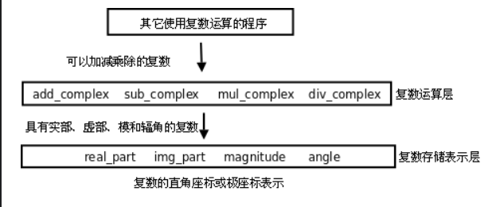


在我们的复数运算程序中，复数有可能用直角座标或极座标来表示，我们把这个有可能变动的因素提取出来组成复数存储表示层：`real_part`、`img_part`、`magnitude`、`angle`、`make_from_real_img`、`make_from_mag_ang`。这一层看到的数据是结构体的两个成员`x`和`y`，或者`r`和`A`，如果改变了结构体的实现就要改变这一层函数的实现，但函数接口不改变，因此调用这一层函数接口的复数运算层也不需要改变。复数运算层看到的数据只是一个抽象的“复数”的概念，知道它有直角座标和极座标，可以调用复数存储表示层的函数得到这些座标。再往上看，其它使用复数运算的程序看到的数据是一个更为抽象的“复数”的概念，只知道它是一个数，像整数、小数一样可以加减乘除，甚至连它有直角座标和极座标也不需要知道。

这里的复数存储表示层和复数运算层称为抽象层（Abstraction Layer），从底层往上层来看，复数越来越抽象了，把所有这些层组合在一起就是一个完整的系统。**组合使得系统可以任意复杂，而抽象使得系统的复杂性是可以控制的，任何改动都只局限在某一层，而不会波及整个系统**。

> 1、在本节的基础上实现一个打印复数的函数，打印的格式是x+yi，如果实部或虚部为0则省略，例如：1.0、-2.0i、-1.0+2.0i、1.0-2.0i。最后编写一个`main`函数测试本节的所有代码。想一想这个打印函数应该属于上图中的哪一层？
>
> 2、实现一个用分子分母的格式来表示有理数的结构体`rational`以及相关的函数，`rational`结构体之间可以做加减乘除运算，运算的结果仍然是`rational`。测试代码如下：
>
> ```
> int main(void)
> {
> 	struct rational a = make_rational(1, 8); /* a=1/8 */
> 	struct rational b = make_rational(-1, 8); /* b=-1/8 */
> 	print_rational(add_rational(a, b));
> 	print_rational(sub_rational(a, b));
> 	print_rational(mul_rational(a, b));
> 	print_rational(div_rational(a, b));
> 
> 	return 0;
> }
> ```
>
> 注意要约分为最简分数，例如1/8和-1/8相减的打印结果应该是1/4而不是2/8，可以利用[第 3 节 “递归”](http://akaedu.github.io/book/ch05s03.html#func2.recursion)练习题中的Euclid算法来约分。在动手编程之前先思考一下这个问题实现了什么样的数据抽象，抽象层应该由哪些函数组成。

1、

```c
#include <math.h>
#include <stdio.h>

struct complex_struct {
	double x, y;
};

double real_part(struct complex_struct z)
{
	return z.x;
}

double img_part(struct complex_struct z)
{
	return z.y;
}

double magnitude(struct complex_struct z)
{
	return sqrt(z.x * z.x + z.y * z.y);
}

double angle(struct complex_struct z)
{
	return atan2(z.y, z.x);
}
struct complex_struct make_from_real_img(double x, double y)
{
	struct complex_struct z;
	z.x = x;
	z.y = y;
	return z;
}

struct complex_struct make_from_mag_ang(double r, double A)
{
	struct complex_struct z;
	z.x = r * cos(A);
	z.y = r * sin(A);
	return z;
}
struct complex_struct add_complex(struct complex_struct z1, struct complex_struct z2)
{
	return make_from_real_img(real_part(z1) + real_part(z2),
				  img_part(z1) + img_part(z2));
}

struct complex_struct sub_complex(struct complex_struct z1, struct complex_struct z2)
{
	return make_from_real_img(real_part(z1) - real_part(z2),
				  img_part(z1) - img_part(z2));
}

struct complex_struct mul_complex(struct complex_struct z1, struct complex_struct z2)
{
	return make_from_mag_ang(magnitude(z1) * magnitude(z2),
				 angle(z1) + angle(z2));
}

struct complex_struct div_complex(struct complex_struct z1, struct complex_struct z2)
{
	return make_from_mag_ang(magnitude(z1) / magnitude(z2),
				 angle(z1) - angle(z2));
}
void print_complex(struct complex_struct z1){
    if(real_part(z1) != 0.0){
        printf("%lf",z1.x);
        if(img_part(z1) > 0.0){
            printf("+");
        }
    }
    if(z1.y != 0.0){
        printf("%lfi\n",img_part(z1));
    } else {
    	printf("\n");
	}
}
int main(void) {
    struct complex_struct z1 = make_from_real_img(1,2);
    print_complex(z1);
    struct complex_struct z2 = make_from_real_img(1,-2);
    print_complex(z2);
    struct complex_struct z3 = add_complex(z1,z2);
    print_complex(z3);
    struct complex_struct z4 = sub_complex(z1,z2);
    print_complex(z4);
    struct complex_struct z5 = mul_complex(z1,z2);
    print_complex(z5);
    struct complex_struct z6 = div_complex(z1,z2);
    print_complex(z6);
    print_complex(z6);
    return 0;
}
```

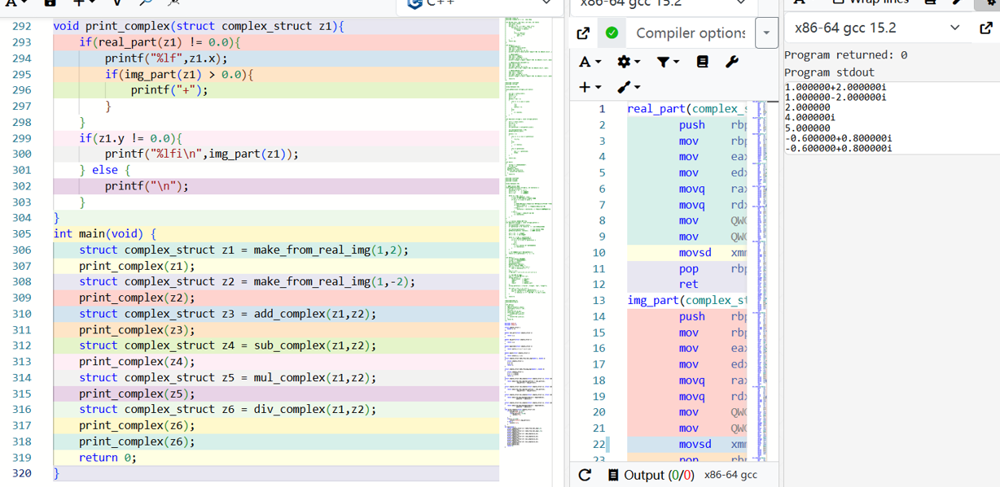

打印函数应该在图里的最高层，或者说在负数运算层也不是不行

2、

这个函数实现了分数存储和分数运算的抽象，我们在调用时就只需要调用对应函数即可，不需要修改各个运算的内部实现了

有make_rational用于存储一个分数，剩下的就是加减乘除了，以及对分数的输出了

```c
#include<stdio.h>
#include<math.h>


struct rational {
	int a,b;
};

int get_numerator(struct rational r){
	return r.a;
}

int get_denominator(struct rational r){
	return r.b;
}

struct rational make_rational(int a, int b) {
	struct rational r;
	r.a = a;
	r.b = b;
	return r;
}

int GCD(int a, int b){
    a = abs(a);
    b = abs(b);
    if(a == 0 || b == 0){
    	return 0;
	}
	int c = a%b;
    while(c != 0){
        a = b;
        b = c;
        c = a%b;
    }
    return b;
}

int LCM(int a, int b){
	return a*b/GCD(a,b);
}

struct rational add_rational(struct rational a, struct rational b) {
	int denominator = LCM(get_denominator(a),get_denominator(b));//通分后的分母 
	int numerator_a = get_numerator(a) * denominator / get_denominator(a);
	int numerator_b = get_numerator(b) * denominator / get_denominator(b);
	int numerator = numerator_a + numerator_b;
	int gcd = GCD(numerator,denominator);
	if(gcd != 0){
		numerator = numerator / gcd;
		denominator = denominator / gcd;
	} else {
		numerator = 0;
	}
	
	return make_rational(numerator,denominator);
}

struct rational sub_rational(struct rational a, struct rational b) {
	int denominator = LCM(get_denominator(a),get_denominator(b));//通分后的分母 
	int numerator_a = get_numerator(a) * denominator / get_denominator(a);
	int numerator_b = get_numerator(b) * denominator / get_denominator(b);
	int numerator = numerator_a - numerator_b;
	int gcd = GCD(numerator,denominator);
	if(gcd != 0){
		numerator = numerator / gcd;
		denominator = denominator / gcd;
	} else {
		numerator = 0;
	}
	
	return make_rational(numerator,denominator);
}

struct rational mul_rational(struct rational a, struct rational b) {
	int denominator = get_denominator(a) * get_denominator(b);//通分后的分母 
	int numerator = get_numerator(a) * get_numerator(b);
	int gcd = GCD(numerator,denominator);
	if(gcd != 0){
		numerator = numerator / gcd;
		denominator = denominator / gcd;
	} else {
		numerator = 0;
	}
	
	return make_rational(numerator,denominator);
}

struct rational div_rational(struct rational a, struct rational b) {
	int denominator = get_denominator(a) * get_numerator(b);
	int numerator = get_numerator(a) * get_denominator(b);
	int gcd = GCD(numerator,denominator);
	if(gcd != 0){
		numerator = numerator / gcd;
		denominator = denominator / gcd;
	} else {
		numerator = 0;
	}
	
	return make_rational(numerator,denominator);
}

void print_rational(struct rational r){
	if(get_numerator(r) != 0 && abs(get_denominator(r)) != 1){
		printf("%d/%d\n",get_numerator(r),get_denominator(r));
	} else {
		printf("%d\n",get_numerator(r) * get_denominator(r));
	}
	
}

int main(void)
{
	struct rational a = make_rational(1, 8); /* a=1/8 */
	struct rational b = make_rational(-1, 8); /* b=-1/8 */
	print_rational(add_rational(a, b));
	print_rational(sub_rational(a, b));
	print_rational(mul_rational(a, b));
	print_rational(div_rational(a, b));

	return 0;
}
```

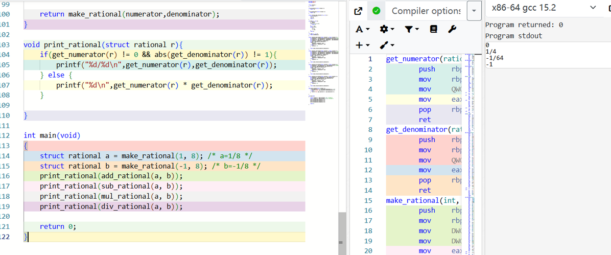

## 3. 数据类型标志

这里介绍另一种办法，`complex_struct`结构体由一个数据类型标志和两个浮点数组成，如果数据类型标志为0，那么两个浮点数就表示直角座标，如果数据类型标志为1，那么两个浮点数就表示极座标。这样，直角座标和极座标的数据都可以适配（Adapt）到`complex_struct`结构体中，无需转换和损失精度：

```c
enum coordinate_type { RECTANGULAR, POLAR };
struct complex_struct {
	enum coordinate_type t;
	double a, b;
};
```

`enum`关键字的作用和`struct`关键字类似，把`coordinate_type`这个标识符定义为一个Tag，`struct complex_struct`表示一个结构体类型，而`enum coordinate_type`表示一个枚举（Enumeration）类型。枚举类型的成员是常量，它们的值由编译器自动分配，例如定义了上面的枚举类型之后，`RECTANGULAR`就表示常量0，`POLAR`表示常量1。如果不希望从0开始分配，可以这样定义：

```c
enum coordinate_type { RECTANGULAR = 1, POLAR };
```

这样，`RECTANGULAR`就表示常量1，而`POLAR`表示常量2。枚举常量也是一种整型，其值在编译时确定，因此也可以出现在常量表达式中，可以用于初始化全局变量或者作为`case`分支的判断条件。

一点需要注意，虽然结构体的成员名和变量名不在同一命名空间中，但**枚举的成员名却和变量名在同一命名空间中**，所以会出现命名冲突。例如这样是不合法的：

```c
int main(void)
{
	enum coordinate_type { RECTANGULAR = 1, POLAR };
	int RECTANGULAR;
	printf("%d %d\n", RECTANGULAR, POLAR);
	return 0;
}
```

`complex_struct`结构体的格式变了，就需要修改复数存储表示层的函数，但只要保持函数接口不变就不会影响到上层函数。例如：

```c
struct complex_struct make_from_real_img(double x, double y)
{
	struct complex_struct z;
	z.t = RECTANGULAR;
	z.a = x;
	z.b = y;
	return z;
}

struct complex_struct make_from_mag_ang(double r, double A)
{
	struct complex_struct z;
	z.t = POLAR;
	z.a = r;
	z.b = A;
	return z;
}
```

> 1、本节只给出了`make_from_real_img`和`make_from_mag_ang`函数的实现，请读者自己实现`real_part`、`img_part`、`magnitude`、`angle`这些函数。
>
> 2、编译运行下面这段程序：
>
> ```c
> #include <stdio.h>
> 
> enum coordinate_type { RECTANGULAR = 1, POLAR };
> 
> int main(void)
> {
> 	int RECTANGULAR;
> 	printf("%d %d\n", RECTANGULAR, POLAR);
> 	return 0;
> }
> ```
>
> 结果是什么？并解释一下为什么是这样的结果。

1、

```c
enum coordinate_type { RECTANGULAR, POLAR };
struct complex_struct {
	enum coordinate_type t;
	double a, b;
};

struct complex_struct make_from_real_img(double x, double y)
{
	struct complex_struct z;
	z.t = RECTANGULAR;
	z.a = x;
	z.b = y;
	return z;
}

struct complex_struct make_from_mag_ang(double r, double A)
{
	struct complex_struct z;
	z.t = POLAR;
	z.a = r;
	z.b = A;
	return z;
}

double real_part(struct complex_struct z)
{
    if(z.t == RECTANGULAR){
        return z.a;
    } else {
        return z.a * cos(z.b);
    }
	
}

double img_part(struct complex_struct z)
{
    if(z.t == RECTANGULAR){
		return z.b;
    } else {
        retrun z.a * sin(z.b);
    }
    
}

double magnitude(struct complex_struct z)
{
    if(z.t == RECTANGULAR){
		return sqrt(z.a * z.a + z.b * z.b);
    } else {
        return z.a;
    }
}

double angle(struct complex_struct z)
{
    if(z.t == RECTANGULAR){
		return atan2(z.b, z.a);
    } else {
        return z.b;
    }
    
}
```

2、

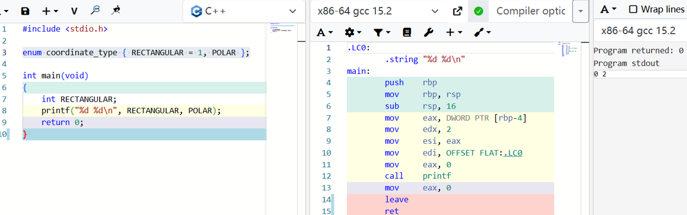

输出为0 2，2很好理解，就是枚举变量里的POLAR的值2，这个0则是main函数里定义的RECTANGULAR的值(我其实感觉不一定是0，只是刚好是0而已)，相当于枚举变量是全局变量，main里的是局部变量，所以局部变量更优先，如果将局部变量注释掉就会变成输出1 2

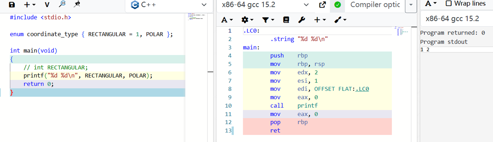

## 4. 嵌套结构体

结构体也是一种递归定义：结构体的成员具有某种数据类型，而结构体本身也是一种数据类型。换句话说，结构体的成员可以是另一个结构体，即结构体可以嵌套定义。例如我们在复数的基础上定义复平面上的线段：

```c
struct segment {
	struct complex_struct start;
	struct complex_struct end;
};
```

从[第 1 节 “复合类型与结构体”](http://akaedu.github.io/book/ch07s01.html#struct.intro)讲的Initializer的语法可以看出，Initializer也可以嵌套，因此嵌套结构体可以嵌套地初始化，例如：

```c
struct segment s = {{ 1.0, 2.0 }, { 4.0, 6.0 }};
```

也可以平坦（Flat）地初始化。例如：

```c
struct segment s = { 1.0, 2.0, 4.0, 6.0 };
```

甚至可以把两种方式混合使用（这样可读性很差，应该避免）：

```c
struct segment s = {{ 1.0, 2.0 }, 4.0, 6.0 };
```

利用C99的新特性也可以做Memberwise Initialization，例如[[15](http://akaedu.github.io/book/ch07s04.html#ftn.id2731613)]：

```c
struct segment s = { .start.x = 1.0, .end.x = 2.0 };
```

访问嵌套结构体的成员要用到多个.运算符，例如：

```c
s.start.t = RECTANGULAR;
s.start.a = 1.0;
s.start.b = 2.0;
```

# 第 8 章 数组

## 1. 数组的基本概念

数组（Array）也是一种复合数据类型，它由一系列相同类型的元素（Element）组成。

和结构体成员类似，数组`count`的4个元素的存储空间也是相邻的。结构体成员可以是基本数据类型，也可以是复合数据类型，数组中的元素也是如此。

数组下标也可以是表达式，但表达式的值必须是整型的。

使用数组下标不能超出数组的长度范围，这一点在使用变量做数组下标时尤其要注意。C编译器并不检查`count[-1]`或是`count[100]`这样的访问越界错误，编译时能顺利通过，所以属于运行时错误[[17](http://akaedu.github.io/book/ch08s01.html#ftn.id2733456)]。

数组也可以像结构体一样初始化，未赋初值的元素也是用0来初始化，例如：

```c
int count[4] = { 3, 2, };
```

则`count[0]`等于3， `count[1]`等于2，后面两个元素等于0。如果定义数组的同时初始化它，也可以不指定数组的长度，例如：

```c
int count[] = { 3, 2, 1, };
```

编译器会根据Initializer有三个元素确定数组的长度为3。利用C99的新特性也可以做Memberwise Initialization：

```c
int count[4] = { [2] = 3 };
```

数组和结构体虽然有很多相似之处，但也有一个显著的不同：数组不能相互赋值或初始化。

数组不能相互赋值，也就**不能用数组类型作为函数的参数或返回值**。

如果写出这样的函数定义：

```c
void foo(int a[5])
{
	...
}
```

然后这样调用：

```c
int array[5] = {0};
foo(array);
```

编译器也不会报错，但这样写并不是传一个数组类型参数的意思。对于数组类型有一条特殊规则：**数组类型做右值使用时，自动转换成指向数组首元素的指针**。所以上面的函数调用其实是传一个指针类型的参数，而不是数组类型的参数。接下来的几章里有的函数需要访问数组，我们就把数组定义为全局变量给函数访问，等以后讲了指针再使用传参的办法。这也解释了为什么数组类型不能相互赋值或初始化，例如上面提到的`a = b`这个表达式，`a`和`b`都是数组类型的变量，但是`b`做右值使用，自动转换成指针类型，而左边仍然是数组类型，所以编译器报的错是`error: incompatible types in assignment`。

> 1、编写一个程序，定义两个类型和长度都相同的数组，将其中一个数组的所有元素拷贝给另一个。既然数组不能直接赋值，想想应该怎么实现。

```c
#include<stdio.h>

int main(void){
    int a[4] = { 3, 2, 1, };
    int b[4];
    for(int i = 0; i < 4; i++){
        b[i] = a[i];
    }
    
    return 0;
}
```

## 2. 数组应用实例：统计随机数

本节通过一个实例介绍使用数组的一些基本模式。问题是这样的：首先生成一列0~9的随机数保存在数组中，然后统计其中每个数字出现的次数并打印，检查这些数字的随机性如何。随机数在某些场合（例如游戏程序）是非常有用的，但是用计算机生成完全随机的数却不是那么容易。计算机执行每一条指令的结果都是确定的，没有一条指令产生的是随机数，调用C标准库得到的随机数其实是伪随机（Pseudorandom）数，是用数学公式算出来的确定的数，只不过这些数看起来很随机，并且从统计意义上也很接近均匀分布（Uniform Distribution）的随机数。

C标准库中生成伪随机数的是`rand`函数，使用这个函数需要包含头文件`stdlib.h`，它没有参数，返回值是一个介于0和`RAND_MAX`之间的接近均匀分布的整数。`RAND_MAX`是该头文件中定义的一个常量，在不同的平台上有不同的取值，但可以肯定它是一个非常大的整数。通常我们用到的随机数是限定在某个范围之中的，例如0\~9，而不是0\~`RAND_MAX`，我们可以用%运算符将`rand`函数的返回值处理一下：

```c
int x = rand() % 10;
```

完整的程序如下：

```c
#include <stdio.h>
#include <stdlib.h>
#define N 20

int a[N];

void gen_random(int upper_bound)
{
	int i;
	for (i = 0; i < N; i++)
		a[i] = rand() % upper_bound;
}

void print_random()
{
	int i;
	for (i = 0; i < N; i++)
		printf("%d ", a[i]);
	printf("\n");
}

int main(void)
{
	gen_random(10);
	print_random();
	return 0;
}
```

### 宏定义

这里介绍一种新的语法：用`#define`定义一个常量。实际上编译器的工作分为两个阶段，先是预处理（Preprocess）阶段，然后才是编译阶段，用`gcc`的`-E`选项可以看到预处理之后、编译之前的程序，例如：

```c
$ gcc -E main.c
...（这里省略了很多行stdio.h和stdlib.h的代码）
int a[20];

void gen_random(int upper_bound)
{
 int i;
 for (i = 0; i < 20; i++)
  a[i] = rand() % upper_bound;
}

void print_random()
{
 int i;
 for (i = 0; i < 20; i++)
  printf("%d ", a[i]);
 printf("\n");
}

int main(void)
{
 gen_random(10);
 print_random();
 return 0;
}
```

可见在这里预处理器做了两件事情，一是把头文件`stdio.h`和`stdlib.h`在代码中展开，二是把`#define`定义的标识符`N`替换成它的定义20（在代码中做了三处替换，分别位于数组的定义中和两个函数中）。像`#include`和`#define`这种以#号开头的行称为预处理指示（Preprocessing Directive），我们将在[第 21 章 *预处理*](http://akaedu.github.io/book/ch21.html#prep)学习其它预处理指示。此外，用`cpp main.c`命令也可以达到同样的效果，只做预处理而不编译，`cpp`表示C preprocessor。

那么用`#define`定义的常量和[第 3 节 “数据类型标志”](http://akaedu.github.io/book/ch07s03.html#struct.datatag)讲的枚举常量有什么区别呢？首先，`define`不仅用于定义常量，也可以定义更复杂的语法结构，称为宏（Macro）定义。其次，`define`定义是在预处理阶段处理的，而枚举是在编译阶段处理的。

试试看把[第 3 节 “数据类型标志”](http://akaedu.github.io/book/ch07s03.html#struct.datatag)习题2的程序改成下面这样是什么结果。

```c
#include <stdio.h>
#define RECTANGULAR 1
#define POLAR 2

int main(void)
{
	int RECTANGULAR;
	printf("%d %d\n", RECTANGULAR, POLAR);
	return 0;
}
```

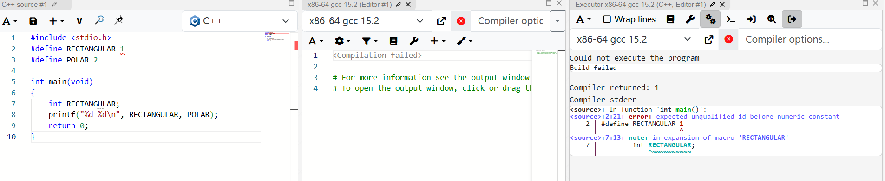

显示报错，这是因为RECTANGULAR都被转换成1，main的第一行就变成了int 1，就出错了

注意，虽然`include`和`define`在预处理指示中有特殊含义，但它们并不是C语言的关键字，换句话说，它们也可以用作标识符，例如声明`int include;`或者`void define(int);`。在预处理阶段，如果一行以#号开头，后面跟`include`或`define`，预处理器就认为这是一条预处理指示，除此之外出现在其它地方的`include`或`define`预处理器并不关心，只是当成普通标识符交给编译阶段去处理。

### 统计随机数的分布

回到随机数这个程序继续讨论，一开始为了便于分析和调试，我们取小一点的数组长度，只生成20个随机数，这个程序的运行结果为：

```
3 6 7 5 3 5 6 2 9 1 2 7 0 9 3 6 0 6 2 6
```

看起来很随机了。但随机性如何呢？分布得均匀吗？所谓均匀分布，应该每个数出现的概率是一样的。在上面的20个结果中，6出现了5次，而4和8一次也没出现过。但这说明不了什么问题，毕竟我们的样本太少了，才20个数，如果样本足够多，比如说100000个数，统计一下其中每个数字出现的次数也许能说明问题。但总不能把100000个数都打印出来然后挨个去数吧？我们需要写一个函数统计每个数字出现的次数。完整的程序如下：


**例 8.3. 统计随机数的分布**

```c
#include <stdio.h>
#include <stdlib.h>
#define N 100000

int a[N];

void gen_random(int upper_bound)
{
	int i;
	for (i = 0; i < N; i++)
		a[i] = rand() % upper_bound;
}

int howmany(int value)
{
	int count = 0, i;
	for (i = 0; i < N; i++)
		if (a[i] == value)
			++count;
	return count;
}

int main(void)
{
	int i;

	gen_random(10);
	printf("value\thow many\n");
	for (i = 0; i < 10; i++)
		printf("%d\t%d\n", i, howmany(i));

	return 0;
}
```


我们只要把`#define N`的值改为100000，就相当于把整个程序中所有用到`N`的地方都改为100000了。如果我们不这么写，而是在定义数组时直接写成`int a[20];`，在每个循环中也直接使用20这个值，这称为硬编码（Hard coding）。如果原来的代码是硬编码的，那么一旦需要把20改成100000就非常麻烦，你需要找遍整个代码，判断哪些20表示这个数组的长度就改为100000，哪些20表示别的数量则不做改动，如果代码很长，这是很容易出错的。所以，*写代码时应尽可能避免硬编码*，这其实也是一个“提取公因式”的过程，和[第 2 节 “数据抽象”](http://akaedu.github.io/book/ch07s02.html#struct.abstract)讲的抽象具有相同的作用，就是避免一个地方的改动波及到大的范围。这个程序的运行结果如下：

```bash
$ ./a.out
value	how many
0	10130
1	10072
2	9990
3	9842
4	10174
5	9930
6	10059
7	9954
8	9891
9	9958
```

各数字出现的次数都在10000次左右，可见是比较均匀的。

> 1、用`rand`函数生成[10, 20]之间的随机整数，表达式应该怎么写？

```c
int a = 10 + rand() % 11;
```

## 3. 数组应用实例：直方图

继续上面的例子。我们统计一列0~9的随机数，打印每个数字出现的次数，像这样的统计结果称为直方图（Histogram）。有时候我们并不只是想打印，更想把统计结果保存下来以便做后续处理。

可以把`histogram`中的元素当作累加器来用，这些随机数只需要从头到尾检查一遍（Single Pass）就可以得出结果：

```c
int main(void)
{
	int i, histogram[10] = {0};

	gen_random(10);
	for (i = 0; i < N; i++)
		histogram[a[i]]++;
	...
}
```

首先把`histogram`的所有元素初始化为0，注意使用局部变量的值之前一定要初始化，否则值是不确定的。接下来的代码很有意思，在每次循环中，`a[i]`就是出现的随机数，而这个随机数同时也是`histogram`的下标，这个随机数每出现一次就把`histogram`中相应的元素加1。

把上面的程序运行几遍，你就会发现每次产生的随机数都是一样的，不仅如此，在别的计算机上运行该程序产生的随机数很可能也是这样的。这正说明了这些数是伪随机数，是用一套确定的公式基于某个初值算出来的，只要初值相同，随后的整个数列就都相同。实际应用中不可能使用每次都一样的随机数，例如开发一个麻将游戏，每次运行这个游戏摸到的牌不应该是一样的。因此，C标准库允许我们自己指定一个初值，然后在此基础上生成伪随机数，这个初值称为Seed，可以用`srand`函数指定Seed。通常我们通过别的途径得到一个不确定的数作为Seed，例如调用`time`函数得到当前系统时间距1970年1月1日00:00:00[[18](http://akaedu.github.io/book/ch08s03.html#ftn.id2734350)]的秒数，然后传给`srand`：

```c
srand(time(NULL));
```

然后再调用`rand`，得到的随机数就和刚才完全不同了。调用`time`函数需要包含头文件`time.h`，这里的`NULL`表示空指针，到[第 1 节 “指针的基本概念”](http://akaedu.github.io/book/ch23s01.html#pointer.intro)再详细解释。

> 1、补完本节直方图程序的`main`函数，以可视化的形式打印直方图。例如上一节统计20个随机数的结果是：
>
> ```
> 0  1  2  3  4  5  6  7  8  9
> 
> *  *  *  *     *  *  *     *
> *     *  *     *  *  *     *
>       *  *        *
>                   *
>                   *
> ```
>
> 2、定义一个数组，编程打印它的全排列。比如定义：
>
> ```c
> #define N 3
> int a[N] = { 1, 2, 3 };
> ```
>
> 则运行结果是：
>
> ```
> $ ./a.out
> 1 2 3 
> 1 3 2 
> 2 1 3 
> 2 3 1 
> 3 2 1 
> 3 1 2 
> 1 2 3
> ```
>
> 程序的主要思路是：
>
> 1. 把第1个数换到最前面来（本来就在最前面），准备打印1xx，再对后两个数2和3做全排列。
> 2. 把第2个数换到最前面来，准备打印2xx，再对后两个数1和3做全排列。
> 3. 把第3个数换到最前面来，准备打印3xx，再对后两个数1和2做全排列。
>
> 可见这是一个递归的过程，把对整个序列做全排列的问题归结为对它的子序列做全排列的问题，注意我没有描述Base Case怎么处理，你需要自己想。你的程序要具有通用性，如果改变了`N`和数组`a`的定义（比如改成4个数的数组），其它代码不需要修改就可以做4个数的全排列（共24种排列）。
>
> 完成了上述要求之后再考虑第二个问题：如果再定义一个常量`M`表示从`N`个数中取几个数做排列（`N == M`时表示全排列），原来的程序应该怎么改？
>
> 最后再考虑第三个问题：如果要求从`N`个数中取`M`个数做组合而不是做排列，就不能用原来的递归过程了，想想组合的递归过程应该怎么描述，编程实现它。

1、

为了能正常显示，把N从10000改成了100

```c
#include <stdio.h>
#include <stdlib.h>
#define N 100

int a[N];

void gen_random(int upper_bound)
{
	int i;
	for (i = 0; i < N; i++)
		a[i] = rand() % upper_bound;
}

int howmany(int value)
{
	int count = 0, i;
	for (i = 0; i < N; i++)
		if (a[i] == value)
			++count;
	return count;
}

int main(void)
{
	int i, histogram[10] = {0};

	gen_random(10);
	for (i = 0; i < N; i++)
		histogram[a[i]]++;
    for(i = 0; i < 10; i++){
        printf("%d\t",i);
    }
     printf("\n");
     int n = N;
     while(n){
        for(i = 0; i < 10; i++){
            if(histogram[i]-- > 0){
                printf("*\t");
                n--;
            } else {
                printf("\t");
            }
        }
        printf("\n");
     }
    return 0;
}
```

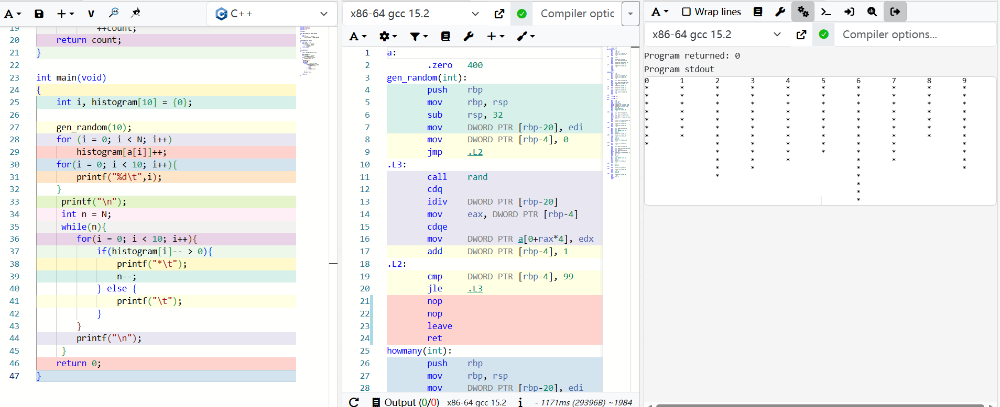

2、

```c
#include <stdio.h>
#include <stdlib.h>
#define N 3
int a[N] = { 1, 2, 3 };
int flag[N];
int print[N];
int idx = 0;
void Full_Permutation(int n){
    if(n == 0){
        for(int i = 0; i < N; i++){
            printf("%d ",print[i]);
        }
        printf("\n");
        return;
    } else{
        for(int i = 0; i < N; i++){
            if(!flag[i]){
                flag[i] = 1;
                print[idx] = a[i];
                idx++;
                Full_Permutation(n-1);
                idx--;
                flag[i] = 0;
            }
        }
    }
}

int main(void)
{
    Full_Permutation(N);
    return 0;
}
```

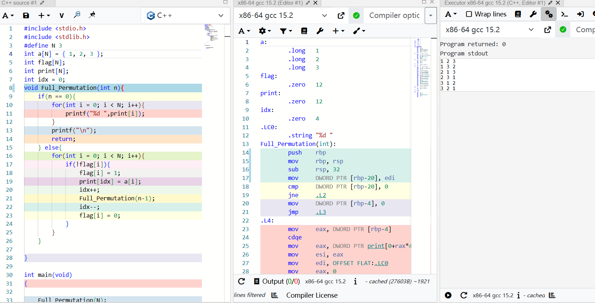

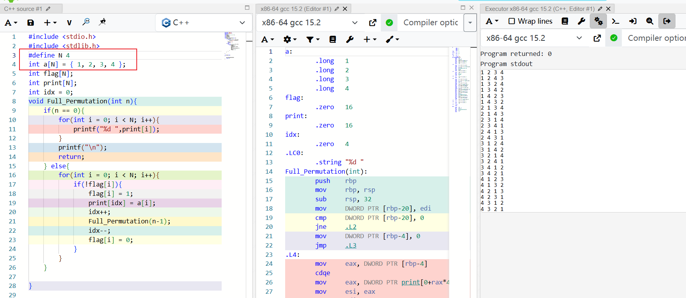

定义一个常量`M`表示从`N`个数中取几个数做排列，当递归M层就输出就好了

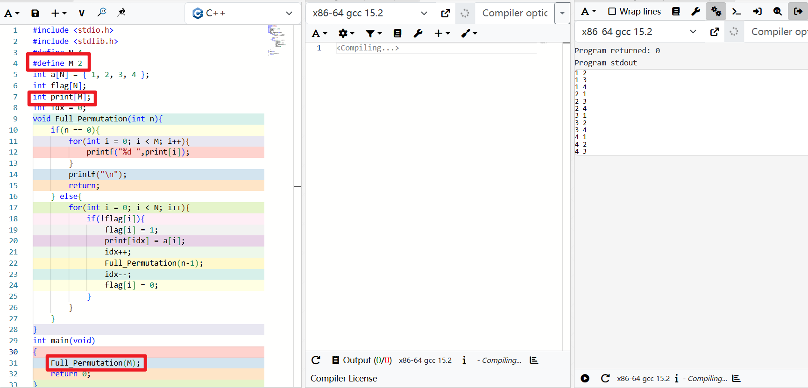

为了实现组合，只需要给递归函数增加一个参数，用于指定当前开始的位置，在递归调用的时候，让下一层递归从自己之后的位置开始，这样可以理解为是只能上升的排列了，不会出现重复了，也就是组合了，确保同一个的元素只出现一次

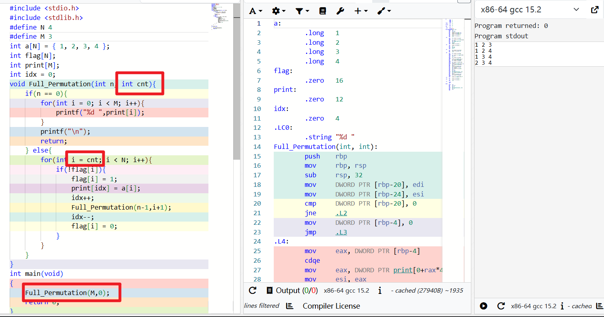

## 4. 字符串

字符串可以看作一个数组，它的每个元素是字符型的，例如字符串`"Hello, world.\n"`图示如下：

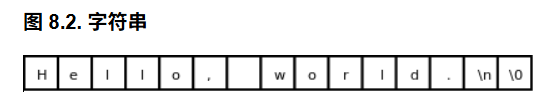

注意每个字符末尾都有一个字符`'\0'`做结束符，这里的`\0`是ASCII码的八进制表示，也就是ASCII码为0的Null字符，在C语言中这种字符串也称为以零结尾的字符串（Null-terminated String）。数组元素可以通过数组名加下标的方式访问，而字符串字面值也可以像数组名一样使用，可以加下标访问其中的字符：

```c
char c = "Hello, world.\n"[0];
```

但是通过下标修改其中的字符却是不允许的：

```c
"Hello, world.\n"[0] = 'A';
```

这行代码会产生编译错误，说字符串字面值是只读的，不允许修改。字符串字面值还有一点和数组名类似，做右值使用时自动转换成指向首元素的指针，在[第 3 节 “形参和实参”](http://akaedu.github.io/book/ch03s03.html#func.paraarg)我们看到`printf`原型的第一个参数是指针类型，而`printf("hello world")`其实就是传一个指针参数给`printf`。

前面讲过数组可以像结构体一样初始化，如果是字符数组，也可以用一个字符串字面值来初始化：

```c
char str[10] = "Hello";
```

相当于：

```c
char str[10] = { 'H', 'e', 'l', 'l', 'o', '\0' };
```

`str`的后四个元素没有指定，自动初始化为0，即Null字符。

注意，虽然字符串字面值`"Hello"`是只读的，但用**它初始化的数组`str`却是可读可写的**。数组`str`中保存了一串字符，以`'\0'`结尾，也可以叫字符串。在本书中只要是以Null字符结尾的一串字符都叫字符串，不管是像`str`这样的数组，还是像`"Hello"`这样的字符串字面值。

如果用于初始化的字符串字面值比数组还长，比如：

```c
char str[10] = "Hello, world.\n";
```

则数组`str`只包含字符串的前10个字符，不包含Null字符，这种情况编译器会给出警告。如果要用一个字符串字面值准确地初始化一个字符数组，最好的办法是不指定数组的长度，让编译器自己计算：

```c
char str[] = "Hello, world.\n";
```

`printf`函数的格式化字符串中可以用`%s`表示字符串的占位符。

字符串可以保存在一个数组里面，用`%s`来打印就很有必要了：

```
printf("string: %s\n", str);
```

`printf`会从数组`str`的开头一直打印到Null字符为止，Null字符本身是Non-printable字符，不打印。这其实是一个危险的信号：如果数组`str`中没有Null字符，那么`printf`函数就会访问数组越界，后果可能会很诡异：有时候打印出乱码，有时候看起来没错误，有时候引起程序崩溃。

## 5. 多维数组

就像结构体可以嵌套一样，数组也可以嵌套，一个数组的元素可以是另外一个数组，这样就构成了多维数组（Multi-dimensional Array）。例如定义并初始化一个二维数组：

```c
int a[3][2] = { 1, 2, 3, 4, 5 };
```

数组`a`有3个元素，`a[0]`、`a[1]`、`a[2]`。每个元素也是一个数组，例如`a[0]`是一个数组，它有两个元素`a[0][0]`、`a[0][1]`，这两个元素的类型是`int`，值分别是1、2，同理，数组`a[1]`的两个元素是3、4，数组`a[2]`的两个元素是5、0。如下图所示：

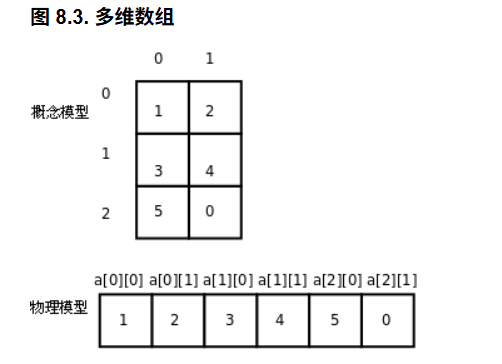

从概念模型上看，这个二维数组是三行两列的表格，元素的两个下标分别是行号和列号。从物理模型上看，这六个元素在存储器中仍然是连续存储的，就像一维数组一样，相当于把概念模型的表格一行一行接起来拼成一串，C语言的这种存储方式称为Row-major方式，而有些编程语言（例如FORTRAN）是把概念模型的表格一列一列接起来拼成一串存储的，称为Column-major方式。

多维数组也可以像嵌套结构体一样用嵌套Initializer初始化，例如上面的二维数组也可以这样初始化：

```c
int a[][2] = { { 1, 2 },
		{ 3, 4 },
		{ 5, } };
```

注意，除了第一维的长度可以由编译器自动计算而不需要指定，其余各维都必须明确指定长度。

利用C99的新特性也可以做Memberwise Initialization，例如：

```c
int a[3][2] = { [0][1] = 9, [2][1] = 8 };
```

结构体和数组嵌套的情况也可以做Memberwise Initialization，例如：

```c
struct complex_struct {
	double x, y;
} a[4] = { [0].x = 8.0 };

struct {
	double x, y;
	int count[4];
} s = { .count[2] = 9 };
```

如果是多维字符数组，也可以嵌套使用字符串字面值做Initializer，例如：


**例 8.4. 多维字符数组**

```c
#include <stdio.h>

void print_day(int day)
{
	char days[8][10] = { "", "Monday", "Tuesday",
			     "Wednesday", "Thursday", "Friday",
			     "Saturday", "Sunday" };

	if (day < 1 || day > 7)
		printf("Illegal day number!\n");
	printf("%s\n", days[day]);
}

int main(void)
{
	print_day(2);
	return 0;
}
```

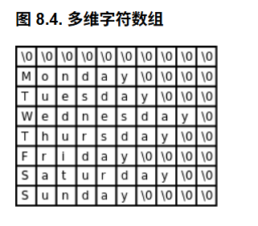

个程序和[例 4.1 “switch语句”](http://akaedu.github.io/book/ch04s04.html#cond.switch1)的功能其实是一样的，但是代码简洁多了。简洁的代码不仅可读性强，而且维护成本也低，像[例 4.1 “switch语句”](http://akaedu.github.io/book/ch04s04.html#cond.switch1)那样一堆`case`、`printf`和`break`，如果漏写一个`break`就要出Bug。这个程序之所以简洁，是因为用数据代替了代码。具体来说，通过下标访问字符串组成的数组可以代替一堆`case`分支判断，这样就可以把每个`case`里重复的代码（`printf`调用）提取出来，从而又一次达到了“提取公因式”的效果。这种方法称为数据驱动的编程（Data-driven Programming），写代码最重要的是选择正确的数据结构来组织信息，设计控制流程和算法尚在其次，只要数据结构选择得正确，其它代码自然而然就变得容易理解和维护了，就像这里的`printf`自然而然就被提取出来了。[[人月神话\]](http://akaedu.github.io/book/bi01.html#bibli.manmonth)中说过：“Show me your flowcharts and conceal your tables, and I shall continue to be mystified. Show me your tables, and I won't usually need your flowcharts; they'll be obvious.”


最后，综合本章的知识，我们来写一个最简单的小游戏－－剪刀石头布：


**例 8.5. 剪刀石头布**

```c
#include <stdio.h>
#include <stdlib.h>
#include <time.h>

int main(void)
{
	char gesture[3][10] = { "scissor", "stone", "cloth" };
	int man, computer, result, ret;

	srand(time(NULL));
	while (1) {
		computer = rand() % 3;
	  	printf("\nInput your gesture (0-scissor 1-stone 2-cloth):\n");
		ret = scanf("%d", &man);
	  	if (ret != 1 || man < 0 || man > 2) {
			printf("Invalid input! Please input 0, 1 or 2.\n");
			continue;
		}
		printf("Your gesture: %s\tComputer's gesture: %s\n", 
			gesture[man], gesture[computer]);

		result = (man - computer + 4) % 3 - 1;
		if (result > 0)
			printf("You win!\n");
		else if (result == 0)
			printf("Draw!\n");
		else
			printf("You lose!\n");
	}
	return 0;
}
```

0、1、2三个整数分别是剪刀石头布在程序中的内部表示，用户也要求输入0、1或2，然后和计算机随机生成的0、1或2比胜负。这个程序的主体是一个死循环，需要按Ctrl-C退出程序。以往我们写的程序都只有打印输出，在这个程序中我们第一次碰到处理用户输入的情况。我们简单介绍一下`scanf`函数的用法，到[第 2.9 节 “格式化I/O函数”](http://akaedu.github.io/book/ch25s02.html#stdlib.formatio)再详细解释。`scanf("%d", &man)`这个调用的功能是等待用户输入一个整数并回车，这个整数会被`scanf`函数保存在`man`这个整型变量里。如果用户输入合法（输入的确实是数字而不是别的字符），则`scanf`函数返回1，表示成功读入一个数据。但即使用户输入的是整数，我们还需要进一步检查是不是在0~2的范围内，写程序时对用户输入要格外小心，用户有可能输入任何数据，他才不管游戏规则是什么。

和`printf`类似，`scanf`也可以用`%c`、`%f`、`%s`等转换说明。如果在传给`scanf`的第一个参数中用`%d`、`%f`或`%c`表示读入一个整数、浮点数或字符，则第二个参数的形式应该是&运算符加相应类型的变量名，表示读进来的数保存到这个变量中，&运算符的作用是得到一个指针类型，到[第 1 节 “指针的基本概念”](http://akaedu.github.io/book/ch23s01.html#pointer.intro)再详细解释；如果在第一个参数中用`%s`读入一个字符串，则第二个参数应该是数组名，数组名前面不加&，因为数组类型做右值时自动转换成指针类型，在[第 2 节 “断点”](http://akaedu.github.io/book/ch10s02.html#gdb.bp)有`scanf`读入字符串的例子。

留给读者思考的问题是：`(man - computer + 4) % 3 - 1`这个神奇的表达式是如何比较出0、1、2这三个数字在“剪刀石头布”意义上的大小的？

平局很显然，man-computer=0时成立，代入式子一定为0

赢的情况，man-compute值为-2或1，代入式子值一定都为1

输的情况，man-compute值为-1或2，代入式子值一定都为-1

感觉是用了同模的思想，但是其实不太知道为什么一定是这个式子

我感觉(man - computer + 3) % 3也可以啊，0平局，1赢，2输也可以吧

# 第 9 章 编码风格

## 1. 缩进和空白

关于空白字符并没有特别规定，因为基本上所有的C代码风格对于空白字符的规定都差不多，主要有以下几条。

1、关键字`if`、`while`、`for`与其后的控制表达式的(括号之间插入一个空格分隔，但括号内的表达式应紧贴括号。例如：

```
while␣(1);
```

2、双目运算符的两侧各插入一个空格分隔，单目运算符和操作数之间不加空格，

例如`i␣=␣i␣+␣1`、`++i`、`!(i␣<␣1)`、`-x`、`&a[1]`等。

3、后缀运算符和操作数之间也不加空格，例如取结构体成员`s.a`、函数调用`foo(arg1)`、取数组成员`a[i]`。

4、,号和;号之后要加空格，这是英文的书写习惯，例如`for␣(i␣=␣1;␣i␣<␣10;␣i++)`、`foo(arg1,␣arg2)`。

5、以上关于双目运算符和后缀运算符的规则并没有严格要求，有时候为了突出优先级也可以写得更紧凑一些，例如`for␣(i=1;␣i<10;␣i++)`、`distance␣=␣sqrt(x*x␣+␣y*y)`等。但是省略的空格一定不要误导了读代码的人，例如`a||b␣&&␣c`很容易让人理解成错误的优先级。

6、由于UNIX系统标准的字符终端是24行80列的，**接近或大于80个字符的较长语句要折行写**，折行后用空格和上面的表达式或参数对齐，例如：

```c
if␣(sqrt(x*x␣+␣y*y)␣>␣5.0
    &&␣x␣<␣0.0
    &&␣y␣>␣0.0)
```

再比如：

```c
foo(sqrt(x*x␣+␣y*y),
    a[i-1]␣+␣b[i-1]␣+␣c[i-1])
```

7、较长的字符串可以断成多个字符串然后分行书写，例如：

```c
printf("This is such a long sentence that "
       "it cannot be held within a line\n");
```

C编译器会自动把相邻的多个字符串接在一起，以上两个字符串相当于一个字符串`"This is such a long sentence that it cannot be held within a line\n"`。

8、有的人喜欢在变量定义语句中用Tab字符，使变量名对齐，这样看起来很美观。

```c
       →int    →a, b;
       →double →c;
```

内核代码风格关于缩进的规则有以下几条。

1、要用缩进体现出语句块的层次关系，**使用Tab字符缩进，不能用空格代替Tab**。在标准的字符终端上一个Tab看起来是8个空格的宽度，如果你的文本编辑器可以设置Tab的显示宽度是几个空格，建议也设成8，这样大的缩进使代码看起来非常清晰。如果有的行用空格做缩进，有的行用Tab做缩进，甚至空格和Tab混用，那么一旦改变了文本编辑器的Tab显示宽度就会看起来非常混乱，所以内核代码风格规定只能用Tab做缩进，不能用空格代替Tab。

2、`if/else`、`while`、`do/while`、`for`、`switch`这些可以带语句块的语句，语句块的{或}应该和关键字写在同一行，用空格隔开，而不是单独占一行。例如应该这样写：

```c
if␣(...)␣{
       →语句列表
}␣else␣if␣(...)␣{
       →语句列表
}
```

但很多人习惯这样写：

```c
if␣(...)
{
       →语句列表
}
else␣if␣(...)
{
       →语句列表
}
```

内核的写法和[[K&R\]](http://akaedu.github.io/book/bi01.html#bibli.kr)一致，好处是不必占太多行，使得一屏能显示更多代码。这两种写法用得都很广泛，只**要在同一个项目中能保持统一就可以了。**

3、函数定义的{和}单独占一行，这一点和语句块的规定不同，例如：

```c
int␣foo(int␣a,␣int␣b)
{
       →语句列表
}
```

4、`switch`和语句块里的`case`、`default`对齐写，也就是说语句块里的`case`、`default`标号相对于`switch`不往里缩进，但标号下的语句要往里缩进。例如：

```c
      →switch␣(c)␣{
      →case 'A':
      →       →语句列表
      →case 'B':
      →       →语句列表
      →default:
      →       →语句列表
      →}
```

用于`goto`语句的自定义标号应该顶头写不缩进，而不管标号下的语句缩进到第几层。

5、代码中每个逻辑段落之间应该用一个空行分隔开。例如每个函数定义之间应该插入一个空行，头文件、全局变量定义和函数定义之间也应该插入空行，例如：

```c
#include <stdio.h>
#include <stdlib.h>

int g;
double h;

int foo(void)
{
       →语句列表
}

int bar(int a)
{
       →语句列表
}

int main(void)
{
       →语句列表
}
```

6、一个函数的语句列表如果很长，也可以根据相关性分成若干组，用空行分隔。这条规定不是严格要求，通常把变量定义组成一组，后面加空行，`return`语句之前加空行，例如：

```c
int main(void)
{
       →int    →a, b;
       →double →c;

       →语句组1

       →语句组2

       →return 0;
}
```

## 2. 注释

单行注释应采用`/*␣comment␣*/`的形式，用空格把界定符和文字分开。多行注释最常见的是这种形式：

```c
/*
␣*␣Multi-line
␣*␣comment
␣*/
```

使用注释的场合主要有以下几种。

1、整个源文件的顶部注释。说明此模块的相关信息，例如文件名、作者和版本历史等，顶头写不缩进。例如内核源代码目录下的`kernel/sched.c`文件的开头：

```c
/*
 *  kernel/sched.c
 *
 *  Kernel scheduler and related syscalls
 *
 *  Copyright (C) 1991-2002  Linus Torvalds
 *
 *  1996-12-23  Modified by Dave Grothe to fix bugs in semaphores and
 *              make semaphores SMP safe
 *  1998-11-19  Implemented schedule_timeout() and related stuff
 *              by Andrea Arcangeli
 *  2002-01-04  New ultra-scalable O(1) scheduler by Ingo Molnar:
 *              hybrid priority-list and round-robin design with
 *              an array-switch method of distributing timeslices
 *              and per-CPU runqueues.  Cleanups and useful suggestions
 *              by Davide Libenzi, preemptible kernel bits by Robert Love.
 *  2003-09-03  Interactivity tuning by Con Kolivas.
 *  2004-04-02  Scheduler domains code by Nick Piggin
 */
```

2、函数注释。说明此函数的功能、参数、返回值、错误码等，**写在函数定义上侧**，和此函数定义之间不留空行，顶头写不缩进。

3、相对独立的语句组注释。对这一组语句做特别说明，**写在语句组上侧**，和此语句组之间不留空行，与当前语句组的缩进一致。

4、代码行右侧的简短注释。对当前代码行做特别说明，一般为单行注释，和代码之间至少用一个空格隔开，一个源文件中所有的右侧注释最好能上下对齐。尽管[例 2.1 “带更多注释的Hello World”](http://akaedu.github.io/book/ch02s01.html#expr.morehelloworld)讲过注释可以穿插在一行代码中间，但不建议这么写。内核源代码目录下的`lib/radix-tree.c`文件中的一个函数包含了上述三种注释：

```c
/**
 *      radix_tree_insert    -    insert into a radix tree
 *      @root:          radix tree root
 *      @index:         index key
 *      @item:          item to insert
 *
 *      Insert an item into the radix tree at position @index.
 */
int radix_tree_insert(struct radix_tree_root *root,
                        unsigned long index, void *item)
{
        struct radix_tree_node *node = NULL, *slot;
        unsigned int height, shift;
        int offset;
        int error;

        /* Make sure the tree is high enough.  */
        if ((!index && !root->rnode) ||
                        index > radix_tree_maxindex(root->height)) {
                error = radix_tree_extend(root, index);
                if (error)
                        return error;
        }

        slot = root->rnode;
        height = root->height;
        shift = (height-1) * RADIX_TREE_MAP_SHIFT;

        offset = 0;                     /* uninitialised var warning */
        do {
                if (slot == NULL) {
                        /* Have to add a child node.  */
                        if (!(slot = radix_tree_node_alloc(root)))
                                return -ENOMEM;
                        if (node) {
                                node->slots[offset] = slot;
                                node->count++;
                        } else
                                root->rnode = slot;
                }

                /* Go a level down */
                offset = (index >> shift) & RADIX_TREE_MAP_MASK;
                node = slot;
                slot = node->slots[offset];
                shift -= RADIX_TREE_MAP_SHIFT;
                height--;
        } while (height > 0);

        if (slot != NULL)
                return -EEXIST;

        BUG_ON(!node);
        node->count++;
        node->slots[offset] = item;
        BUG_ON(tag_get(node, 0, offset));
        BUG_ON(tag_get(node, 1, offset));

        return 0;
}
```

[[CodingStyle\]](http://akaedu.github.io/book/bi01.html#bibli.codingstyle)中特别指出，**函数内的注释要尽可能少用**。写注释主要是为了说明你的代码“能做什么”（比如函数接口定义），而不是为了说明“怎样做”，只要代码写得足够清晰，“怎样做”是一目了然的，如果你需要用注释才能解释清楚，那就表示你的代码可读性很差，除非是特别需要提醒注意的地方才使用函数内注释。

5、复杂的结构体定义比函数更需要注释。例如内核源代码目录下的`kernel/sched.c`文件中定义了这样一个结构体：

```c
/*
 * This is the main, per-CPU runqueue data structure.
 *
 * Locking rule: those places that want to lock multiple runqueues
 * (such as the load balancing or the thread migration code), lock
 * acquire operations must be ordered by ascending &runqueue.
 */
struct runqueue {
        spinlock_t lock;

        /*
         * nr_running and cpu_load should be in the same cacheline because
         * remote CPUs use both these fields when doing load calculation.
         */
        unsigned long nr_running;
#ifdef CONFIG_SMP
        unsigned long cpu_load[3];
#endif
        unsigned long long nr_switches;

        /*
         * This is part of a global counter where only the total sum
         * over all CPUs matters. A task can increase this counter on
         * one CPU and if it got migrated afterwards it may decrease
         * it on another CPU. Always updated under the runqueue lock:
         */
        unsigned long nr_uninterruptible;

        unsigned long expired_timestamp;
        unsigned long long timestamp_last_tick;
        task_t *curr, *idle;
        struct mm_struct *prev_mm;
        prio_array_t *active, *expired, arrays[2];
        int best_expired_prio;
        atomic_t nr_iowait;

#ifdef CONFIG_SMP
        struct sched_domain *sd;

        /* For active balancing */
        int active_balance;
        int push_cpu;

        task_t *migration_thread;
        struct list_head migration_queue;
        int cpu;
#endif

#ifdef CONFIG_SCHEDSTATS
        /* latency stats */
        struct sched_info rq_sched_info;

        /* sys_sched_yield() stats */
        unsigned long yld_exp_empty;
        unsigned long yld_act_empty;
        unsigned long yld_both_empty;
        unsigned long yld_cnt;

        /* schedule() stats */
        unsigned long sched_switch;
        unsigned long sched_cnt;
        unsigned long sched_goidle;

        /* try_to_wake_up() stats */
        unsigned long ttwu_cnt;
        unsigned long ttwu_local;
#endif
};
```

6、复杂的宏定义和变量声明也需要注释。例如内核源代码目录下的`include/linux/jiffies.h`文件中的定义：

```c
/* TICK_USEC_TO_NSEC is the time between ticks in nsec assuming real ACTHZ and  */
/* a value TUSEC for TICK_USEC (can be set bij adjtimex)                */
#define TICK_USEC_TO_NSEC(TUSEC) (SH_DIV (TUSEC * USER_HZ * 1000, ACTHZ, 8))

/* some arch's have a small-data section that can be accessed register-relative
 * but that can only take up to, say, 4-byte variables. jiffies being part of
 * an 8-byte variable may not be correctly accessed unless we force the issue
 */
#define __jiffy_data  __attribute__((section(".data")))

/*
 * The 64-bit value is not volatile - you MUST NOT read it
 * without sampling the sequence number in xtime_lock.
 * get_jiffies_64() will do this for you as appropriate.
 */
extern u64 __jiffy_data jiffies_64;
extern unsigned long volatile __jiffy_data jiffies;
```

## 3. 标识符命名

标识符命名应遵循以下原则：

1. 标识符命名要清晰明了，可以使用完整的单词和易于理解的缩写。短的单词可以通过去元音形成缩写，较长的单词可以取单词的头几个字母形成缩写。看别人的代码看多了就可以总结出一些缩写惯例，例如`count`写成`cnt`，`block`写成`blk`，`length`写成`len`，`window`写成`win`，`message`写成`msg`，`number`写成`nr`，`temporary`可以写成`temp`，也可以进一步写成`tmp`，最有意思的是`internationalization`写成`i18n`，词根`trans`经常缩写成`x`，例如`transmit`写成`xmt`。我就不多举例了，请读者在看代码时自己注意总结和积累。

2. 内核编码风格规定**变量、函数和类型采用全小写加下划线**的方式命名，**常量（比如宏定义和枚举常量）采用全大写加下划线**的方式命名，比如上一节举例的函数名`radix_tree_insert`、类型名`struct radix_tree_root`、常量名`RADIX_TREE_MAP_SHIFT`等。

   微软发明了一种变量命名法叫匈牙利命名法（Hungarian notation），在变量名中用前缀表示类型，例如`iCnt`（i表示int）、`pMsg`（p表示pointer）、`lpszText`（lpsz表示long pointer to a zero-ended string）等。Linus在[[CodingStyle\]](http://akaedu.github.io/book/bi01.html#bibli.codingstyle)中毫不客气地讽刺了这种写法：“Encoding the type of a function into the name (so-called Hungarian notation) is brain damaged - the compiler knows the types anyway and can check those, and it only confuses the programmer. No wonder MicroSoft makes buggy programs.”代码风格本来就是一个很有争议的问题，如果你接受本章介绍的内核编码风格（也是本书所有范例代码的风格），就不要使用大小写混合的变量命名方式[[19](http://akaedu.github.io/book/ch09s03.html#ftn.id2738703)]，更不要使用匈牙利命名法。

3. **全局变量和全局函数的命名一定要详细**，不惜多用几个单词多写几个下划线，例如函数名`radix_tree_insert`，因为它们在整个项目的许多源文件中都会用到，必须让使用者明确这个变量或函数是干什么用的。局部变量和只在一个源文件中调用的内部函数的命名可以简略一些，但不能太短。尽量不要使用单个字母做变量名，只有一个例外：用`i`、`j`、`k`做循环变量是可以的。

4. 针对中国程序员的一条特别规定：**禁止用汉语拼音做标识符**，可读性极差。

## 4. 函数

每个函数都应该设计得尽可能简单，简单的函数才容易维护。应遵循以下原则：

1. 实现**一个函数只是为了做好一件事情**，不要把函数设计成用途广泛、面面俱到的，这样的函数肯定会超长，而且往往不可重用，维护困难。
2. **函数内部的缩进层次不宜过多**，一般以少于4层为宜。如果缩进层次太多就说明设计得太复杂了，应考虑分割成更小的函数（Helper Function）来调用。
3. **函数不要写得太长**，建议在24行的标准终端上不超过两屏，太长会造成阅读困难，如果一个函数超过两屏就应该考虑分割函数了。[[CodingStyle\]](http://akaedu.github.io/book/bi01.html#bibli.codingstyle)中特别说明，如果一个函数在概念上是简单的，只是长度很长，这倒没关系。例如函数由一个大的`switch`组成，其中有非常多的`case`，这是可以的，因为各`case`分支互不影响，整个函数的复杂度只等于其中一个`case`的复杂度，这种情况很常见，例如TCP协议的状态机实现。
4. 执行函数就是执行一个动作，**函数名通常应包含动词**，例如`get_current`、`radix_tree_insert`。
5. 比较**重要的函数定义上侧必须加注释**，说明此函数的功能、参数、返回值、错误码等。
6. 另一种度量函数复杂度的办法是看有多少个局部变量，5到10个局部变量已经很多了，再多就很难维护了，应该考虑分割成多个函数。

## 5. indent工具

`indent`工具可以把代码格式化成某种风格

```bash
$ indent -kr -i8 main.c 
```

`-kr`选项表示K&R风格，`-i8`表示缩进8个空格的长度。如果没有指定`-nut`选项，则每8个缩进空格会自动用一个Tab代替。注意`indent`命令会直接修改原文件，而不是打印到屏幕上或者输出到另一个文件，这一点和很多UNIX命令不同。可以看出，`-kr -i8`两个选项格式化出来的代码已经很符合本章介绍的代码风格了，添加了必要的缩进和空白，较长的代码行也会自动折行。美中不足的是没有添加适当的空行，因为`indent`工具也不知道哪几行代码在逻辑上是一组的，空行还是要自己动手添，当然原有的空行肯定不会被`indent`删去的。

如果你采纳本章介绍的内核编码风格，基本上`-kr -i8`这两个参数就够用了。`indent`工具也有支持其它编码风格的选项，具体请参考Man Page。有时候`indent`工具的确非常有用，比如某个项目中途决定改变编码风格（这很少见），或者往某个项目中添加的几个代码文件来自另一个编码风格不同的项目，**但绝不能因为有了`indent`工具就肆无忌惮**，一开始把代码写得乱七八糟，最后再依靠`indent`去清理。

# 第 11 章 排序与查找

## 1. 算法的概念

**算法（Algorithm）是将一组输入转化成一组输出的一系列计算步骤，其中每个步骤必须能在有限时间内完成。**比如[第 3 节 “递归”](http://akaedu.github.io/book/ch05s03.html#func2.recursion)习题1中的Euclid算法，输入是两个正整数，输出是它们的最大公约数，计算步骤是取模、比较等操作，这个算法一定能在有限的步骤和时间内完成（想一想为什么？）。再比如将一组数从小到大排序，输入是一组原始数据，输出是排序之后的数据，计算步骤包括比较、移动数据等操作。

不正确的算法有两种可能，一是对于该问题的某些输入，该算法会无限计算下去，不会终止，二是对于该问题的某些输入，该算法终止时输出的是错误的结果。有时候不正确的算法也是有用的，如果对于某个问题寻求正确的算法很困难，而某个不正确的算法可以在有限时间内终止，并且能把误差控制在一定范围内，那么这样的算法也是有实际意义的。例如有时候寻找最优解的开销很大，往往会选择能给出次优解的算法。

## 2. 插入排序

每次选择1个数，将其插入到前面已经排好序的部分的合适的位置，其余后移

```c
#include <stdio.h>

#define LEN 5
int a[LEN] = { 10, 5, 2, 4, 7 };

void insertion_sort(void)
{
	int i, j, key;
	for (j = 1; j < LEN; j++) {
		printf("%d, %d, %d, %d, %d\n",
		       a[0], a[1], a[2], a[3], a[4]);
		key = a[j];
		i = j - 1;
		while (i >= 0 && a[i] > key) {
			a[i+1] = a[i];
			i--;
		}
		a[i+1] = key;
	}
	printf("%d, %d, %d, %d, %d\n",
	       a[0], a[1], a[2], a[3], a[4]);
}

int main(void)
{
	insertion_sort();
	return 0;
}
```

如何严格证明这个算法是正确的？换句话说，只要反复执行该算法的`for`循环体，执行`LEN-1`次，就一定能把数组`a`排好序，而不管数组`a`的原始数据是什么，如何证明这一点呢？我们可以借助Loop Invariant的概念和数学归纳法来理解循环结构的算法，**假如某个判断条件满足以下三条准则，它就称为Loop Invariant**：

1. 第一次执行循环体之前该判断条件为真。
2. 如果“第N-1次循环之后（或者说第N次循环之前）该判断条件为真”这个前提可以成立，那么就有办法证明第N次循环之后该判断条件仍为真。
3. 如果在所有循环结束后该判断条件为真，那么就有办法证明该算法正确地解决了问题。

只要我们找到这个Loop Invariant，就可以证明一个循环结构的算法是正确的。上述插入排序算法的Loop Invariant是这样的判断条件：*第`j`次循环之前，子序列a[0..j-1]是排好序的*。在上面的打印结果中，我把子序列a[0..j-1]加粗表示。下面我们验证一下Loop Invariant的三条准则：

1. 第一次执行循环之前，`j=1`，子序列a[0..j-1]只有一个元素`a[0]`，只有一个元素的序列显然是排好序的。
2. 第`j`次循环之前，如果“子序列a[0..j-1]是排好序的”这个前提成立，现在要把`key=a[j]`插进去，按照该算法的步骤，把`a[j-1]`、`a[j-2]`、`a[j-3]`等等比`key`大的元素都依次往后移一个，直到找到合适的位置给`key`插入，就能证明循环结束时子序列a[0..j]是排好序的。就像插扑克牌一样，“手中已有的牌是排好序的”这个前提很重要，如果没有这个前提，就不能证明再插一张牌之后也是排好序的。
3. 当循环结束时，`j=LEN`，如果“子序列a[0..j-1]是排好序的”这个前提成立，那就是说a[0..LEN-1]是排好序的，也就是说整个数组`a`的`LEN`个元素都排好序了。

可见，有了这三条，就可以用数学归纳法证明这个循环是正确的。这和[第 3 节 “递归”](http://akaedu.github.io/book/ch05s03.html#func2.recursion)证明递归程序正确性的思想是一致的，这里的第一条就相当于递归的Base Case，第二条就相当于递归的递推关系。这再次说明了递归和循环是等价的。

## 3. 算法的时间复杂度分析

解决同一个问题可以有很多种算法，比较评价算法的好坏，一个重要的标准就是算法的时间复杂度。现在研究一下插入排序算法的执行时间，按照习惯，输入长度`LEN`以下用n表示。设循环中各条语句的执行时间分别是c1、c2、c3、c4、c5这样五个常数[[23](http://akaedu.github.io/book/ch11s03.html#ftn.id2745592)]：

```c
void insertion_sort(void)			执行时间
{
	int i, j, key;
	for (j = 1; j < LEN; j++) {
		key = a[j];				c1
		i = j - 1;				c2
		while (i >= 0 && a[i] > key) {
			a[i+1] = a[i];		c3
			i--;				c4
		}
		a[i+1] = key;			c5
	}
}
```

显然外层`for`循环的执行次数是n-1次，假设内层的`while`循环执行m次，则总的执行时间粗略估计是(n-1)\*(c1+c2+c5+m\*(c3+c4))。当然，`for`和`while`后面()括号中的赋值和条件判断的执行也需要时间，而我没有设一个常数来表示，这不影响我们的粗略估计。

这里有一个问题，m不是个常数，也不取决于输入长度n，而是取决于具体的输入数据。在最好情况下，数组`a`的原始数据已经排好序了，`while`循环一次也不执行，总的执行时间是(c1+c2+c5)*n-(c1+c2+c5)，可以表示成an+b的形式，是n的线性函数（Linear Function）。那么在最坏情况（Worst Case）下又如何呢？所谓最坏情况是指数组`a`的原始数据正好是从大到小排好序的，请读者想一想为什么这是最坏情况，然后把上式中的m替换掉算一下执行时间是多少。

最坏情况下，m依次是0，1，2.....n-1

数组`a`的原始数据属于最好和最坏情况的都比较少见，如果原始数据是随机的，可称为平均情况（Average Case）。如果原始数据是随机的，那么每次循环将已排序的子序列a[1..j-1]与新插入的元素`key`相比较，子序列中平均都有一半的元素比`key`大而另一半比`key`小，请读者把上式中的m替换掉算一下执行时间是多少。最后的结论应该是：在最坏情况和平均情况下，总的执行时间都可以表示成an^2^+bn+c的形式，是n的二次函数（Quadratic Function）。

在分析算法的时间复杂度时，我们更关心最坏情况而不是最好情况，理由如下：

1. 最坏情况给出了算法执行时间的上界，我们可以确信，无论给什么输入，算法的执行时间都不会超过这个上界，这样为比较和分析提供了便利。
2. 对于某些算法，最坏情况是最常发生的情况，例如在数据库中查找某个信息的算法，最坏情况就是数据库中根本不存在该信息，都找遍了也没有，而某些应用场合经常要查找一个信息在数据库中存在不存在。
3. 虽然最坏情况是一种悲观估计，但是对于很多问题，平均情况和最坏情况的时间复杂度差不多，比如插入排序这个例子，平均情况和最坏情况的时间复杂度都是输入长度n的二次函数。

比较两个多项式a~1~n+b~1~和a~2~n^2^+b~2~n+c~2~的值（n取正整数）可以得出结论：n的最高次指数是最主要的决定因素，常数项、低次幂项和系数都是次要的。比如100n+1和n^2^+1，虽然后者的系数小，当n较小时前者的值较大，但是当n>100时，后者的值就远远大于前者了。如果同一个问题可以用两种算法解决，其中一种算法的时间复杂度为线性函数，另一种算法的时间复杂度为二次函数，当问题的输入长度n足够大时，前者明显优于后者。因此我们可以用一种更粗略的方式表示算法的时间复杂度，把系数和低次幂项都省去，线性函数记作Θ(n)，二次函数记作Θ(n^2^)。

Θ(g(n))表示和g(n)同一量级的一类函数，例如所有的二次函数f(n)都和g(n)=n^2^属于同一量级，都可以用Θ(n^2^)来表示，甚至有些不是二次函数的也和n^2^属于同一量级，例如2n^2^+3lgn。

几种常见的时间复杂度函数按数量级从小到大的顺序依次是：Θ(lgn)，Θ(sqrt(n))，Θ(n)，Θ(nlgn)，Θ(n^2^)，Θ(n^3^)，Θ(2^n^)，Θ(n!)。

除了Θ-notation之外，表示算法的时间复杂度常用的还有一种Big-O notation。我们知道插入排序在最坏情况和平均情况下时间复杂度是Θ(n^2^)，在最好情况下是Θ(n)，数量级比Θ(n^2^)要小，那么总结起来在各种情况下插入排序的时间复杂度是O(n^2^)。**Θ的含义和“等于”类似，而大O的含义和“小于等于”类似**。

## 4. 归并排序

下面介绍另一种典型的排序算法－－归并排序，它采取分而治之（Divide-and-Conquer）的策略，时间复杂度是Θ(nlgn)。归并排序的步骤如下：

1. Divide: 把长度为n的输入序列分成两个长度为n/2的子序列。
2. Conquer: 对这两个子序列分别采用归并排序。
3. Combine: 将两个排序好的子序列合并成一个最终的排序序列。

在描述归并排序的步骤时又调用了归并排序本身，可见这是一个递归的过程。

```c
#include <stdio.h>

#define LEN 8
int a[LEN] = { 5, 2, 4, 7, 1, 3, 2, 6 };

void merge(int start, int mid, int end)
{
	int n1 = mid - start + 1;
	int n2 = end - mid;
	int left[n1], right[n2];
	int i, j, k;

	for (i = 0; i < n1; i++) /* left holds a[start..mid] */
		left[i] = a[start+i];
	for (j = 0; j < n2; j++) /* right holds a[mid+1..end] */
		right[j] = a[mid+1+j];

	i = j = 0;
	k = start;
	while (i < n1 && j < n2)
		if (left[i] < right[j])
			a[k++] = left[i++];
		else
			a[k++] = right[j++];

	while (i < n1) /* left[] is not exhausted */
		a[k++] = left[i++];
	while (j < n2) /* right[] is not exhausted */
		a[k++] = right[j++];
}

void sort(int start, int end)
{
	int mid;
	if (start < end) {
		mid = (start + end) / 2;
		printf("sort (%d-%d, %d-%d) %d %d %d %d %d %d %d %d\n", 
		       start, mid, mid+1, end, 
		       a[0], a[1], a[2], a[3], a[4], a[5], a[6], a[7]);
		sort(start, mid);
		sort(mid+1, end);
		merge(start, mid, end);
		printf("merge (%d-%d, %d-%d) to %d %d %d %d %d %d %d %d\n", 
		       start, mid, mid+1, end, 
		       a[0], a[1], a[2], a[3], a[4], a[5], a[6], a[7]);
	}
}

int main(void)
{
	sort(0, LEN-1);
	return 0;
}
```

`sort`函数把a[start..end]平均分成两个子序列，分别是a[start..mid]和a[mid+1..end]，对这两个子序列分别递归调用`sort`函数进行排序，然后调用`merge`函数将排好序的两个子序列合并起来，由于两个子序列都已经排好序了，合并的过程很简单，每次循环取两个子序列中最小的元素进行比较，将较小的元素取出放到最终的排序序列中，如果其中一个子序列的元素已取完，就把另一个子序列剩下的元素都放到最终的排序序列中。

首先分析`merge`函数的时间复杂度。在`merge`函数中演示了C99的新特性－－可变长数组，当然也可以避免使用这一特性，比如把`left`和`right`都按最大长度`LEN`分配。不管用哪种办法，定义数组并分配存储空间的执行时间都可以看作常数，与数组的长度无关，常数用Θ-notation记作Θ(1)。设子序列a[start..mid]的长度为`n1`，子序列[mid+1..end]的长度为`n2`，a[start..end]的总长度为n=n1+n2，则前两个`for`循环的执行时间是Θ(n1+n2)，也就是Θ(n)，后面三个`for`循环合在一起看，每走一次循环就会在最终的排序序列中确定一个元素，最终的排序序列共有n个元素，所以执行时间也是Θ(n)。两个Θ(n)再加上若干常数项，`merge`函数总的执行时间仍是Θ(n)，其中n=end-start+1。

然后分析`sort`函数的时间复杂度，当输入长度n=1，也就是`start==end`时，`if`条件不成立，执行时间为常数Θ(1)，当输入长度n>1时：

总的执行时间 = 2 × 输入长度为n/2的`sort`函数的执行时间 + `merge`函数的执行时间Θ(n)

设输入长度为n的`sort`函数的执行时间为T(n)，综上所述：

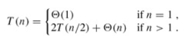

这是一个递推公式（Recurrence），我们需要消去等号右侧的T(n)，把T(n)写成n的函数。其实符合一定条件的Recurrence的展开有数学公式可以套，这里我们略去严格的数学证明，只是从直观上看一下这个递推公式的结果。当n=1时可以设T(1)=c1，当n>1时可以设T(n)=2T(n/2)+c2n，我们取c1和c2中较大的一个设为c，把原来的公式改为：

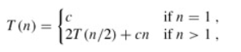

这样计算出的结果应该是T(n)的上界。下面我们把T(n/2)展开成2T(n/4)+cn/2（下图中的(c)），然后再把T(n/4)进一步展开，直到最后全部变成T(1)=c（下图中的(d)）：

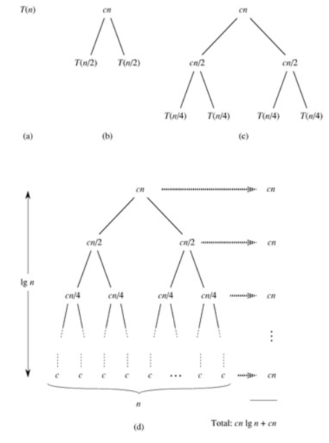

把图(d)中所有的项加起来就是总的执行时间。这是一个树状结构，每一层的和都是cn，共有lgn+1层，因此总的执行时间是cnlgn+cn，相比nlgn来说，cn项可以忽略，因此T(n)的上界是Θ(nlgn)。

如果先前取c1和c2中较小的一个设为c，计算出的结果应该是T(n)的下界，然而推导过程一样，结果也是Θ(nlgn)。既然T(n)的上下界都是Θ(nlgn)，显然T(n)就是Θ(nlgn)。

和插入排序的平均情况相比归并排序更快一些，虽然`merge`函数的步骤较多，引入了较大的常数、系数和低次项，但是对于较大的输入长度n，这些都不是主要因素，归并排序的时间复杂度是Θ(nlgn)，而插入排序的平均情况是Θ(n^2^)，这就决定了归并排序是更快的算法。但是不是任何情况下归并排序都优于插入排序呢？哪些情况适用插入排序而不适用归并排序？留给读者思考。

当数组基本有序时，插入排序的时间复杂度接近O(n)，比归并更快

> 1、快速排序是另外一种采用分而治之策略的排序算法，在平均情况下的时间复杂度也是Θ(nlgn)，但比归并排序有更小的时间常数。它的基本思想是这样的：
>
> ```c
> int partition(int start, int end)
> {
> 	从a[start..end]中选取一个pivot元素（比如选a[start]为pivot）;
> 	在一个循环中移动a[start..end]的数据，将a[start..end]分成两半，
> 	使a[start..mid-1]比pivot元素小，a[mid+1..end]比pivot元素大，而a[mid]就是pivot元素;
> 	return mid;
> }
> 
> void quicksort(int start, int end)
> {
> 	int mid;
> 	if (end > start) {
> 		mid = partition(start, end);
> 		quicksort(start, mid-1);
> 		quicksort(mid+1, end);
> 	}
> }
> ```
>
> 请补完`partition`函数，这个函数有多种写法，请选择时间常数尽可能小的实现方法。想想快速排序在最好和最坏情况下的时间复杂度是多少？快速排序在平均情况下的时间复杂度分析起来比较复杂，有兴趣的读者可以参考[[算法导论\]](http://akaedu.github.io/book/bi01.html#bibli.algorithm)。

```c
#include <stdio.h>
#include <stdlib.h>
int a[8] = { 5, 2, 4, 7, 1, 3, 2, 6 };
int partition(int start, int end)
{
	// 从a[start..end]中选取一个pivot元素（比如选a[start]为pivot）;
	// 在一个循环中移动a[start..end]的数据，将a[start..end]分成两半，
	// 使a[start..mid-1]比pivot元素小，a[mid+1..end]比pivot元素大，而a[mid]就是pivot元素;
    int pivot = a[start];
    int i = start;
    int j = end;
    while(i < j){
        //注意一定要是>=或者下面写<=，不然两边都是和枢值相同的值时会死循环
        while(i < j && a[j] >= pivot){ 
            j--;
        }
        a[i] = a[j];
        printf("%d %d %d %d %d %d %d %d\n",
		       a[0], a[1], a[2], a[3], a[4], a[5], a[6], a[7]);
        while(i < j && a[i] < pivot){
            i++;
        }
        a[j] = a[i];
        printf("%d %d %d %d %d %d %d %d\n",
		       a[0], a[1], a[2], a[3], a[4], a[5], a[6], a[7]);
    }
    a[i] = pivot;
	return i;
}
    
void quicksort(int start, int end)
{
	int mid;
	if (end > start) {
		mid = partition(start, end);
		quicksort(start, mid-1);
		quicksort(mid+1, end);
	}
}
int main(void)
{
    quicksort(0,7);
     printf("%d %d %d %d %d %d %d %d\n",
		       a[0], a[1], a[2], a[3], a[4], a[5], a[6], a[7]);
        
    return 0;
}
```

最好就是每一次选的枢值都正好是这个区间的中值，这样只需要log(n)次划分即可，总时间复杂度就是O(nlog(n))

最差就是给的数据已经是顺序的或者逆序的，这样就需要n次划分，每次都要遍历，所以时间复杂度就是O(n^2^)

## 5. 线性查找

就是一个一个按下标来遍历

那么现在这个问题－－给定一个随机排列的序列，找出其中某个元素的位置－－有没有比O(n)更快的算法？比如O(lgn)？请读者思考一下。

想了半天也没想出来。。去搜了一下，结果发现没有。。

> 1、实现一个算法，在一组随机排列的数中找出最小的一个。你能想到的最直观的算法一定是Θ(n)的，想想有没有比Θ(n)更快的算法？
>
> 2、在一组随机排列的数中找出第二小的，这个问题比上一个稍复杂，你能不能想出Θ(n)的算法？
>
> 3、进一步泛化，在一组随机排列的数中找出第k小的，这个元素称为k-th Order Statistic。能想到的最直观的算法肯定是先把这些数排序然后取第k个，时间复杂度和排序算法相同，可以是Θ(nlgn)。这个问题虽然比前两个问题复杂，但它也有平均情况下时间复杂度是Θ(n)的算法，将上一节习题1的快速排序算法稍加修改就可以解决这个问题：
>
> ```
> /* 从start到end之间找出第k小的元素 */
> int order_statistic(int start, int end, int k)
> {
> 	用partition函数把序列分成两半，中间的pivot元素是序列中的第i个;
> 	if (k == i)
> 		返回找到的元素;
> 	else if (k > i)
> 		从后半部分找出第k-i小的元素并返回;
> 	else
> 		从前半部分找出第k小的元素并返回;
> }
> ```
>
> 请编程实现这个算法。

1、我觉得没有比O(n)更快的算法，因为数列的数据是随机的，比O(n)快的算法一定会有没有检测到的数据，而数据间又没有关系，不能保证未检测的数据没有更小的值

2、这个可以，循环2次就好了

```c
#include <stdio.h>
#include <stdlib.h>
#define N 8
int a[N] = { 5, 2, 4, 7, 1, 3, 9, 6 };
int find_second(){
    int f = a[0]<a[1] ? a[0] : a[1];
    int s = a[0]<a[1] ? a[1] : a[0];
    for(int i = 0; i < N; i++){
        if(a[i] < f){
            f = a[i];
        } 
    }
    for(int i = 0; i < N; i++){
        if(a[i] < s && a[i] > f){
            s = a[i];
        }
    }
    return s;
}
int main(void)
{
    printf("%d",find_second());
    return 0;
}
```

3、

```c
#include <stdio.h>
#include <stdlib.h>
int a[8] = { 5, 2, 4, 7, 1, 3, 2, 6 };
int partition(int start, int end)
{
	// 从a[start..end]中选取一个pivot元素（比如选a[start]为pivot）;
	// 在一个循环中移动a[start..end]的数据，将a[start..end]分成两半，
	// 使a[start..mid-1]比pivot元素小，a[mid+1..end]比pivot元素大，而a[mid]就是pivot元素;
    int pivot = a[start];
    int i = start;
    int j = end;
    while(i < j){
        //注意一定要是>=或者下面写<=，不然两边都是和枢值相同的值时会死循环
        while(i < j && a[j] >= pivot){ 
            j--;
        }
        a[i] = a[j];
        while(i < j && a[i] < pivot){
            i++;
        }
        a[j] = a[i];
    }
    a[i] = pivot;
	return i;
}
/* 从start到end之间找出第k小的元素 */
int order_statistic(int start, int end, int k)
{
	//用partition函数把序列分成两半，中间的pivot元素是序列中的第i个;
    int i = partition(start, end);
	if (k == i)
		//返回找到的元素;
        return a[k-1];
	else if (k > i)
		//从后半部分找出第k-i小的元素并返回;
    	return order_statistic(i+1,end,k);
	else
		//从前半部分找出第k小的元素并返回;
    	return order_statistic(start,i-1,k);
}

int main(void)
{
    printf("%d",order_statistic(0,7,0));
    return 0;
}
```

因为返回的是下标，第1小应该返回a[0],所以返回a[k-1]

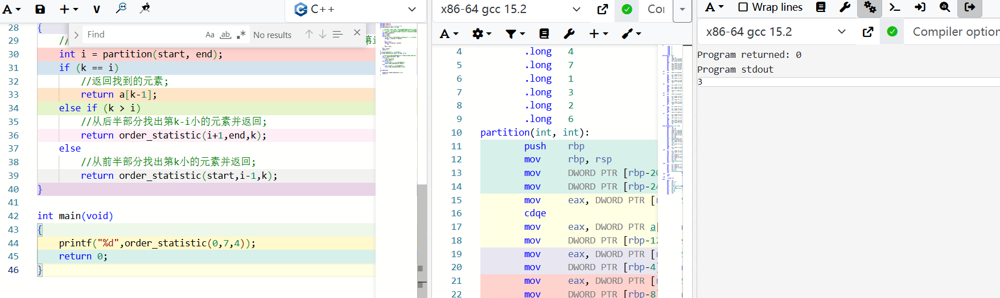

## 6. 折半查找

如果不是从一组随机的序列里查找，而是从一组排好序的序列里找出某个元素的位置，则可以有更快的算法.

由于这个序列已经从小到大排好序了，每次取中间的元素和待查找的元素比较，如果中间的元素比待查找的元素小，就说明“如果待查找的元素存在，一定位于序列的后半部分”，这样可以把搜索范围缩小到后半部分，然后再次使用这种算法迭代。这种“每次将搜索范围缩小一半”的思想称为折半查找（Binary Search）。思考一下，这个算法的时间复杂度是多少？

这个算法的思想很简单，不是吗？可是[[编程珠玑\]](http://akaedu.github.io/book/bi01.html#bibli.pearls)上说作者在课堂上讲完这个算法的思想然后让学生写程序，有90%的人写出的程序中有各种各样的Bug，读者不信的话可以不看书自己写一遍试试。这个算法容易出错的地方很多，比如`mid = (start + end) / 2;`这一句，在数学概念上其实是`mid = ⌊(start + end) / 2⌋`，还有`start = mid + 1;`和`end = mid - 1;`，如果前者写成了`start = mid;`或后者写成了`end = mid;`那么很可能会导致死循环（想一想什么情况下会死循环）。

当start是1，end是2时，且值在2处时就会一直死循环

怎样才能保证程序的正确性呢？在[第 2 节 “插入排序”](http://akaedu.github.io/book/ch11s02.html#sortsearch.insertion)我们讲过借助Loop Invariant证明循环的正确性，`binarysearch`这个函数的主体也是一个循环，它的Loop Invariant可以这样描述：*待查找的元素`number`如果存在于数组`a`之中，那么一定存在于a[start..end]这个范围之间，换句话说，在这个范围之外的数组`a`的元素中一定不存在`number`这个元素*。以下为了书写方便，我们把这句话表示成`mustbe(start, end, number)`。可以一边看算法一边做推理：

```c
int binarysearch(int number)
{
	int mid, start = 0, end = LEN - 1;

	/* 假定a是排好序的 */
	/* mustbe(start, end, number)，因为a[start..end]就是整个数组a[0..LEN-1] */
	while (start <= end) {
	/* mustbe(start, end, number)，因为一开始进入循环时是正确的，每次循环也都维护了这个条件 */
		mid = (start + end) / 2;
		if (a[mid] < number)
			/* 既然a是排好序的，a[start..mid]应该都比number小，所以mustbe(mid+1, end, number) */
			start = mid + 1;
			/* 维护了mustbe(start, end, number) */
		else if (a[mid] > number)
			/* 既然a是排好序的，a[mid..end]应该都比number大，所以mustbe(start, mid-1, number) */
			end = mid - 1;
			/* 维护了mustbe(start, end, number) */
		else
			/* a[mid] == number，说明找到了 */
			return mid;
	}
	/* 
	 * mustbe(start, end, number)一直被循环维护着，到这里应该仍然成立，在a[start..end]范围之外一定不存在number，
	 * 但现在a[start..end]是空序列，在这个范围之外的正是整个数组a，因此整个数组a中都不存在number
	 */
	return -1;
}
```

注意这个算法有一个非常重要的前提－－`a`是排好序的。缺了这个前提，“如果`a[mid] < number`，那么a[start..mid]应该都比`number`小”这一步推理就不能成立，这个函数就不能正确地完成查找。从更普遍的意义上说，函数的调用者（Caller）和函数的实现者（Callee，被调用者）之间订立了一个契约（Contract），在调用函数之前，Caller要为Callee提供某些条件，比如确保`a`是排好序的，确保a[start..end]都是有效的数组元素而没有访问越界，这称为Precondition，然后Callee对一些Invariant进行维护（Maintenance），这些Invariant保证了Callee在函数返回时能够对Caller尽到某些义务，比如确保“如果`number`在数组`a`中存在，一定能找出来并返回它的位置，如果`number`在数组`a`中不存在，一定能返回-1”，这称为Postcondition。如果每个函数的文档都非常清楚地记录了Precondition、Maintenance和Postcondition是什么，那么每个函数都可以独立编写和测试，整个系统就会易于维护。这种编程思想是由Eiffel语言的设计者Bertrand Meyer提出来的，称为Design by Contract（DbC）。

测试一个函数是否正确需要把Precondition、Maintenance和Postcondition这三方面都测试到，比如`binarysearch`这个函数，即使它写得非常正确，既维护了Invariant也保证了Postcondition，如果调用它的Caller没有保证Precondition，最后的结果也还是错的。我们编写几个测试用的Predicate函数，然后把相关的测试插入到`binarysearch`函数中：

```c
#include <stdio.h>
#include <assert.h>

#define LEN 8
int a[LEN] = { 1, 2, 2, 2, 5, 6, 8, 9 };

int is_sorted(void)
{
	int i;
	for (i = 1; i < LEN; i++)
		if (a[i-1] > a[i])
			return 0;
	return 1;
}

int mustbe(int start, int end, int number)
{
	int i;
	for (i = 0; i < start; i++)
		if (a[i] == number)
			return 0;
	for (i = end+1; i < LEN; i++)
		if (a[i] == number)
			return 0;
	return 1;
}

int contains(int n)
{
	int i;
	for (i = 0; i < LEN; i++)
		if (a[i] == n)
			return 1;
	return 0;
}

int binarysearch(int number)
{
	int mid, start = 0, end = LEN - 1;

	assert(is_sorted()); /* Precondition */
	while (start <= end) {
		assert(mustbe(start, end, number)); /* Maintenance */
		mid = (start + end) / 2;
		if (a[mid] < number)
			start = mid + 1;
		else if (a[mid] > number)
			end = mid - 1;
		else {
			assert(mid >= start && mid <= end
			       && a[mid] == number) /* Postcondition 1 */
			return mid;
		}
	}
	assert(!contains(number)); /* Postcondition 2 */
	return -1;
}

int main(void)
{
	printf("%d\n", binarysearch(5));
	return 0;
}
```

`assert`是头文件`assert.h`中的一个宏定义，执行到`assert(is_sorted())`这句时，如果`is_sorted()`返回值为真，则当什么事都没发生过，继续往下执行，如果`is_sorted()`返回值为假（例如把数组的排列顺序改一改），则报错退出程序：

```bash
main: main.c:33: binarysearch: Assertion `is_sorted()' failed.
Aborted
```

在代码中适当的地方使用断言（Assertion）可以有效地帮助我们测试程序。也许有人会问：我们用几个测试函数来测试`binarysearch`，那么这几个测试函数又用什么来测试呢？在实际工作中我们要测试的代码绝不会像`binarysearch`这么简单，而我们编写的测试函数往往都很简单，比较容易保证正确性，也就是用简单的、不容易出错的代码去测试复杂的、容易出错的代码。

测试代码只在开发和调试时有用，如果正式发布（Release）的软件也要运行这些测试代码就会严重影响性能了，如果在包含`assert.h`之前定义一个`NDEBUG`宏（表示No Debug），就可以禁用`assert.h`中的`assert`宏定义，这样代码中的所有`assert`测试都不起作用了：

```c
#define NDEBUG
#include <stdio.h>
#include <assert.h>
...
```

注意`NDEBUG`和我们以前使用的宏定义有点不同，例如`#define N 20`将`N`定义为20，在预处理时把代码中所有的标识符`N`替换成20，而`#define NDEBUG`把`NDEBUG`定义为空，在预处理时把代码中所有的标识符`NDEBUG`替换成空。这样的宏定义主要是为了用`#ifdef`等预处理指示测试它定义过没有，而不是为了做替换，所以定义成什么值都无所谓，一般定义成空就足够了。

还有另一种办法，不必修改源文件，在编译命令行加上选项`-DNDEBUG`就相当于在源文件开头定义了`NDEBUG`宏。宏定义和预处理到[第 21 章 *预处理*](http://akaedu.github.io/book/ch21.html#prep)再详细解释，在[第 4 节 “其它预处理特性”](http://akaedu.github.io/book/ch21s04.html#prep.other)将给出`assert.h`一种实现。

> 1、本节的折半查找算法有一个特点：如果待查找的元素在数组中有多个则返回其中任意一个，以本节定义的数组`int a[8] = { 1, 2, 2, 2, 5, 6, 8, 9 };`为例，如果调用`binarysearch(2)`则返回3，即`a[3]`，而有些场合下要求这样的查找返回`a[1]`，也就是说，如果待查找的元素在数组中有多个则返回第一个。请修改折半查找算法实现这一特性。
>
> 2、编写一个函数`double mysqrt(double y);`求`y`的正平方根，参数`y`是正实数。我们用折半查找来找这个平方根，在从0到`y`之间必定有一个取值是`y`的平方根，如果我们查找的数`x`比`y`的平方根小，则x2<y，如果我们查找的数`x`比`y`的平方根大，则x2>y，我们可以据此缩小查找范围，当我们查找的数足够准确时（比如满足|x2-y|<0.001），就可以认为找到了`y`的平方根。思考一下这个算法需要迭代多少次？迭代次数的多少由什么因素决定？
>
> 3、编写一个函数`double mypow(double x, int n);`求`x`的`n`次方，参数`n`是正整数。最简单的算法是：
>
> ```
> double product = 1;
> for (i = 0; i < n; i++)
> 	product *= x;
> ```
>
> 这个算法的时间复杂度是Θ(n)。其实有更好的办法，比如`mypow(x, 8)`，第一次循环算出x·x=x2，第二次循环算出x2·x2=x4，第三次循环算出4·x4=x8。这样只需要三次循环，时间复杂度是Θ(lgn)。思考一下如果`n`不是2的整数次幂应该怎么处理。请分别用递归和循环实现这个算法。
>
> 从以上几题可以看出，折半查找的思想有非常广泛的应用，不仅限于从一组排好序的元素中找出某个元素的位置，还可以解决很多类似的问题。[[编程珠玑\]](http://akaedu.github.io/book/bi01.html#bibli.pearls)对于折半查找的各种应用和优化技巧有非常详细的介绍。

1、

```c
int binarysearch(int number)
{
	int mid, start = 0, end = LEN - 1;
    int ans = -1;

	/* 假定a是排好序的 */
	/* mustbe(start, end, number)，因为a[start..end]就是整个数组a[0..LEN-1] */
	while (start <= end) {
	/* mustbe(start, end, number)，因为一开始进入循环时是正确的，每次循环也都维护了这个条件 */
		mid = (start + end) / 2;
		if (a[mid] < number)
			/* 既然a是排好序的，a[start..mid]应该都比number小，所以mustbe(mid+1, end, number) */
			start = mid + 1;
			/* 维护了mustbe(start, end, number) */
		else if (a[mid] > number)
			/* 既然a是排好序的，a[mid..end]应该都比number大，所以mustbe(start, mid-1, number) */
			end = mid - 1;
			/* 维护了mustbe(start, end, number) */
		else{
            /* a[mid] == number，说明找到了，但是左侧可能还有，暂且记录，继续寻找左侧 */
            ans = mid;
            end = mid - 1;
        }
			
	}
	/* 
	 * 我们用ans进行了记录，如果有多个number，ans最后一次更新的一定是最左侧的，
	 * 如果没有number，ans会是初值-1
	 */
	return ans;
}
```

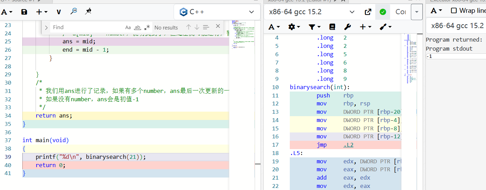

2、

```c
#include <stdio.h>
#include <stdlib.h>
#include <math.h>

double mysqrt(double y){
    double start = 0;
    double end = y;
    double sq = (start + end) / 2;
    double ny = sq * sq;
    while(ny - y >= 0.001 || ny - y <= -0.001){
        if(ny > y){
            end = sq;
        } else if(ny < y){
            start = sq;
        } else {
            return sq;
        }
        sq =  (start + end) / 2;
        ny = sq * sq;
    }
    return sq;
}

int main(void)
{
    printf("%lf\n", mysqrt(9.0) );
	return 0;
}
```

因为是实数，更新边界就不用+1了，保留本位就行了。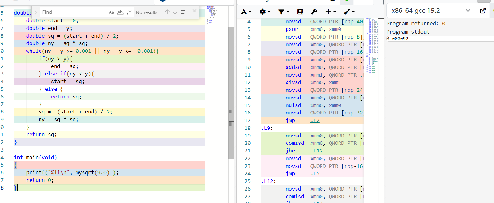

3、

```c
double mypow1(double x, int n){
    if(n == 1){
        return x;
    }
    if(n % 2 == 0){
        return mypow1(x*x,n/2);
    } else {
        return x * mypow1(x*x,n/2);
    }
}
```

```c
double mypow2(double x, int n){
    double ans = 1;
    while(n > 0){
        if(n % 2 == 1){
            ans *= x;
        }
        n /= 2;
        x *= x;
    }
    return ans;
}
```

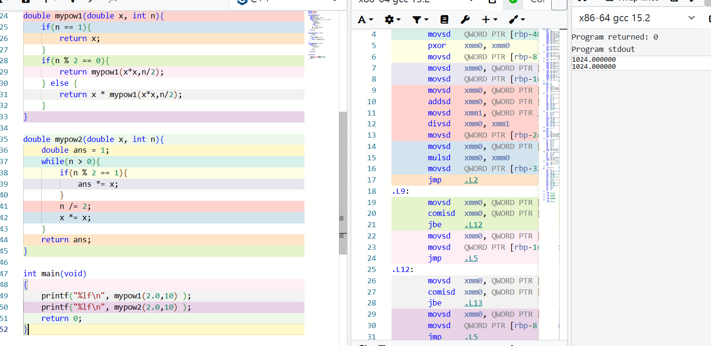

# 第 12 章 栈与队列

## 1. 数据结构的概念

数据结构（Data Structure）是数据的组织方式。

**算法+数据结构=程序**

## 2. 堆栈

在[第 3 节 “递归”](http://akaedu.github.io/book/ch05s03.html#func2.recursion)中我们已经对堆栈这种数据结构有了初步认识。堆栈是一组元素的集合，类似于数组，不同之处在于，数组可以按下标随机访问，这次访问`a[5]`下次可以访问`a[1]`，但是堆栈的访问规则被限制为Push和Pop两种操作，Push（入栈或压栈）向栈顶添加元素，Pop（出栈或弹出）则取出当前栈顶的元素，也就是说，只能访问栈顶元素而不能访问栈中其它元素。如果所有元素的类型相同，堆栈的存储也可以用数组来实现，访问操作可以通过函数接口提供。

## 3. 深度优先搜索

现在我们用堆栈解决一个有意思的问题，定义一个二维数组：

```c
int maze[5][5] = {
	0, 1, 0, 0, 0,
	0, 1, 0, 1, 0,
	0, 0, 0, 0, 0,
	0, 1, 1, 1, 0,
	0, 0, 0, 1, 0,
};
```

它表示一个迷宫，其中的1表示墙壁，0表示可以走的路，只能横着走或竖着走，不能斜着走，要求编程序找出从左上角到右下角的路线。程序如下：


**例 12.3. 用深度优先搜索解迷宫问题**

```c
#include <stdio.h>

#define MAX_ROW 5
#define MAX_COL 5

struct point { int row, col; } stack[512];
int top = 0;

void push(struct point p)
{
	stack[top++] = p;
}

struct point pop(void)
{
	return stack[--top];
}

int is_empty(void)
{
	return top == 0;
}

int maze[MAX_ROW][MAX_COL] = {
	0, 1, 0, 0, 0,
	0, 1, 0, 1, 0,
	0, 0, 0, 0, 0,
	0, 1, 1, 1, 0,
	0, 0, 0, 1, 0,
};

void print_maze(void)
{
	int i, j;
	for (i = 0; i < MAX_ROW; i++) {
		for (j = 0; j < MAX_COL; j++)
			printf("%d ", maze[i][j]);
		putchar('\n');
	}
	printf("*********\n");
}

struct point predecessor[MAX_ROW][MAX_COL] = {
	{{-1,-1}, {-1,-1}, {-1,-1}, {-1,-1}, {-1,-1}},
	{{-1,-1}, {-1,-1}, {-1,-1}, {-1,-1}, {-1,-1}},
	{{-1,-1}, {-1,-1}, {-1,-1}, {-1,-1}, {-1,-1}},
	{{-1,-1}, {-1,-1}, {-1,-1}, {-1,-1}, {-1,-1}},
	{{-1,-1}, {-1,-1}, {-1,-1}, {-1,-1}, {-1,-1}},
};

void visit(int row, int col, struct point pre)
{
	struct point visit_point = { row, col };
	maze[row][col] = 2;
	predecessor[row][col] = pre;
	push(visit_point);
}

int main(void)
{
	struct point p = { 0, 0 };

	maze[p.row][p.col] = 2;
	push(p);	
	
	while (!is_empty()) {
		p = pop();
		if (p.row == MAX_ROW - 1  /* goal */
		    && p.col == MAX_COL - 1)
			break;
		if (p.col+1 < MAX_COL     /* right */
		    && maze[p.row][p.col+1] == 0)
			visit(p.row, p.col+1, p);
		if (p.row+1 < MAX_ROW     /* down */
		    && maze[p.row+1][p.col] == 0)
			visit(p.row+1, p.col, p);
		if (p.col-1 >= 0          /* left */
		    && maze[p.row][p.col-1] == 0)
			visit(p.row, p.col-1, p);
		if (p.row-1 >= 0          /* up */
		    && maze[p.row-1][p.col] == 0)
			visit(p.row-1, p.col, p);
		print_maze();
	}
	if (p.row == MAX_ROW - 1 && p.col == MAX_COL - 1) {
		printf("(%d, %d)\n", p.row, p.col);
		while (predecessor[p.row][p.col].row != -1) {
			p = predecessor[p.row][p.col];
			printf("(%d, %d)\n", p.row, p.col);
		}
	} else
		printf("No path!\n");

	return 0;
}
```

这次堆栈里的元素是结构体类型的，用来表示迷宫中一个点的x和y座标。我们用一个新的数据结构保存走迷宫的路线，每个走过的点都有一个前趋（Predecessor）点，表示是从哪儿走到当前点的，比如`predecessor[4][4]`是座标为(3, 4)的点，就表示从(3, 4)走到了(4, 4)，一开始`predecessor`的各元素初始化为无效座标(-1, -1)。在迷宫中探索路线的同时就把路线保存在`predecessor`数组中，已经走过的点在`maze`数组中记为2防止重复走，最后找到终点时就根据`predecessor`数组保存的路线从终点打印到起点。为了帮助理解，我把这个算法改写成伪代码（Pseudocode）如下：

```c
将起点标记为已走过并压栈;
while (栈非空) {
	从栈顶弹出一个点p;
	if (p这个点是终点)
		break;
	否则沿右、下、左、上四个方向探索相邻的点
	if (和p相邻的点有路可走，并且还没走过)
		将相邻的点标记为已走过并压栈，它的前趋就是p点;
}
if (p点是终点) {
	打印p点的座标;
	while (p点有前趋) {
		p点 = p点的前趋;
		打印p点的座标;
	}
} else
	没有路线可以到达终点;
```

我在`while`循环的末尾插了打印语句，每探索一步都打印出当前迷宫的状态（标记了哪些点），从打印结果可以看出这种搜索算法的特点是：每次探索完各个方向相邻的点之后，取其中一个相邻的点走下去，一直走到无路可走了再退回来，取另一个相邻的点再走下去。这称为深度优先搜索（DFS，Depth First Search）。

> 1、修改本节的程序，要求从起点到终点正向打印路线。你能想到几种办法？
>
> 2、本节程序中`predecessor`这个数据结构占用的存储空间太多了，改变它的存储方式可以节省空间，想想该怎么改。
>
> 3、上一节我们实现了一个基于堆栈的程序，然后改写成递归程序，用函数调用的栈帧替代自己实现的堆栈。本节的DFS算法也是基于堆栈的，请把它改写成递归程序，这样改写可以避免使用`predecessor`数据结构，想想该怎么做。

1、

不改原有的数据结构，在原有输出的部分先不输出，改为入栈，之后再出栈时输出，就反向了，也就变为输出正向路线了，只改了main函数，如下，注意准备入栈前记得先将栈清空

```c
int main(void)
{
	struct point p = { 0, 0 };

	maze[p.row][p.col] = 2;
	push(p);	
	
	while (!is_empty()) {
		p = pop();
		if (p.row == MAX_ROW - 1  /* goal */
		    && p.col == MAX_COL - 1)
			break;
		if (p.col+1 < MAX_COL     /* right */
		    && maze[p.row][p.col+1] == 0)
			visit(p.row, p.col+1, p);
		if (p.row+1 < MAX_ROW     /* down */
		    && maze[p.row+1][p.col] == 0)
			visit(p.row+1, p.col, p);
		if (p.col-1 >= 0          /* left */
		    && maze[p.row][p.col-1] == 0)
			visit(p.row, p.col-1, p);
		if (p.row-1 >= 0          /* up */
		    && maze[p.row-1][p.col] == 0)
			visit(p.row-1, p.col, p);
		print_maze();
	}
	if (p.row == MAX_ROW - 1 && p.col == MAX_COL - 1) {
		while(!is_empty()) pop();
		push(p);
		while (predecessor[p.row][p.col].row != -1) {
			p = predecessor[p.row][p.col];
			push(p); 
		}
		while(!is_empty()){
			p = pop();
			printf("(%d, %d)\n", p.row, p.col);
		}
	} else
		printf("No path!\n");

	return 0;
}
```

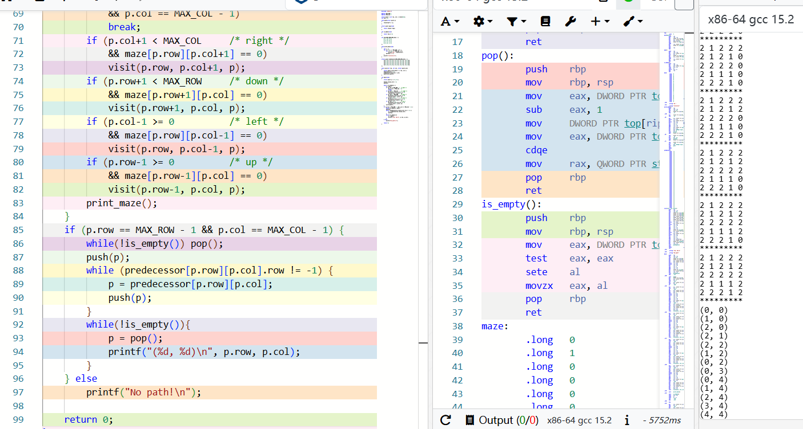

或者另一种，使用数组把路径存下来，然后再反向打出来，但是和栈的原理是一致的，就不管了吧


2、

由于每个节点的路径一定是和它相邻的节点，所以只用记它的前驱是它上下左右的哪一个即可，所以用char的二维数组就行了

u代表上，d代表下，l代表左，r代表右，x代表没有

在输出路径时对应判断一下就好了

```c
#include <stdio.h>

#define MAX_ROW 5
#define MAX_COL 5

struct point { int row, col; } stack[512];
int top = 0;

void push(struct point p)
{
	stack[top++] = p;
}

struct point pop(void)
{
	return stack[--top];
}

int is_empty(void)
{
	return top == 0;
}

int maze[MAX_ROW][MAX_COL] = {
	0, 1, 0, 0, 0,
	0, 1, 0, 1, 0,
	0, 0, 0, 0, 0,
	0, 1, 1, 1, 0,
	0, 0, 0, 1, 0,
};

void print_maze(void)
{
	int i, j;
	for (i = 0; i < MAX_ROW; i++) {
		for (j = 0; j < MAX_COL; j++)
			printf("%d ", maze[i][j]);
		putchar('\n');
	}
	printf("*********\n");
}

char predecessor[MAX_ROW][MAX_COL] = {
	{'x', 'x', 'x', 'x', 'x'},
	{'x', 'x', 'x', 'x', 'x'},
    {'x', 'x', 'x', 'x', 'x'},
    {'x', 'x', 'x', 'x', 'x'},
    {'x', 'x', 'x', 'x', 'x'},
};

void print_p(void)
{
	int i, j;
	for (i = 0; i < MAX_ROW; i++) {
		for (j = 0; j < MAX_COL; j++)
			printf("%c ", predecessor[i][j]);
		putchar('\n');
	}
	printf("*********\n");
}

void visit(int row, int col, char pre)
{
	struct point visit_point = { row, col };
	maze[row][col] = 2;
	predecessor[row][col] = pre;
	push(visit_point);
}

int main(void)
{
	struct point p = { 0, 0 };

	maze[p.row][p.col] = 2;
	push(p);	
	
	while (!is_empty()) {
		p = pop();
		if (p.row == MAX_ROW - 1  /* goal */
		    && p.col == MAX_COL - 1)
			break;
		if (p.col+1 < MAX_COL     /* right */
		    && maze[p.row][p.col+1] == 0)
			visit(p.row, p.col+1, 'l');//前驱在左
		if (p.row+1 < MAX_ROW     /* down */
		    && maze[p.row+1][p.col] == 0)
			visit(p.row+1, p.col, 'u');//前驱在上
		if (p.col-1 >= 0          /* left */
		    && maze[p.row][p.col-1] == 0)
			visit(p.row, p.col-1, 'r');//前驱在右
		if (p.row-1 >= 0          /* up */
		    && maze[p.row-1][p.col] == 0)
			visit(p.row-1, p.col, 'd');//前驱在下
		print_maze();
	}
	if (p.row == MAX_ROW - 1 && p.col == MAX_COL - 1) {
		print_p();
        printf("(%d, %d)\n", p.row, p.col);
		while (predecessor[p.row][p.col] != 'x') {
            switch(predecessor[p.row][p.col]) {
                case 'u': p.row--; break; // 前驱在上
                case 'r': p.col++; break; // 前驱在右
                case 'd': p.row++; break; // 前驱在下
                case 'l': p.col--; break; // 前驱在左
            }
            printf("(%d, %d)\n", p.row, p.col);
		}
	} else
		printf("No path!\n");
	return 0;
}
```

3、递归实现如下

```c
#include <stdio.h>

#define MAX_ROW 5
#define MAX_COL 5

int maze[MAX_ROW][MAX_COL] = {
	0, 1, 0, 0, 0,
	0, 1, 0, 1, 0,
	0, 0, 0, 0, 0,
	0, 1, 1, 1, 0,
	0, 0, 0, 1, 0,
};

void print_maze(void)
{
	int i, j;
	for (i = 0; i < MAX_ROW; i++) {
		for (j = 0; j < MAX_COL; j++)
			printf("%d ", maze[i][j]);
		putchar('\n');
	}
	printf("*********\n");
}

// 返回值：1 表示找到了终点，0 表示是死路
int dfs(int row, int col)
{
    // 判断越界
    if (row < 0 || row >= MAX_ROW || col < 0 || col >= MAX_COL)
        return 0;

    // 判断是否不可达
    if (maze[row][col] != 0) 
        return 0;

    // 标记当前点为已访问
    maze[row][col] = 2;
    print_maze(); // 打印过程，看 search 轨迹

    // 到达终点
    if (row == MAX_ROW - 1 && col == MAX_COL - 1) {
        printf("(%d, %d)\n", row, col); // 打印终点
        return 1; // 告诉上一层：找到终点了
    }

    // 递归搜索四个方向
    // 如果 dfs(某个方向) 返回1，说明那个方向通往终点，打印当前点，并向上一层返回1
    // 向右
    if (dfs(row, col + 1)) {
        printf("(%d, %d)\n", row, col);
        return 1;
    }
    // 向下
    if (dfs(row + 1, col)) {
        printf("(%d, %d)\n", row, col);
        return 1;
    }
    // 向左
    if (dfs(row, col - 1)) {
        printf("(%d, %d)\n", row, col);
        return 1;
    }
    // 向上
    if (dfs(row - 1, col)) {
        printf("(%d, %d)\n", row, col);
        return 1;
    }
    return 0;
}

int main(void)
{
	dfs(0,0);

	return 0;
}
```

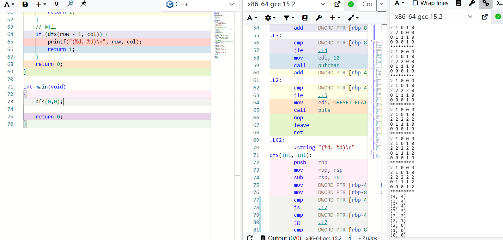

## 4. 队列与广度优先搜索

队列也是一组元素的集合，也提供两种基本操作：Enqueue（入队）将元素添加到队尾，Dequeue（出队）从队头取出元素并返回。

用队列解决迷宫问题。程序如下：


**例 12.4. 用广度优先搜索解迷宫问题**

```c
#include <stdio.h>

#define MAX_ROW 5
#define MAX_COL 5

struct point { int row, col, predecessor; } queue[512];
int head = 0, tail = 0;

void enqueue(struct point p)
{
	queue[tail++] = p;
}

struct point dequeue(void)
{
	return queue[head++];
}

int is_empty(void)
{
	return head == tail;
}

int maze[MAX_ROW][MAX_COL] = {
	0, 1, 0, 0, 0,
	0, 1, 0, 1, 0,
	0, 0, 0, 0, 0,
	0, 1, 1, 1, 0,
	0, 0, 0, 1, 0,
};

void print_maze(void)
{
	int i, j;
	for (i = 0; i < MAX_ROW; i++) {
		for (j = 0; j < MAX_COL; j++)
			printf("%d ", maze[i][j]);
		putchar('\n');
	}
	printf("*********\n");
}

void visit(int row, int col)
{
	struct point visit_point = { row, col, head-1 };
	maze[row][col] = 2;
	enqueue(visit_point);
}

int main(void)
{
	struct point p = { 0, 0, -1 };

	maze[p.row][p.col] = 2;
	enqueue(p);
	
	while (!is_empty()) {
		p = dequeue();
		if (p.row == MAX_ROW - 1  /* goal */
		    && p.col == MAX_COL - 1)
			break;
		if (p.col+1 < MAX_COL     /* right */
		    && maze[p.row][p.col+1] == 0)
			visit(p.row, p.col+1);
		if (p.row+1 < MAX_ROW     /* down */
		    && maze[p.row+1][p.col] == 0)
			visit(p.row+1, p.col);
		if (p.col-1 >= 0          /* left */
		    && maze[p.row][p.col-1] == 0)
			visit(p.row, p.col-1);
		if (p.row-1 >= 0          /* up */
		    && maze[p.row-1][p.col] == 0)
			visit(p.row-1, p.col);
		print_maze();
	}
	if (p.row == MAX_ROW - 1 && p.col == MAX_COL - 1) {
		printf("(%d, %d)\n", p.row, p.col);
		while (p.predecessor != -1) {
			p = queue[p.predecessor];
			printf("(%d, %d)\n", p.row, p.col);
		}
	} else
		printf("No path!\n");

	return 0;
}
```

其实仍然可以像[例 12.3 “用深度优先搜索解迷宫问题”](http://akaedu.github.io/book/ch12s03.html#stackqueue.dfs)一样用`predecessor`数组表示每个点的前趋，但我想换一种更方便的数据结构，直接在每个点的结构体中加一个成员表示前趋：

```
struct point { int row, col, predecessor; } queue[512];
int head = 0, tail = 0;
```

变量`head`和`tail`是队头和队尾指针，`head`总是指向队头，`tail`总是指向队尾的下一个元素。每个点的`predecessor`成员也是一个指针，指向它的前趋在`queue`数组中的位置。如下图所示：

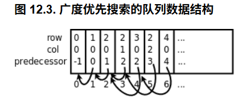

为了帮助理解，我把这个算法改写成伪代码如下：

```
将起点标记为已走过并入队;
while (队列非空) {
	出队一个点p;
	if (p这个点是终点)
		break;
	否则沿右、下、左、上四个方向探索相邻的点
	if (和p相邻的点有路可走，并且还没走过)
		将相邻的点标记为已走过并入队，它的前趋就是刚出队的p点;
}
if (p点是终点) {
	打印p点的座标;
	while (p点有前趋) {
		p点 = p点的前趋;
		打印p点的座标;
	}
} else
	没有路线可以到达终点;
```

从打印的搜索过程可以看出，这个算法的特点是沿各个方向同时展开搜索，每个可以走通的方向轮流往前走一步，这称为广度优先搜索（BFS，Breadth First Search）。探索迷宫和队列变化的过程如下图所示。

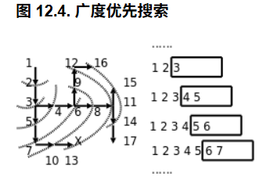

广度优先是一种步步为营的策略，每次都从各个方向探索一步，将前线推进一步，图中的虚线就表示这个前线，队列中的元素总是由前线的点组成的，可见正是队列先进先出的性质使这个算法具有了广度优先的特点。广度优先搜索还有一个特点是可以找到从起点到终点的最短路径，而深度优先搜索找到的不一定是最短路径。

> 1、本节的例子直接在队列元素中加一个指针成员表示前趋，想一想为什么上一节的[例 12.3 “用深度优先搜索解迷宫问题”](http://akaedu.github.io/book/ch12s03.html#stackqueue.dfs)不能采用这种方法表示前趋？
>
> 2、本节例子中给队列分配的存储空间是512个元素，其实没必要这么多，那么解决这个问题至少要分配多少个元素的队列空间呢？跟什么因素有关？

1、通过队列的定义和图12.4可以知道，这里的队列，无论入队还是出队，指针都是往后移，并没有覆盖过元素，也就是每个元素都在队列中永久保存下来了，所以记录前驱只用记录它在队列里的位置即可。而上一节的使用栈来记录，由于栈帧的移动，数据会被覆盖，原先的位置在最后大概率不是原来的元素了，所以一个指针是不能表示前驱的，不过其实把坐标放到元素里也是可行的，但那耗费的空间和原有的方式差不多，就都可以吧，

2、只对这个写死的迷宫的话，最少只需要18即可，也就是把所有能走的点都记录下来即可，或者设置25，也就是迷宫的大小。其实就是和需要入队的元素数有关，因为每个入队的元素都要占据空间且不释放。

## 5. 环形队列

比较[例 12.3 “用深度优先搜索解迷宫问题”](http://akaedu.github.io/book/ch12s03.html#stackqueue.dfs)的栈操作和[例 12.4 “用广度优先搜索解迷宫问题”](http://akaedu.github.io/book/ch12s04.html#stackqueue.bfs)的队列操作可以发现，栈操作的`top`指针在Push时增大而在Pop时减小，栈空间是可以重复利用的，而队列的`head`、`tail`指针都在一直增大，虽然前面的元素已经出队了，但它所占的存储空间却不能重复利用。在[例 12.4 “用广度优先搜索解迷宫问题”](http://akaedu.github.io/book/ch12s04.html#stackqueue.bfs)的解法中，出队的元素仍然有用，保存着走过的路径和每个点的前趋，但大多数程序并不是这样使用队列的，一般情况下出队的元素就不再有保存价值了，这些元素的存储空间应该回收利用，由此想到把队列改造成环形队列（Circular Queue）：把`queue`数组想像成一个圈，`head`和`tail`指针仍然是一直增大的，当指到数组末尾时就自动回到数组开头，就像两个人围着操场赛跑，沿着它们跑的方向看，从`head`到`tail`之间是队列的有效元素，从`tail`到`head`之间是空的存储位置，如果`head`追上`tail`就表示队列空了，如果`tail`追上`head`就表示队列的存储空间满了。如下图所示：

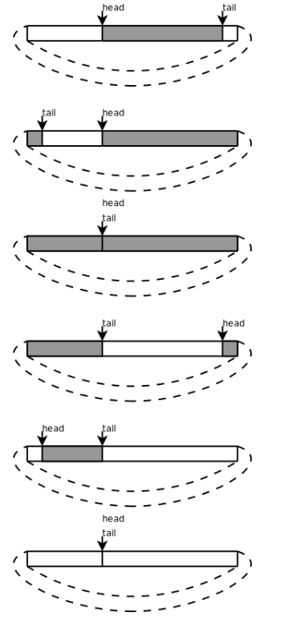

> 1、现在把迷宫问题的要求改一下，只要求程序给出最后结论就可以了，回答“有路能到达终点”或者“没有路能到达终点”，而不需要把路径打印出来。请把[例 12.4 “用广度优先搜索解迷宫问题”](http://akaedu.github.io/book/ch12s04.html#stackqueue.bfs)改用环形队列实现，然后试验一下解决这个问题至少需要分配多少个元素的队列空间。

```c
#include <stdio.h>

#define MAX_ROW 5
#define MAX_COL 5
#define MAX_NUM 5

struct point { int row, col, predecessor; } queue[512];
int head = 0, tail = 0;

int is_empty(void)
{
	return head == tail;
}

int is_full(void)
{
	return (tail+1) % MAX_NUM == head;
}

void enqueue(struct point p)
{
    if(is_full()){
        printf("错误：队列已满！(MAX_NUM=%d 不够用)\n", MAX_NUM);
        return;
    }
    queue[tail] = p;
    tail = (tail + 1) % MAX_NUM;
}

struct point dequeue(void)
{
    if(is_empty()){
        return {0,0};
    }
    struct point t = queue[head];
    head = (head + 1) % MAX_NUM;
	return t;
}


int maze[MAX_ROW][MAX_COL] = {
	0, 1, 0, 0, 0,
	0, 1, 0, 1, 0,
	0, 0, 0, 0, 0,
	0, 1, 1, 1, 0,
	0, 0, 0, 1, 0,
};

void print_maze(void)
{
	int i, j;
	for (i = 0; i < MAX_ROW; i++) {
		for (j = 0; j < MAX_COL; j++)
			printf("%d ", maze[i][j]);
		putchar('\n');
	}
	printf("*********\n");
}

void visit(int row, int col)
{
	struct point visit_point = { row, col, head-1 };
	maze[row][col] = 2;
	enqueue(visit_point);
}

int main(void)
{
	struct point p = { 0, 0, -1 };

	maze[p.row][p.col] = 2;
	enqueue(p);
	
	while (!is_empty()) {
		p = dequeue();
		if (p.row == MAX_ROW - 1  /* goal */
		    && p.col == MAX_COL - 1)
			break;
		if (p.col+1 < MAX_COL     /* right */
		    && maze[p.row][p.col+1] == 0)
			visit(p.row, p.col+1);
		if (p.row+1 < MAX_ROW     /* down */
		    && maze[p.row+1][p.col] == 0)
			visit(p.row+1, p.col);
		if (p.col-1 >= 0          /* left */
		    && maze[p.row][p.col-1] == 0)
			visit(p.row, p.col-1);
		if (p.row-1 >= 0          /* up */
		    && maze[p.row-1][p.col] == 0)
			visit(p.row-1, p.col);
		// print_maze();
	}
	if (p.row == MAX_ROW - 1 && p.col == MAX_COL - 1) {
		// printf("(%d, %d)\n", p.row, p.col);
		// while (p.predecessor != -1) {
		// 	p = queue[p.predecessor];
		// 	printf("(%d, %d)\n", p.row, p.col);
		// }
        printf("有路能到达终点!\n");
	} else
		printf("没有路能到达终点!\n");

	return 0;
}
```

实现了循环队列，但是为了区分空和满会导致浪费一个空间不能存储，此外，发现解决这个题目队列长度最少为5，因为为长度4时会有队列满的情况发生

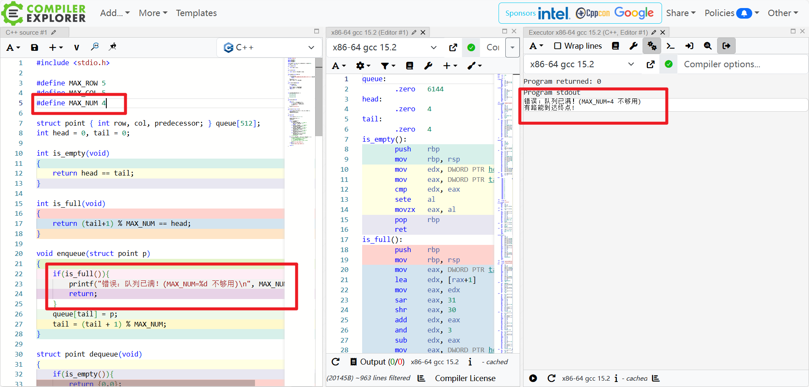

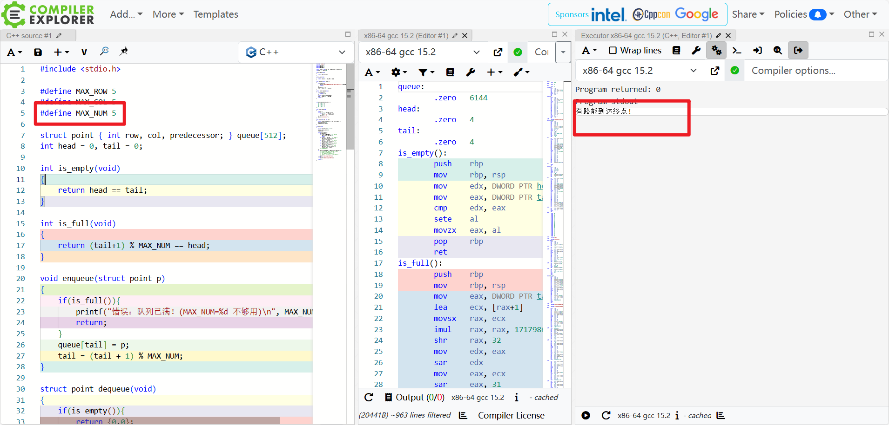

# 第 13 章 本阶段总结

我们一章一章地纵向学习过来之后，应该理出几个横切面，把拆散到各章节中的知识点串起来。请从以下几个方面整理和复习。

1、C的语法规则。

1. 源文件中所有函数定义之外可以出现哪些语法元素？

   全局变量，函数声明，预处理的指令(#include，#define)，类型的定义

2. 函数定义之中可以出现哪些语法元素？

   变量声明，语句

3. 语句有哪几种？

   表达式，选择语句，循环语句，跳转语句

4. 哪些语法元素需要遵循标识符的命名规则？

   感觉基本上都要吧

5. 表达式由哪些语法元素组成？

   操作符和操作数

6. 到目前为止学过哪些运算符？它们的优先级和结合性是怎样的？

   +, -, *, /, %, &&, ||, !, ++, --, =, ==, ()

   优先级最高的是扩号，然后是单目运算符，然后是双目运算符，最低的是赋值=

   结合性基本上都是左到右，但是!, ++, --, -这些单目运算符，还有赋值= 是右到左

7. 哪些运算符取操作数的左值？哪些运算符的操作数必须是整型？哪些运算符有Side Effect？

   需要取左值的：赋值运算符，自增和自减运算符

   必须是整型的：取模的%，还有数组下标里的索引

   有副作用的：赋值，自增自减

8. 哪些表达式可以做左值？哪些表达式只能做右值？

   可以做左值的：变量，数组

   只能做右值的：常量，计算结果

9. 哪些地方必须用常量表达式？哪些地方必须用整数常量表达式？

   必须用常量表达式的包括全局变量，预处理后面的值，case后面的值，数组的大小

   其中必须用整数常量表达式的主要是数组的大小，但是C99已经可以用变量了。还有case后面的值也必须是整型常量

   

2、思维方法与编程思想。

- 以概念为中心，[第 1 节 “程序和编程语言”](http://akaedu.github.io/book/intro.program.html)
- 组合规则，[第 5 节 “表达式”](http://akaedu.github.io/book/expr.expression.html)
- Least Surprise，[第 3 节 “形参和实参”](http://akaedu.github.io/book/ch03s03.html#func.paraarg)
- 充分条件与必要条件，[第 4 节 “全局变量、局部变量和作用域”](http://akaedu.github.io/book/ch03s04.html#func.localvar)
- 封装，[第 2 节 “if/else语句”](http://akaedu.github.io/book/ch04s02.html#cond.ifelse)
- 布尔逻辑，[第 3 节 “布尔代数”](http://akaedu.github.io/book/ch04s03.html#cond.bool)
- 递归，[第 3 节 “递归”](http://akaedu.github.io/book/ch05s03.html#func2.recursion)
- 函数式编程，[第 1 节 “while语句”](http://akaedu.github.io/book/ch06s01.html#iter.while)
- 迭代（[第 6 章 *循环语句*](http://akaedu.github.io/book/ch06.html#iter)）与增量式求解（[第 2 节 “插入排序”](http://akaedu.github.io/book/ch11s02.html#sortsearch.insertion)）
- 抽象，[第 2 节 “数据抽象”](http://akaedu.github.io/book/ch07s02.html#struct.abstract)
- 数据驱动，[第 5 节 “多维数组”](http://akaedu.github.io/book/ch08s05.html#array.multidimension)
- 分而治之，[第 4 节 “归并排序”](http://akaedu.github.io/book/ch11s04.html#sortsearch.merge)
- 折半查找，[第 6 节 “折半查找”](http://akaedu.github.io/book/ch11s06.html#sortsearch.binary)
- 回溯，[例 12.3 “用深度优先搜索解迷宫问题”](http://akaedu.github.io/book/ch12s03.html#stackqueue.dfs)

3、调试方法

- 编译错误、运行时错误与语义错误，[第 3 节 “程序的调试”](http://akaedu.github.io/book/ch01s03.html#intro.debug)
- 增量式开发，[第 2 节 “增量式开发”](http://akaedu.github.io/book/ch05s02.html#func2.incremental)
- 打印语句与Scaffold，[第 2 节 “增量式开发”](http://akaedu.github.io/book/ch05s02.html#func2.incremental)
- gdb，[第 10 章 *gdb*](http://akaedu.github.io/book/ch10.html#gdb)
- DbC与Assertion，[第 6 节 “折半查找”](http://akaedu.github.io/book/ch11s06.html#sortsearch.binary)

# 第 14 章 计算机中数的表示

## 1. 为什么计算机用二进制计数

人类的计数方式通常是“逢十进一”，称为十进制

计算机是用数字电路搭成的，数字电路中只有1和0两种状态，或者可以说计算机只有两个手指，所以对计算机来说二进制（Binary）是最自然的计数方式。根据“逢二进一”的原则，十进制的1、2、3、4分别对应二进制的1、10、11、100。二进制的一位数字称为一个位（Bit），三个bit能够表示的最大的二进制数是111，也就是十进制的7。不管用哪种计数方式，数的大小并没有变，十进制的1+1等于2，二进制的1+1等于10，二进制的10和十进制的2大小是相等的。

大部分内容和F3的内容差不多，稍微读一下就好

## 2. 不同进制之间的换算

> 1、二进制小数可以这样定义：
>
> (0.A1A2A3...)2=A1×2^-1^+A2×2^-2^+A3×2^-3^+...
>
> 这个定义同时也是从二进制小数到十进制小数的换算公式。从本节讲的十进制转二进制的推导过程出发类比一下，十进制小数换算成二进制小数应该怎么算？
>
> 2、再类比一下，八进制（或十六进制）与十进制之间如何相互换算？

1、将小数每次乘以2，要是乘完大于1，就从左往右，对应位置写1，并且将值减去1。如果乘完小于1，对应位置就写0。直至乘完减1后为0结束，当然也可能永远结束不了。。

2、八进制或者十六进制可以简单的转换成二进制，然后再和十进制转换。

对八进制转10进制，就是每个位置乘以8的n-1次方，然后求和

小数：同理，按位乘以8的-(n-1)次方

十进制转八进制：就是每次除以8然后倒序取余

小数：同理，每次乘以8，若大于等于1则写1，否则写0，若还有小数就继续乘


对十六进制转10进制，就是每个位置乘以16的n-1次方，然后求和

小数：同理，按位乘以16的-(n-1)次方

十进制转十六进制：就是每次除以16然后倒序取余

小数：同理，每次乘以16，若大于等于1则写1，否则写0，若还有小数就继续乘

## 3. 整数的加减运算

我们已经了解了计算机中正整数如何表示，加法如何计算，那么负数如何表示，减法又如何计算呢？本节讨论这些问题。为了书写方便，本节举的例子都用8个bit表示一个数，实际计算机做整数加减运算的操作数可以是8位、16位、32位甚至64位的。

### 3.1. Sign and Magnitude表示法

要用8个bit表示正数和负数，一种简单的想法是把最高位规定为符号位（Sign Bit），0表示正1表示负，剩下的7位表示绝对值的大小，这称为Sign and Magnitude表示法。例如-1表示成10000001，+1表示成00000001。这样用8个bit表示整数的取值范围是-2^7^-1\~2^7^-1，即-127~127。

采用这种表示法，计算机做加法运算需要处理以下逻辑：

1. 如果两数符号位相同，就把它们的低7位相加，符号位不变。如果低7位相加时在最高位产生进位，说明结果的绝对值大于127，超出7位所能表示的数值范围，这称为溢出（Overflow）[[24](http://akaedu.github.io/book/ch14s03.html#ftn.id2753684)]，这时通常把计算机中的一个标志位置1表示当前运算产生了溢出。
2. 如果两数符号位不同，首先比较它们的低7位谁大，然后用大数减小数，结果的符号位和大数相同。

那么减法如何计算呢？由于我们规定了负数的表示，可以把减法转换成加法来计算，要计算a-b，可以先把b变号然后和a相加，相当于计算a+(-b)。但如果两个加数的符号位不同就要用大数的绝对值减小数的绝对值，这一步减法计算仍然是免不了的。我们知道加法要进位，减法要借位，计算过程是不同的，所以除了要有[第 1 节 “为什么计算机用二进制计数”](http://akaedu.github.io/book/ch14s01.html#number.binary)提到的加法器电路之外，**还要另外有一套减法器电路**。

如果采用**Sign and Magnitude表示法，计算机做加减运算需要处理很多逻辑**：比较符号位，比较绝对值，加法改减法，减法改加法，小数减大数改成大数减小数……这是非常低效率的。还有一个缺点是0的表示不唯一，既可以表示成10000000也可以表示成00000000，这进一步增加了逻辑的复杂性，所以我们迫切需要重新设计整数的表示方法使计算过程更简单。

### 3.2. 1's Complement表示法

本节介绍一种二进制补码表示法，为了便于理解，我们先看一个十进制的例子：

167-52=167+(-52)=167+(999-52)-1000+1=167+947-1000+1=1114-1000+1=114+1=115
167-52 → 减法转换成加法 167+(-52) → 负数取9的补码表示 167+947 → 114进1 → 高位进的1加到低位上去，结果为115

在这个例子中我们用三位十进制数字表示正数和负数，具体规定如下：

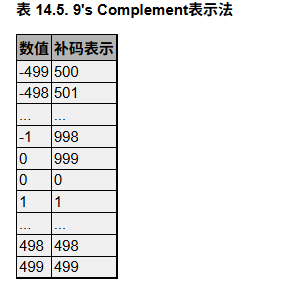

其实就是，负数与这么多位能表示的最大值求和来表示，正数不变

这种补码表示法的计算规则用一句话概括就是：负数用9的补码表示，减法转换成加法，计算结果的最高位如果有进位则要加回到最低位上去。

对于二进制来说就是反码，负数除了符号位取反，正数不变即可

1's Complement表示法相对于Sign and Magnitude表示法的优势是非常明显的：不需要把符号和绝对值分开考虑，正数和负数的加法都一样算，计算逻辑更简单，甚至连减法器电路都省了，只要有一套加法器电路，再有一套把每个bit取反的电路，就可以做加法和减法运算。如果8个bit采用1's Complement表示法，负数的取值范围是从10000000到11111111（-127\~0），正数是从00000000到01111111（0\~127），仍然可以根据最高位判断一个数是正是负。**美中不足的是0的表示仍然不唯一，既可以表示成11111111也可以表示成00000000**，为了解决这最后一个问题，我们引入2's Complement表示法。

### 3.3. 2's Complement表示法

2's Complement表示法规定：**正数不变，负数先取反码再加1**。如果8个bit采用2's Complement表示法，负数的取值范围是从10000000到11111111（-128\~-1），正数是从00000000到01111111（0\~127），也可以根据最高位判断一个数是正是负，并且0的表示是唯一的，目前绝大多数计算机都采用这种表示法。为什么称为“2的补码”呢？因为对一位二进制数b取补码就是1-b+1=10-b，相当于从2里面减去b。类似地，要表示-4需要对00000100取补码，11111111-00000100+1=100000000-00000100，相当于从28里面减去4。2's Complement表示法的计算规则有些不同：减法转换成加法，忽略计算结果最高位的进位，不必加回到最低位上去。

8个bit采用2's Complement表示法的取值范围是-128~127，如果计算结果超出这个范围就会产生溢出

如何判断产生了溢出呢？我们还是分四种情况讨论：**如果两个正数相加溢出，结果一定是负数**；如果**两个负数相加溢出，结果一定是正数**；一正一负相加，无论结果是正是负都不可能溢出。

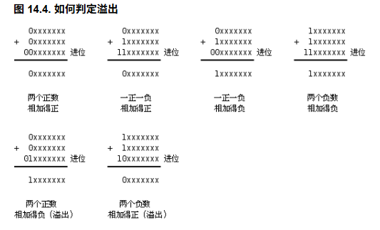

从上图可以得出结论：**在相加过程中最高位产生的进位和次高位产生的进位如果相同则没有溢出，如果不同则表示有溢出**。逻辑电路的实现可以把这两个进位连接到一个异或门，把异或门的输出连接到溢出标志位。

### 3.4. 有符号数和无符号数

前面几节我们用8个bit表示正数和负数，讲了三种表示法，每种表示法对应一种计算规则，这称为有符号数（Signed Number）；如果8个bit全部表示正数则取值范围是0~255，这称为无符号数（Unsigned Number）。**其实计算机做加法时并不区分操作数是有符号数还是无符号数，计算过程都一样**，比如上面的例子也可以看作无符号数的加法：

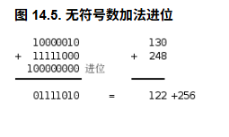

如果把这两个操作数看作有符号数-126和-8相加，计算结果是错的，因为产生了溢出；但如果看作无符号数130和248相加，计算结果是122进1，也就是122+256，这个结果是对的。计算机的加法器在做完计算之后，根据最高位产生的进位设置**进位标志**，同时根据最高位和次高位产生的进位的异或设置**溢出标志**。至于这个加法到底是有符号数加法还是无符号数加法则取决于程序怎么理解了，如果程序把它理解成有符号数加法，下一步就要检查溢出标志，如果程序把它理解成无符号数加法，下一步就要检查进位标志。通常计算机在做算术运算之后还可能设置另外两个标志，如果计算结果的所有bit都是零则设置**零标志**，如果计算结果的最高位是1则设置**负数标志**，如果程序把计算结果理解成有符号数，也可以检查负数标志判断结果是正是负。

## 4. 浮点数

浮点数在计算机中的表示是基于**科学计数法**（Scientific Notation）的，我们知道32767这个数用科学计数法可以写成3.2767×104，3.2767称为**尾数**（Mantissa，或者叫Significand），4称为**指数**（Exponent）。浮点数在计算机中的表示与此类似，只不过基数（Radix）是2而不是10。

我们的模型中指数部分没有规定如何表示负数。我们可以在指数部分规定一个符号位，然而更广泛采用的办法是使用**偏移的指数**（Biased Exponent）。规定一个偏移值，比如16，实际的指数要加上这个偏移值再填写到指数部分，这样比16大的就表示正指数，比16小的就表示负指数。要表示0.25，指数部分应该填16-1=15

我们规定尾数部分的最高位必须是1，也就是说尾数必须以0.1开头，对指数做相应的调整，这称为正规化（Normalize）。由于尾数部分的最高位必须是1，这个1就不必保存了，可以节省出一位来用于提高精度，我们说最高位的1是隐含的（Implied）。这样17就只有一种表示方法了，指数部分应该是16+5=21=(10101)~2~，尾数部分去掉最高位的1是0001

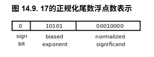

做浮点运算时要注意**精度损失**（Significance Loss）问题，有**时计算顺序不同也会导致不同的结果**，比如11.0010000+0.00000001+0.00000001=11.0010000+0.00000001=11.0010000，后面加的两个很小的数全被舍去了，没有对计算结果产生任何影响，但如果调一下计算顺序它们就能影响到计算结果了，0.00000001+0.00000001+11.0010000=0.00000010+11.0010000=11.0010001。再比如128.25=(10000000.01)~2~，需要10个有效位，而我们的模型中尾数部分是8位，算上隐含的最高位1一共有9个有效位，那么128.25的浮点数表示只能舍去末尾的1，表示成(10000000.0)~2~，其实跟128相等了。在[第 2 节 “if/else语句”](http://akaedu.github.io/book/ch04s02.html#cond.ifelse)讲过浮点数不能做精确比较，现在读者应该知道为什么不能精确比较了。

整数运算会产生溢出，浮点运算也会产生溢出，浮点运算的溢出也分上溢和下溢两种，但和整数运算的定义不同。假设整数采用8位2's Complement表示法，取值范围是-128\~127，如果计算结果是-130则称为下溢，计算结果是130则称为上溢。假设按本节介绍的浮点数表示法，取值范围是-(0.111111111)~2~×2^15^\~(0.111111111)~2~×2^15^，如果计算结果超出这个范围则称为上溢；如果计算结果未超出这个范围但绝对值太小了，在-(0.1)~2~×2^-16^\~(0.1)~2~×2^-16^之间，那么也同样无法表示，称为下溢。

最后讨论一个细节问题。我们知道，定义全局变量时如果没有Initializer就用0初始化，定义数组时如果Initializer中提供的元素不够那么剩下的元素也用0初始化。例如：

```c
int i;
double d;
double a[10] = { 1.0 };
```

**用0初始化”的意思是变量`i`、变量`d`和数组元素`a[1]~a[9]`的所有字节都用0填充，或者说所有bit都是0**。无论是用Sign and Magnitude表示法、1's Complement表示法还是2's Complement表示法，一个整数的所有bit是0都表示0值，但一个浮点数的所有bit是0一定表示0值吗？严格来说不一定，某种平台可能会规定一个浮点数的所有bit是0并不表示0值，但[[C99 Rationale\]](http://akaedu.github.io/book/bi01.html#bibli.rationale)第6.7.8节的条款25提到：As far as the committee knows, all machines treat all bits zero as a representation of floating-point zero. But, all bits zero might not be the canonical representation of zero. 因此在绝大多数平台上，一个浮点数的所有bit是0就表示0值。

# 第 15 章 数据类型详解

## 1. 整型

我们知道，在C语言中`char`型占一个字节的存储空间，一个字节通常是8个bit。如果这8个bit按无符号整数来解释，取值范围是0~255，如果按有符号整数来解释，采用2's Complement表示法，取值范围是-128~127。C语言规定了`signed`和`unsigned`两个关键字，`unsigned char`型表示无符号数，`signed char`型表示有符号数。

那么以前我们常用的不带`signed`或`unsigned`关键字的`char`型是无符号数还是有符号数呢？C标准规定这是Implementation Defined，**编译器可以定义`char`型是无符号的，也可以定义`char`型是有符号的，在该编译器所对应的体系结构上哪种实现效率高就可以采用哪种实现**，x86平台的`gcc`定义`char`型是有符号的。这也是C标准的Rationale之一：**优先考虑效率，而可移植性尚在其次**。这就要求程序员非常清楚这些规则，如果你要写可移植的代码，就必须清楚哪些写法是不可移植的，应该避免使用。另一方面，写不可移植的代码有时候也是必要的，比如Linux内核代码使用了很多只有`gcc`支持的语法特性以得到最佳的执行效率，在写这些代码的时候就没打算用别的编译器编译，也就没考虑可移植性的问题。如果要写不可移植的代码，你也必须清楚代码中的哪些部分是不可移植的，以及为什么要这样写，如果不是为了效率，一般来说就没有理由故意写不可移植的代码。从现在开始，我们会接触到很多Implementation Defined的特性，C语言与平台和编译器是密不可分的，离开了具体的平台和编译器讨论C语言，就只能讨论到本书第一部分的程度了。注意，ASCII码的取值范围是0~127，所以不管`char`型是有符号的还是无符号的，存一个ASCII码都没有问题，一般来说，如果用`char`型存ASCII码字符，就不必明确写是`signed`还是`unsigned`，如果用`char`型表示8位的整数，为了可移植性就必须写明是`signed`还是`unsigned`。

> ### Implementation-defined、Unspecified和Undefined
>
> 在C标准中没有做明确规定的地方会用Implementation-defined、Unspecified或Undefined来表述，在本书中有时把这三种情况统称为“未明确定义”的。这三种情况到底有什么不同呢？
>
> 我们刚才看到一种Implementation-defined的情况，C标准没有明确规定`char`是有符号的还是无符号的，但是要求编译器必须对此做出明确规定，并写在编译器的文档中。
>
> 而对于Unspecified的情况，往往有几种可选的处理方式，C标准没有明确规定按哪种方式处理，编译器可以自己决定，并且也不必写在编译器的文档中，这样即便用同一个编译器的不同版本来编译也可能得到不同的结果，因为编译器没有在文档中明确写它会怎么处理，那么不同版本的编译器就可以选择不同的处理方式，比如下一章我们会讲到一个函数调用的各个实参表达式按什么顺序求值是Unspecified的。
>
> Undefined的情况则是完全不确定的，C标准没规定怎么处理，编译器很可能也没规定，甚至也没做出错处理，有很多Undefined的情况编译器是检查不出来的，最终会导致运行时错误，比如数组访问越界就是Undefined的。

除了`char`型之外，整型还包括`short int`（或者简写为`short`）、`int`、`long int`（或者简写为`long`）、`long long int`（或者简写为`long long`）等几种[[25](http://akaedu.github.io/book/ch15s01.html#ftn.id2756873)]，这些类型都可以加上`signed`或`unsigned`关键字表示有符号或无符号数。其实，对于有符号数在计算机中的表示是Sign and Magnitude、1's Complement还是2's Complement，C标准也没有明确规定，也是Implementation Defined。大多数体系结构都采用2's Complement表示法，x86平台也是如此，从现在开始我们只讨论2's Complement表示法的情况。还有一点要注意，**除了`char`型以外的这些类型如果不明确写`signed`或`unsigned`关键字都表示`signed`**，这一点是C标准明确规定的，不是Implementation Defined。

除了`char`型在C标准中明确规定占一个字节之外，其它整型占几个字节都是Implementation Defined。通常的编译器实现遵守ILP32或LP64规范，如下表所示。

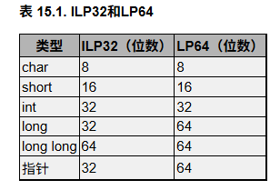

ILP32这个缩写的意思是`int`（I）、`long`（L）和指针（P）类型都占32位，通常32位计算机的C编译器采用这种规范，x86平台的`gcc`也是如此。LP64是指`long`（L）和指针占64位，通常64位计算机的C编译器采用这种规范。指针类型的长度总是和计算机的位数一致，至于什么是计算机的位数，指针又是一种什么样的类型，我们到[第 17 章 *计算机体系结构基础*](http://akaedu.github.io/book/ch17.html#arch)和[第 23 章 *指针*](http://akaedu.github.io/book/ch23.html#pointer)再分别详细解释。从现在开始本书做以下约定：**在以后的陈述中，缺省平台是x86/Linux/gcc，遵循ILP32，并且`char`是有符号的，我不会每次都加以说明，但说到其它平台时我会明确指出是什么平台**。

以前我们只用到十进制的整数常量，其实在C语言中也可以用八进制和十六进制的整数常量[[26](http://akaedu.github.io/book/ch15s01.html#ftn.id2757137)]。**八进制整数常量以0开头，后面的数字只能是0\~7**，例如022，因此**十进制的整数常量就不能以0开头**了，否则无法和八进制区分。**十六进制整数常量以0x或0X开头，后面的数字可以是0\~9、a\~f和A\~F**。在[第 6 节 “字符类型与字符编码”](http://akaedu.github.io/book/ch02s06.html#expr.charencoding)讲过一种转义序列，以\或\x加八进制或十六进制数字表示，这种表示方式相当于把八进制和十六进制整数常量开头的0替换成\了。

整数常量还可以在末尾加u或U表示“unsigned”，加l或L表示“long”，加ll或LL表示“long long”，例如0x1234U，98765ULL等。但事实上u、l、ll这几种后缀和上面讲的`unsigned`、`long`、`long long`关键字并不是一一对应的。准确的描述如下表所示

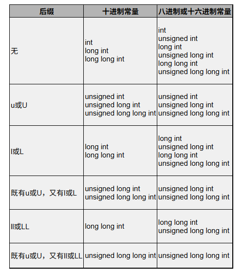

定一个整数常量，比如1234U，那么它应该属于“u或U”这一行的“十进制常量”这一列，这个表格单元中列了三种类型`unsigned int`、`unsigned long int`、`unsigned long long int`，**从上到下找出第一个足够长的类型可以表示1234这个数，那么它就是这个整数常量的类型**，如果`int`是32位的那么`unsigned int`就可以表示。

再比如0xffff0000，应该属于第一行“无”的第二列“八进制或十六进制常量”，这一列有六种类型`int`、`unsigned int`、`long int`、`unsigned long int`、`long long int`、`unsigned long long int`，**第一个类型`int`表示不了0xffff0000这么大的数，我们写这个十六进制常量是要表示一个正数，而它的MSB（第31位）是1，如果按有符号`int`类型来解释就成了负数了，第二个类型`unsigned int`可以表示这个数**，所以这个十六进制常量的类型应该算`unsigned int`。所以请注意，0x7fffffff和0xffff0000这两个常量虽然看起来差不多，但前者是`int`型，而后者是`unsigned int`型。

讲一个有意思的问题。我们知道x86平台上`int`的取值范围是-2147483648\~2147483647，那么用`printf("%d\n", -2147483648);`打印`int`类型的下界有没有问题呢？如果用`gcc main.c -std=c99`编译会有警告信息：`warning: format ‘%d’ expects type ‘int’, but argument 2 has type ‘long long int’`。这是因为，**虽然-2147483648这个数值能够用`int`型表示**，但在C语言中却没法写出对应这个数值的`int`型常量，**C编译器会把它当成一个整数常量2147483648和一个负号运算符组成的表达式**，而整数**常量2147483648已经超过了`int`型的取值范围**，在x86平台上`int`和`long`的取值范围相同，所以这个常量也超过了`long`型的取值范围，根据上表第一行“无”的第一列`十进制常量`，**这个整数常量应该算`long long`型的**，前面再加个负号组成的表达式仍然是`long long`型，而`printf`的`%d`转换说明要求后面的参数是`int`型，所以编译器报警告。之所以编译命令要加`-std=c99`选项是因为C99以前对于整数常量的类型规定和上表有一些出入，即使不加这个选项也会报警告，但警告信息不准确，读者可以试试。如果改成`printf("%d\n", -2147483647-1);`编译器就不会报警告了，-号运算符的两个操作数-2147483647和1都是`int`型，计算结果也应该是`int`型，并且它的值也没有超出`int`型的取值范围；或者改成`printf("%lld\n", -2147483648);`也可以，转换说明`%lld`告诉`printf`后面的参数是`long long`型，有些转换说明格式目前还没讲到，详见[第 2.9 节 “格式化I/O函数”](http://akaedu.github.io/book/ch25s02.html#stdlib.formatio)。

再看一个不简单的问题。`long long i = 1234567890 * 1234567890;`编译时会有警告信息：`warning: integer overflow in expression`。1234567890是`int`型，两个`int`型相乘的表达式仍然是`int`型，而乘积已经超过`int`型的取值范围了，因此提示计算结果溢出。如果改成`long long i = 1234567890LL * 1234567890;`，其中一个常量是`long long`型，另一个常量也会先转换成`long long`型再做乘法运算，两数相乘的表达式也是`long long`型，编译器就不会报警告了。有关类型转换的规则将在[第 3 节 “类型转换”](http://akaedu.github.io/book/ch15s03.html#type.conversion)详细介绍。

## 2. 浮点型

C标准规定的浮点型有`float`、`double`、`long double`，和整型一样，**既没有规定每种类型占多少字节，也没有规定采用哪种表示形式**。浮点数的实现在各种平台上差异很大，有的处理器有浮点运算单元（FPU，Floating Point Unit），称为硬浮点（Hard-float）实现；有的处理器没有浮点运算单元，只能做整数运算，需要用整数运算来模拟浮点运算，称为软浮点（Soft-float）实现。大部分平台的浮点数实现遵循IEEE 754，`float`型通常是32位，`double`型通常是64位。

`long double`型通常是比`double`型精度更高的类型，但各平台的实现有较大差异。在x86平台上，大多数编译器实现的`long double`型是80位，因为x86的浮点运算单元具有80位精度，`gcc`实现的`long double`型是12字节（96位），这是为了对齐到4字节边界（在[第 4 节 “结构体和联合体”](http://akaedu.github.io/book/ch19s04.html#asmc.structunion)详细讨论对齐的问题），也有些编译器实现的`long double`型和`double`型精度相同，没有充分利用x86浮点运算单元的精度。其它体系结构的浮点运算单元的精度不同，编译器实现也会不同，例如PowerPC上的`long double`型通常是128位。

以前我们只用到最简单的浮点数常量，例如3.14，现在看看浮点数常量还有哪些写法。由于浮点数在计算机中的表示是基于科学计数法的，所以浮点数常量也可以写成科学计数法的形式，尾数和指数之间用e或E隔开，例如314e-2表示314×10^-2^，注意这种表示形式基数是10[[27](http://akaedu.github.io/book/ch15s02.html#ftn.id2757890)]，如果尾数的小数点左边或右边没有数字则表示这一部分为零，例如3.e-1，.987等等。浮点数也可以加一个后缀，例如3.14f、.01L，浮点数的后缀和类型之间的对应关系比较简单，**没有后缀的浮点数常量是`double`型的，有后缀f或F的浮点数常量是`float`型的，有后缀l或L的浮点数常量是`long double`型**的。

## 3. 类型转换

从上面两节可以看出，有符号、无符号整数和浮点数加起来有那么多种类型，每两种类型之间都要定义一个转换规则，转换规则的数量自然很庞大，更何况由于各种体系结构对于整数和浮点数的实现很不相同，很多类型转换的情况都是C标准未做明确规定的阴暗角落。虽然我们写代码时不会故意去触碰这些阴暗角落，但有时候会不小心犯错，所以了解一些未明确规定的情况还是有必要的，可以在出错时更容易分析错误原因。本节分成几小节，首先介绍哪些情况下会发生类型转换，会把什么类型转成什么类型，然后介绍编译器如何处理这样的类型转换。

### 3.1. Integer Promotion

在一个表达式中，凡是可以使用`int`或`unsigned int`类型做右值的地方也都可以使用有符号或无符号的**`char`型、`short`型和Bit-field。如果原始类型的取值范围都能用`int`型表示，则其类型被提升为`int`，如果原始类型的取值范围用`int`型表示不了，则提升为`unsigned int`型**，这称为Integer Promotion。做Integer Promotion只影响上述几种类型的值，对其它类型无影响。C99规定Integer Promotion适用于以下几种情况：

1、如果一个函数的**形参类型未知**，例如使用了Old Style C风格的函数声明（详见[第 2 节 “自定义函数”](http://akaedu.github.io/book/ch03s02.html#func.ourfirstfunc)），或**者函数的参数列表中有...**，那么调用函数时要对相应的实参做Integer Promotion，此外，相应的实参如果是`float`型的也要被提升为`double`型，这条规则称为Default Argument Promotion。我们知道`printf`的参数列表中有`...`，除了第一个形参之外，其它形参的类型都是未知的，比如有这样的代码：

```
char ch = 'A';
printf("%c", ch);
```

**`ch`要被提升为`int`型之后再传给`printf`**。

2、**算术运算中的类型转换**。**有符号或无符号的`char`型、`short`型和Bit-field在做算术运算之前首先要做Integer Promotion，然后才能参与计算。**例如：

```
unsigned char c1 = 255, c2 = 2;
int n = c1 + c2;
```

计算表达式`c1 + c2`的过程其实是先把`c1`和`c2`提升为`int`型然后再相加（`unsigned char`的取值范围是0~255，完全可以用`int`表示，所以提升为`int`就可以了，不需要提升为`unsigned int`），整个表达式的值也是`int`型，最后的结果是257。假如没有这个提升的过程，`c1 + c2`就溢出了，溢出会得到什么结果是Undefined，在大多数平台上会把进位截掉，得到的结果应该是1。

除了+号之外还有哪些运算符在计算之前需要做Integer Promotion呢？我们在下一小节先介绍Usual Arithmetic Conversion规则，然后再解答这个问题。

### 3.2. Usual Arithmetic Conversion

两个算术类型的操作数做算术运算，比如`a + b`，如果**两边操作数的类型不同，编译器会自动做类型转换**，使两边类型相同之后才做运算，这称为Usual Arithmetic Conversion。转换规则如下：

1. 如果有一边的类型是`long double`，则把另一边也转成`long double`。
2. 否则，如果有一边的类型是`double`，则把另一边也转成`double`。
3. 否则，如果有一边的类型是`float`，则把另一边也转成`float`。
4. 否则，两边应该都是整型，首先按上一小节讲过的规则对`a`和`b`做Integer Promotion，然后如果类型仍不相同，则需要继续转换。首先我们规定`char`、`short`、`int`、`long`、`long long`的转换级别（Integer Conversion Rank）一个比一个高，同一类型的有符号和无符号数具有相同的Rank。转换规则如下：
   1. 如果两边都是有符号数，或者都是无符号数，那么**较低Rank的类型转换成较高Rank的类型**。例如`unsigned int`和`unsigned long`做算术运算时都转成`unsigned long`。
   2. 否则，**如果一边是无符号数另一边是有符号数**，**无符号数的Rank不低于有符号数的Rank，则把有符号数转成另一边的无符号类型**。例如`unsigned long`和`int`做算术运算时都转成`unsigned long`，`unsigned long`和`long`做算术运算时也都转成`unsigned long`。
   3. 剩下的情况是：一边有符号另一边无符号，并且**无符号数的Rank低于有符号数的Rank**。这时又分为两种情况，如果这个**有符号数类型能够覆盖这个无符号数类型的取值范围，则把无符号数转成另一边的有符号类型**。例如遵循LP64的平台上`unsigned int`和`long`在做算术运算时都转成`long`。
   4. 否则，也就是这个**有符号数类型不足以覆盖这个无符号数类型的取值范围**，则把两边**都转成有符号数的Rank对应的无符号类型**。例如在遵循ILP32的平台上**`unsigned int`和`long`在做算术运算时都转成`unsigned long`**。

可见有符号和无符号整数的转换规则是十分复杂的，虽然这是有明确规定的，不属于阴暗角落，但为了程序的可读性不应该依赖这些规则来写代码。我讲这些规则，不是为了让你用，而是为了让你了解有符号数和无符号数混用会非常麻烦，从而避免触及这些规则，并且在程序出错时记得往这上面找原因。所以这些规则不需要牢记，但要知道有这么回事，以便在用到的时候能找到我书上的这一段。

到目前为止我们学过的+ - * / % > < >= <= == !=运算符都**需要**做Usual Arithmetic Conversion，因为都要求两边操作数的类型一致，在下一章会介绍几种新的运算符也需要做Usual Arithmetic Conversion。

单目运算符+ - ~只有一个操作数，移位运算符<< >>两边的操作数类型不要求一致，这些运算**不需要**做Usual Arithmetic Conversion，但也需要做Integer Promotion，运算符~ << >>将在下一章介绍。

### 3.3. 由赋值产生的类型转换

如果赋值或初始化时等号两边的类型不相同，则编译器会把等号右边的类型转换成等号左边的类型再做赋值。例如`int c = 3.14;`，编译器会把右边的`double`型转成`int`型再赋给变量`c`。

我们知道，**函数调用传参的过程相当于定义形参并且用实参对其做初始化**，**函数返回的过程相当于定义一个临时变量并且用`return`的表达式对其做初始化**，所以由赋值产生的类型转换也适用于这两种情况。例如一个函数的原型是`int foo(int, int);`，则调用`foo(3.1, 4.2)`时会自动把两个`double`型的实参转成`int`型赋给形参，如果这个函数定义中有返回语句`return 1.2;`，则返回值`1.2`会自动转成`int`型再返回。

在函数调用和返回过程中发生的类型转换往往容易被忽视，因为函数原型和函数调用并没有写在一起。例如`char c = getchar();`，看到这一句往往会想当然地认为`getchar`的返回值是`char`型，而事实上`getchar`的返回值是`int`型，这样赋值会引起类型转换，可能产生Bug，我们在[第 2.5 节 “以字节为单位的I/O函数”](http://akaedu.github.io/book/ch25s02.html#stdlib.byteio)详细讨论这个问题。

### 3.4. 强制类型转换

**以上三种情况通称为隐式类型转换**（Implicit Conversion，或者叫Coercion），编译器根据它自己的一套规则将一种类型自动转换成另一种类型。除此之外，程序员**也可以通过类型转换运算符**（Cast Operator）自己规定某个表达式要转换成何种类型，这称为显式类型转换（Explicit Conversion）或强制类型转换（Type Cast）。例如计算表达式`(double)3 + i`，首先将整数3强制转换成`double`型（值为3.0），然后和整型变量`i`相加，这时适用Usual Arithmetic Conversion规则，首先把`i`也转成`double`型，然后两者相加，最后整个表达式也是`double`型的。这里的`(double)`就是一个类型转换运算符，**这种运算符由一个类型名套()括号组成，属于单目运算符**，后面的3是这个运算符的操作数。注意操作数的类型必须是标量类型，转换之后的类型必须是标量类型或者`void`型。

### 3.5. 编译器如何处理类型转换

以上几小节介绍了哪些情况下会发生类型转换，并且明确了每种情况下会把什么类型转成什么类型，本节介绍编译器如何处理任意两种类型之间的转换。现在要**把一个M位的类型（值为X）转换成一个N位的类型**，所有可能的情况如下表所示。

**表 15.3. 如何做类型转换**

| 待转换的类型                                 | M > N的情况                                                  | M == N的情况                                                 | M < N的情况 |
| -------------------------------------------- | ------------------------------------------------------------ | ------------------------------------------------------------ | ----------- |
| signed integer to signed integer             | 如果X在目标类型的取值范围内则值不变，否则Implementation-defined | 值不变                                                       | 值不变      |
| unsigned integer to signed integer           | 如果X在目标类型的取值范围内则值不变，否则Implementation-defined | 如果X在目标类型的取值范围内则值不变，否则Implementation-defined | 值不变      |
| signed integer to unsigned integer           | X % 2^N^                                                     | X % 2^N^                                                     | X % 2^N^    |
| unsigned integer to unsigned integer         | X % 2^N^                                                     | 值不变                                                       | 值不变      |
| floating-point to signed or unsigned integer | Truncate toward Zero，如果X的整数部分超出目标类型的取值范围则Undefined |                                                              |             |
| signed or unsigned integer to floating-point | 如果X在目标类型的取值范围内则值不变，但有可能损失精度，如果X超出目标类型的取值范围则Undefined |                                                              |             |
| floating-point to floating-point             | 如果X在目标类型的取值范围内则值不变，但有可能损失精度，如果X超出目标类型的取值范围则Undefined | 值不变                                                       | 值不变      |

注意上表中的**“X % 2^N^”，我想表达的意思是“把X加上或者减去2^N^的整数倍，使结果落入[0, 2^N^-1]的范围内”**，当X是负数时运算结果也得是正数，**即运算结果和除数同号而不是和被除数同号**，这**不同于C语言%运算的定义**。写程序时不要故意用上表中的规则，尤其不要触碰Implementation-defined和Undefined的情况，但程序出错时可以借助上表分析错误原因。

下面举几个例子说明上表的用法。比如把`double`型转换成`short`型，对应表中的“floating-point to signed or unsigned integer”，如果原值在(-32769.0, 32768.0)之间则截掉小数部分得到转换结果，否则产生溢出，结果是Undefined，例如对于`short s = 32768.4;`这个语句`gcc`会报警告。

比如把`int`型转换成`unsigned short`型，对应表中的“signed integer to unsigned integer”，如果原值是**正的，则把它除以2^16^取模**，**其实就是取它的低16位**，如果原值是**负的，则加上2^16^的整数倍**，使结果落在[0, 65535]之间。

比如把`int`类型转换成`short`类型，对应表中的“signed integer to signed integer”，如果原值在[-32768, 32767]之间则值不变，否则产生溢出，结果是Implementation-defined，例如对于`short s = -32769;`这个语句`gcc`会报警告。

最后一个例子，把`short`型转换成`int`型，对应表中的“signed integer to signed integer”，转换之后应该值不变。那怎么维持值不变呢？是不是在高位补16个0就行了呢？如果原值是-1，十六进制表示就是ffff，要转成`int`型的-1需要变成ffffffff，因此需要在高位补16个1而不是16个0。换句话说，要维持值不变，**在高位补1还是补0取决于原来的符号位**，这称为**符号扩展**（Sign Extension）。

# 第 16 章 运算符详解

## 1. 位运算

整数在计算机中用二进制的位来表示，C语言提供一些运算符可以直接操作整数中的位，称为位运算，**这些运算符的操作数都必须是整型的**。在以后的学习中你会发现，有些信息利用整数中的某几个位来存储，要访问这些位，仅仅有对整数的操作是不够的，必须借助位运算，例如[第 2 节 “Unicode和UTF-8”](http://akaedu.github.io/book/apas02.html#app-encoding.utf8)介绍的UTF-8编码就是如此，学完本节之后你应该能自己写出UTF-8的编码和解码程序。本节首先介绍各种位运算符，然后介绍与位运算有关的编程技巧。

### 1.1. 按位与、或、异或、取反运算

对于整数中的位也可以做与、或、非运算，C语言提供了按位与（Bitwise AND）运算符`&`、按位或（Bitwise OR）运算符`|`和按位取反（Bitwise NOT）运算符`~`，此外还有按位异或（Bitwise XOR）运算符`^`

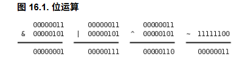

注意，&、|、^运算符都是要做Usual Arithmetic Conversion的（其中有一步是**Integer Promotion**），~运算符也要做Integer Promotion，所以在C语言中其实并不存在8位整数的位运算，操作数在**做位运算之前都至少被提升为`int`型了**，上面用8位整数举例只是为了书写方便。比如：

```c
unsigned char c = 0xfc;
unsigned int i = ~c;
```

计算过程是这样的：常量0xfc是`int`型的，赋给`c`要转成`unsigned char`，值不变；`c`的十六进制表示是fc，计算`~c`时先提升为整型（000000fc）然后取反，最后结果是ffffff03。注意，如果把`~c`看成是8位整数的取反，最后结果就得3了，这就错了。为了避免出错，一是尽量避免不同类型之间的赋值，二是每一步计算都要按上一章讲的类型转换规则仔细检查。

### 1.2. 移位运算

移位运算符（Bitwise Shift）包括左移`<<`和右移`>>`。左移将一个整数的各二进制位全部左移若干位，例如0xcfffffff3<<2得到0x3fffffcc

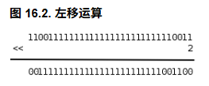

最高两位的11被移出去了，最低两位又补了两个0，其它位依次左移两位。但要注意，**移动的位数必须小于左操作数的总位数**，比如上面的例子，左边是`unsigned int`型，如果左移的位数大于等于32位，则结果是Undefined。移位运算符不同于+ - * / ==等运算符，**两边操作数的类型不要求一致**，但两边操作数都要做Integer Promotion，整个表达式的类型和左操作数提升后的类型相同。

复习一下[第 2 节 “不同进制之间的换算”](http://akaedu.github.io/book/ch14s02.html#number.convert)讲过的知识可以得出结论，**在一定的取值范围内，将一个整数左移1位相当于乘以2**。比如二进制11（十进制3）左移一位变成110，就是6，再左移一位变成1100，就是12。读者可以自己验证这条规律对有符号数和无符号数都成立，对负数也成立。当然，如果左移改变了最高位（符号位），那么结果肯定不是乘以2了，所以我加了个前提“在一定的取值范围内”。由于计算机做移位比做乘法快得多，编译器可以利用这一点做优化，比如看到源代码中有`i * 8`，可以编译成移位指令而不是乘法指令。

当操作数是**无符号数时，右移运算的规则和左移类似**，例如0xcfffffff3>>2得到0x33fffffc：

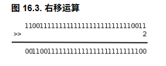

最低两位的11被移出去了，最高两位又补了两个0，其它位依次右移两位。和左移类似，移动的位数也必须小于左操作数的总位数，否则结果是Undefined。在一定的取值范围内，将一个整数**右移1位相当于除以2，小数部分截掉**。

当操作数是**有符号数**时，右移运算的规则比较复杂：

- **如果是正数**，那么高位移入0
- **如果是负数**，那么高位移入1还是0不一定，这是Implementation-defined的。**对于x86平台的`gcc`编译器，最高位移入1**，也就是仍保持负数的符号位，这种处理方式对负数仍然保持了“右移1位相当于除以2”的性质。

综上所述，由于类型转换和移位等问题，用有符号数做位运算是很不方便的，所以，**建议只对无符号数做位运算，以减少出错的可能**。

> 1、下面两行`printf`打印的结果有何不同？请读者比较分析一下。`%x`转换说明的含义详见[第 2.9 节 “格式化I/O函数”](http://akaedu.github.io/book/ch25s02.html#stdlib.formatio)。
>
> ```c
> int i = 0xcffffff3;
> printf("%x\n", 0xcffffff3>>2);
> printf("%x\n", i>>2);
> ```

执行结果如下

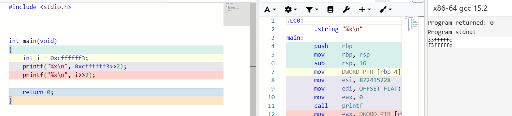

由于对应二进制为11001111111111111111111111110011

第一个0xcffffff3>>2里的，在计算之前会进行Integer Promotion，由于最高位为1，会被转换成 unsigned integer，则在x86平台上右移高位补0，则输出33fffffc

而i已经确定是int，也就是有符号数，此时代表负数，那此时右移就是高位补符号位1，就输出f3fffffc了

### 1.3. 掩码

如果要对一个整数中的某些位进行操作，怎样表示这些位在整数中的位置呢？可以用掩码（Mask）来表示。比如掩码0x0000ff00表示对一个32位整数的8~15位进行操作，举例如下。

1、取出8~15位。

```c
unsigned int a, b, mask = 0x0000ff00;
a = 0x12345678;
b = (a & mask) >> 8; /* 0x00000056 */
```

这样也可以达到同样的效果：

```c
b = (a >> 8) & ~(~0U << 8);
```

2、将8~15位清0。

```c
unsigned int a, b, mask = 0x0000ff00;
a = 0x12345678;
b = a & ~mask; /* 0x12340078 */
```

3、将8~15位置1。

```c
unsigned int a, b, mask = 0x0000ff00;
a = 0x12345678;
b = a | mask; /* 0x1234ff78 */
```

> 1、统计一个无符号整数的二进制表示中1的个数，函数原型是`int countbit(unsigned int x);`。
>
> 2、用位操作实现无符号整数的乘法运算，函数原型是`unsigned int multiply(unsigned int x, unsigned int y);`。例如：(11011)~2~×(10010)~2~=((11011)~2~<<1)+((11011)~2~<<4)。
>
> 3、对一个32位无符号整数做循环右移，函数原型是`unsigned int rotate_right(unsigned int x);`。所谓循环右移就是把低位移出去的部分再补到高位上去，例如`rotate_right(0xdeadbeef, 16)`的值应该是0xefdeadbe。

1、

```c
int countbit(unsigned int x){
    unsigned int mask = 0x00000001;
    int cnt = 0;
    for(int i = 0; i < 32; i++){
        cnt += (x & mask) >> i;
        mask <<= 1;
    }
    return cnt;
}
```

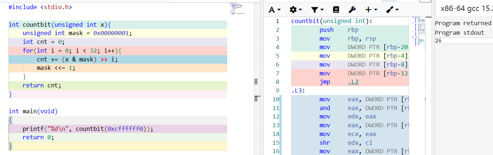

2、

```c
unsigned int multiply(unsigned int x, unsigned int y){
    unsigned long ans = 0;
    unsigned int mask = 0x00000001;
    for(int i = 0; i < 32; i++){
        //ans每轮如果y的低i位是1，ans加上x<<i，否则不加
        ans += (x << i) * ((y & mask) >> i);
        mask <<= 1;
        // printf("%d\n", ans);
    }
    return ans;
}
```

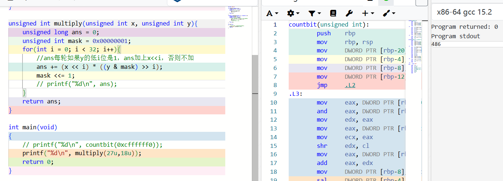

3、

题目好像函数原型给错了，没有右移多少位的值，所以改成unsigned int rotate_right(unsigned int x, unsigned int n)

不是，这答案也不对吧。。结果应该是0xbeefdead才对啊

```c
unsigned int rotate_right(unsigned int x, unsigned int n){
    unsigned int mask = 0x00000001;
    int sign = x & mask;
    for(int i = 0; i < n; i++){
        x >>= 1;
        // printf("%x\n", x);
        x = x | (sign << (31));
        printf("%x\n", x);

        // printf("%x\n", (sign << (31-i)));
        sign = x & mask;
        
    }
    return x;
}
```

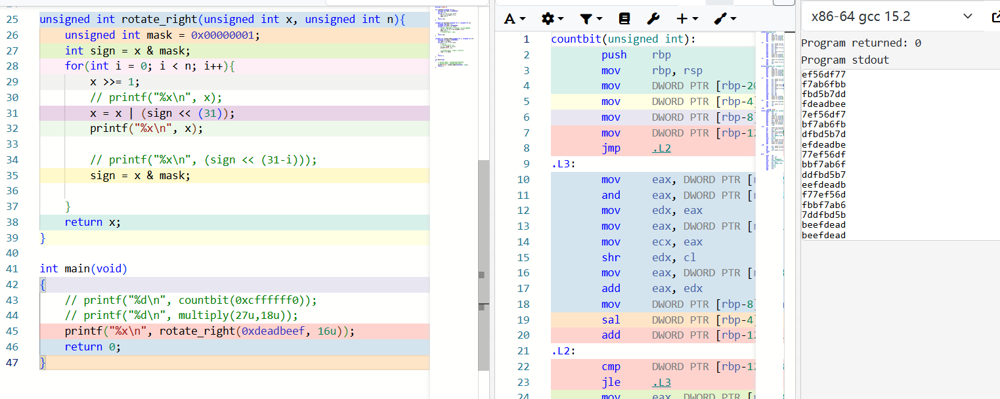

### 1.4. 异或运算的一些特性

1、**一个数和自己做异或的结果是0**。如果需要一个常数0，x86平台的编译器可能会生成这样的指令：`xorl %eax, %eax`。不管`eax`寄存器里的值原来是多少，做异或运算都能得到0，这条指令比同样效果的`movl $0, %eax`指令快，因为前者只需要在CPU内部计算，而后者需要访问内存，在下一章[第 5 节 “Memory Hierarchy”](http://akaedu.github.io/book/ch17s05.html#arch.memh)详细介绍。

2、从异或的真值表可以看出，不管是0还是1，**和0做异或保持原值不变**，**和1做异或得到原值的相反值**。可以利用这个特性配合掩码实现某些位的翻转，例如：

```c
unsigned int a, b, mask = 1U << 6;
a = 0x12345678;
b = a ^ mask; /* flip the 6th bit */
```

3、**如果a1 ^ a2 ^ a3 ^ ... ^ an的结果是1，则表示a1、a2、a3...an之中1的个数为奇数个**，否则为偶数个。这条性质**可用于奇偶校验**（Parity Check），比如在串口通信过程中，每个字节的数据都计算一个校验位，数据和校验位一起发送出去，这样接收方可以根据校验位粗略地判断接收到的数据是否有误。

4、x ^ x ^ y == y，因为x ^ x == 0，0 ^ y == y。这个性质有什么用呢？我们来看这样一个问题：**交换两个变量的值**，不得借助额外的存储空间，所以就不能采用`temp = a; a = b; b = temp;`的办法了。利用位运算可以这样做交换：

```c
a = a ^ b;
b = b ^ a;
a = a ^ b;
```

分析一下这个过程。为了避免混淆，把a和b的初值分别记为a0和b0。第一行，`a = a0 ^ b0`；第二行，把a的新值代入，得到`b = b0 ^ a0 ^ b0`，等号右边的b0相当于上面公式中的x，a0相当于y，所以结果为a0；第三行，把a和b的新值代入，得到`a = a0 ^ b0 ^ a0`，结果为b0。注意这个过程不能把同一个变量自己跟自己交换，而利用中间变量`temp`则可以交换。

> 1、请在网上查找有关RAID（Redundant Array of Independent Disks，独立磁盘冗余阵列）的资料，理解其实现原理，其实就是利用了本节的性质3和4。
>
> 2、交换两个变量的值，不得借助额外的存储空间，除了本节讲的方法之外你还能想出什么方法？本节讲的方法不能把同一个变量自己跟自己交换，你的方法有没有什么局限性？

1、RAID5会使用到性质3和性质4，在两个磁盘都好的时候，将两个磁盘的数据进行异或记录下校验位P

在其中一个磁盘损坏时，只需要另一个磁盘和P进行异或即可得到损坏的数据

2、还可以使用加减法进行交换

```
a = a + b; // a=a+b, b=b;
b = a - b; // a=a+b, b=a;
a = a - b; // a=b, b=a;
```

这个方法依旧不能自己和自己交换，但是如果是值相同的两个变量则不影响，然后还有个问题如果a和b的值都比较大，可能会出现溢出导致结果出错

## 2. 其它运算符

### 2.1. 复合赋值运算符

复合赋值运算符（Compound Assignment Operator）包括`*=` `/=` `%=` `+=` `-=` `<<=` `>>=` `&=` `^=` `|=`，一边做运算一边赋值。例如`a += 1`相当于`a = a + 1`。但有一点细微的差别，**前者对表达式`a`只求值一次**，而**后者求值两次**，如果`a`是一个复杂的表达式，求值一次和求值两次的效率是不同的，例如`a[i+j] += 1`和`a[i+j] = a[i+j] + 1`。

那么仅仅是效率上的差别吗？对于没有Side Effect的表达式，求值一次和求值两次的结果是一样的，但对于有Side Effect的表达式则不一定，例如`a[foo()] += 1`和`a[foo()] = a[foo()] + 1`，**如果`foo()`函数调用有Side Effect，比如会打印一条消息，那么前者只打印一次，而后者打印两次**。

在[第 3 节 “for语句”](http://akaedu.github.io/book/ch06s03.html#iter.for)讲自增、自减运算符时说`++i`相当于`i = i + 1`，其实更准确地说应该是等价于`i += 1`，表达式`i`只求值一次，而`--i`等价于`i -= 1`。

### 2.2. 条件运算符

条件运算符（Conditional Operator）是C语言中唯一一个三目运算符（Ternary Operator），带三个操作数，它的形式是`表达式1 ? 表达式2 : 表达式3`，这个运算符所组成的整个表达式的值等于表达式2或表达式3的值，取决于表达式1的值是否为真，可以把它想像成这样的函数：

```
if (表达式1)
	return 表达式2;
else
	return 表达式3;
```

表达式1相当于`if`语句的控制表达式，因此它的值必须是标量类型，而**表达式2和3相当于同一个函数在不同情况下的返回值，因此它们的类型要求一致**，也要做Usual Arithmetic Conversion。

### 2.3. 逗号运算符

逗号运算符（Comma Operator）也是一种双目运算符，它的形式是`表达式1, 表达式2`，**两个表达式不要求类型一致，左边的表达式1先求值，求完了直接把值丢掉，再求右边表达式2的值作为整个表达式的值**。

逗号运算符是**左结合的**，类似于+ - * /运算符，根据组合规则可以写出`表达式1, 表达式2, 表达式3, ..., 表达式n`这种形式，`表达式1, 表达式2`可以看作一个子表达式，先求表达式1的值，然后求表达式2的值作为这个子表达式的值，然后这个值再和表达式3组成一个更大的表达式，求表达式3的值作为这个更大的表达式的值，依此类推，整个计算过程就是从左到右依次求值，最后一个表达式的值成为整个表达式的值。

注意，**函数调用时各实参之间也是用逗号隔开，这种逗号是分隔符而不是逗号运算符**。但可以这样使用逗号运算符：

```
f(a, (t=3, t+2), c)
```

传给函数`f`的参数有三个，其中第二个参数的值是表达式`t+2`的值。//这里会输出5

### 2.4. sizeof运算符与typedef类型声明

`sizeof`是一个很特殊的运算符，它有两种形式：“sizeof 表达式”和“sizeof(类型名)”。这个运算符很特殊，“**sizeof 表达式”中的子表达式并不求值，而只是根据类型转换规则求得子表达式的类型，然后把这种类型所占的字节数作为整个表达式的值**。有些人喜欢写成“sizeof(表达式)”的形式也可以，这里的括号和`return(1);`的括号一样，不起任何作用。但另外一种形式**“sizeof(类型名)”的括号则是必须写的，整个表达式的值也是这种类型所占的字节数**。

比如用`sizeof`运算符求一个数组的长度：

```
int a[12];
printf("%d\n", sizeof a/sizeof a[0]);
```

在上面这个例子中，由于`sizeof 表达式`中的子表达式不需要求值，所以不需要到运行时才计算，事实上在编译时就知道`sizeof a`的值是48，`sizeof a[0]`的值是4，所以在编译时就已经把`sizeof a/sizeof a[0]`替换成常量12了，**这是一个常量表达式**。

`sizeof`运算符的结果是`size_t`类型的，这个类型定义在`stddef.h`头文件中，不过你的代码中只要不出现`size_t`这个类型名就不用包含这个头文件，比如像上面的例子就不用包含这个头文件。C标准规定`size_t`是一种无符号整型，编译器可以用`typedef`做一个类型声明：

```
typedef unsigned long size_t;
```

那么`size_t`就代表`unsigned long`型。不同平台的编译器可能会根据自己平台的具体情况定义`size_t`所代表的类型，比如有的平台定义为`unsigned long`型，有的平台定义为`unsigned long long`型，C标准规定`size_t`这个名字就是为了隐藏这些细节，使代码具有可移植性。所以注意不要把`size_t`类型和它所代表的真实类型混用，例如：

```
unsigned long x;
size_t y;
x = y;
```

如果在一种ILP32平台上定义`size_t`代表`unsigned long long`型，这段代码把`y`赋给`x`时就把高位截掉了，结果可能是错的。

**`typedef`这个关键字用于给某种类型起个新名字**，比如上面的`typedef`声明可以这么看：去掉`typedef`就成了一个变量声明`unsigned long size_t;`，`size_t`是一个变量名，类型是`unsigned long`，那么加上`typedef`之后，`size_t`就是一个类型名，就代表`unsigned long`类型。再举个例子：

```
typedef char array_t[10];
array_t a;
```

这相当于声明`char a[10];`。类型名也遵循标识符的命名规则，并且通常加个`_t`后缀表示Type。

## 3. Side Effect与Sequence Point

如果你只想规规矩矩地写代码，那么基本用不着看这一节。本节的内容基本上是钻牛角尖儿的，除**了Short-circuit比较实用，其它写法都应该避免使用**。但没办法，有时候不是你想钻牛角尖儿，而是有人逼你去钻牛角尖儿。这是我们的学员在找工作笔试时碰到的问题：

```c
int a=0;
a = (++a)+(++a)+(++a)+(++a);
```

据我了解，似乎很多公司都有出这种笔试题的恶趣味。**答案应该是Undefined**，我甚至有些怀疑出题人是否真的知道答案。下面我来解释为什么是Undefined。

我们知道，调用一个函数可能产生Side Effect，使用某些运算符（++ -- = 复合赋值）也会产生Side Effect，如果一个表达式中隐含着多个Side Effect，究竟哪个先发生哪个后发生呢？C标准规定代码中的某些点是Sequence Point，**当执行到一个Sequence Point时，在此之前的Side Effect必须全部作用完毕，在此之后的Side Effect必须一个都没发生**。至于两个Sequence Point之间的多个Side Effect哪个先发生哪个后发生则没有规定，编译器可以任意选择各Side Effect的作用顺序。下面详细解释各种Sequence Point。

1、调用一个函数时，在所有准备工作做完之后、函数调用开始之前是Sequence Point。比如调用`foo(f(), g())`时，`foo`、`f()`、`g()`这三个表达式哪个先求值哪个后求值是Unspecified，但是必须都求值完了才能做最后的函数调用，所以`f()`和`g()`的Side Effect按什么顺序发生不一定，但必定在这些Side Effect全部作用完之后才开始调用`foo`函数。

2、条件运算符`?:`、逗号运算符`,`、逻辑与`&&`、逻辑或`||`的第一个操作数求值之后是Sequence Point。我们刚讲过条件运算符和逗号运算符，条件运算符要根据表达式1的值是否为真决定下一步求表达式2还是表达式3的值，如果决定求表达式2的值，表达式3就不会被求值了，反之也一样，逗号运算符也是这样，表达式1求值结束才继续求表达式2的值。

逻辑与和逻辑或早在[第 3 节 “布尔代数”](http://akaedu.github.io/book/ch04s03.html#cond.bool)就讲了，但在初学阶段我一直回避它们的操作数求值顺序问题。这两个运算符和条件运算符类似，先求左操作数的值，然后根据这个值是否为真，右操作数可能被求值，也可能不被求值。比如[例 8.5 “剪刀石头布”](http://akaedu.github.io/book/ch08s05.html#array.scissor)这个程序中的这几句：

```
ret = scanf("%d", &man);
if (ret != 1 || man < 0 || man > 2) {
	printf("Invalid input! Please input 0, 1 or 2.\n");
	continue;
}
```

其实可以写得更简单（类似于[[K&R\]](http://akaedu.github.io/book/bi01.html#bibli.kr)的简洁风格）：

```
if (scanf("%d", &man) != 1 || man < 0 || man > 2) {
	printf("Invalid input! Please input 0, 1 or 2.\n");
	continue;
}
```

这个控制表达式的求值顺序是：先求`scanf("%d", &man) = 1`的值，如果`scanf`调用失败，则返回值不等于1成立，||运算有一个操作数为真则整个表达式为真，这时直接执行下一句`printf`，根本不会再去求`man < 0`或`man > 2`的值；如果`scanf`调用成功，则读入的数保存在变量`man`中，并且返回值等于1，那么说它不等于1就不成立了，第一个||运算的左操作数为假，就会去求右操作数`man < 0`的值作为整个表达式的值，这时变量`man`的值正是`scanf`读上来的值，我们判断它是否在[0, 2]之间，如果`man < 0`不成立，则整个表达式`scanf("%d", &man) != 1 || man < 0 `的值为假，也就是第二个||运算的左操作数为假，所以最后求右操作数`man > 2`的值作为整个表达式的值。

&&运算与此类似，`a && b`的计算过程是：**首先求表达式`a`的值，如果`a`的值是假则整个表达式的值是假，不会再去求`b`的值；如果`a`的值是真，则下一步求`b`的值作为整个表达式的值**。所以，`a && b`相当于“if a then b”，而`a || b`相当于“if not a then b”。**这种特性称为Short-circuit**，很多人喜欢利用Short-circuit特性简化代码。

3、在一个完整的声明末尾是Sequence Point，所谓完整的声明是指这个声明不是另外一个声明的一部分。比如声明`int a[10], b[20];`，在`a[10]`末尾是Sequence Point，在`b[20]`末尾也是。

4、在一个完整的表达式末尾是Sequence Point，所谓完整的表达式是指这个表达式不是另外一个表达式的一部分。所以如果有`f(); g();`这样两条语句，`f()`和`g()`是两个完整的表达式，`f()`的Side Effect必定在`g()`之前发生。

5、在库函数即将返回时是Sequence Point。这条规则似乎可以包含在上一条规则里面，因为函数返回时必然会结束掉一个完整的表达式。而事实上很多库函数是以宏定义的形式实现的（[第 2.1 节 “函数式宏定义”](http://akaedu.github.io/book/ch21s02.html#prep.funcmacro)），并不是真正的函数，所以才需要有这条规则。

还有两种Sequence Point和某些C标准库函数的执行过程相关，此处从略，有兴趣的读者可参考[[C99\]](http://akaedu.github.io/book/bi01.html#bibli.c99)的Annex C。

现在可以分析一下本节开头的例子了。`a = (++a)+(++a)+(++a)+(++a);`的结果之所以是Undefined，因为在这个表达式中有五个Side Effect都在改变`a`的值，这些Side Effect按什么顺序发生不一定，只知道在整个表达式求值结束时一定都发生了。比如现在求第二个`++a`的值，这时第一个、第三个、第四个`++a`的Side Effect发生了没有，`a`的值被加过几次了，这些都不确定，所以第二个`++a`的值也不确定。这行代码用不同平台的不同编译器来编译结果是不同的，甚至在同一平台上用同一编译器的不同版本来编译也可能不同。

写表达式应遵循的原则一：**在两个Sequence Point之间，同一个变量的值只允许被改变一次**。仅有这一条原则还不够，例如`a[i++] = i;`的变量`i`只改变了一次，但结果仍是Undefined，因为等号左边改`i`的值，等号右边读`i`的值，到底是先改还是先读？这个读写顺序是不确定的。但为什么`i = i + 1;`就没有歧义呢？虽然也是等号左边改`i`的值，等号右边读`i`的值，但你不读出`i`的值就没法计算`i + 1`，那拿什么去改`i`的值呢？所以这个读写顺序是确定的。写表达式应遵循的原则二：**如果在两个Sequence Point之间既要读一个变量的值又要改它的值，只有在读写顺序确定的情况下才可以这么写**。

## 4. 运算符总结

到此为止，除了和指针相关的运算符还没讲之外，其它运算符都讲过了，是时候做一个总结了。

运算符`+` `-` `*` `/` `%` `>` `<` `>=` `<=` `==` `!``=` `&` `|` `^` 以及各种复合赋值运算符要求两边的操作数类型一致，条件运算符`?:`要求后两个操作数类型一致，这些运算符在计算之前都需要做Usual Arithmetic Conversion。

下面按优先级从高到低的顺序总结一下C语言的运算符，每一条所列的各运算符具有相同的优先级，对于同一优先级的多个运算符按什么顺序计算也有说明，双目运算符就简单地用“左结合”或“右结合”来说明了。和指针有关的运算符`*` `&` `->`也在这里列出来了，到[第 23 章 *指针*](http://akaedu.github.io/book/ch23.html#pointer)再详细解释。

1、标识符、常量、字符串和用()括号套起来的表达式是组成表达式的最基本单元，在运算中做操作数，优先级最高。

2、后缀运算符，包括数组取下标`[]`、函数调用`()`、结构体取成员“`.`”、指向结构体的指针取成员`->`、后缀自增`++`、后缀自减`--`。如果一个操作数后面有多个后缀，按照离操作数从近到远的顺序（也就是**从左到右**）依次计算，比如`a.name++`，先算`a.name`，再++，这里的`.name`应该看成`a`的一个后缀，而不是把`.`看成双目运算符。

3、单目运算符，包括前缀自增`++`、前缀自减`--`、`sizeof`、类型转换`()`、取地址运算`&`、指针间接寻址`*`、正号`+`、负号`-`、按位取反`~`、逻辑非`!`。如果一个操作数前面有多个前缀，按照离操作数从近到远的顺序（也就是从**右到左**）依次计算，比如`!~a`，先算`~a`，再求!。

4、乘`*`、除`/`、模`%`运算符。这三个运算符是左结合的。

5、加`+`、减`-`运算符。左结合。

6、移位运算符`<<`和`>>`。左结合。

7、关系运算符`<` `>` `<=` `>=`。左结合。

8、相等性运算符`==`和`!=`。左结合。

9、按位与`&`。左结合。

10、按位异或`^`。左结合。

11、按位或`|`。左结合。

12、逻辑与`&&`。左结合。

13、逻辑或`||`。左结合。

14、条件运算符`:?`。在[第 2 节 “if/else语句”](http://akaedu.github.io/book/ch04s02.html#cond.ifelse)讲过Dangling-else问题，条件运算符也有类似的问题。例如`a ? b : c ? d : e`是看成`(a ? b : c) ? d : e`还是`a ? b : (c ? d : e)`呢？**C语言规定是后者**。

15、赋值`=`和各种复合赋值（`*=` `/=` `%=` `+=` `-=` `<<=` `>>=` `&=` `^=` `|=`）。在双目运算符中只有赋值和复合赋值是右结合的。

16、逗号运算符。左结合。

[[K&R\]](http://akaedu.github.io/book/bi01.html#bibli.kr)第2章也有这样一个列表，但是对于结合性解释得不够清楚。左结合和右结合这两个概念只对双目运算符有意义，对于前缀、后缀和三目运算符我单独做了说明。C语言表达式的详细语法规则可以参考[[C99\]](http://akaedu.github.io/book/bi01.html#bibli.c99)的Annex A.2，其实语法规则并不是用优先级和结合性这两个概念来表述的，有一些细节用优先级和结合性是表达不了的，只有看C99才能了解完整的语法规则。

# 第 21 章 预处理

## 1. 预处理的步骤

现在我们全面了解一下C编译器做语法解析之前的预处理步骤：

1、把[第 2 节 “常量”](http://akaedu.github.io/book/ch02s02.html#expr.constant)提到过的三连符替换成相应的单字符。

2、把用`\`字符续行的多行代码接成一行。例如：

```
#define STR "hello, "\
		"world"
```

经过这个预处理步骤之后接成一行：

```
#define STR "hello, "		"world"
```

这种续行的写法要求`\`后面紧跟换行，中间不能有其它空白字符。

3、把**注释（不管是单行注释还是多行注释）都替换成一个空格**。

4、经过以上两步之后去掉了一些换行，有的换行在续行过程中去掉了，有的换行在多行注释之中，也随着注释一起去掉了，剩下的代码行称为逻辑代码行。然后**预处理器把逻辑代码行划分成Token和空白字符**，这时的Token称为预处理Token，包括标识符、整数常量、浮点数常量、字符常量、字符串、运算符和其它符号。继续上面的例子，两个源代码行被接成一个逻辑代码行，然后这个逻辑代码行被划分成Token和空白字符：`#`，`define`，空格，`STR`，空格，`"hello, "`，Tab，Tab，`"world"`。

5、在Token中识别出预处理指示，做相应的**预处理动作**，如果遇到`#include`预处理指示，则把相应的源文件包含进来，并对源文件做以上1-4步预处理。如果遇到宏定义则做宏展开。

我们早在[第 2 节 “数组应用实例：统计随机数”](http://akaedu.github.io/book/ch08s02.html#array.statistic)就认识了预处理指示这个概念，现在给出它的严格定义。**一条预处理指示由一个逻辑代码行组成，以`#`开头，后面跟若干个预处理Token**，在预处理指示中允许使用的空白字符只有空格和Tab。

6、找出字符常量或字符串中的转义序列，用相应的字节来替换它，比如把`\n`替换成字节0x0a。

7、把相邻的字符串连接起来。继续上面的例子，如果代码中有：

```
printf(
	STR);
```

经过第4步处理划分成以下Token：`printf`，`(`，换行，Tab，`STR`，`)`，`;`，换行。

经过第5步宏展开后变成以下Token：`printf`，`(`，换行，Tab，`"hello, "`，Tab，Tab，`"world"`，`)`，`;`，换行。

然后把相邻的字符串连接起来，变成以下Token：`printf`，`(`，换行，Tab，`"hello, world"`，`)`，`;`，换行。

8、经过以上处理之后，把空白字符丢掉，把Token交给C编译器做语法解析，这时就不再是预处理Token，而称为**C Token**了。这里丢掉的空白字符包括空格、换行、水平Tab、垂直Tab、分页符。继续上面的例子，最后交给C编译器做语法解析的Token是：`printf`，`(`，`"hello, world"`，`)`，`;`。注意，把一个预处理指示写成多行要用`\`续行，因为根据定义，一条预处理指示只能由一个逻辑代码行组成，而把C代码写成多行则不需要用`\`续行，因为换行在C代码中只不过是一种空白字符，在做语法解析时所有空白字符都已经丢掉了。

## 2. 宏定义

较大的项目都会用大量的宏定义来组织代码，你可以看看`/usr/include`下面的头文件中用了多少个宏定义。看起来宏展开就是做个替换而已，其实里面有比较复杂的规则，C语言有很多复杂但不常用的语法规则本书并不涉及，但有关宏展开的语法规则本节却力图做全面讲解，因为它很重要也很常用。

### 2.1. 函数式宏定义

以前我们用过的`#define N 20`或`#define STR "hello, world"`这种宏定义可以称为**变量式宏定义**（Object-like Macro），宏定义名可以像变量一样在代码中使用。另外一种宏定义可以像函数调用一样在代码中使用，称为函数式宏定义（Function-like Macro）。例如编辑一个文件`main.c`：

```c
#define MAX(a, b) ((a)>(b)?(a):(b))
k = MAX(i&0x0f, j&0x0f)
```

我们想看第二行的表达式展开成什么样，可以用`gcc`的`-E`选项或`cpp`命令，尽管这个C程序不合语法，但没关系，我们只做预处理而不编译，不会检查程序是否符合C语法。

```c
$ cpp main.c
# 1 "main.c"
# 1 "<built-in>"
# 1 "<command-line>"
# 1 "main.c"

k = ((i&0x0f)>(j&0x0f)?(i&0x0f):(j&0x0f))
```

就像函数调用一样，把两个实参分别替换到宏定义中形参`a`和`b`的位置。注意这种函数式宏定义和真正的函数调用有什么不同：

1、函数式宏定义的**参数没有类型**，预处理器**只**负责**做形式上的替换**，而**不做参数类型检查**，所以传参时要格外小心。

2、**调用真正函数的代码和调用函数式宏定义的代码编译生成的指令不同**。如果`MAX`是个真正的函数，那么它的函数体`return a > b ? a : b;`要编译生成指令，代码中出现的每次调用也要编译生成传参指令和`call`指令。而如果`MAX`是个函数式宏定义，这个宏定义本身倒不必编译生成指令，但是代码中出现的每次调用编译生成的指令都相当于一个函数体，而不是简单的几条传参指令和`call`指令。所以，**使用函数式宏定义编译生成的目标文件会比较大**。

3、定义这种宏要格外小心，如果上面的定义写成`#define MAX(a, b) (a>b?a:b)`，省去内层括号，则宏展开就成了`k = (i&0x0f>j&0x0f?i&0x0f:j&0x0f)`，运算的优先级就错了。同样道理，这个宏定义的外层括号也是不能省的，想一想为什么。

4、调用函数时先求实参表达式的值再传给形参，如果实参表达式有Side Effect，那么这些Side Effect只发生一次。例如`MAX(++a, ++b)`，如果`MAX`是个真正的函数，`a`和`b`只增加一次。但如果`MAX`是上面那样的宏定义，则要展开成`k = ((++a)>(++b)?(++a):(++b))`，`a`和`b`就不一定是增加一次还是两次了。

5、即使实参没有Side Effect，使用**函数式宏定义也往往会导致较低的代码执行效率**。下面举一个极端的例子，也是个很有意思的例子。

```c
#define MAX(a, b) ((a)>(b)?(a):(b))

int a[] = { 9, 3, 5, 2, 1, 0, 8, 7, 6, 4 };

int max(int n)
{
	return n == 0 ? a[0] : MAX(a[n], max(n-1));
}

int main(void)
{
	max(9);
	return 0;
}
```

这段代码从一个数组中找出最大的数，如果`MAX`是个真正的函数，这个算法就是从前到后遍历一遍数组，时间复杂度是Θ(n)，而现在`MAX`是这样一个函数式宏定义，思考一下这个算法的时间复杂度是多少？

> MAX(a[n], max(n-1))会被编译成
>
> (a[n]) > (max(n-1)) ? (a[n]) : (max(n-1))
>
> 也就是每次都会调两次max(n-1)，严重浪费了

尽管函数式宏定义和真正的函数相比有很多缺点，但只要小心使用还是会显著提高代码的执行效率，毕竟省去了分配和释放栈帧、传参、传返回值等一系列工作，因此那些简短并且被频繁调用的函数经常用函数式宏定义来代替实现。例如C标准库的很多函数都提供两种实现，一种是真正的函数实现，一种是宏定义实现，这一点以后还要详细解释。

函数式宏定义经常写成这样的形式（取自内核代码`include/linux/pm.h`）：

```c
#define device_init_wakeup(dev,val) \
        do { \
                device_can_wakeup(dev) = !!(val); \
                device_set_wakeup_enable(dev,val); \
        } while(0)
```

为什么要用`do { ... } while(0)`括起来呢？不括起来会有什么问题呢？

```c
#define device_init_wakeup(dev,val) \
                device_can_wakeup(dev) = !!(val); \
                device_set_wakeup_enable(dev,val);

if (n > 0)
	device_init_wakeup(d, v);
```

这样宏展开之后，函数体的第二条语句不在`if`条件中。那么简单地用`{ ... }`括起来组成一个语句块不行吗？

```c
#define device_init_wakeup(dev,val) \
                { device_can_wakeup(dev) = !!(val); \
                device_set_wakeup_enable(dev,val); }

if (n > 0)
	device_init_wakeup(d, v);
else
	continue;
```

问题出在`device_init_wakeup(d, v);`末尾的`;`号，如果不允许写这个`;`号，看起来不像个函数调用，可如果写了这个`;`号，宏展开之后就有语法错误，`if`语句被这个`;`号结束掉了，没法跟`else`配对。因此，`do { ... } while(0)`是一种比较好的解决办法。

如果在一个程序文件中重复定义一个宏，C语言规定这些**重复的宏定义必须一模一样**。例如这样的重复定义是允许的：

```c
#define OBJ_LIKE (1 - 1)
#define OBJ_LIKE /* comment */ (1/* comment */-/* comment */  1)/* comment */
```

在定义的前后多些空白（空格、Tab、注释）没有关系，在定义之中多些空白或少些空白也没有关系，但在定义之中有空白和没有空白被认为是不同的，所以这样的重复定义是不允许的：

```c
#define OBJ_LIKE (1 - 1)
#define OBJ_LIKE (1-1)
```

如果需要重新定义一个宏，和原来的定义不同，可以先用`#undef`取消原来的定义，再重新定义，例如：

```c
#define X 3
... /* X is 3 */
#undef X
... /* X has no definition */
#define X 2
... /* X is 2 */
```

### 2.2. 内联函数

C99引入一个新关键字`inline`，用于定义内联函数（inline function）。这种用法在内核代码中很常见，例如`include/linux/rwsem.h`中：

```c
static inline void down_read(struct rw_semaphore *sem)
{
        might_sleep();
        rwsemtrace(sem,"Entering down_read");
        __down_read(sem);
        rwsemtrace(sem,"Leaving down_read");
}
```

**`inline`关键字告诉编译器，这个函数的调用要尽可能快**，可以当普通的函数调用实现，也可以用宏展开的办法实现。我们做个实验，把上一节的例子改一下：

```c
nline int MAX(int a, int b)
{
	return a > b ? a : b;
}

int a[] = { 9, 3, 5, 2, 1, 0, 8, 7, 6, 4 };

int max(int n)
{
	return n == 0 ? a[0] : MAX(a[n], max(n-1));
}

int main(void)
{
	max(9);
	return 0;
}
```

按往常的步骤编译然后反汇编：

```
$ gcc main.c -g
$ objdump -dS a.out
...
int max(int n)
{
 8048369:       55                      push   %ebp
 804836a:       89 e5                   mov    %esp,%ebp
 804836c:       83 ec 0c                sub    $0xc,%esp
        return n == 0 ? a[0] : MAX(a[n], max(n-1));
 804836f:       83 7d 08 00             cmpl   $0x0,0x8(%ebp)
 8048373:       75 0a                   jne    804837f <max+0x16>
 8048375:       a1 c0 95 04 08          mov    0x80495c0,%eax
 804837a:       89 45 fc                mov    %eax,-0x4(%ebp)
 804837d:       eb 29                   jmp    80483a8 <max+0x3f>
 804837f:       8b 45 08                mov    0x8(%ebp),%eax
 8048382:       83 e8 01                sub    $0x1,%eax
 8048385:       89 04 24                mov    %eax,(%esp)
 8048388:       e8 dc ff ff ff          call   8048369 <max>
 804838d:       89 c2                   mov    %eax,%edx
 804838f:       8b 45 08                mov    0x8(%ebp),%eax
 8048392:       8b 04 85 c0 95 04 08    mov    0x80495c0(,%eax,4),%eax
 8048399:       89 54 24 04             mov    %edx,0x4(%esp)
 804839d:       89 04 24                mov    %eax,(%esp)
 80483a0:       e8 9f ff ff ff          call   8048344 <MAX>
 80483a5:       89 45 fc                mov    %eax,-0x4(%ebp)
 80483a8:       8b 45 fc                mov    -0x4(%ebp),%eax
}
...
```

可以看到`MAX`是作为普通函数调用的。如果指定优化选项编译，然后反汇编：

```
$ gcc main.c -g -O
$ objdump -dS a.out
...
int max(int n)
{
 8048355:       55                      push   %ebp
 8048356:       89 e5                   mov    %esp,%ebp
 8048358:       53                      push   %ebx
 8048359:       83 ec 04                sub    $0x4,%esp
 804835c:       8b 5d 08                mov    0x8(%ebp),%ebx
        return n == 0 ? a[0] : MAX(a[n], max(n-1));
 804835f:       85 db                   test   %ebx,%ebx
 8048361:       75 07                   jne    804836a <max+0x15>
 8048363:       a1 a0 95 04 08          mov    0x80495a0,%eax
 8048368:       eb 18                   jmp    8048382 <max+0x2d>
 804836a:       8d 43 ff                lea    -0x1(%ebx),%eax
 804836d:       89 04 24                mov    %eax,(%esp)
 8048370:       e8 e0 ff ff ff          call   8048355 <max>
inline int MAX(int a, int b)
{
        return a > b ? a : b;
 8048375:       8b 14 9d a0 95 04 08    mov    0x80495a0(,%ebx,4),%edx
 804837c:       39 d0                   cmp    %edx,%eax
 804837e:       7d 02                   jge    8048382 <max+0x2d>
 8048380:       89 d0                   mov    %edx,%eax
int a[] = { 9, 3, 5, 2, 1, 0, 8, 7, 6, 4 };

int max(int n)
{
        return n == 0 ? a[0] : MAX(a[n], max(n-1));
}
 8048382:       83 c4 04                add    $0x4,%esp
 8048385:       5b                      pop    %ebx
 8048386:       5d                      pop    %ebp
 8048387:       c3                      ret    
...
```

可以看到，并没有`call`指令调用`MAX`函数，`MAX`函数的指令是内联在`max`函数中的，由于源代码和指令的次序无法对应，`max`和`MAX`函数的源代码也交错在一起显示。

inline 关键字只是给编译器的一个**建议**（Hint）。编译器觉得“这个函数太复杂，内联不划算”或者没开优化选项，它可能就不理你，依然把它当普通函数处理。

------

### 2.3. `#`、`##`运算符和可变参数

在函数式宏定义中，**`#`运算符用于创建字符串，`#`运算符后面应该跟一个形参**（中间可以有空格或Tab），例如：

```c
#define STR(s) # s
STR(hello 	world)
```

用`cpp`命令预处理之后是`"hello␣world"`，**自动用`"`号把实参括起来成为一个字符串，并且实参中的连续多个空白字符被替换成一个空格**。

再比如：

```c
#define STR(s) #s
fputs(STR(strncmp("ab\"c\0d", "abc", '\4"')
	== 0) STR(: @\n), s);
```

预处理之后是`fputs("strncmp(\"ab\\\"c\\0d\", \"abc\", '\\4\"') == 0" ": @\n", s);`，注意**如果实参中包含字符常量或字符串，则宏展开之后字符串的界定符`"`要替换成`\"`**，字符常量或字符串中的**`\`和`"`字符要替换成`\\`和`\"`**。

在**宏定义中可以用`##`运算符把前后两个预处理Token连接成一个预处理Token**，和`#`运算符不同，`##`运算符不仅限于函数式宏定义，变量式宏定义也可以用。例如：

```
#define CONCAT(a, b) a##b
CONCAT(con, cat)
```

预处理之后是`concat`。再比如，要定义一个宏展开成两个`#`号，可以这样定义：

```
#define HASH_HASH # ## #
```

中间的`##`是运算符，宏展开时前后两个`#`号被这个运算符连接在一起。注意中间的两个空格是不可少的，如果写成`####`，会被划分成`##`和`##`两个Token，而根据定义`##`运算符用于连接前后两个预处理Token，不能出现在宏定义的开头或末尾，所以会报错。

我们知道`printf`函数带有可变参数，**函数式宏定义也可以带可变参数**，同样是在参数列表中用`...`表示可变参数。例如：

```c
#define showlist(...) printf(#__VA_ARGS__)
#define report(test, ...) ((test)?printf(#test):\
	printf(__VA_ARGS__))
showlist(The first, second, and third items.);
report(x>y, "x is %d but y is %d", x, y);
```

预处理之后变成：

```c
printf("The first, second, and third items.");
((x>y)?printf("x>y"): printf("x is %d but y is %d", x, y));
```

**在宏定义中，可变参数的部分用`__VA_ARGS__`表示，实参中对应`...`的几个参数可以看成一个参数替换到宏定义中`__VA_ARGS__`所在的地方**。

> `__VA_ARGS__`会带着`,`

调用函数式宏定义允许传空参数，这一点和函数调用不同，通过下面几个例子理解空参数的用法。

```c
#define FOO() foo
FOO()
```

预处理之后变成`foo`。`FOO`在定义时不带参数，在调用时也不允许传参数给它。

```c
#define FOO(a) foo##a
FOO(bar)
FOO()
```

预处理之后变成：

```
foobar
foo
```

`FOO`在定义时带一个参数，在调用时必须传一个参数给它，如果不传参数则表示传了一个空参数。

```c
#define FOO(a, b, c) a##b##c
FOO(1,2,3)
FOO(1,2,)
FOO(1,,3)
FOO(,,3)
```

预处理之后变成：

```
123
12
13
3
```

`FOO`在定义时带三个参数，在调用时也必须传三个参数给它，空参数的位置可以空着，但必须给够三个参数，`FOO(1,2)`这样的调用是错误的。

```
#define FOO(a, ...) a##__VA_ARGS__
FOO(1)
FOO(1,2,3,)
```

预处理之后变成：

```
1
12,3,
```

`FOO(1)`这个调用相当于可变参数部分传了一个空参数，`FOO(1,2,3,)`这个调用相当于可变参数部分传了三个参数，第三个是空参数。

`gcc`有一种扩展语法，如果`##`运算符用在`__VA_ARGS__`前面，除了起连接作用之外还有特殊的含义，例如内核代码`net/netfilter/nf_conntrack_proto_sctp.c`中的：

```
#define DEBUGP(format, ...) printk(format, ## __VA_ARGS__)
```

`printk`这个内核函数相当于`printf`，也带有格式化字符串和可变参数，由于内核不能调用`libc`的函数，所以另外实现了一个打印函数。这个函数式宏定义可以这样调用：`DEBUGP("info no. %d", 1)`。也可以这样调用：`DEBUGP("info")`。后者相当于可变参数部分传了一个空参数，但展开后并不是`printk("info",)`，而是`printk("info")`，当`__VA_ARGS`是空参数时，`##`运算符把它前面的`,`号“吃”掉了。

### 2.4. 宏展开的步骤

以上举的宏展开的例子都是最简单的，有些宏展开的过程要做多次替换，例如：

```c
#define sh(x) printf("n" #x "=%d, or %d\n",n##x,alt[x])
#define sub_z  26
sh(sub_z)
```

`sh(sub_z)`要用`sh(x)`这个宏定义来展开，形参`x`对应的实参是`sub_z`，替换过程如下：

1. `#x`要替换成`"sub_z"`。
2. `n##x`要替换成`nsub_z`。
3. 除了带`#`和`##`运算符的参数之外，其它参数在替换之前要对实参本身做充分的展开，所以应该先把`sub_z`展开成26再替换到`alt[x]`中`x`的位置。
4. 现在展开成了`printf("n" "sub_z" "=%d, or %d\n",nsub_z,alt[26])`，所有参数都替换完了，这时编译器会再扫描一遍，再找出可以展开的宏定义来展开，假设`nsub_z`或`alt`是变量式宏定义，这时会进一步展开。

再举一个例子：

```
#define x 3
#define f(a) f(x * (a))
#undef x
#define x 2
#define g f
#define t(a) a

t(t(g)(0) + t)(1);
```

展开的步骤是：

1. 先把`g`展开成`f`再替换到`#define t(a) a`中，得到`t(f(0) + t)(1);`。

2. 根据`#define f(a) f(x * (a))`，得到`t(f(x * (0)) + t)(1);`。

3. 把`x`替换成2，得到`t(f(2 * (0)) + t)(1);`。

   注意，一开始定义`x`为3，但是后来用`#undef x`取消了`x`的定义，又重新定义`x`为2。

   当处理到`t(t(g)(0) + t)(1);`这一行代码时`x`已经定义成2了，所以用2来替换。

   还要注意一点，现在得到的`t(f(2 * (0)) + t)(1);`中仍然有`f`，**但不能再次根据`#define f(a) f(x * (a))`展开了，`f(2 * (0))`就是由展开`f(0)`得到的**，这里面再遇到`f`就不展开了，这样规定可以避免无穷展开（类似于无穷递归），因此我们可以放心地使用递归定义，例如`#define a a[0]`，`#define a a.member`等。

4. 根据`#define t(a) a`，最终展开成`f(2 * (0)) + t(1);`。这时不能再展开`t(1)`了，因为这里的`t`就是由展开`t(f(2 * (0)) + t)`得到的，所以不能再展开了。


## 3. 条件预处理指示

条件预处理指示也常用于源代码的配置管理，例如：

```c
#if MACHINE == 68000
    int x;
#elif MACHINE == 8086
    long x;
#else    /* all others */
    #error UNKNOWN TARGET MACHINE
#endif
```

假设这段程序是为多种平台编写的，在68000平台上需要定义`x`为`int`型，在8086平台上需要定义`x`为`long`型，对其它平台暂不提供支持，就可以用条件预处理指示来写。如果在预处理这段代码之前，`MACHINE`被定义为68000，则包含`int x;`这段代码；否则如果`MACHINE`被定义为8086，则包含`long x;`这段代码；否则（`MACHINE`没有定义，或者定义为其它值），包含`#error UNKNOWN TARGET MACHINE`这段代码，编译器遇到这个预处理指示就报错退出，错误信息就是`UNKNOWN TARGET MACHINE`。

如果要为8086平台编译这段代码，有几种可选的办法：

1、手动编辑代码，在前面添一行`#define MACHINE 8086`。这样做的缺点是难以管理，如果这个项目中有很多源文件都需要定义`MACHINE`，每次要为8086平台编译就得把这些定义全部改成8086，每次要为68000平台编译就得把这些定义全部改成68000。

2、在所有需要配置的源文件开头包含一个头文件，在头文件中定义`#define MACHINE 8086`，这样只需要改一个头文件就可以影响所有包含它的源文件。通常这个头文件由配置工具生成，比如在Linux内核源代码的目录下运行`make menuconfig`命令可以出来一个配置菜单，在其中配置的选项会自动转换成头文件`include/linux/autoconf.h`中的宏定义。

3、要定义一个宏不一定非得在代码中用`#define`定义，早在[第 6 节 “折半查找”](http://akaedu.github.io/book/ch11s06.html#sortsearch.binary)我们就见过用`gcc`的`-D`选项定义一个宏`NDEBUG`。对于上面的例子，我们需要给`MACHINE`定义一个值，可以写成类似这样的命令：`gcc -c -DMACHINE=8086 main.c`。这种办法需要给每个编译命令都加上适当的选项，和第2种方法相比似乎也很麻烦，第2种方法在头文件中只写一次宏定义就可以在很多源文件中生效，第3种方法能不能做到“只写一次到处生效”呢？等以后学习了Makefile就有办法了。

最后通过下面的例子说一下`#if`后面的表达式：

```
#define VERSION  2
#if defined x || y || VERSION < 3
```

1. 首先处理`defined`运算符，`defined`运算符一般用作表达式中的一部分，如果单独使用，`#if defined x`相当于`#ifdef x`，而`#if !defined x`相当于`#ifndef x`。在这个例子中，如果`x`这个宏有定义，则把`defined x`替换为1，否则替换为0，因此变成`#if 0 || y || VERSION < 3`。
2. 然后把有定义的宏展开，变成`#if 0 || y || 2 < 3`。
3. 把没有定义的宏替换成0，变成`#if 0 || 0 || 2 < 3`，注意，即使前面定义了一个变量名是`y`，在这一步也还是替换成0，因为`#if`的表达式必须在编译时求值，**其中包含的名字只能是宏定义**。
4. 把得到的表达式`0 || 0 || 2 < 3`像C表达式一样求值，求值的结果是`#if 1`，因此条件成立。

## 4. 其它预处理特性

`#pragma`预处理指示供编译器实现一些非标准的特性，C标准没有规定`#pragma`后面应该写什么以及起什么作用，由编译器自己规定。有的编译器用`#pragma`定义一些特殊功能寄存器名，有的编译器用`#pragma`定位链接地址，本书不做深入讨论。如果编译器在代码中碰到不认识的`#pragma`指示则忽略它，例如`gcc`的`#pragma`指示都是`#pragma GCC ...`这种形式，用别的编译器编译则忽略这些指示。

C标准规定了几个特殊的宏，在不同的地方使用可以自动展开成不同的值，常用的有`__FILE__`和`__LINE__`，**`__FILE__`展开为当前源文件的文件名**，是一个字符串，**`__LINE__`展开为当前代码行的行号**，是一个整数。这两个宏在源代码中不同的位置使用会自动取不同的值，显然不是用`#define`能定义得出来的，它们是编译器内建的特殊的宏。在打印调试信息时打印这两个宏可以给开发者非常有用的提示，例如在[第 6 节 “折半查找”](http://akaedu.github.io/book/ch11s06.html#sortsearch.binary)我们看到`assert`函数打印的错误信息就有`__FILE__`和`__LINE__`的值。现在我们自己实现这个`assert`函数，以理解它的原理。这个实现出自[[Standard C Library\]](http://akaedu.github.io/book/bi01.html#bibli.standardclib)：


**例 21.3. assert.h的一种实现**

```c
/* assert.h standard header */
#undef assert	/* remove existing definition */

#ifdef NDEBUG
	#define assert(test)	((void)0)
#else		/* NDEBUG not defined */
	void _Assert(char *);
	/* macros */
	#define _STR(x) _VAL(x)
	#define _VAL(x) #x
	#define assert(test)	((test) ? (void)0 \
		: _Assert(__FILE__ ":" _STR(__LINE__) " " #test))
#endif
```

通过这个例子可以全面复习本章所讲的知识。C标准规定`assert`应该实现为宏定义而不是一个真正的函数，并且`assert(test)`这个表达式的值应该是`void`类型的。

首先用`#undef assert`确保取消前面对`assert`的定义，然后分两种情况：如果定义了`NDEBUG`，那么`assert(test)`直接定义成一个`void`类型的值，什么也不做；如果没有定义`NDEBUG`，则要判断测试条件`test`是否成立，如果条件成立就什么也不做，如果不成立则调用`_Assert`函数。

假设在`main.c`文件的第`33`行调用`assert(is_sorted())`，那么`__FILE__`是字符串`"main.c"`，`__LINE__`是整数`33`，`#test`是字符串`"is_sorted()"`。注意`_STR(__LINE__)`的展开过程：首先展开成`_VAL(33)`，然后进一步展开成字符串`"33"`。这样，最后`_Assert`调用的形式是`_Assert("main.c" ":" "33" " " "is_sorted()")`，传给`_Assert`函数的字符串是`"main.c:33 is_sorted()"`。`_Assert`函数是我们自己定义的，在另一个源文件中：

```c
/* xassert.c _Assert function */
#include <stdio.h>
#include <stdlib.h>

void _Assert(char *mesg)
{		/* print assertion message and abort */
	fputs(mesg, stderr);
	fputs(" -- assertion failed\n", stderr);
	abort();
}
```

注意，在头文件`assert.h`中自己定义的内部使用的标识符都以`_`线开头，例如`_STR`，`_VAL`，`_Assert`，因为我们在模拟C标准库的实现，在[第 3 节 “变量”](http://akaedu.github.io/book/expr.variable.html)讲过，以`_`线开头的标识符通常由编译器和C语言库使用，在`/usr/include`下的头文件中你可以看到大量`_`线开头的标识符。另外一个问题，为什么我们不直接在`assert`的宏定义中调用`fputs`和`abort`呢？因为调用这两个函数需要包含`stdio.h`和`stdlib.h`，**C标准库的头文件应该是相互独立的**，一个程序只要包含`assert.h`就应该能使用`assert`，而不应该再依赖于别的头文件。`_Assert`中的`fputs`向标准错误输出打印错误信息，`abort`异常终止当前进程，这些函数以后再详细讨论。

现在测试一下我们的`assert`实现，把`assert.h`和`xassert.c`和测试代码`main.c`放在同一个目录下。

```
/* main.c */
#include "assert.h"

int main(void)
{
	assert(2>3);
	return 0;
}
```

注意`#include "assert.h"`要用`"`引号而不要用`<>`括号，以保证包含的是我们自己写的`assert.h`而非C标准库的头文件。然后编译运行：

```
$ gcc main.c xassert.c
$ ./a.out
main.c:6 2>3 -- assertion failed
Aborted
```

在打印调试信息时除了文件名和行号之外还可以打印出当前函数名，C99引入一个特殊的标识符`__func__`支持这一功能。这个标识符应该是一个变量名而不是宏定义，不属于预处理的范畴，但它的作用和`__FILE__`、`__LINE__`类似，所以放在一起讲。例如：


**例 21.4. 特殊标识符__func__**

```c
#include <stdio.h>

void myfunc(void)
{
	printf("%s\n", __func__);
}

int main(void)
{
	myfunc();
	printf("%s\n", __func__);
	return 0;
}
$ gcc main.c
$ ./a.out 
myfunc
main
```

# 第 23 章 指针

## 1. 指针的基本概念

保存地址的这个内存单元称为指针，通过指针和间接寻址访问变量，这种指针在C语言中可以用一个指针类型的变量表示

，例如某程序中定义了以下全局变量：

```c
int i;
int *pi = &i;
char c;
char *pc = &c;
```

这几个变量的内存布局如下图所示，在初学阶段经常要借助于这样的图来理解指针。

**图 23.1. 指针的基本概念**

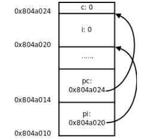

这里的`&`是取地址运算符（Address Operator），`&i`表示取变量`i`的地址，`int *pi = &i;`表示定义一个指向`int`型的指针变量`pi`，并用`i`的地址来初始化`pi`。

我们讲过全局变量只能用常量表达式初始化，如果定义`int p = i;`就错了，因为`i`不是常量表达式，然而用`i`的地址来初始化一个指针却没有错，因为**`i`的地址是在编译链接时能确定的**，而不需要到运行时才知道，`&i`是常量表达式。后面两行代码定义了一个字符型变量`c`和一个指向`c`的字符型指针`pc`，注意`pi`和`pc`虽然是不同类型的指针变量，但它们的内存单元都占4个字节，因为要保存32位的虚拟地址，同理，在64位平台上指针变量都占8个字节。

定义指针的`*`号前后空格都可以省，写成`int*p,*q;`也算对，但`*`号通常和类型`int`之间留空格而和变量名写在一起，这样看`int *p, q;`就很明显是定义了一个指针和一个整型变量，就不容易看错了。

如果要让`pi`指向另一个整型变量`j`，可以重新对`pi`赋值：

```c
pi = &j;
```

如果要改变`pi`所指向的整型变量的值，比如把变量`j`的值增加10，可以写：

```c
*pi = *pi + 10;
```

这里的**`*`号是指针间接寻址运算符**（Indirection Operator），**`*pi`表示取指针`pi`所指向的变量的值**，也称为Dereference操作，指针有时称为变量的引用（Reference），所以根据指针找到变量称为Dereference。

`&`运算符的操作数必须是左值，因为只有左值才表示一个内存单元，才会有地址，运算结果是指针类型。`*`运算符的操作数必须是指针类型，运算结果可以做左值。所以，**如果表达式`E`可以做左值，`*&E`和`E`等价，如果表达式`E`是指针类型，`&*E`和`E`等价**。

指针之间可以相互赋值，也可以用一个指针初始化另一个指针，例如：

```c
int *ptri = pi;
```

或者：

```c
int *ptri;
ptri = pi;
```

表示*`pi`指向哪就让`ptri`也指向哪*，本质上就是把变量`pi`所保存的地址值赋给变量`ptri`。

用一个指针给另一个指针赋值时要注意，两个指针必须是同一类型的。在我们的例子中，`pi`是`int *`型的，`pc`是`char *`型的，`pi = pc;`这样赋值就是错误的。但是可以先强制类型转换然后赋值：

```c
pi = (int *)pc;
```

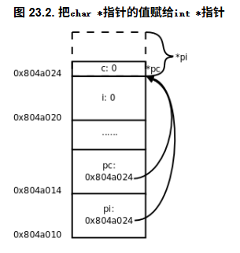

现在`pi`指向的地址和`pc`一样，但是通过`*pc`只能访问到一个字节，而通过`*pi`可以访问到4个字节，后3个字节已经不属于变量`c`了，除非你很确定变量`c`的一个字节和后面3个字节组合而成的`int`值是有意义的，否则就不应该给`pi`这么赋值。因此使用指针要特别小心，很容易将指针指向错误的地址，访问这样的地址可能导致段错误，可能读到无意义的值，也可能意外改写了某些数据，使得程序在随后的运行中出错。有一种情况需要特别注意，定义一个指针类型的局部变量而没有初始化：

```
int main(void)
{
	int *p;
	...
	*p = 0;
	...
}
```

我们知道，在堆栈上分配的变量初始值是不确定的，也就是说指针`p`所指向的内存地址是不确定的，后面用`*p`访问不确定的地址就会导致不确定的后果，如果导致段错误还比较容易改正，如果意外改写了数据而导致随后的运行中出错，就很难找到错误原因了。像这种**指向不确定地址的指针称为“野指针”**（Unbound Pointer），为避免出现野指针，在定义指针变量时就应该给它明确的初值，或者把它初始化为`NULL`：

```
int main(void)
{
	int *p = NULL;
	...
	*p = 0;
	...
}
```

`NULL`在C标准库的头文件`stddef.h`中定义：

```
#define NULL ((void *)0)
```

就是把地址0转换成指针类型，称为空指针，它的特殊之处在于，**操作系统不会把任何数据保存在地址0及其附近，也不会把地址0~0xfff的页面映射到物理内存，所以任何对地址0的访问都会立刻导致段错误**。`*p = 0;`会导致段错误，就像放在眼前的炸弹一样很容易找到，相比之下，野指针的错误就像埋下地雷一样，更难发现和排除，这次走过去没事，下次走过去就有事。

讲到这里就该讲一下`void *`类型了。在编程时经常需要一种**通用指针**，可以转换为任意其它类型的指针，任意其它类型的指针也可以转换为通用指针，最初C语言没有`void *`类型，就把`char *`当通用指针，需要转换时就用类型转换运算符`()`，ANSI在将C语言标准化时引入了`void *`类型，**`void *`指针与其它类型的指针之间可以隐式转换，而不必用类型转换运算符**。注意，**只能定义`void *`指针，而不能定义`void`型的变量**，因为`void *`指针和别的指针一样都占4个字节，而如果定义`void`型变量（也就是类型暂时不确定的变量），编译器不知道该分配几个字节给变量。同样道理，`void *`指针不能直接Dereference，而必须先转换成别的类型的指针再做Dereference。`void *`指针常用于函数接口，比如：

```
void func(void *pv)
{
	/* *pv = 'A' is illegal */
	char *pchar = pv;
	*pchar = 'A';
}

int main(void)
{
	char c;
	func(&c);
	printf("%c\n", c);
...
}
```

下一章讲函数接口时再详细介绍`void *`指针的用处。

## 2. 指针类型的参数和返回值

首先看以下程序：

```c
#include <stdio.h>

int *swap(int *px, int *py)
{
	int temp;
	temp = *px;
	*px = *py;
	*py = temp;
	return px;
}

int main(void)
{
	int i = 10, j = 20;
	int *p = swap(&i, &j);
	printf("now i=%d j=%d *p=%d\n", i, j, *p);
	return 0;
}
```

我们知道，调用函数的传参过程相当于用实参定义并初始化形参，`swap(&i, &j)`这个调用相当于：

```c
int *px = &i;
int *py = &j;
```

所以`px`和`py`分别指向`main`函数的局部变量`i`和`j`，在`swap`函数中读写`*px`和`*py`其实是读写`main`函数的`i`和`j`。尽管在`swap`函数的作用域中访问不到`i`和`j`这两个变量名，却可以通过地址访问它们，最终`swap`函数将`i`和`j`的值做了交换。

上面的例子还演示了函数返回值是指针的情况，`return px;`语句相当于定义了一个临时变量并用`px`初始化：

```
int *tmp = px;
```

然后临时变量`tmp`的值成为表达式`swap(&i, &j)`的值，然后在`main`函数中又把这个值赋给了p，相当于：

```
int *p = tmp;
```

最后的结果是`swap`函数的`px`指向哪就让`main`函数的`p`指向哪。我们知道`px`指向`i`，所以`p`也指向`i`。

> 1、对照本节的描述，像[图 23.1 “指针的基本概念”](http://akaedu.github.io/book/ch23s01.html#pointer.pointer0)那样画图理解函数的调用和返回过程。在下一章我们会看到更复杂的参数和返回值形式，在初学阶段对每个程序都要画图理解它的运行过程，只要基本概念清晰，无论多复杂的形式都应该能正确分析。
>
> 2、现在回头看[第 3 节 “形参和实参”](http://akaedu.github.io/book/ch03s03.html#func.paraarg)的习题1，那个程序应该怎么改？

1、黑色是调用时的赋值，红色是返回时的赋值，左边的蓝色的是地址，方块里的不论黑的还是蓝的都是该单元的值

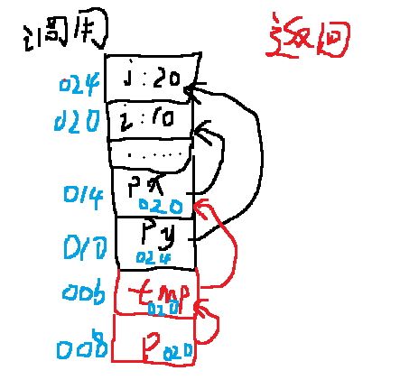

2、

```c
#include <stdio.h>

void increment(int *x)
{
	*x = *x + 1;
}

int main(void)
{
	int i = 1, j = 2;
	increment(&i);
	increment(&j);
    printf("%d %d",i,j);
	return 0;
}
```

## 3. 指针与数组

先看个例子，有如下语句：

```
int a[10];
int *pa = &a[0];
pa++;
```

首先指针`pa`指向`a[0]`的地址，**注意后缀运算符的优先级高于单目运算符，所以是取`a[0]`的地址**，而不是取`a`的地址。然后`pa++`让`pa`指向下一个元素（也就是`a[1]`），由于`pa`是`int *`指针，一个`int`型元素占4个字节，所以`pa++`使`pa`所指向的地址加4，注意不是加1。

下面画图理解。从前面的例子我们发现，地址的具体数值其实无关紧要，关键是要说明地址之间的关系（`a[1]`位于`a[0]`之后4个字节处）以及指针与变量之间的关系（指针保存的是变量的地址），现在我们换一种画法，省略地址的具体数值，用方框表示存储空间，用箭头表示指针和变量之间的关系。

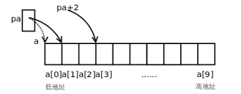

既然指针可以用`++`运算符，当然也可以用`+`、`-`运算符，`pa+2`这个表达式也是有意义的，如上图所示，`pa`指向`a[1]`，那么`pa+2`指向a[3]。事实上，`E1[E2]`这种写法和`(*((E1)+(E2)))`是等价的，`*(pa+2)`也可以写成`pa[2]`，`pa`就像数组名一样，其实数组名也没有什么特殊的，`a[2]`之所以能取数组的第2个元素，是因为它等价于`*(a+2)`，在[第 1 节 “数组的基本概念”](http://akaedu.github.io/book/ch08s01.html#array.intro)讲过**数组名做右值时自动转换成指向首元素的指针**，所以`a[2]`和`pa[2]`本质上是一样的，都是通过指针间接寻址访问元素。由于`(*((E1)+(E2)))`显然可以写成`(*((E2)+(E1)))`，所以`E1[E2]`也可以写成`E2[E1]`，这意味着`2[a]`、`2[pa]`这种写法也是对的，但一般不这么写。另外，由于`a`做右值使用时和`&a[0]`是一个意思，所以`int *pa = &a[0];`通常不这么写，而是写成更简洁的形式`int *pa = a;`。

在[第 1 节 “数组的基本概念”](http://akaedu.github.io/book/ch08s01.html#array.intro)还讲过C语言允许数组下标是负数，现在你该明白为什么这样规定了。在上面的例子中，表达式`pa[-1]`是合法的，它和`a[0]`表示同一个元素。

现在猜一下，两个指针变量做比较运算（`>`、`>=`、`<`、`<=`、`==`、`!=`）表示什么意义？两个指针变量做减法运算又表示什么意义？

根据什么来猜？根据[第 3 节 “形参和实参”](http://akaedu.github.io/book/ch03s03.html#func.paraarg)讲过的Rule of Least Surprise原则。你理解了指针和常数加减的概念，再根据以往使用比较运算的经验，就应该猜到`pa + 2 > pa`，`pa - 1 == a`，所以指针之间的比较运算比的是地址，C语言正是这样规定的，不过C语言的规定更为严谨，**只有指向同一个数组中元素的指针之间相互比较才有意义，否则没有意义**。那么两个指针相减表示什么？`pa - a`等于几？因为`pa - 1 == a`，所以`pa - a`显然应该等于1，**指针相减表示两个指针之间相差的元素个数**，同样只有指向同一个数组中元素的指针之间相减才有意义。两个指针相加表示什么？想不出来它能有什么意义，因此**C语言也规定两个指针不能相加**。假如C语言为指针相加也规定了一种意义，那就相当Surprise了，不符合一般的经验。无论是设计编程语言还是设计函数接口或人机界面都是这个道理，应该尽可能让用户根据以往的经验知识就能推断出该系统的基本用法。

在**取数组元素时用数组名和用指针的语法一样**，但如果把**数组名做左值使用，和指针就有区别**了。例如`pa++`是合法的，但`a++`就不合法，`pa = a + 1`是合法的，但`a = pa + 1`就不合法。数**组名做右值时转换成指向首元素的指针，但做左值仍然表示整个数组的存储空间，而不是首元素的存储空间**，数组名做左值还有一点特殊之处，不支持`++`、赋值这些运算符，但支持取地址运算符`&`，所以`&a`是合法的，我们将在[第 7 节 “指向数组的指针与多维数组”](http://akaedu.github.io/book/ch23s07.html#pointer.array3)介绍这种语法。

在函数原型中，如果参数是数组，则等价于参数是指针的形式，例如：

```c
void func(int a[10])
{
	...
}
```

等价于：

```c
void func(int *a)
{
	...
}
```

第一种形式方括号中的数字可以不写，仍然是等价的：

```c
void func(int a[])
{
	...
}
```

参数写成指针形式还是数组形式对编译器来说没区别，都表示这个参数是指针，之所以规定两种形式是为了给读代码的人提供有用的信息，如果这个参数指向一个元素，通常写成指针的形式，如果这个参数指向一串元素中的首元素，则经常写成数组的形式。

## 4. 指针与`const`限定符

`const`限定符和指针结合起来常见的情况有以下几种。

```
const int *a;
int const *a;
```

这两种写法是一样的，**`a`是一个指向`const int`型的指针，`a`所指向的内存单元不可改写，所以`(*a)++`是不允许的，但`a`可以改写**，所以`a++`是允许的。


```c
int * const a;
```

**`a`是一个指向`int`型的`const`指针，`*a`是可以改写的，但`a`不允许改写。**


```c
int const * const a;
```

**`a`是一个指向`const int`型的`const`指针，因此`*a`和`a`都不允许改写。**


**指向非`const`变量的指针或者非`const`变量的地址可以传给指向`const`变量的指针**，编译器可以做隐式类型转换，例如：

```c
char c = 'a';
const char *pc = &c;
```

**但是，指向`const`变量的指针或者`const`变量的地址不可以传给指向非`const`变量的指针**，以免透过后者意外改写了前者所指向的内存单元，例如对下面的代码编译器会报警告：

```c
const char c = 'a';
char *pc = &c;
```

即使不用`const`限定符也能写出功能正确的程序，但良好的编程习惯应该尽可能多地使用`const`，因为：

1. `const`给读代码的人传达非常有用的信息。比如一个函数的参数是`const char *`，你在调用这个函数时就可以放心地传给它`char *`或`const char *`指针，而不必担心指针所指的内存单元被改写。
2. 尽可能多地使用`const`限定符，把不该变的都声明成只读，这样可以依靠编译器检查程序中的Bug，防止意外改写数据。
3. `const`对编译器优化是一个有用的提示，编译器也许会把`const`变量优化成常量。

在[第 3 节 “变量的存储布局”](http://akaedu.github.io/book/ch19s03.html#asmc.layout)我们看到，字符串字面值通常分配在`.rodata`段，而在[第 4 节 “字符串”](http://akaedu.github.io/book/ch08s04.html#array.string)提到，**字符串字面值类似于数组名，做右值使用时自动转换成指向首元素的指针，这种指针应该是`const char *`型**。我们知道`printf`函数原型的第一个参数是`const char *`型，可以把`char *`或`const char *`指针传给它，所以下面这些调用都是合法的：

```
const char *p = "abcd";
const char str1[5] = "abcd";
char str2[5] = "abcd";
printf(p);
printf(str1);
printf(str2);
printf("abcd");
```

注意上面第一行，如果要定义一个指针指向字符串字面值，这个指针应该是`const char *`型，如果写成`char *p = "abcd";`就不好了，有隐患，例如：

```
int main(void)
{
	char *p = "abcd";
...
	*p = 'A';
...
}
```

`p`指向`.rodata`段，不允许改写，但编译器不会报错，在运行时会出现段错误。

## 5. 指针与结构体


首先定义一个结构体类型，然后定义这种类型的变量和指针：

```c
struct unit {
	char c;
	int num;
};
struct unit u;
struct unit *p = &u;
```

**要通过指针`p`访问结构体成员可以写成`(*p).c`和`(*p).num`，为了书写方便，C语言提供了`->`运算符，也可以写成`p->c`和`p->num`**。

## 6. 指向指针的指针与指针数组

指针可以指向基本类型，也可以指向复合类型，因此也可以指向另外一个指针变量，称为指向指针的指针。

```c
int i;
int *pi = &i;
int **ppi = &pi;
```

这样定义之后，表达式`*ppi`取`pi`的值，表达式`**ppi`取`i`的值。请读者自己画图理解`i`、`pi`、`ppi`这三个变量之间的关系。

很自然地，也可以定义指向“指向指针的指针”的指针，但是很少用到：

```c
int ***p;
```

数组中的每个元素可以是基本类型，也可以复合类型，因此也可以是指针类型。例如定义一个数组`a`由10个元素组成，每个元素都是`int *`指针：

```
int *a[10];
```

**这称为指针数组。`int *a[10];`和`int **pa;`之间的关系类似于`int a[10];`和`int *pa;`之间的关系：`a`是由一种元素组成的数组，`pa`则是指向这种元素的指针**。所以，如果`pa`指向`a`的首元素：

```
int *a[10];
int **pa = &a[0];
```

则`pa[0]`和`a[0]`取的是同一个元素，唯一比原来复杂的地方在于这个元素是一个`int *`指针，而不是基本类型。

我们知道main函数的标准原型应该是`int main(int argc, char *argv[]);`。`argc`是命令行参数的个数。**而`argv`是一个指向指针的指针**，为什么不是指针数组呢？因为前面讲过，函数原型中的`[]`表示指针而不表示数组，等价于`char **argv`。那为什么要写成`char *argv[]`而不写成`char **argv`呢？这样写给读代码的人提供了有用信息，`argv`不是指向单个指针，而是指向一个指针数组的首元素。数组中每个元素都是`char *`指针，指向一个命令行参数字符串。


**例 23.2. 打印命令行参数**

```c
#include <stdio.h>

int main(int argc, char *argv[])
{
	int i;
	for(i = 0; i < argc; i++)
		printf("argv[%d]=%s\n", i, argv[i]);
	return 0;
}
```

编译执行：

```
$ gcc main.c
$ ./a.out a b c
argv[0]=./a.out
argv[1]=a
argv[2]=b
argv[3]=c
$ ln -s a.out printargv
$ ./printargv d e 
argv[0]=./printargv
argv[1]=d
argv[2]=e
```

注意程序名也算一个命令行参数，所以执行`./a.out a b c`这个命令时，`argc`是4，`argv`如下图所示：

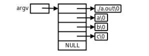

由于`argv[4]`是`NULL`，我们也可以这样循环遍历`argv`：

```
for(i=0; argv[i] != NULL; i++)
```

`NULL`标识着`argv`的结尾，这个循环碰到`NULL`就结束，因而不会访问越界，这种用法很形象地称为Sentinel，`NULL`就像一个哨兵守卫着数组的边界。

在这个例子中我们还看到，如果给程序建立符号链接，然后通过符号链接运行这个程序，就可以得到不同的`argv[0]`。通常，程序会根据不同的命令行参数做不同的事情，例如`ls -l`和`ls -R`打印不同的文件列表，而有些程序会根据不同的`argv[0]`做不同的事情，例如专门针对嵌入式系统的开源项目Busybox，将各种Linux命令裁剪后集于一身，编译成一个可执行文件`busybox`，安装时将`busybox`程序拷到嵌入式系统的`/bin`目录下，同时在`/bin`、`/sbin`、`/usr/bin`、`/usr/sbin`等目录下创建很多指向`/bin/busybox`的符号链接，命名为`cp`、`ls`、`mv`、`ifconfig`等等，不管执行哪个命令其实最终都是在执行`/bin/busybox`，它会根据`argv[0]`来区分不同的命令。


> 1、想想以下定义中的`const`分别起什么作用？编写程序验证你的猜测。
>
> ```c
> const char **p;
> char *const *p;
> char **const p;
> ```

第一个是一个指向const char的元素的指针的指针，也就是要求p指向的指针，它指向的元素值不可改变，两层的指针指针是可以修改的

第二个是一个不能更改的指针，他指向一个指向const char的指针，也就是p的指向不能改变，但是p指向的指针的指向可以改变，但是第二层指针指向的值不能改变

第三个也一样，p是不可更改的，指向指向char类型的指针，也就是两层指针都不能改，但是值是可以改的

------

查了一下，理解完全错误。。。

应该这样记，const修饰左边的对象，如果没有就修饰右边紧邻的

也就是第一个const修饰char，p 是指针，指向 \*p，\*p 是指针，指向 const char。

第二个const修饰\*，也就是中间一级指针，p 是指针，指向一个 char * const 类型的数据。
char * const 是一个“指向 char 的常量指针”。这意味着 *p一旦初始化或赋值，就不能指向别处了。

第三个char修饰\*\*，也就是修饰p，，所以 p 本身是常量指针，不可以修改，p 指向 char *，char * 是一个普通的指向字符的指针。

```c
#include <stdio.h>

int main() {

    const char **p1;
    // 测试：
    p1++;               // p1 本身可以改
    *p1++;              // p1 指向的指针可以改
    // **p1 = 'X';      // ERROR: 最终的值是 const char，不能改

    char *const *p2;
    
    // 测试：
    p2++;          // p2 是指针，它自己可以变
    // *p2 = ptr2; // ERROR: *p2 是 (char *const)，即常量指针，不能被修改！
    **p2 = 'X';    // 最终指向的是 char，可以改


    char **const p3; 
    
    // 测试：
    // p3++;        // ERROR: p3 本身是 const，不能改指向
    (*p3)++;        // *p3 只是 char*，可以改。(注意这里不加扩号的话也会报错，因为*的优先级似乎低一些)
    **p3 = 'X';     // 最终的值可以改

    return 0;
}
```

## 7. 指向数组的指针与多维数组

指针可以指向复合类型，上一节讲了指向指针的指针，这一节学习指向数组的指针。以下定义一个指向数组的指针，该数组有10个`int`元素：

```
int (*a)[10];
```

和上一节指针数组的定义`int *a[10];`相比，仅仅多了一个`()`括号。如何记住和区分这两种定义呢？我们可以认为`[]`比`*`有更高的优先级，如果`a`先和`*`结合则表示`a`是一个指针，如果`a`先和`[]`结合则表示`a`是一个数组。`int *a[10];`这个定义可以拆成两句：

```
typedef int *t;
t a[10];
```

`t`代表`int *`类型，`a`则是由这种类型的元素组成的数组。`int (*a)[10];`这个定义也可以拆成两句：

```
typedef int t[10];
t *a;
```

`t`代表由10个`int`组成的数组类型，`a`则是指向这种类型的指针。

现在看指向数组的指针如何使用：

```
int a[10];
int (*pa)[10] = &a;
```

`a`是一个数组，在`&a`这个表达式中，数组名做左值，取整个数组的首地址赋给指针`pa`。注意，**`&a[0]`表示数组`a`的首元素的首地址，而`&a`表示数组`a`的首地址**，显然这两个地址的**数值相同**，但这两个表达式的**类型是两种**不同的指针类型，前者的类型是`int *`，而后者的类型是`int (*)[10]`。

`*pa`就表示`pa`所指向的数组`a`，所以取数组的`a[0]`元素可以用表达式`(*pa)[0]`。注意到`*pa`可以写成`pa[0]`，所以`(*pa)[0]`这个表达式也可以改写成`pa[0][0]`，`pa`就像一个二维数组的名字，它表示什么含义呢？下面把`pa`和二维数组放在一起做个分析。

`int a[5][10];`和`int (*pa)[10];`之间的关系同样类似于`int a[10];`和`int *pa;`之间的关系：`a`是由一种元素组成的数组，`pa`则是指向这种元素的指针。所以，如果`pa`指向`a`的首元素：

```
int a[5][10];
int (*pa)[10] = &a[0];
```

则`pa[0]`和`a[0]`取的是同一个元素，唯一比原来复杂的地方在于这个元素是由10个`int`组成的数组，而不是基本类型。这样，我们可以把`pa`当成二维数组名来使用，`pa[1][2]`和`a[1][2]`取的也是同一个元素，而且`pa`比`a`用起来更灵活，数组名不支持赋值、自增等运算，而指针可以支持，**`pa++`使`pa`跳过二维数组的一行（40个字节），指向`a[1]`的首地址。**

> 1、定义以下变量：
>
> ```c
> char a[4][3][2] = {
>     	   {{'a', 'b'}, {'c', 'd'}, {'e', 'f'}},
> 		   {{'g', 'h'}, {'i', 'j'}, {'k', 'l'}},
> 		   {{'m', 'n'}, {'o', 'p'}, {'q', 'r'}},
> 		   {{'s', 't'}, {'u', 'v'}, {'w', 'x'}}
> 		};
> 
> char (*pa)[2] = &a[1][0];
> char (*ppa)[3][2] = &a[1];
> ```
>
> 要想通过`pa`或`ppa`访问数组`a`中的`'r'`元素，分别应该怎么写？

```c
#include <stdio.h>

int main() {

    char a[4][3][2] = {
    	   {{'a', 'b'}, {'c', 'd'}, {'e', 'f'}},
		   {{'g', 'h'}, {'i', 'j'}, {'k', 'l'}},
		   {{'m', 'n'}, {'o', 'p'}, {'q', 'r'}},
		   {{'s', 't'}, {'u', 'v'}, {'w', 'x'}}
		};
    char (*pa)[2] = &a[1][0];
    char (*ppa)[3][2] = &a[1];
    
    //pa是一个数组指针，每个指针包含两个元素，起始地址位a里的{'g', 'h'}那里，想要输出r，则要往后5个元素
    //然后输出第2个值即可
    pa = pa + 5;
    printf("%c\n", (*pa)[1]);
    //ppa也是数组指针，但是大小不同，它一个元素占3*2，初始地址在{{'g', 'h'}, {'i', 'j'}, {'k', 'l'}}
    //所以想输出r，要先加1，然后输出第3个元素的第二个值即可；
    ppa = ppa + 1;
    printf("%c", (*ppa)[2][1]);
    return 0;
}
```

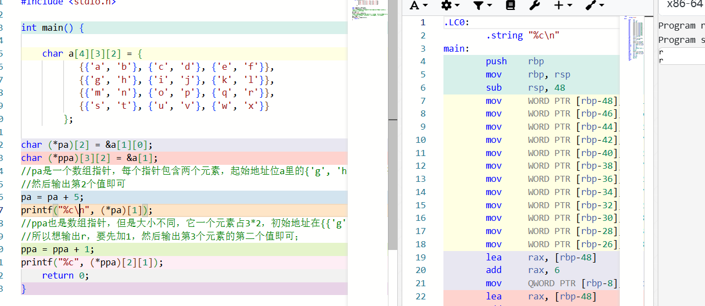

## 8. 函数类型和函数指针类型

在C语言中，**函数也是一种类型**，**可以定义指向函数的指针**。我们知道，指针变量的内存单元存放一个地址值，而**函数指针存放的就是函数的入口地址**（位于`.text`段）。下面看一个简单的例子：


**例 23.3. 函数指针**

```c
#include <stdio.h>

void say_hello(const char *str)
{
	printf("Hello %s\n", str);
}

int main(void)
{
	void (*f)(const char *) = say_hello;
	f("Guys");
	return 0;
}
```

分析一下变量`f`的类型声明`void (*f)(const char *)`，`f`首先跟`*`号结合在一起，因此是一个指针。

`(*f)`外面是一个函数原型的格式，参数是`const char *`，返回值是`void`，所以`f`是指向这种函数的指针。

而`say_hello`的参数是`const char *`，返回值是`void`，正好是这种函数，因此`f`可以指向`say_hello`。注意，`say_hello`是一种函数类型，而**函数类型和数组类型类似，做右值使用时自动转换成函数指针类型**，所以可以直接赋给`f`，当然也可以写成`void (*f)(const char *) = &say_hello;`，把函数`say_hello`先取地址再赋给`f`，就不需要自动类型转换了。

可以直接通过函数指针调用函数，如上面的`f("Guys")`，也可以先用`*f`取出它所指的函数类型，再调用函数，即`(*f)("Guys")`。可以这么理解：函数调用运算符`()`要求操作数是函数指针，所以`f("Guys")`是最直接的写法，而`say_hello("Guys")`或`(*f)("Guys")`则是把函数类型自动转换成函数指针然后做函数调用。

下面再举几个例子区分函数类型和函数指针类型。首先定义函数类型F：

```c
typedef int F(void);
```

这种类型的函数不带参数，返回值是`int`。那么可以这样声明`f`和`g`：

```c
F f, g;
```

相当于声明：

```c
int f(void);
int g(void);
```

下面这个函数声明是错误的：

```c
F h(void);
```

因为**函数可以返回`void`类型、标量类型、结构体、联合体，但不能返回函数类型**，也不能返回数组类型。而下面这个函数声明是正确的：

```c
F *e(void);
```

函数`e`返回一个`F *`类型的函数指针。如果给`e`多套几层括号仍然表示同样的意思：

```c
F *((e))(void);
```

但如果把`*`号也套在括号里就不一样了：

```c
int (*fp)(void);
```

这样声明了一个函数指针，而不是声明一个函数。`fp`也可以这样声明：

```
F *fp;
```

通过函数指针调用函数和直接调用函数相比有什么好处呢？我们研究一个例子。回顾[第 3 节 “数据类型标志”](http://akaedu.github.io/book/ch07s03.html#struct.datatag)的习题1，由于结构体中多了一个类型字段，需要重新实现`real_part`、`img_part`、`magnitude`、`angle`这些函数，你当时是怎么实现的？大概是这样吧：

```c
double real_part(struct complex_struct z)
{
	if (z.t == RECTANGULAR)
		return z.a;
	else
		return z.a * cos(z.b);
}
```

现在类型字段有两种取值，`RECTANGULAR`和`POLAR`，每个函数都要`if ... else ...`，如果类型字段有三种取值呢？每个函数都要`if ... else if ... else`，或者`switch ... case ...`。这样维护代码是不够理想的，现在我用函数指针给出一种实现：

```c
double rect_real_part(struct complex_struct z)
{
	return z.a;
}

double rect_img_part(struct complex_struct z)
{
	return z.b;
}

double rect_magnitude(struct complex_struct z)
{
	return sqrt(z.a * z.a + z.b * z.b);
}

double rect_angle(struct complex_struct z)
{
	double PI = acos(-1.0);

	if (z.a > 0)
		return atan(z.b / z.a);
	else
		return atan(z.b / z.a) + PI;
}

double pol_real_part(struct complex_struct z)
{
	return z.a * cos(z.b);
}

double pol_img_part(struct complex_struct z)
{
	return z.a * sin(z.b);
}

double pol_magnitude(struct complex_struct z)
{
	return z.a;
}

double pol_angle(struct complex_struct z)
{
	return z.b;
}

double (*real_part_tbl[])(struct complex_struct) = { rect_real_part, pol_real_part };
double (*img_part_tbl[])(struct complex_struct) = { rect_img_part, pol_img_part };
double (*magnitude_tbl[])(struct complex_struct) = { rect_magnitude, pol_magnitude };
double (*angle_tbl[])(struct complex_struct) = { rect_angle, pol_angle };

#define real_part(z) real_part_tbl[z.t](z)
#define img_part(z) img_part_tbl[z.t](z)
#define magnitude(z) magnitude_tbl[z.t](z)
#define angle(z) angle_tbl[z.t](z)
```

当调用`real_part(z)`时，用类型字段`z.t`做索引，从指针数组`real_part_tbl`中取出相应的函数指针来调用，也可以达到`if ... else ...`的效果，但相比之下这种实现更好，每个函数都只做一件事情，而不必用`if ... else ...`兼顾好几件事情，比如`rect_real_part`和`pol_real_part`各做各的，互相独立，而不必把它们的代码都耦合到一个函数中。

“低耦合，高内聚”（Low Coupling, High Cohesion）是程序设计的一条基本原则，这样可以更好地复用现有代码，使代码更容易维护。如果类型字段`z.t`又多了一种取值，只需要添加一组新的函数，修改函数指针数组，原有的函数仍然可以不加改动地复用。

## 9. 不完全类型和复杂声明

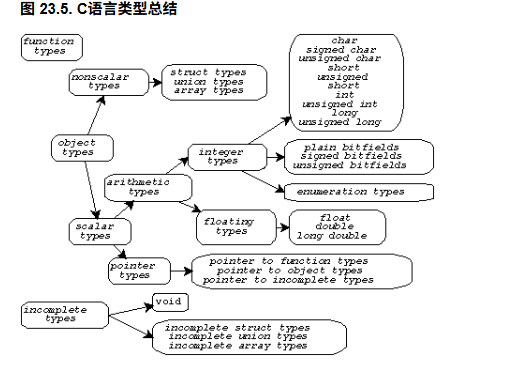

C语言的类型分为**函数类型、对象类型和不完全类型**三大类。对象类型又分为标量类型和非标量类型。指针类型属于标量类型，因此也可以做逻辑与、或、非运算的操作数和`if`、`for`、`while`的控制表达式，`NULL`指针表示假，非`NULL`指针表示真。不完全类型是暂时没有完全定义好的类型，编译器不知道这种类型该占几个字节的存储空间，例如：

```c
struct s;
union u;
char str[];
```

具有不完全类型的变量可以通过多次声明组合成一个完全类型，比如数组`str`声明两次：

```
char str[];
char str[10];
```

当编译器碰到第一个声明时，认为`str`是一个不完全类型，碰到第二个声明时`str`就组合成完全类型了，如果编译器处理到程序文件的末尾仍然无法把`str`组合成一个完全类型，就会报错。读者可能会想，这个语法有什么用呢？为何不在第一次声明时就把`str`声明成完全类型？有些情况下这么做有一定的理由，比如第一个声明是写在头文件里的，第二个声明写在`.c`文件里，这样如果要改数组长度，只改`.c`文件就行了，头文件可以不用改。

**不完全的结构体类型有重要作用**：

```c
struct s {
	struct t *pt;
};

struct t {
	struct s *ps;
};
```

`struct s`和`struct t`各有一个指针成员指向另一种类型。编译器从前到后依次处理，当看到`struct s { struct t* pt; };`时，认为`struct t`是一个不完全类型，`pt`是一个指向不完全类型的指针，尽管如此，这个指针却是完全类型，因为不管什么指针都占4个字节存储空间，这一点很明确。然后编译器又看到`struct t { struct s *ps; };`，这时`struct t`有了完整的定义，就组合成一个完全类型了，`pt`的类型就组合成一个指向完全类型的指针。由于`struct s`在前面有完整的定义，所以`struct s *ps;`也定义了一个指向完全类型的指针。

这样的类型定义是错误的：

```
struct s {
	struct t ot;
};

struct t {
	struct s os;
};
```

编译器看到`struct s { struct t ot; };`时，认为`struct t`是一个不完全类型，无法定义成员`ot`，因为不知道它该占几个字节。

所以**结构体中可以递归地定义指针成员，但不能递归地定义变量成员**，你可以设想一下，假如允许递归地定义变量成员，`struct s`中有一个`struct t`，`struct t`中又有一个`struct s`，`struct s`又中有一个`struct t`，这就成了一个无穷递归的定义。

以上是两个结构体构成的递归定义，一个结构体也可以递归定义：

```
struct s {
	char data[6];
	struct s* next;
};
```

当编译器处理到第一行`struct s {`时，认为`struct s`是一个不完全类型，当处理到第三行`struct s *next;`时，认为`next`是一个指向不完全类型的指针，当处理到第四行`};`时，`struct s`成了一个完全类型，`next`也成了一个指向完全类型的指针。类似这样的结构体是很多种数据结构的基本组成单元，如链表、二叉树等，我们将在后面详细介绍。下图示意了由几个`struct s`结构体组成的链表，这些结构体称为链表的节点（Node）。

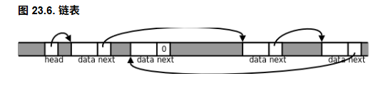

`head`指针是链表的头指针，指向第一个节点，每个节点的`next`指针域指向下一个节点，最后一个节点的`next`指针域为`NULL`，在图中用0表示。

### 复杂声明

可以想像得到，如果把指针和数组、函数、结构体层层组合起来可以构成非常复杂的类型，下面看几个复杂的声明。

```
typedef void (*sighandler_t)(int);
sighandler_t signal(int signum, sighandler_t handler);
```

这个声明来自`signal(2)`。`sighandler_t`是一个函数指针，它所指向的函数带一个参数，返回值为`void`，`signal`是一个函数，它带两个参数，一个`int`参数，一个`sighandler_t`参数，返回值也是`sighandler_t`参数。如果把这两行合成一行写，就是：

```
void (*signal(int signum, void (*handler)(int)))(int);
```

在分析复杂声明时，要借助`typedef`把复杂声明分解成几种基本形式：

- `T *p;`，`p`是指向`T`类型的指针。
- `T a[];`，`a`是由`T`类型的元素组成的数组，但有一个例外，如果`a`是函数的形参，则相当于`T *a;`
- `T1 f(T2, T3...);`，`f`是一个函数，参数类型是`T2`、`T3`等等，返回值类型是`T1`。


我们分解一下这个复杂声明：

```
int (*(*fp)(void *))[10];
```


1、`fp`和`*`号括在一起，说明`fp`是一个指针，指向`T1`类型：

```
typedef int (*T1(void *))[10];
T1 *fp;
```

2、`T1`应该是一个函数类型，参数是`void *`，返回值是`T2`类型：

```
typedef int (*T2)[10];
typedef T2 T1(void *);
T1 *fp;
```

3、`T2`和`*`号括在一起，应该也是个指针，指向`T3`类型：

```
typedef int T3[10];
typedef T3 *T2;
typedef T2 T1(void *);
T1 *fp;
```

显然，`T3`是一个`int`数组，由10个元素组成。分解完毕。

# 第 24 章 函数接口

## 1. 本章的预备知识

### 1.1. `strcpy`与`strncpy`

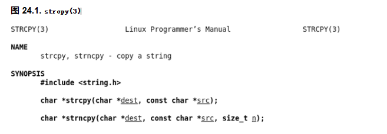

这个Man Page描述了两个函数，`strcpy`和`strncpy`，敲命令`man strcpy`或者`man strncpy`都可以看到这个Man Page。这两个函数的作用是把一个字符串拷贝给另一个字符串。**SYNOPSIS**部分给出了这两个函数的原型，以及要用这些函数需要包含哪些头文件。参数`dest`、`src`和`n`都加了下划线，有时候并不想从头到尾阅读整个Man Page，而是想查一下某个参数的含义，通过下划线和参数名就能很快找到你关心的部分。

`dest`表示Destination，`src`表示Source，看名字就能猜到是把`src`所指向的字符串拷贝到`dest`所指向的内存空间。这一点从两个参数的类型也能看出来，`dest`是`char *`型的，而`src`是`const char *`型的，说明`src`所指向的内存空间在函数中只能读不能改写，而`dest`所指向的内存空间在函数中是要改写的，显然改写的目的是当函数返回后调用者可以读取改写的结果。因此可以猜到`strcpy`函数是这样用的：

```c
char buf[10];
strcpy(buf, "hello");
printf(buf);
```

至于`strncpy`的参数`n`是干什么用的，单从函数接口猜不出来，就需要看下面的文档。

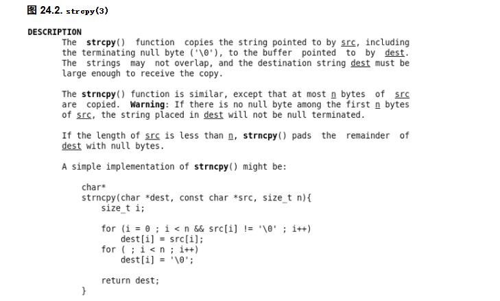

在文档中强调了`strcpy`在拷贝字符串时会把结尾的`'\0'`也拷到`dest`中，因此保证了`dest`中是以`'\0'`结尾的字符串。但另外一个要注意的问题是，`strcpy`只知道`src`字符串的首地址，不知道长度，它会一直拷贝到`'\0'`为止，所以`dest`所指向的内存空间要足够大，否则有可能写越界，例如：

```c
char buf[10];
strcpy(buf, "hello world");
```

如果没有保证`src`所指向的内存空间以`'\0'`结尾，也有可能读越界，例如：

```c
char buf[10] = "abcdefghij", str[4] = "hell";
strcpy(buf, str);
//因为str长度只有4，所以\0并不在
```

因为`strcpy`函数的实现者通过函数接口无法得知`src`字符串的长度和`dest`内存空间的大小，所以“确保不会写越界”应该是调用者的责任，调用者提供的`dest`参数应该指向足够大的内存空间，“确保不会读越界”也是调用者的责任，调用者提供的`src`参数指向的内存应该确保以`'\0'`结尾。

此外，文档中还强调了`src`和`dest`所指向的内存空间不能有重叠。凡是有指针参数的C标准库函数基本上都有这条要求，每个指针参数所指向的内存空间互不重叠，例如这样调用是不允许的：

```
char buf[10] = "hello";
strcpy(buf, buf+1);
```

`strncpy`的参数`n`指定**最多**从`src`中拷贝`n`个字节到`dest`中，换句话说，如果拷贝到`'\0'`就结束，如果拷贝到`n`个字节还没有碰到`'\0'`，那么也结束，调用者负责提供适当的`n`值，以确保读写不会越界，比如让`n`的值等于`dest`所指向的内存空间的大小：

```
char buf[10];
strncpy(buf, "hello world", sizeof(buf));
```

然而这意味着什么呢？文档中特别用了**Warning**指出，这意味着`dest`有可能不是以`'\0'`结尾的。例如上面的调用，虽然把`"hello world"`截断到10个字符拷贝至`buf`中，但`buf`不是以`'\0'`结尾的，如果再`printf(buf)`就会读越界。如果你需要确保`dest`以`'\0'`结束，可以这么调用：

```
char buf[10];
strncpy(buf, "hello world", sizeof(buf));
buf[sizeof(buf)-1] = '\0';
```

`strncpy`还有一个特性，如果`src`字符串全部拷完了不足`n`个字节，那么还差多少个字节就补多少个`'\0'`，但是正如上面所述，这并不保证`dest`一定以`'\0'`结束，当`src`字符串的长度大于`n`时，不但不补多余的`'\0'`，连字符串的结尾`'\0'`也不拷贝。`strcpy(3)`的文档已经相当友好了，为了帮助理解，还给出一个`strncpy`的简单实现。

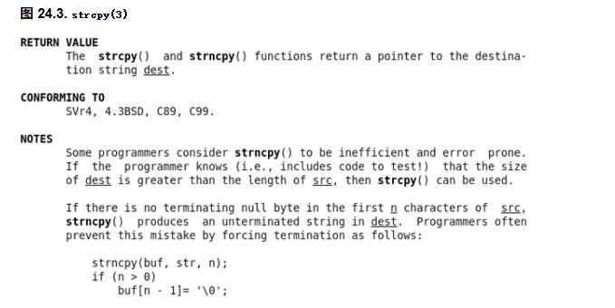

函数的Man Page都有一部分专门讲返回值的。这两个函数的返回值都是`dest`指针。可是为什么要返回`dest`指针呢？`dest`指针本来就是调用者传过去的，再返回一遍`dest`指针并没有提供任何有用的信息。之所以这么规定是为了把函数调用当作一个指针类型的表达式使用，比如`printf("%s\n", strcpy(buf, "hello"))`，一举两得，如果`strcpy`的返回值是`void`就没有这么方便了。

**CONFORMING TO**部分描述了这个函数是遵照哪些标准实现的。`strcpy`和`strncpy`是C标准库函数，当然遵照C99标准。以后我们还会看到`libc`中有些函数属于POSIX标准但并不属于C标准，例如`write(2)`。

**NOTES**部分给出一些提示信息。这里指出如何确保`strncpy`的`dest`以`'\0'`结尾，和我们上面给出的代码类似，但由于`n`是个变量，在执行`buf[n - 1]= '\0';`之前先检查一下`n`是否大于0，如果`n`不大于0，`buf[n - 1]`就访问越界了，所以要避免。

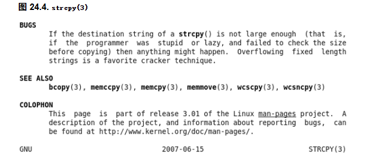

**BUGS**部分说明了使用这些函数可能引起的Bug，这部分一定要仔细看。用`strcpy`比用`strncpy`更加不安全，如果在调用`strcpy`之前不仔细检查`src`字符串的长度就有可能写越界，这是一个很常见的错误，例如：

```
void foo(char *str)
{
	char buf[10];
	strcpy(buf, str);
	...
}
```

`str`所指向的字符串有可能超过10个字符而导致写越界，在[第 4 节 “段错误”](http://akaedu.github.io/book/ch10s04.html#gdb.segfault)我们看到过，这种写越界可能当时不出错，而在函数返回时出现段错误，原因是写越界覆盖了保存在栈帧上的返回地址，函数返回时跳转到非法地址，因而出错。

像`buf`这种由调用者分配并传给函数读或写的一段内存通常称为缓冲区（Buffer），缓冲区写越界的错误称为缓冲区溢出（Buffer Overflow）。如果只是出现段错误那还不算严重，更严重的是缓冲区溢出Bug经常被恶意用户利用，使函数返回时跳转到一个事先设好的地址，执行事先设好的指令，如果设计得巧妙甚至可以启动一个Shell，然后随心所欲执行任何命令，可想而知，如果一个用`root`权限执行的程序存在这样的Bug，被攻陷了，后果将很严重。至于怎样巧妙设计和攻陷一个有缓冲区溢出Bug的程序，有兴趣的读者可以参考[[SmashStack\]](http://akaedu.github.io/book/bi01.html#bibli.smashstack)。

> 1、自己实现一个`strcpy`函数，尽可能简洁，按照本书的编码风格你能用三行代码写出函数体吗？
>
> 2、编一个函数，输入一个字符串，要求做一个新字符串，把其中所有的一个或多个连续的空白字符都压缩为一个空格。这里所说的空白包括空格、'\t'、'\n'、'\r'。例如原来的字符串是：
>
> ```
> This Content hoho       is ok
>         ok?
> 
>         file system
> uttered words   ok ok      ?
> end.
> ```
>
> 压缩了空白之后就是：
>
> ```
> This Content hoho is ok ok? file system uttered words ok ok ? end.
> ```
>
> 实现该功能的函数接口要求符合下述规范：
>
> ```
> char *shrink_space(char *dest, const char *src, size_t n);
> ```
>
> 各项参数和返回值的含义和`strncpy`类似。完成之后，为自己实现的函数写一个Man Page。

1、

本来是这么写的

```c
char *strcpy(char *dest, const char *str){
    for(int i = 0; str[i] != '\0'; i++)
        dest[i] = str[i];
    return dest;
}
```

但是发现这样dest一定没有\0，所以改成下面这种

```c
char *strcpy(char *dest, const char *str){
    int i = 0;
    while((dest[i] = str[i]) != '\0')i++;
    return dest;
}
```

2、

```c
char *shrink_space(char *dest, const char *src, size_t n){
    size_t idx = 0;
    int flag = 1; 	//用于检验当前是否第一次遇到空白
    for(size_t i = 0; idx < n && src[i] != '\0'; i++){
        if(src[i] != ' ' && src[i] != '\t' && src[i] != '\n' && src[i] != '\r'){	//字母
            dest[idx++] = src[i];
            flag = 1;
        } else if(flag){	//空白且第一次
            dest[idx++] = ' ';
            flag = 0;
        }
    }
    for(;idx < n; idx++){
        dest[idx] = '\0';
    }
    return dest;
}
```

Man Page：

shrink_space

**NAME**

shrink_space  - shrink string's space

**SYNOPSIS**

char *shrink_space(char *dest, const char *src, size_t n)

**DESCRIPTION**

shrink_space()函数可以将连续的空白符(空格、'\t'、'\n'、'\r')压缩成一个空格，压缩的结果，长度最长为n，若不到n后面用'\0'填充。注意这个函数也不会关注写越界和读越界，需要调用者自己注意。

**RETURN VALUE**

返回dest的指针

**NOTES**

注意使用后也要确保字符串最后一位是'\0'

**BUGS**

注意一定一确保dest的长度要大于str，否则可能会发送写越界
