# 数字逻辑电路基础

## 晶体管


主要是CMOS部分


> 注意pMOS带圆圈，栅极与源极电压差大时导通，也就是和上方比电压
>
> nMOS不带圆圈，也是栅极与源极电压差大时导通，但是和下方比电压

## 通过晶体管搭建门电路

### 非门

上图就是非门，会将输入取反


### 与非门


> 主要就是模拟输入端AB的所有情况，列出输出Y的所有结果判断是什么门电路。为了得到Y的结果，在过程中也需要记录N和P的结果

|  A   |  B   |  P1  |  P2  |  N1  |  N2  |  Y   |
| :--: | :--: | :--: | :--: | :--: | :--: | :--: |
|  0   |  0   | 导通 | 导通 | 截止 | 截止 |  1   |
|  0   |  1   | 导通 | 截止 | 截止 | 导通 |  1   |
|  1   |  0   | 截止 | 导通 | 导通 | 截止 |  1   |
|  1   |  1   | 截止 | 截止 | 导通 | 导通 |  0   |

### 与门

就是在与非门原来的Y处后面接个非门


|  A   |  B   |  P1  |  P2  | P3   |  N1  |  N2  | N3   |  Y   |
| :--: | :--: | :--: | :--: | ---- | :--: | :--: | ---- | :--: |
|  0   |  0   | 导通 | 导通 | 截止 | 截止 | 截止 | 导通 |  0   |
|  0   |  1   | 导通 | 截止 | 截止 | 截止 | 导通 | 导通 |  0   |
|  1   |  0   | 截止 | 导通 | 截止 | 导通 | 截止 | 导通 |  0   |
|  1   |  1   | 截止 | 截止 | 导通 | 导通 | 导通 | 截止 |  1   |


### 或非门


|  A   |  B   |  P1  |  P2  |  N1  |  N2  |  Y   |
| :--: | :--: | :--: | :--: | :--: | :--: | :--: |
|  0   |  0   | 导通 | 导通 | 截止 | 截止 |  1   |
|  0   |  1   | 导通 | 截止 | 截止 | 导通 |  0   |
|  1   |  0   | 截止 | 导通 | 导通 | 截止 |  0   |
|  1   |  1   | 截止 | 截止 | 导通 | 导通 |  0   |

通过以上表格可以看出这是一个或非门

### 或门

晶体管结构如下图

其实就是上面的或非门加上个非门


|  A   |  B   |  P1  |  P2  | P3   |  N1  |  N2  | N3   |  Y   |
| :--: | :--: | :--: | :--: | ---- | :--: | :--: | ---- | :--: |
|  0   |  0   | 导通 | 导通 | 截止 | 截止 | 截止 | 导通 |  0   |
|  0   |  1   | 导通 | 截止 | 导通 | 截止 | 导通 | 截止 |  1   |
|  1   |  0   | 截止 | 导通 | 导通 | 导通 | 截止 | 截止 |  1   |
|  1   |  1   | 截止 | 截止 | 导通 | 导通 | 导通 | 截止 |  1   |

### 三输入与非门

与非门不止有两个输入的，还可以有更多输入，下面是3个输入的情况


可以通过一个与门和一个与非门实现，也可以只使用晶体管重新设计实现


在不考虑面积的情况下，前者需要6+4=10个晶体管，后者只需要6个晶体管

### 异或门

不相同输出1，相同输出0


> ### 真值表到逻辑表达式的转换
>
> 看真值表的表项，是1就写本身，是0就写本身的取反
>
> 将所有的表项与起来
>
> 最后将输出为1的结构或一下
>
> 如下图
>
> 

依照上述结果可以简单的通过与门和或门实现


共使用6\*2+2\*2+6=22个晶体管

#### 异或门的优化

可以使用或非门和与门来实现

其逻辑表达式可转化为(A & B) NOR (A NOR B)

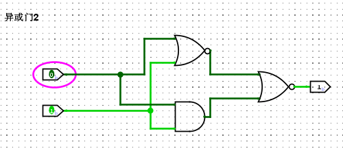

#### 异或门的全定制电路

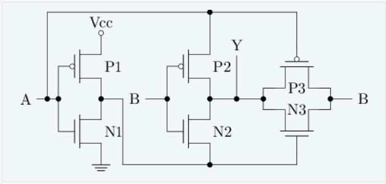

它在最后使用了一个传输门，当A是1时，传输门关闭，只考虑左侧的B即可，是0则上侧导通就输出1，是0则下侧导通输出0

当A是0时，右侧电路N2下方是高电平，P2上方是低电平，无论左侧的B是0还是1都不会影响Y的值。但此时右侧的传输门是联通的，Y值与右侧的B完全相同。

> 注意，我的理解传输门是双向联通的，但是logisim里却好像有方向，是单向联通，所以必须使得箭头向左才能实现。如下图，上面是对的。好像在这里只能让它从**源极流向漏极**
>
> 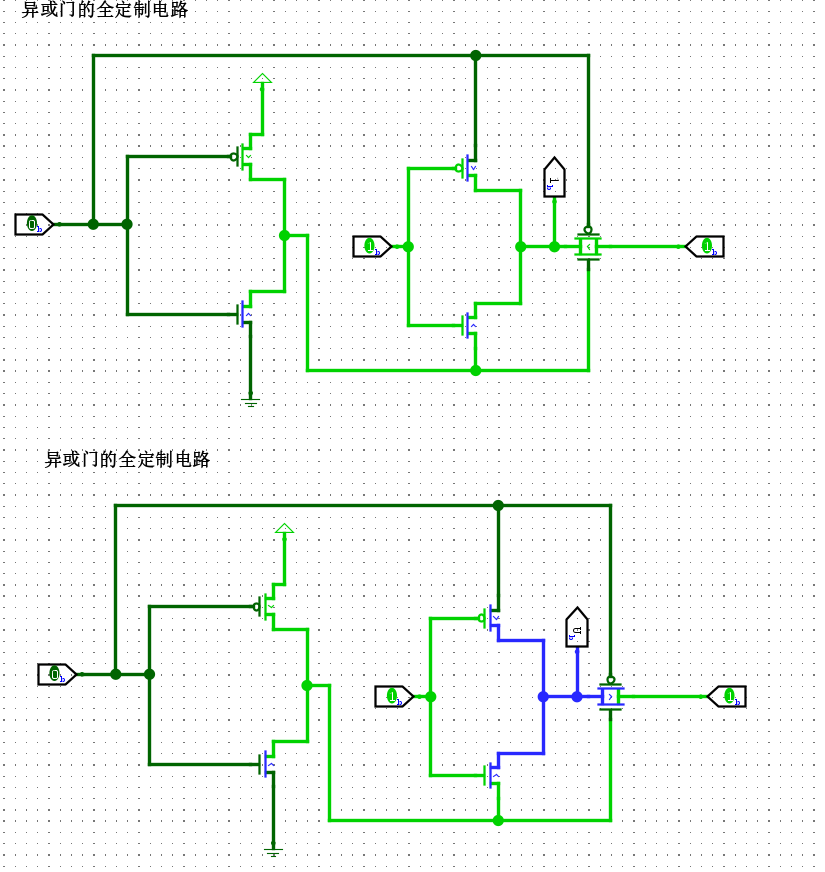

### 同或门

相同输出1，不同输出0

最简单的实现和就是异或的取反


或者按照查真值表构建表达式的方式构建如下，可以省一个非门


> 上述描述方式是错的，第一个同或门使用或非门实现反而更省晶体管。。

#### 同或门的全定制电路

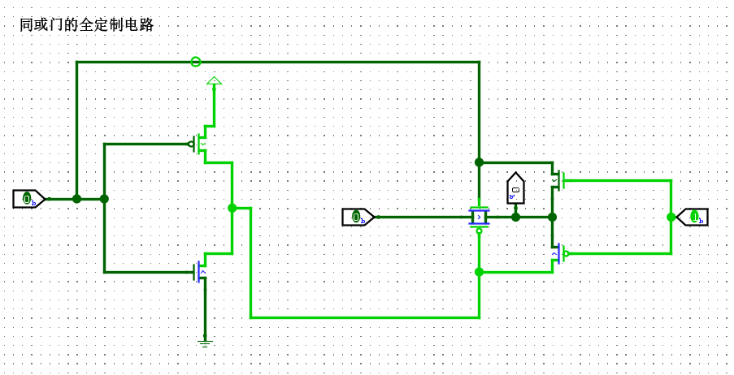

就是将异或门的反过来

## 进位计数法

2进制和16进制都比较熟悉了

下面稍微考虑一下8进制转换

8进制转换成2进制只需要把每一位转换成3位2进制即可

2进制转换成8进制只需要把每3位转换成1位8进制即可，不够的高位补0

8进制转10进制，只需要按位数去乘以权值即可，如最低位就乘以8的0次方，第二位就乘以8的1次方，再加起来就行了

10进制转8进制，可以先转2再转8，或者和转2进制意义，每次除以8，把余数存下来，倒着排列即可。如20转换，商2余4，然后2再除以8，商0余2。最后结果就是24，

## 通过门电路搭建基本组合逻辑电路

### 译码器

2-4译码器，写出真值表，通过与门和非门即可实现

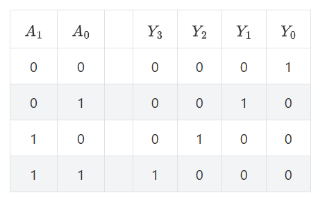

在logisim中设计如下，可以使用子电路保存下来


3-8译码器可以通过4个2-4译码器实现

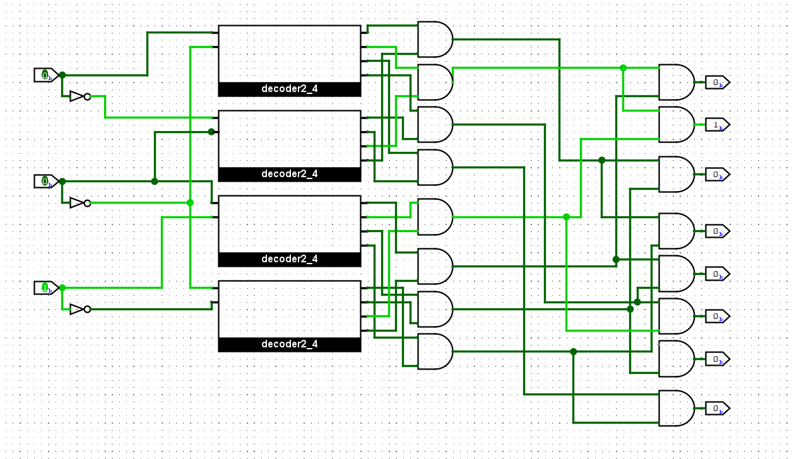

(但是感觉这样好像不是很对，加了好多门电路，但是功能是对的)

> 看了下由2个2-4译码器即可。。但是需要增加使能信号才行，暂且先不管吧

#### 转码器

主要是将一种输入转换成另一种输出，余译码器的不同在于输出不止一个1，不是one-hot类型的

主要看七段数码管译码器吧

> 0：abcdef
>
> 1：bc
>
> 2：abdeg
>
> 3：abcdg
>
> 4：bcfg
>
> 5：acdfg
>
> 6：acdefg
>
> 7：abc
>
> 8：abcdefg
>
> 9：abcdfg
>
> 所以说
>
> a：02356789
>
> b：01234789
>
> c：013456789
>
> d：0235689
>
> e：0268
>
> f：045689
>
> g：2345689
>
> 即可构建或门了，下图实现了0-9
>
> 
>
> 对16位的：
>
> A：abcefg
>
> b：cdefg
>
> C：adef
>
> d：bcdeg
>
> E：adefg
>
> F：aefg
>
> 所以说更新为
>
> a：02356789ACEF
>
> b：01234789AD
>
> c：013456789ABD
>
> d：0235689BCDE
>
> e：0268ABCDEF
>
> f：045689ABCEF
>
> g：2345689ABDEF
>
> 实现如下
>
> 

### 编码器

它的功能与译码器相反，是将2^n^ 位独热嘛转换成n位2进制数

**当输入不为独热码时，输出未定义**

> 16-4编码器
>
> 第一位：89abcdef
>
> 第二位：4567cdef
>
> 第三位：2367abef
>
> 第四位：13579bdf
>
> 然后采用或门加实现即可，右边的seven_segment_circuit16是上面实现电路构建的子电路，输入为4位宽，所以需要通过一下集线器
>
> 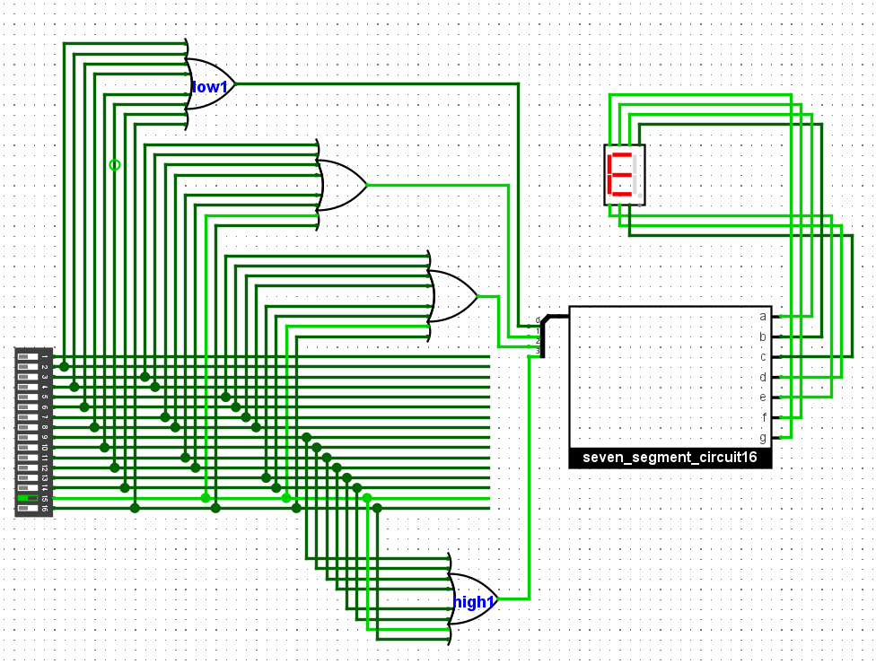

#### 优先编码器

当输入有多个1时，优先输出高位的结果

> 4-2优先编码器的真值表如下
>
> 
>
> | $A_3$ | $A_2$ | $A_1$ | $A_0$ |      | $Y_1$ | $A_0$ |
> | :---: | :---: | :---: | :---: | :--: | :---: | :---: |
> |   0   |   0   |   0   |   1   |      |   0   |   0   |
> |   0   |   0   |   1   |   0   |      |   0   |   1   |
> |   0   |   0   |   1   |   1   |      |   0   |   1   |
> |   0   |   1   |   0   |   0   |      |   1   |   0   |
> |   0   |   1   |   0   |   1   |      |   1   |   0   |
> |   0   |   1   |   1   |   0   |      |   1   |   0   |
> |   0   |   1   |   1   |   1   |      |   1   |   0   |
> |   1   |   0   |   0   |   0   |      |   1   |   1   |
> |   1   |   0   |   0   |   1   |      |   1   |   1   |
> |   1   |   0   |   1   |   0   |      |   1   |   1   |
> |   1   |   0   |   1   |   1   |      |   1   |   1   |
> |   1   |   1   |   0   |   0   |      |   1   |   1   |
> |   1   |   1   |   0   |   1   |      |   1   |   1   |
> |   1   |   1   |   1   |   0   |      |   1   |   1   |
> |   1   |   1   |   1   |   1   |      |   1   |   1   |
> |   0   |   0   |   0   |   0   |      |   X   |   X   |
>
> 可以通过与门来实现，0001输出00，001_输出01，01__输出10，1输出11，如下图
>
> 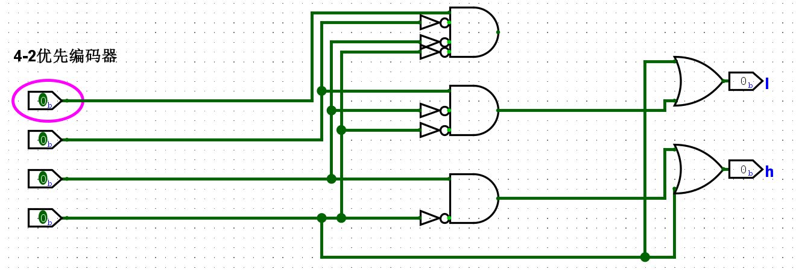
>
> 但是发现0001的与门完全没用。。可以变成这样
>
> 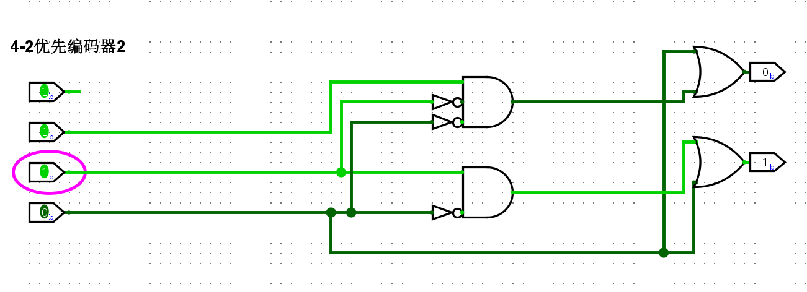
>
> 而普通的4-2编码器如下
>
> 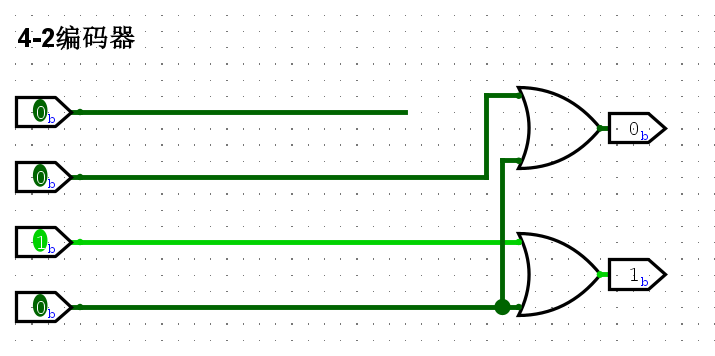
>
> 可以看出优先编码器需要多用2个与门和3个非门
>
> ..发现还可以更少一些
>
> 

### 多路选择器

可以根据控制端的输入来从多个数据端中选择一路进行输出。也叫"多路复用器", 或简称"选择器"

> #### 1位2选1选择器
>
> 根据控制端的输入从两路1位的数据中选择一路进行输出
>
> 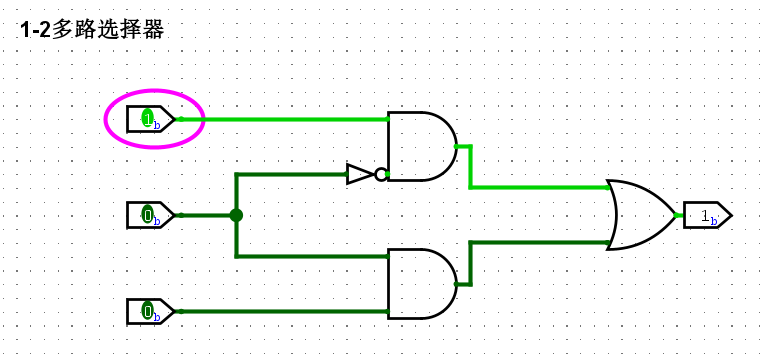

> #### 3位4选1选择器
>
> 注意所有门的输入位数都选择3位
>
> 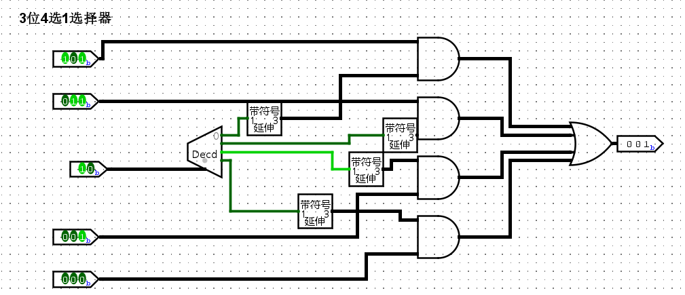

> #### 可切换进位计数制的七段数码管
>
> 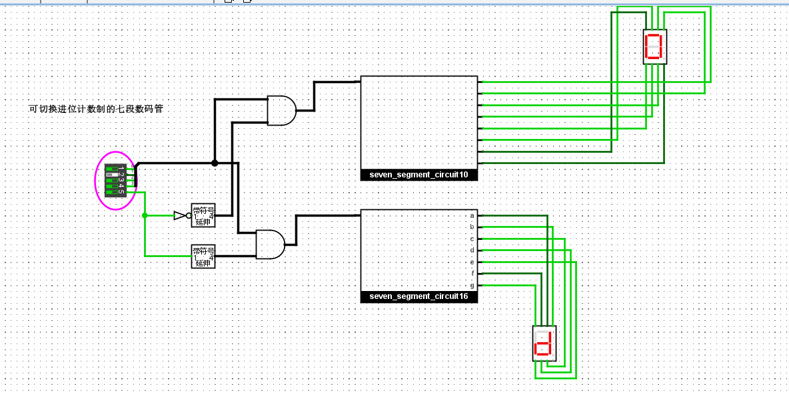
>
> 只能让另一个进制的显示为0，不能不显示。。

### 比较器

用于比较两组输入是否相同

> #### 4位比较器
>
> 
>
> 使用同或门加上与门实现即可

### 加法器

#### 半加器

真值表如下

|  A   |  B   |  S   |  C   |
| :--: | :--: | :--: | :--: |
|  0   |  0   |  0   |  0   |
|  0   |  1   |  1   |  0   |
|  1   |  0   |  1   |  0   |
|  1   |  1   |  0   |  1   |

S是和，C是进位

S=A^B,C=A&B

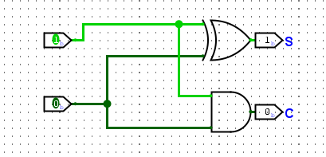

#### 全加器

|  A   |  B   | Cin  |  S   | Cout |
| :--: | :--: | :--: | :--: | :--: |
|  0   |  0   |  0   |  0   |  0   |
|  0   |  1   |  0   |  1   |  0   |
|  1   |  0   |  0   |  1   |  0   |
|  1   |  1   |  0   |  0   |  1   |
|  0   |  0   |  1   |  1   |  0   |
|  0   |  1   |  1   |  0   |  1   |
|  1   |  0   |  1   |  0   |  1   |
|  1   |  1   |  1   |  1   |  1   |

所以S=A\^B\^C，Cout= A&B | Cin&(A|B)

> #### 1位全加器的直接实现
>
> 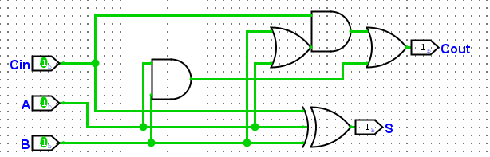
>
> **注意异或门要修改设置为奇数个输入为真**
>
> 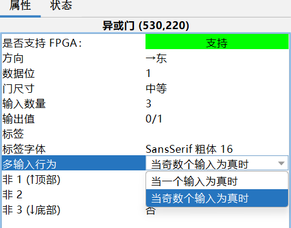

> #### 通过半加器实现全加器
>
> 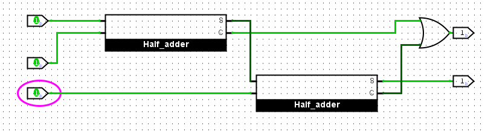

#### 多位加法器

将多个全加器组合起来就可以得到多位加法器了

这种多位加法器称为"行波进位加法器"(Ripple-Carry Adder, RCA), 因为计算过程中产生的进位就像波浪一样从低位向高位传播.

**第一个因为没有进位所以，可以使用半加器来实现**

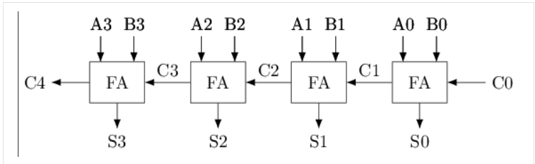

> ####  搭建4位加法器
>
> 用七段数码管按十六进制显示加法器的两个输入和结果, 并用一个LED灯指示加法结果是否产生进位. 
>
> 

### 减法器

为了实现与负数原码的加法，需要先实现减法器

#### 半减器

下面来考虑一下半减器的真值表，其中A为被减数，B为减数，D为结果，B为借位

| A    | B    | D    | Bo   |
| ---- | ---- | ---- | ---- |
| 0    | 0    | 0    | 0    |
| 0    | 1    | 1    | 1    |
| 1    | 0    | 1    | 0    |
| 1    | 1    | 0    | 0    |

则D=A^B，Bo=~A&B，如下图

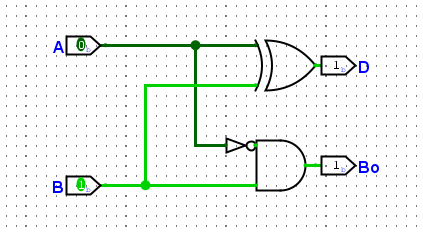

#### 全减器

对于全减器

输入为A，B，上一级的借位Bin，输出为D，借位Bout，真值表如下

| A    | B    | Bin  | D    | Bout |
| ---- | ---- | ---- | ---- | ---- |
| 0    | 0    | 0    | 0    | 0    |
| 0    | 1    | 0    | 1    | 1    |
| 1    | 0    | 0    | 1    | 0    |
| 1    | 1    | 0    | 0    | 0    |
| 0    | 0    | 1    | 1    | 1    |
| 0    | 1    | 1    | 0    | 1    |
| 1    | 0    | 1    | 0    | 0    |
| 1    | 1    | 1    | 1    | 1    |

D=A\^B\^C，Bout=\~Bin&(\~A&B) | Bin&(\~A|B)可以这么实现

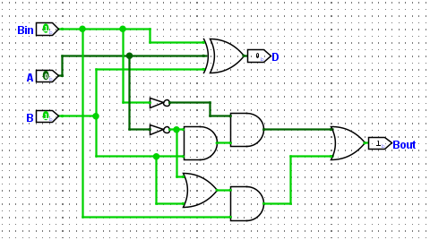

也可以通过半减器来实现

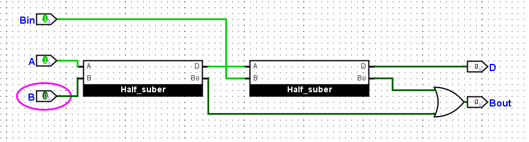

#### 多位加法器

和多位加法器一样，把多个全减器组合起来即可

这是一个四位减法器


## 整数的机器级表示

### 原码

sign-and-magnitude，最高位表示符号位, 0表示正数, 1表示负数, 其余位表示对应真值的绝对值

考虑采用8位的RCA进行原码加法:

```text
 0b00000111 (7)     0b10000111 (-7)     0b10000111 (-7)    0b00000111 (7)
+0b00100010 (34)   +0b10100010 (-34)   +0b00100010 (34)   +0b10000111 (-7)
-----------        -----------         -----------        -----------
 0b00101001 (41)    0b00101001 (41)     0b10101001 (-41)   0b10001110 (-14)
```

通过上述观察, 我们可以得出以下结论:

- 当两数皆为正数时, 通过RCA进行加法所得的结果按原码解释, 与将两数按原码解释后得到的结果在数学意义上相加, 两者一致. 因此, 在这种情况下, 可以直接通过RCA进行原码加法.
- 当两数为负时, RCA所得结果与数学意义不符, 区别在于符号位. 因此, 在这种情况下, 电路需要对符号位进行特殊处理.
- 当仅有一数为负时, RCA所得结果与数学意义不符, 不仅符号位有可能错误, 绝对值也错误. 因此, 在这种情况下, 不能使用RCA进行原码加法.

事实上, 在数学意义上计算第三种情况时, 应该让绝对值较大的一方减去另一方, 符号取绝对值较大的一方. 这意味着, 为了计算原码加法, 电路上还需要设计一个减法器, 然后根据两数符号和绝对值的情况, 选择出正确的处理结果.

> ### 4位减法器
>
> 用七段数码管按十六进制显示减法器的两个输入和结果, 并用一个LED灯指示减法结果是否产生借位.
>
> 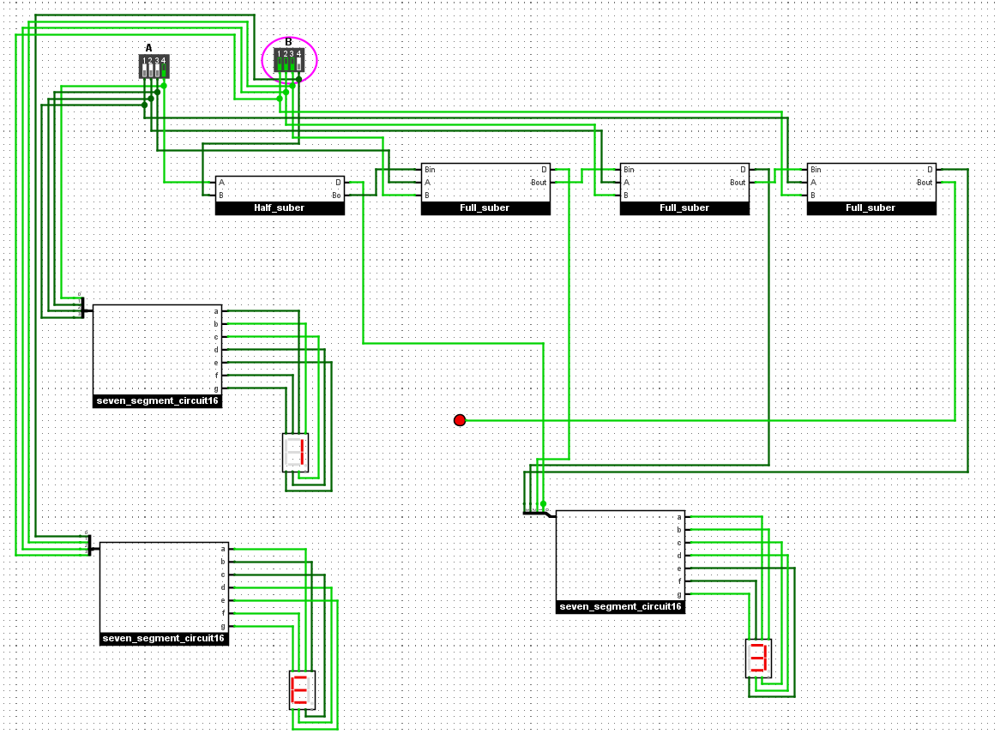

#### 4位原码减法器

> **此设计不考虑溢出，仅进行低3位的真值计算，以及正确的符号位**
>
> 考虑上面说的3种情况，其实主要是根据AB的符号位来考虑，我们可以用2-4译码器来分类，输入是AB的符号位
>
> 当00时，两数直接通过4位加法器相加即可，输出结果符号位置0
>
> 当11时，也直接相加，但是注意只有低3位参与，符号位置1
>
> ,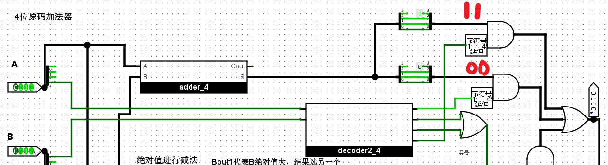
>
> 当10或11时，计算对低三位分别计算A-B和B-A，若A-B的借位为1，说明B大，若B-A的借位为1，说明A大
>
> 然后选择借位为0的减法器结果作为真值，并选择对应的符号位作为结果
>
> 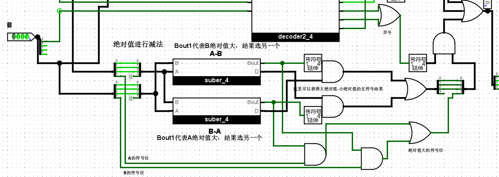
>
> 整体如下
>
> 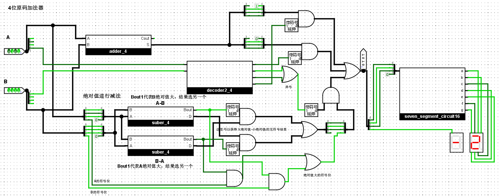

### 反码

one's complement，对于正数和`0`, 其表示与原码一致; 对于负数, 其表示为相应相反数的原码的按位取反. 

考虑采用8位的RCA进行反码加法:

```text
 0b00000111 (7)     0b11111000 (-7)     0b11111000 (-7)    0b00000111 (7)
+0b00100010 (34)   +0b11011101 (-34)   +0b00100010 (34)   +0b11111000 (-7)
-----------        -----------         -----------        -----------
 0b00101001 (41)    0b11010101 (-42)    0b00011010 (26)    0b11111111 (-0)
```

通过上述观察, 我们可以得出以下结论:

- 当两数皆为正数时, 通过RCA进行加法所得的结果按反码解释, 与将两数按反码解释后得到的结果在数学意义上相加, 两者一致. 因此, 在这种情况下, 可以直接通过RCA进行反码加法.
- 当有一数为负时, RCA所得结果与数学意义不符, 虽然符号位正确, 但绝对值部分不正确
- 特别地, 当互为相反数的两数相加时, 根据反码的定义, 结果总是`0b11111111`. 按反码解释, 所得结果的真值为`-0`, 如果将其看成数学意义上的`0`, 则RCA结果正确.

但是, 让`-0`作为RCA的输入进行计算, 则又会得到不正确的结果:

```text
 0b00000111 (7)     0b11111000 (-7)
+0b11111111 (-0)   +0b11111111 (-0)
-----------        -----------
 0b00000110 (6)     0b11110111 (-8)
```

上述例子说明, 不能直接使用RCA计算反码加法. 为了计算反码加法, 一种方式是先将反码转换为真值等价的原码, 然后使用原码加法器计算结果, 再将结果转换为真值等价的反码.

#### 反码加法器

> 第一种反码加法器，将反码码转化成原码，再复用上面的补码加法器
>
> 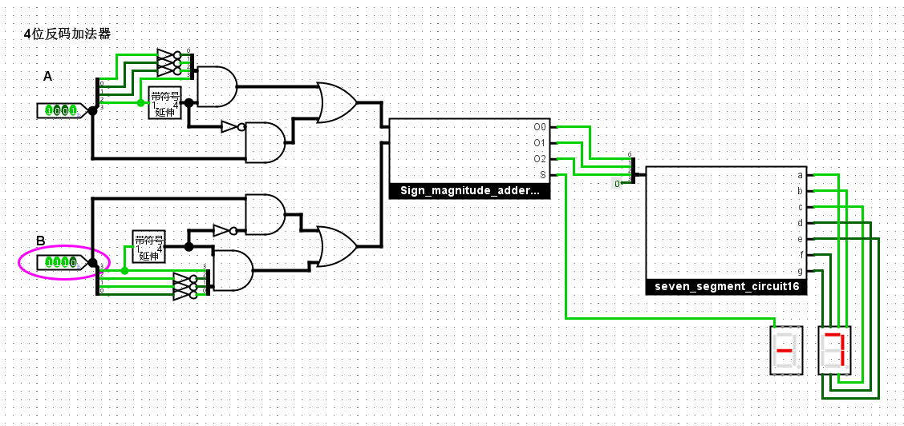

> 第二种直接实现的反码加法器
>
> 本来用瞪眼法，以为是结果是负数就给绝对值-1，结果为正就给绝对值+1
>
> 但是发现不对，有的正负计算后值也是对的。。
>
> 查了下发现，当发生进位时会出现问题，只要将进位加到结果里就好了
>
> 所以有下图
>
> 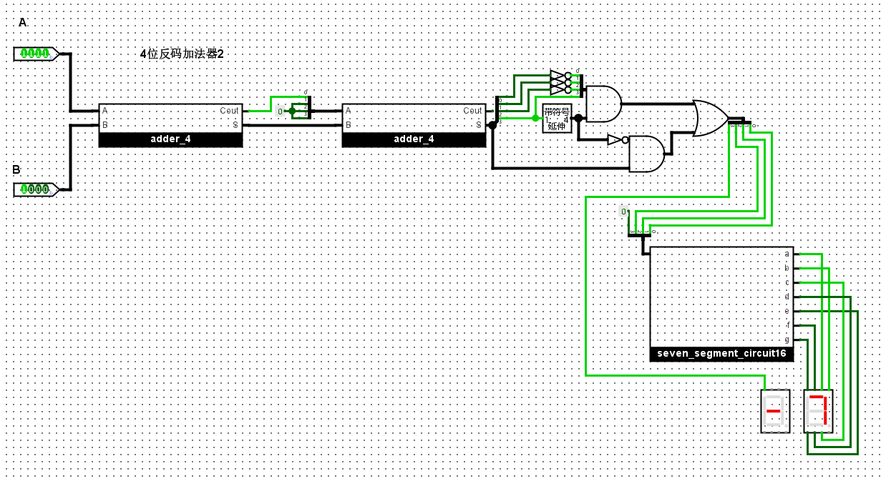

### 补码

two's complement

对于正数和`0`, 其表示与原码一致; 对于负数, 其表示为相应相反数的原码的按位取反后加`1`

用RCA计算补码加法时, 即使输入包含负数, RCA所得结果仍然符合数学意义. 这意味着, 我们也可以用RCA来计算补码的减法. 这是因为在数学意义上, `A-B=A+(-B)`, 但我们已经说明了, 无论`A`和`B`为何值, RCA所得结果都符合数学意义。可以来看补码的时钟模型

```text
              0000 (0)
      (-1) 1111  0001 (1)
   (-2) 1110   ^    0010 (2)
 (-3) 1101     |      0011 (3)
(-4) 1100      +       0100 (4)
 (-5) 1011            0101 (5)
   (-6) 1010        0110 (6)
      (-7) 1001  0111 (7)
              1000 (-8)
```


### 溢出检测

补码直接用行波加法器就可以实现加减法了，但是仍有问题，可能会发生溢出，即正数+正数=负数或者负数+负数=正数

所以只需要考虑符号位的加法情况, 即可检查是否发生溢出. 符号位的加法也是通过全加器来进行的, 因此我们可以考虑全加器的真值表:

| $A_{n-1}$ | $B_{n-1}$ | $C_{n-1}$ |      | $C_{n}$ | $S_{n-1}$ | 溢出 |
| :-------: | :-------: | :-------: | :--: | :-----: | :-------: | :--: |
|     0     |     0     |     0     |      |    0    |     0     |  否  |
|     0     |     0     |     1     |      |    0    |     1     |  是  |
|     0     |     1     |     0     |      |    0    |     1     |  否  |
|     0     |     1     |     1     |      |    1    |     0     |  否  |
|     1     |     0     |     0     |      |    0    |     1     |  否  |
|     1     |     0     |     1     |      |    1    |     0     |  否  |
|     1     |     1     |     0     |      |    1    |     0     |  是  |
|     1     |     1     |     1     |      |    1    |     1     |  否  |

$A_{n-1}$和$B_{n-1}$是加数的最高位，即符号位，$C_{n-1}$是最后一位的进位输入，$C_{n}$是进位的输出，$S_{n-1}$是结果的符号位

其实只看$A_{n-1}$，$B_{n-1}$和$S_{n-1}$即可

> 如下图
>
> O代表溢出
>
> O=($A_{n-1}$&$B_{n-1}$)&\~$S_{n-1}$ | \~($A_{n-1}$&$B_{n-1}$)&$S_{n-1}$
>
> 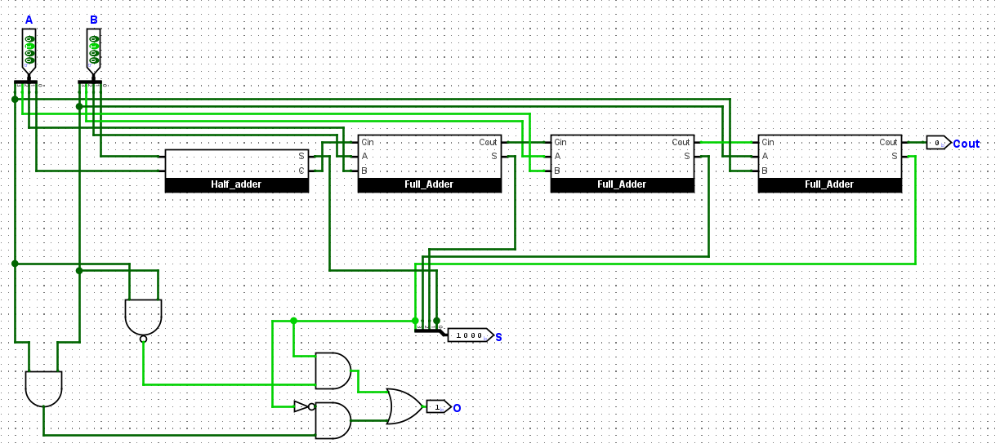

## 时序逻辑电路

它具备以下两种特性: (1) 可以读出电路的旧状态; (2) 可以更新电路的状态. 

具备上述特性的电路称为**时序逻辑**电路, 它可以存储状态, 其输出由当前输入和旧状态共同决定; 

相对地, 上一小节介绍的电路称为**组合逻辑**电路, 它们没有新旧状态的概念.

### 交叉配对反相器

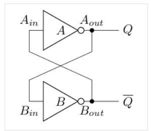

下表总结了交叉配对反相器的行为:

|      |      |      |  新  |  新  |  说明   |
| :--: | :--: | :--: | :--: | :--: | :-----: |
|  0   |  0   |      |  1   |  1   | 亚稳态  |
|  0   |  1   |      |  0   |  1   | 存储`0` |
|  1   |  0   |      |  1   |  0   | 存储`1` |
|  1   |  1   |      |  0   |  0   | 亚稳态  |

### S-R锁存器

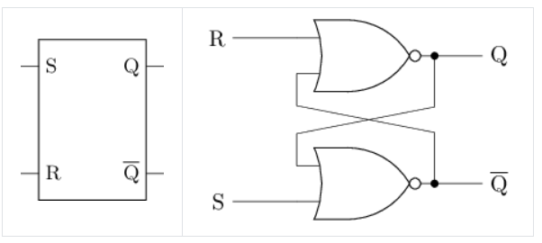

1. 当`S=1, R=0`时, 上方或非门的行为和反相器一致, 下方或非门的输出恒为`0`. 此时`Q`为`1`, 故将SR锁存器存储的值更新为`1`.
2. 当`S=0, R=1`时, 上方或非门的输出恒为`0`, 下方或非门的行为和反相器一致. 此时`Q`为`0`, 故将SR锁存器存储的值更新为`0`.
3. 当`S=0, R=0`时, 两个或非门的行为和反相器一致. 此时SR锁存器的行为与交叉配对反相器一致, 故SR锁存器将保持之前存储的值.
4. 当`S=1, R=1`时, 两个或非门的输出恒为`0`, 此时无法表示有效的信息. 同时, 输入从`S=1, R=1`变为`S=0, R=0`时, 相当于让交叉配对反相器进入Q=0，$\bar{Q}=0$的状态. 根据上文的分析, 这将导致SR锁存器进入亚稳态, 因此需要避免.

| `S`  | `R`  |      | `Q`  |
| :--: | :--: | :--: | :--: |
|  0   |  0   |      | 保持 |
|  0   |  1   |      |  0   |
|  1   |  0   |      |  1   |
|  1   |  1   |      | 禁止 |

> 尝试在Logisim中通过门电路搭建一个SR锁存器. 搭建后, 通过仿真检查你的方案是否正确.
>
> 由于手工操作时, 无法通过一次点击直接将两个拨码开关从`11`变成`00`. 为了触发亚稳态, 你可以在SR锁存器前额外增加若干与门, 让另一个拨码开关同时控制这些与门的其中一个输入端, 这样就可以通过这一个拨码开关来让SR锁存器的两个输入端同时变成`0`了. 如果你成功触发了亚稳态, Logisim会在窗口底部显示`Oscillation apparent`的信息. 此时仿真将无法继续, 你需要通过Logisim的菜单重置仿真.
>
> 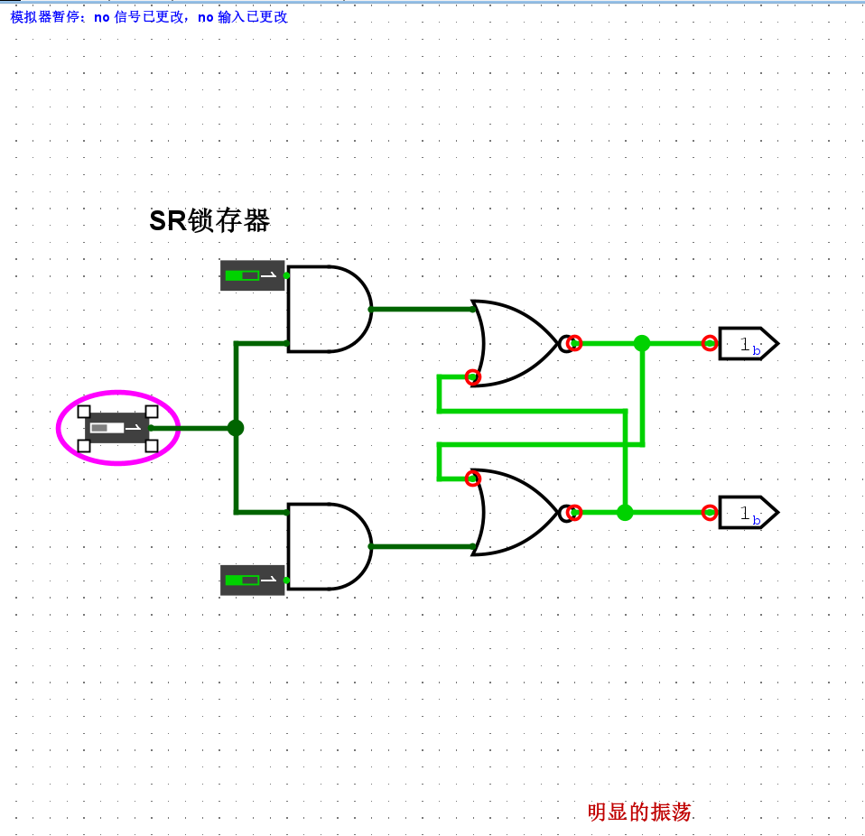

> 使用与非门搭建$\bar{S}$$\bar{R}$锁存器
>
> 1. 当`S=1, R=0`时, 下方与非门的行为和反相器一致, 上方与非门的输出恒为`1`. 此时`Q`为`1`, 故将SR锁存器存储的值更新为`1`.
> 2. 当`S=0, R=1`时, 下方与非门的输出恒为`0`, 上方与非门的行为和反相器一致. 此时`Q`为`0`, 故将SR锁存器存储的值更新为`0`.
> 3. 当`S=1, R=1`时, 两个与非门的行为和反相器一致. 此时SR锁存器的行为与交叉配对反相器一致, 故SR锁存器将保持之前存储的值.
> 4. 当`S=0, R=0`时, 两个或非门的输出恒为`1`, 此时无法表示有效的信息. 同时, 输入从`S=0, R=0`变为`S=1, R=1`时, 相当于让交叉配对反相器进入Q=0，$\bar{Q}=0$的状态. 根据上文的分析, 这将导致SR锁存器进入亚稳态, 因此需要避免.
>
> 真值表如下
>
> | $\bar{S}$ | $\bar{R}$ |      | `Q`  |
> | :-------: | :-------: | :--: | :--: |
> |     0     |     0     |      | 禁止 |
> |     0     |     1     |      |  0   |
> |     1     |     0     |      |  1   |
> |     1     |     1     |      | 保持 |
>
> 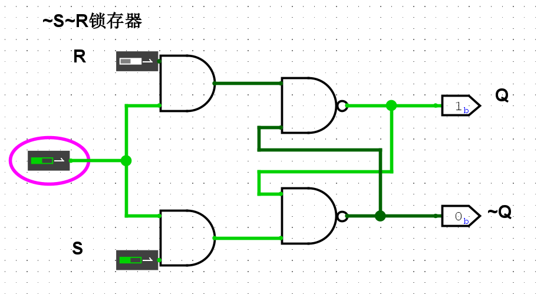

### D锁存器

为了防止出现亚稳态，我们设计了D锁存器，在输入的部分加了两个与门，并且通过一个非门，使得输入要么全0，要么相反，不会出现11的情形了

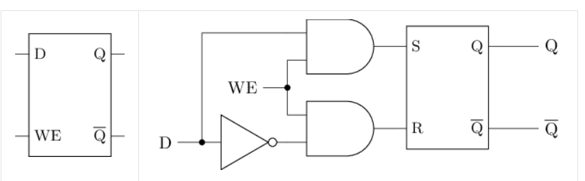

 其中`D`为输入数据, `WE`为写使能(Write Enable).

> 真值表如下
>
> | `D`  | `WE` |  S   |  R   | `Q`  |
> | :--: | :--: | :--: | :--: | :--: |
> |  0   |  0   |  0   |  0   | 保持 |
> |  1   |  0   |  0   |  0   | 保持 |
> |  0   |  1   |  0   |  1   |  0   |
> |  1   |  1   |  1   |  0   |  1   |

> #### Logisim中通过门电路搭建的D锁存器
>
> 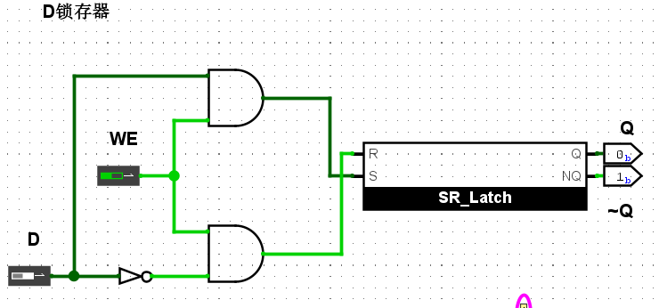

> #### 带复位的D锁存器
>
> 增加了复位器R，WE为1时，当R为1，Q为0，R为0时Q为D；WE为0时，Q不变
>
> 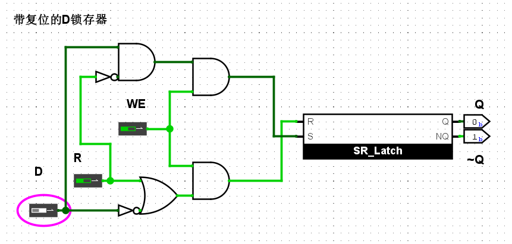

> #### D锁存器实现位翻转功能
>
> 想出现这种情况，要先将复位置1，然后将输出取反接到输入，再将复位置零
>
> 也很好理解，因为复位为0时，Q=D，将输出取反放到输入，则Q马上又变为相反数，就无穷的震荡下去了
>
> 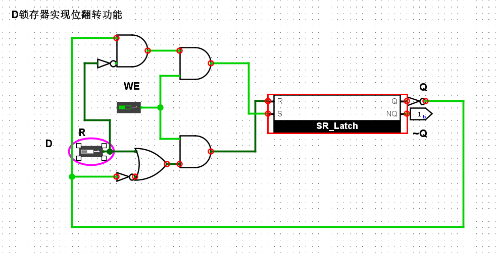

### D触发器

为了实现根据时钟周期进行操作，我们需要能够在时钟的上升沿和下降沿进行操作，但是上面设计的锁存器属于是电平触发(level-triggered)的存储元件，只要输入一改变就会立刻改变，所以我们设计需要一种边沿触发(edge-triggered)的存储元件, 只有信号边沿到来时, 才将输入传播到输出端

D触发器(D Flip-Flop)是一种边沿触发的存储元件, 它基于锁存器搭建, 但可以在时钟信号维持电平的时刻巧妙地阻塞输入信号的传播. D触发器的逻辑符号如下图所示, 其中左下方的`>`符号表示该端口需要连接时钟信号. D触发器有多种实现方式, 这里先介绍主从式D触发器, 其结构如下图所示.

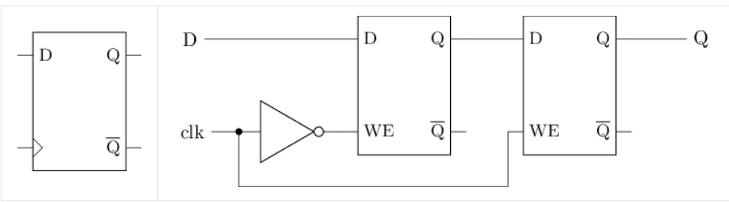

1. 数据准备阶段. 此时时钟信号`clk`处于低电平, 故主锁存器的写使能端有效, 数据信号`D`可从外部进入主锁存器; 但由于从锁存器的写使能端无效, 故数据信号无法传播到从锁存器, 因而整个D触发器的输出端`Q`保持不变.
2. 采样阶段. 当时钟信号`clk`的上升沿到来时, 主锁存器的写使能端无效, 数据信号`D`无法从外部进入主锁存器, `D`的后续变化将无法对主锁存器造成影响, 从而将时钟信号上升沿到来前的外部数据`D`"锁"在主锁存器中. 与此同时, 从锁存器的写使能端开始有效, 主锁存器中"锁住"的数据将传播到从锁存器, 并作为整个D触发器的输出.
3. 维持阶段. 此时时钟信号`clk`处于高电平, 故主锁存器的写使能端无效, 因此不受数据信号`D`变化的影响; 从锁存器的写使能端虽然有效, 但由于主锁存器保持不变, 故从锁存器也保持不变, 因而整个D触发器的输出端`Q`保持不变.

当时钟上升沿到来时, 数据被写入D触发器, 并能在后续时钟周期稳定读出该数据, 符合同步电路对存储元件的要求. 因此, D触发器是同步电路设计中的基本存储元件.

> #### 搭建D触发器
>
> 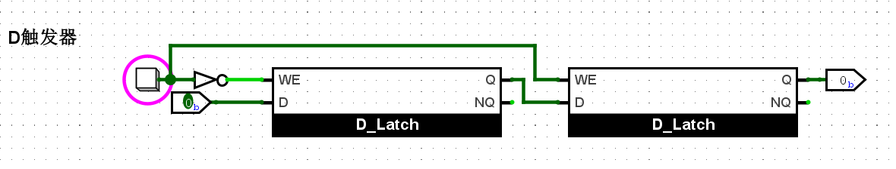

> #### 搭建带复位功能的D触发器
>
> 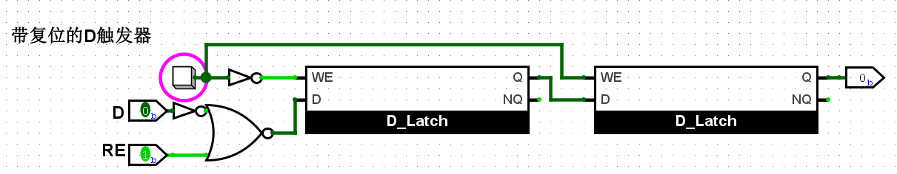
>
> 增加了复位功能，当复位为1时，Q会变为0，但是还是只有在上升沿的时候才会更新

> #### D触发器实现位翻转功能
>
> 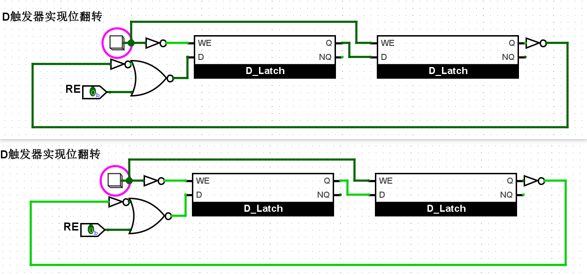
>
> 用D触发器实现位翻转就不会震荡了，只有点击按钮的时候才会翻转

> #### 下降沿的D触发器
>
> 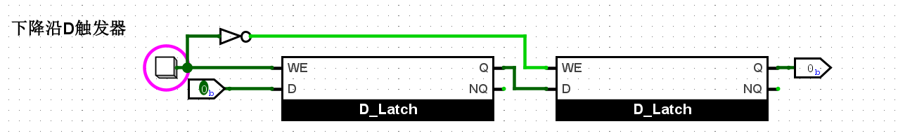

> #### 使能端的D触发器
>
> 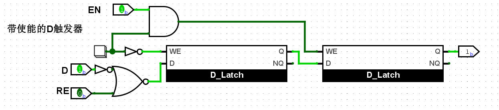

### 寄存器

上述的D触发器只能存储1位数据, 但有时候需要将多位数据作为一个整体来存储和处理. 寄存器(register)是由多个D触发器组成的存储元件, 其电路结构如下图所示. 这些D触发器之间共享相同的时钟信号和使能信号, 从而实现整体存储的效果.

> #### 搭建4位寄存器
>
> 使用带复位的D触发器搭建
>
> 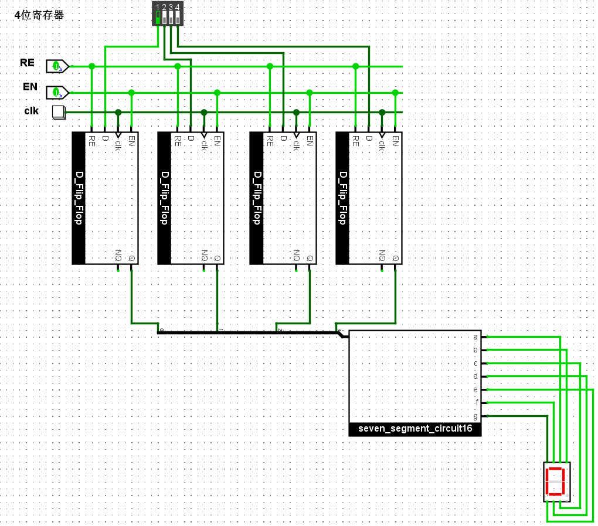

> #### 四位计数器
>
> 通过上述4位寄存器和之前搭建的加法器, 实现一个4位计数器, 每次时钟到来时, 寄存器中的值加1, 加到最大值时重新从`0`开始
>
> 下面是实现结果，就是注意使用前需要先将EN和RE置1，点一次按钮，之后RE置0即可正常使用了
>
> 还有一点那个常数1要设置成4位的
>
> 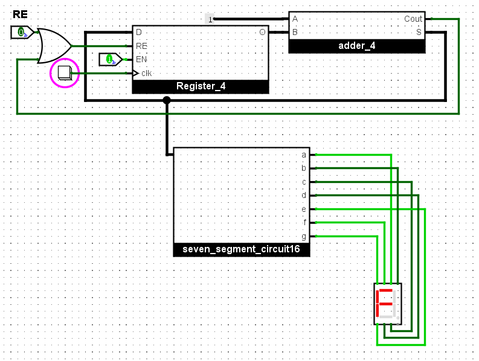
>
> 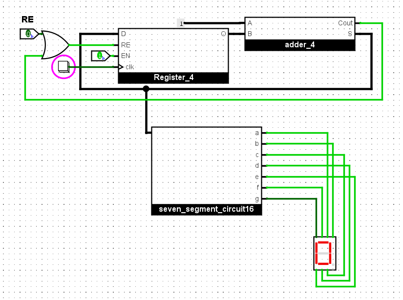
