# 数字逻辑电路基础

## 晶体管

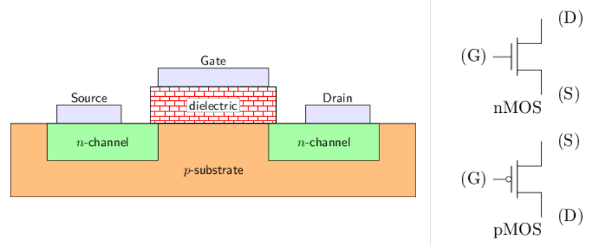

主要是CMOS部分

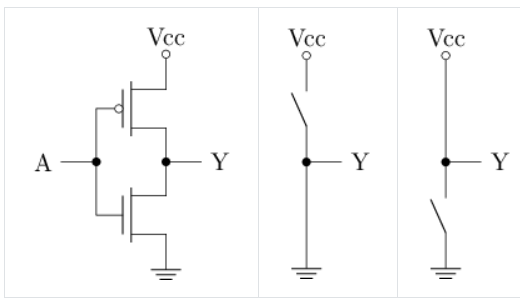

> 注意pMOS带圆圈，栅极与源极电压差大时导通，也就是和上方比电压
>
> nMOS不带圆圈，也是栅极与源极电压差大时导通，但是和下方比电压

## 通过晶体管搭建门电路

### 非门

上图就是非门，会将输入取反

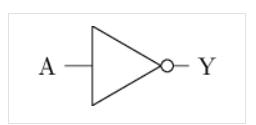

### 与非门

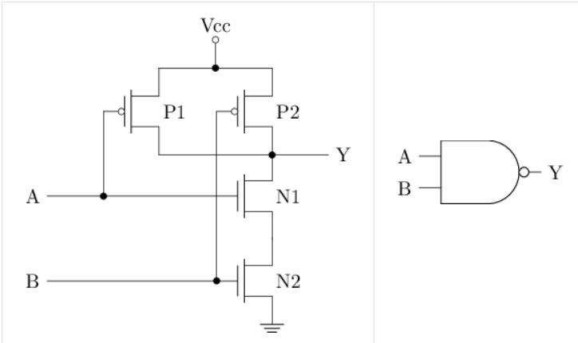

> 主要就是模拟输入端AB的所有情况，列出输出Y的所有结果判断是什么门电路。为了得到Y的结果，在过程中也需要记录N和P的结果

|  A   |  B   |  P1  |  P2  |  N1  |  N2  |  Y   |
| :--: | :--: | :--: | :--: | :--: | :--: | :--: |
|  0   |  0   | 导通 | 导通 | 截止 | 截止 |  1   |
|  0   |  1   | 导通 | 截止 | 截止 | 导通 |  1   |
|  1   |  0   | 截止 | 导通 | 导通 | 截止 |  1   |
|  1   |  1   | 截止 | 截止 | 导通 | 导通 |  0   |

### 与门

就是在与非门原来的Y处后面接个非门

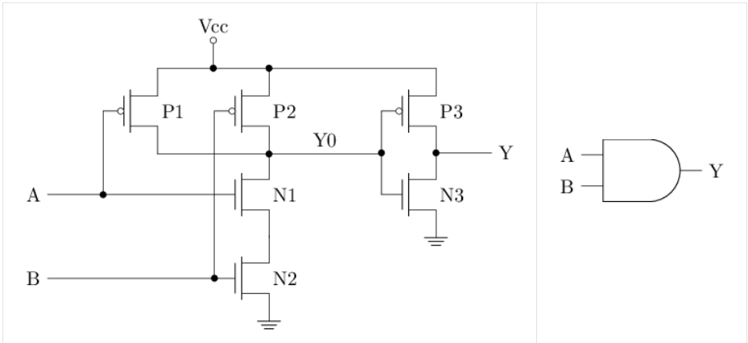

|  A   |  B   |  P1  |  P2  | P3   |  N1  |  N2  | N3   |  Y   |
| :--: | :--: | :--: | :--: | ---- | :--: | :--: | ---- | :--: |
|  0   |  0   | 导通 | 导通 | 截止 | 截止 | 截止 | 导通 |  0   |
|  0   |  1   | 导通 | 截止 | 截止 | 截止 | 导通 | 导通 |  0   |
|  1   |  0   | 截止 | 导通 | 截止 | 导通 | 截止 | 导通 |  0   |
|  1   |  1   | 截止 | 截止 | 导通 | 导通 | 导通 | 截止 |  1   |

### 或非门

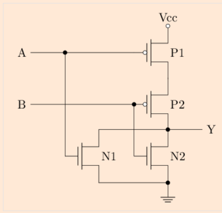

|  A   |  B   |  P1  |  P2  |  N1  |  N2  |  Y   |
| :--: | :--: | :--: | :--: | :--: | :--: | :--: |
|  0   |  0   | 导通 | 导通 | 截止 | 截止 |  1   |
|  0   |  1   | 导通 | 截止 | 截止 | 导通 |  0   |
|  1   |  0   | 截止 | 导通 | 导通 | 截止 |  0   |
|  1   |  1   | 截止 | 截止 | 导通 | 导通 |  0   |

通过以上表格可以看出这是一个或非门

### 或门

晶体管结构如下图

其实就是上面的或非门加上个非门

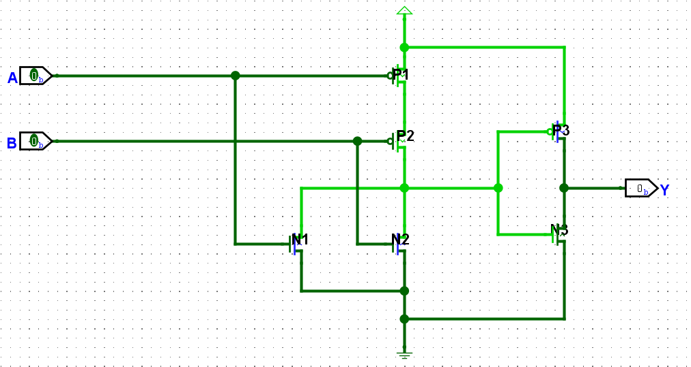

|  A   |  B   |  P1  |  P2  | P3   |  N1  |  N2  | N3   |  Y   |
| :--: | :--: | :--: | :--: | ---- | :--: | :--: | ---- | :--: |
|  0   |  0   | 导通 | 导通 | 截止 | 截止 | 截止 | 导通 |  0   |
|  0   |  1   | 导通 | 截止 | 导通 | 截止 | 导通 | 截止 |  1   |
|  1   |  0   | 截止 | 导通 | 导通 | 导通 | 截止 | 截止 |  1   |
|  1   |  1   | 截止 | 截止 | 导通 | 导通 | 导通 | 截止 |  1   |

### 三输入与非门

与非门不止有两个输入的，还可以有更多输入，下面是3个输入的情况

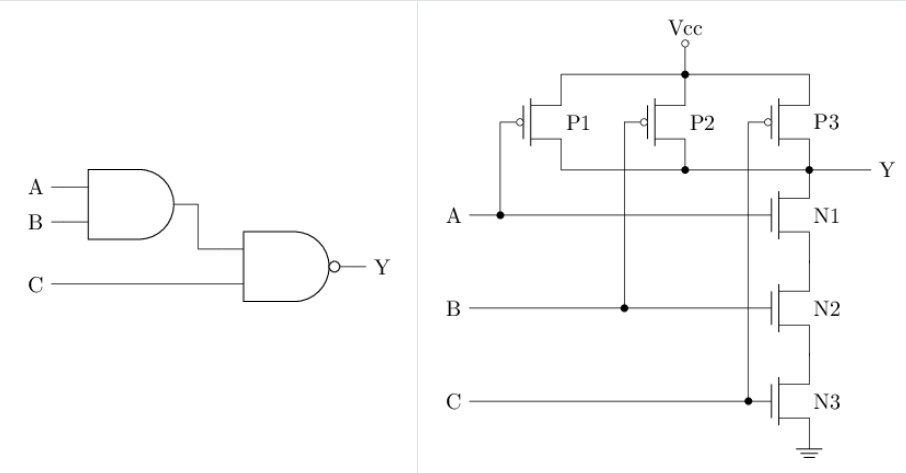

可以通过一个与门和一个与非门实现，也可以只使用晶体管重新设计实现

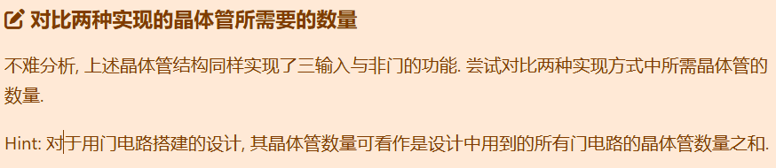

在不考虑面积的情况下，前者需要6+4=10个晶体管，后者只需要6个晶体管

### 异或门

不相同输出1，相同输出0

> ### 真值表到逻辑表达式的转换
>
> 看真值表的表项，是1就写本身，是0就写本身的取反
>
> 将所有的表项与起来
>
> 最后将输出为1的结构或一下
>
> 如下图
>
> 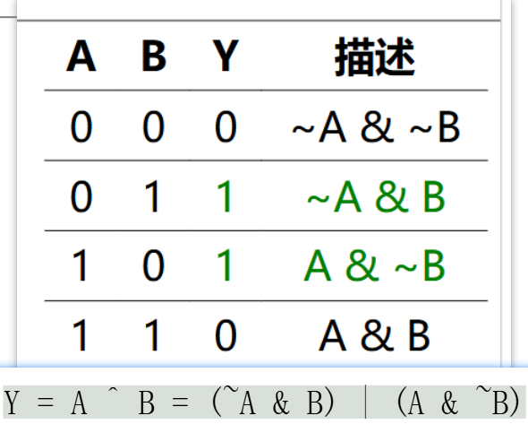

依照上述结果可以简单的通过与门和或门实现

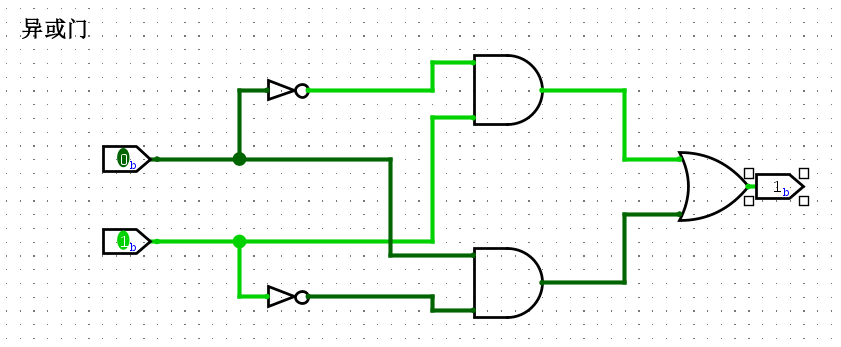

共使用6\*2+2\*2+6=22个晶体管

### 同或门

相同输出1，不同输出0

最简单的实现和就是异或的取反

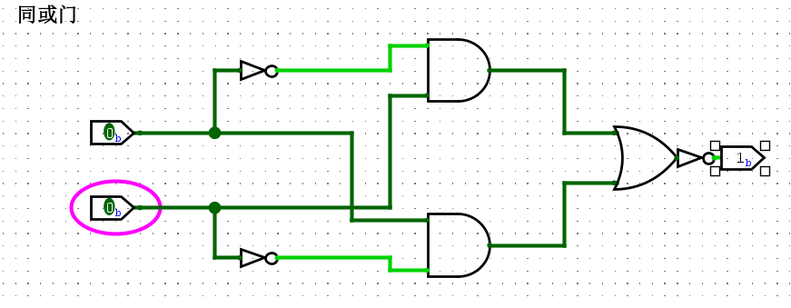

或者按照查真值表构建表达式的方式构建如下，可以省一个非门

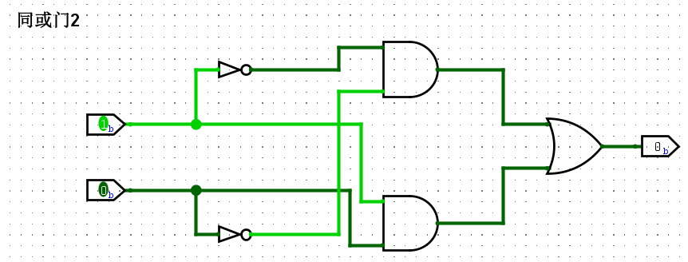