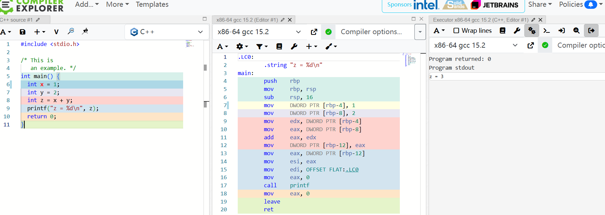
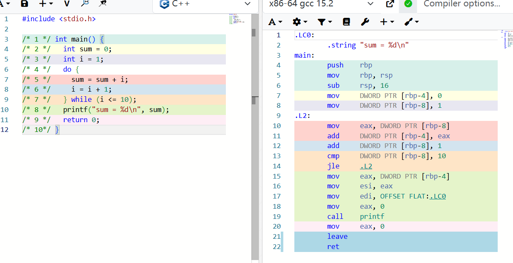

# 计算机系统的状态机模型

## 处理器的组成和工作原理

处理器其实就是一个机械的执行数据处理的机器，执行的就是指令

指令分为两部分，一部分是操作码，用于区分不同的指令；另一部分是操作数，用于知道运算的数据

为了存储数据的中间结果，我们需要一些寄存器来存储，由多个寄存器组成一个"寄存器组"(Register Set, 有的教科书也称其为"寄存器堆", 英文为Register File)。由于这样的寄存器组用于处理一般数据，因此也称其为通用寄存器(General Purpose Register, GPR)。相对地, 有一些寄存器的功能并非用于处理一般处理, 它们不属于GPR，比如说PC，它是用于指定哪一条指令的寄存器。

### 一个数列求和的例子

让我们用指令来计算`1+2+...+10`这一数列的和. 为了方便理解, 我们先不采用`0`和`1`来表示指令. 我们用`r0`, `r1`, `r2`和`r3`分别指代4个GPR, 并且用逗号来分隔指令的操作数. 假设以下指令序列存放在存储器中, 用于计算上述数列之和, 其中`:`前的数字表示PC, `#`及其后的文字表示注释:

```text
0: li r0, 10   # 这里是十进制的10
1: li r1, 0
2: li r2, 0
3: li r3, 1
4: add r1, r1, r3
5: add r2, r2, r1
6: bner0 r1, 4
7: bner0 r3, 7
```

乍眼一看, 你可能很难理解上面的指令序列如何实现数列求和. 让我们来把自己当作处理器, 通过执行一条条指令来理解这个过程. 为了理解指令执行的过程, 我们还需要记录寄存器的变化. 我们用`(PC, r0, r1, r2, r3)`的格式来记录寄存器的值, 这一格式也反映了处理器所处的状态. 例如`(7, 2, 3, 1, 8)`表示接下来将要执行编号为`7`的指令, 当前4个GPR的值分别为`2`, `3`, `1`, `8`. 我们约定在开始的时刻, 处理器的状态是`(0, 0, 0, 0, 0)`. 以下是处理器执行前若干条指令的过程:

```text
PC r0 r1 r2 r3
(0, 0, 0, 0, 0)   # 初始状态
(1, 10, 0, 0, 0)  # 执行PC为0的指令后, r0更新为10, PC更新为下一条指令的位置
(2, 10, 0, 0, 0)  # 执行PC为1的指令后, r1更新为0, PC更新为下一条指令的位置
(3, 10, 0, 0, 0)  # 执行PC为2的指令后, r2更新为0, PC更新为下一条指令的位置
(4, 10, 0, 0, 1)  # 执行PC为3的指令后, r3更新为1, PC更新为下一条指令的位置
(5, 10, 1, 0, 1)  # 执行PC为4的指令后, r1更新为r1+r3, PC更新为下一条指令的位置
(6, 10, 1, 1, 1)  # 执行PC为5的指令后, r2更新为r2+r1, PC更新为下一条指令的位置
(4, 10, 1, 1, 1)  # 执行PC为6的指令后, 因r1不等于r0, 故PC更新为4
(5, 10, 2, 1, 1)  # 执行PC为4的指令后, r1更新为r1+r3, PC更新为下一条指令的位置
......
```

> 整体的过程
>
> ```
> PC r0 r1 r2 r3
> (0, 0, 0, 0, 0)   # 初始状态
> (1, 10, 0, 0, 0)  # 执行PC为0的指令后, r0更新为10, PC更新为下一条指令的位置
> (2, 10, 0, 0, 0)  # 执行PC为1的指令后, r1更新为0, PC更新为下一条指令的位置
> (3, 10, 0, 0, 0)  # 执行PC为2的指令后, r2更新为0, PC更新为下一条指令的位置
> (4, 10, 0, 0, 1)  # 执行PC为3的指令后, r3更新为1, PC更新为下一条指令的位置
> (5, 10, 1, 0, 1)  # 执行PC为4的指令后, r1更新为r1+r3, PC更新为下一条指令的位置
> (6, 10, 1, 1, 1)  # 执行PC为5的指令后, r2更新为r2+r1, PC更新为下一条指令的位置
> (4, 10, 1, 1, 1)  # 执行PC为6的指令后, 因r1不等于r0, 故PC更新为4
> (5, 10, 2, 1, 1)  # 执行PC为4的指令后, r1更新为r1+r3, PC更新为下一条指令的位置
> (6, 10, 2, 3, 1)  # 执行PC为5的指令后, r2更新为r2+r1, PC更新为下一条指令的位置
> (4, 10, 2, 3, 1)  # 执行PC为6的指令后, 因r1不等于r0, 故PC更新为4
> (5, 10, 3, 3, 1)  # 执行PC为4的指令后, r1更新为r1+r3, PC更新为下一条指令的位置
> (6, 10, 3, 6, 1)  # 执行PC为5的指令后, r2更新为r2+r1, PC更新为下一条指令的位置
> (4, 10, 3, 6, 1)  # 执行PC为6的指令后, 因r1不等于r0, 故PC更新为4
> (5, 10, 4, 6, 1)  # 执行PC为4的指令后, r1更新为r1+r3, PC更新为下一条指令的位置
> (6, 10, 4, 10, 1)  # 执行PC为5的指令后, r2更新为r2+r1, PC更新为下一条指令的位置
> (4, 10, 4, 10, 1)  # 执行PC为6的指令后, 因r1不等于r0, 故PC更新为4
> (5, 10, 5, 10, 1)  # 执行PC为4的指令后, r1更新为r1+r3, PC更新为下一条指令的位置
> (6, 10, 5, 15, 1)  # 执行PC为5的指令后, r2更新为r2+r1, PC更新为下一条指令的位置
> (4, 10, 5, 15, 1)  # 执行PC为6的指令后, 因r1不等于r0, 故PC更新为4
> (5, 10, 6, 15, 1)  # 执行PC为4的指令后, r1更新为r1+r3, PC更新为下一条指令的位置
> (6, 10, 6, 21, 1)  # 执行PC为5的指令后, r2更新为r2+r1, PC更新为下一条指令的位置
> (4, 10, 6, 21, 1)  # 执行PC为6的指令后, 因r1不等于r0, 故PC更新为4
> (5, 10, 7, 21, 1)  # 执行PC为4的指令后, r1更新为r1+r3, PC更新为下一条指令的位置
> (6, 10, 7, 28, 1)  # 执行PC为5的指令后, r2更新为r2+r1, PC更新为下一条指令的位置
> (4, 10, 7, 28, 1)  # 执行PC为6的指令后, 因r1不等于r0, 故PC更新为4
> (5, 10, 8, 28, 1)  # 执行PC为4的指令后, r1更新为r1+r3, PC更新为下一条指令的位置
> (6, 10, 8, 36, 1)  # 执行PC为5的指令后, r2更新为r2+r1, PC更新为下一条指令的位置
> (4, 10, 8, 36, 1)  # 执行PC为6的指令后, 因r1不等于r0, 故PC更新为4
> (5, 10, 9, 36, 1)  # 执行PC为4的指令后, r1更新为r1+r3, PC更新为下一条指令的位置
> (6, 10, 9, 45, 1)  # 执行PC为5的指令后, r2更新为r2+r1, PC更新为下一条指令的位置
> (4, 10, 9, 45, 1)  # 执行PC为6的指令后, 因r1不等于r0, 故PC更新为4
> (5, 10, 10, 45, 1)  # 执行PC为4的指令后, r1更新为r1+r3, PC更新为下一条指令的位置
> (6, 10, 10, 55, 1)  # 执行PC为5的指令后, r2更新为r2+r1, PC更新为下一条指令的位置
> (7, 10, 10, 55, 1)  # 执行PC为6的指令后, 因r1等于r0, 故PC更新为7
> (7, 10, 10, 55, 1)  # 执行PC为7的指令后, 因r3不等于r0, 故PC更新为7
> .....
> ```
>
> 我发现执行到最后，会卡到第7条指令不再执行其它指令
>
> 结果存在r2

> ####  计算10以内的奇数之和
>
> 尝试用上述指令编写一个程序, 求出10以内的奇数之和, 即计算`1+3+5+7+9`. 编写后, 尝试列出处理器状态的变化过程, 以此来检查你编写的程序是否正确.
>
> ```
> 10001010    # 0: li r0, 9
> 10010000    # 1: li r1, 1
> 10100000    # 2: li r2, 1
> 10110001    # 3: li r3, 2
> 00010111    # 4: add r1, r1, r3
> 00101001    # 5: add r2, r2, r1
> 11010001    # 6: bner0 r1, 4
> 11011111    # 7: bner0 r3, 7
> ```
>
> 处理器状态变化如下
>
> ```
> PC r0 r1 r2 r3
> (0, 0, 0, 0, 0)   # 初始状态
> (1, 9, 0, 0, 0)  # 执行PC为0的指令后, r0更新为9, PC更新为下一条指令的位置
> (2, 9, 1, 0, 0)  # 执行PC为1的指令后, r1更新为1, PC更新为下一条指令的位置
> (3, 9, 1, 1, 0)  # 执行PC为2的指令后, r2更新为1, PC更新为下一条指令的位置
> (4, 9, 1, 1, 2)  # 执行PC为3的指令后, r3更新为2, PC更新为下一条指令的位置
> (5, 9, 3, 1, 2)  # 执行PC为4的指令后, r1更新为r1+r3, PC更新为下一条指令的位置
> (6, 9, 3, 4, 2)  # 执行PC为5的指令后, r2更新为r2+r1, PC更新为下一条指令的位置
> (4, 9, 3, 4, 2)  # 执行PC为6的指令后, 因r1不等于r0, 故PC更新为4
> (5, 9, 5, 4, 2)  # 执行PC为4的指令后, r1更新为r1+r3, PC更新为下一条指令的位置
> (6, 9, 5, 9, 2)  # 执行PC为5的指令后, r2更新为r2+r1, PC更新为下一条指令的位置
> (4, 9, 5, 9, 2)  # 执行PC为6的指令后, 因r1不等于r0, 故PC更新为4
> (5, 9, 7, 9, 2)  # 执行PC为4的指令后, r1更新为r1+r3, PC更新为下一条指令的位置
> (6, 9, 7, 16, 2)  # 执行PC为5的指令后, r2更新为r2+r1, PC更新为下一条指令的位置
> (4, 9, 7, 16, 2)  # 执行PC为6的指令后, 因r1不等于r0, 故PC更新为4
> (5, 9, 9, 16, 2)  # 执行PC为4的指令后, r1更新为r1+r3, PC更新为下一条指令的位置
> (6, 9, 9, 25, 2)  # 执行PC为5的指令后, r2更新为r2+r1, PC更新为下一条指令的位置
> (7, 9, 9, 25, 2)  # 执行PC为6的指令后, 因r1等于r0, 故PC更新为7
> (7, 9, 9, 25, 2)  # 执行PC为7的指令后, 因r3不等于r0, 故PC更新为7
> .....
> ```
>
> 注意r0初值要为9，否则第6条不会终止，r1和r2要么都为1，要么r1=-1，r2等于0，否则就从3开始加了，r3为2即可

## 指令集架构的状态机模型

状态机的定义包含如下部分:

- 状态集合$S$={$S_1$,$S_2$...}
- 激励事件集合$E$
- 状态转移规则$next:S\times E \rightarrow S$
  - 描述每个状态在不同激励事件下的次态(next state), 即二元函数$next(S,E)$给出了在状态$S$下接收到激励事件$E$后的次态
- 初始状态$S_0 \in S$

所以说对于ISA也类似：

状态集合便是寄存器、内存以及PC

激励事件便是执行指令

状态转移规则就是执行某条指令之后的状态

初始状态就是在未执行任何指令之前的状态

## C程序入门

### 一个简单的C语言示例

> ####  在线运行C程序
>
> 

### C程序的状态机模型

- 状态集合. 在C程序中, 最直接的状态就是变量, 因为它们是存储信息的对象. 除此之外, 我们在上文还提到: `大括号中的语句默认按顺序执行`. 很自然地, 在C程序的执行过程中, 还需要有一个用于指示当前执行到哪条语句的隐含变量, 这个隐含变量就是C语言的“程序计数器”(PC), 它也应该属于状态的一部分. 因此, 在C程序中, 一个状态是一组具体的变量和PC, 而全体状态的集合$S$则是变量和PC所有取值的组合, 即$S={(PC,V)}$, 其中$V$表示程序中所有变量的取值.

- 激励事件集合. 在C程序中, 执行语句会改变状态, 因此执行语句就是这个状态机的激励事件.
- 状态转移规则. 按照C程序的行为, 状态转移规则用于描述“在某个状态下执行某语句后的次态”, 也即语句的语义, 它约定了执行某语句后, 状态应该发生怎么样的变化, 从而从一个状态转移到另一个.
- 初始状态. 在未执行任何语句之前的状态, 即$S_0 = (main函数的第一条语句的位置,V_0)$

### 用C语言实现数列求和

我们还可以用C语言来计算`1+2+...+10`, 考虑以下C程序:

```c
#include <stdio.h>

/* 1 */ int main() {
/* 2 */   int sum = 0;
/* 3 */   int i = 1;
/* 4 */   do {
/* 5 */     sum = sum + i;
/* 6 */     i = i + 1;
/* 7 */   } while (i <= 10);
/* 8 */   printf("sum = %d\n", sum);
/* 9 */   return 0;
/* 10*/ }
```

上述代码中包含一个`do-while`循环, 其行为是, 先执行循环体(在大括号中)中的语句, 然后判断循环条件(在小括号中)是否成立, 若成立, 则重复执行循环体; 否则将结束循环, 继续执行后续语句.

和上文的汇编语言相比, 我们至少看到了用C语言开发程序的两点优势:

1. 变量的命名可以更直观地反映出其用途, 但汇编语言中, GPR的用途只能根据上下文推断
2. 循环的表达更清晰, 可以直接区别循环条件和循环体, 但在汇编语言中, 循环条件和循环体都是指令, 需要根据上下文推断

根据上述程序的行为, 前若干条语句的执行过程如下:

```text
PC sum i
(2, ?, ?)    # 初始状态
(3, 0, ?)    # 执行PC为2的语句后, sum更新为0, PC更新为下一条语句的位置
(5, 0, 1)    # 执行PC为3的语句后, i更新为1, PC更新为下一条语句的位置(第4行无有效操作, 跳过)
(6, 1, 1)    # 执行PC为5的语句后, sum更新为sum + i, PC更新为下一条语句的位置
(7, 1, 2)    # 执行PC为6的语句后, i更新为i + 1, PC更新为下一条语句的位置
(5, 1, 2)    # 执行PC为7的语句后, 由于循环条件i <= 10成立, 因此重新进入循环体
......
```

> #### 继续执行上述程序
>
> ```
> PC sum i
> (2, ?, ?)    # 初始状态
> (3, 0, ?)    # 执行PC为2的语句后, sum更新为0, PC更新为下一条语句的位置
> (5, 0, 1)    # 执行PC为3的语句后, i更新为1, PC更新为下一条语句的位置(第4行无有效操作, 跳过)
> (6, 1, 1)    # 执行PC为5的语句后, sum更新为sum + i, PC更新为下一条语句的位置
> (7, 1, 2)    # 执行PC为6的语句后, i更新为i + 1, PC更新为下一条语句的位置
> (5, 1, 2)    # 执行PC为7的语句后, 由于循环条件i <= 10成立, 因此重新进入循环体
> (6, 3, 2)    # 执行PC为5的语句后, sum更新为sum + i, PC更新为下一条语句的位置
> (7, 3, 3)    # 执行PC为6的语句后, i更新为i + 1, PC更新为下一条语句的位置
> (5, 3, 3)    # 执行PC为7的语句后, 由于循环条件i <= 10成立, 因此重新进入循环体
> (6, 6, 3)    # 执行PC为5的语句后, sum更新为sum + i, PC更新为下一条语句的位置
> (7, 6, 4)    # 执行PC为6的语句后, i更新为i + 1, PC更新为下一条语句的位置
> (5, 6, 4)    # 执行PC为7的语句后, 由于循环条件i <= 10成立, 因此重新进入循环体
> (6, 10, 4)    # 执行PC为5的语句后, sum更新为sum + i, PC更新为下一条语句的位置
> (7, 10, 5)    # 执行PC为6的语句后, i更新为i + 1, PC更新为下一条语句的位置
> (5, 10, 5)    # 执行PC为7的语句后, 由于循环条件i <= 10成立, 因此重新进入循环体
> (6, 15, 5)    # 执行PC为5的语句后, sum更新为sum + i, PC更新为下一条语句的位置
> (7, 15, 6)    # 执行PC为6的语句后, i更新为i + 1, PC更新为下一条语句的位置
> (5, 15, 6)    # 执行PC为7的语句后, 由于循环条件i <= 10成立, 因此重新进入循环体
> (6, 21, 6)    # 执行PC为5的语句后, sum更新为sum + i, PC更新为下一条语句的位置
> (7, 21, 7)    # 执行PC为6的语句后, i更新为i + 1, PC更新为下一条语句的位置
> (5, 21, 7)    # 执行PC为7的语句后, 由于循环条件i <= 10成立, 因此重新进入循环体
> (6, 28, 7)    # 执行PC为5的语句后, sum更新为sum + i, PC更新为下一条语句的位置
> (7, 28, 8)    # 执行PC为6的语句后, i更新为i + 1, PC更新为下一条语句的位置
> (5, 28, 8)    # 执行PC为7的语句后, 由于循环条件i <= 10成立, 因此重新进入循环体
> (6, 36, 8)    # 执行PC为5的语句后, sum更新为sum + i, PC更新为下一条语句的位置
> (7, 36, 9)    # 执行PC为6的语句后, i更新为i + 1, PC更新为下一条语句的位置
> (5, 36, 9)    # 执行PC为7的语句后, 由于循环条件i <= 10成立, 因此重新进入循环体
> (6, 45, 9)    # 执行PC为5的语句后, sum更新为sum + i, PC更新为下一条语句的位置
> (7, 45, 10)    # 执行PC为6的语句后, i更新为i + 1, PC更新为下一条语句的位置
> (5, 45, 10)    # 执行PC为7的语句后, 由于循环条件i <= 10成立, 因此重新进入循环体
> (6, 55, 10)    # 执行PC为5的语句后, sum更新为sum + i, PC更新为下一条语句的位置
> (7, 55, 11)    # 执行PC为6的语句后, i更新为i + 1, PC更新为下一条语句的位置
> (8, 55, 11)    # 执行PC为7的语句后, 由于循环条件i <= 10不成立, PC更新为下一条语句的位置
> (9, 55, 11)    # 执行PC为8的语句后, 进行输出，PC更新为下一条语句的位置
> (10, 55, 11)    # 执行PC为9的语句后, 程序终止
> ......
> ```
>
> 结束时程序终止了

## 数字电路的状态机模型

根据上一节数字电路的知识, 我们可以很容易地归纳出数字电路的状态机模型:

- 状态集合. 在数字电路中, 只有时序逻辑电路才能存储信息, 因此一个状态是时序逻辑元件所存储的具体信息, 而全体状态的集合则是时序逻辑元件所能存储信息的所有组合.

- 激励事件集合. 既然时序逻辑元件表征了数字电路的状态, 而时序逻辑元件的内部状态可以通过其输入端改变(例如可以通过输入端将数据写入D触发器), 我们可以将数字电路看成以下模型:

  ```text
      +------------------+
  +-->| Sequential Logic |----+
  |   +------------------+    |
  | next state                | current state
  |                           |
  |  +---------------------+  |
  +--| Combinational Logic |<-+
     +---------------------+
  ```

  也即, 让时序逻辑元件的状态发生变化的, 其实是组合逻辑电路输出的信号, 因此组合逻辑电路就是这个状态机的激励事件.

- 状态转移规则. 时序逻辑元件的状态具体应如何变化, 是由组合逻辑电路的具体逻辑决定的.

- 初始状态. 即电路在复位时, 时序逻辑元件的状态.

> #### 从状态机视角理解数列求和电路的工作过程
>
> 在上一小节中, 你已经通过寄存器和加法器搭建出一个简单数列求和电路, 用于计算`1+2+...+10`. 尝试列出电路状态的变化过程.
>
> -20251223173106871.png)
>
> 这里记录他们的状态，就只考虑输出吧
>
> ```
> A         B         C         D
> (00000000, 00000000, 00000000, 00000000)    # 初始状态
> (00000001, 00000010, 00000011, 00000001)    #按1次按钮
> (00000010, 00000011, 00000110, 00000011)    #按2次按钮
> (00000011, 00000100, 00001010, 00000110)    #按3次按钮
> (00000100, 00000101, 00001111, 00001010)    #按4次按钮
> (00000101, 00000110, 00010101, 00001111)    #按5次按钮
> (00000110, 00000111, 00011100, 00010101)    #按6次按钮
> (00000111, 00001000, 00100100, 00011100)    #按7次按钮
> (00001000, 00001001, 00101101, 00100100)    #按8次按钮
> (00001001, 00001010, 00110111, 00101101)    #按9次按钮
> (00001010, 00001011, 01000010, 00110111)    #按10次按钮
> ```
>
> 

## 在计算机上执行C程序

为了在计算机上能执行c程序，需要将程序转换成机器语言，也就是符号对应ISA的机器指令，这个工作可以人工实现，也可以设计一个专门的程序，编译器来实现，所以说, 编译器的工作就是将C程序的状态机翻译成ISA的状态机

编译器需要完成以下工作:

- 将C程序的状态翻译成ISA的状态, 也即
  - 将C程序的PC对应到ISA的PC
  - 将C程序的变量对应到ISA的GPR或内存
- 将C程序的状态转移规则翻译成ISA的状态转移规则, 也即, 将语句翻译成指令序列

> #### 编译器的工作
>
> 编译器就是将我们写好的C语言程序转换成对应的等级的指令序列啊，
>
> 
>
> 比如说int sum=0，就被编译器专科成了开辟一个空间，将1放入进去，里面的[rbp-4]就代表了原来的x了，这样就把状态集合转换了，同时也把变量对应到内存了；这里PC也有区别了，左边一条语句PC只加1，但是右边变成了多条指令，PC的变化会更频繁，同时跳跃的PC的位置也要发生变化。
