# 支持数列求和的简单处理器

通过ISA和状态机模型, 我们已经了解程序如何执行. 此外, 我们也已经学习了数字逻辑电路的基础知识. 现在是时候用数字电路实现一个CPU了!

在此之前, 我们需要再次明确需要实现的指令集sISA的细节. 和上一小节相比, 此处还约定了一些寄存器的位宽:

- PC位宽为4位, 初值为`0`

- GPR有4个, 位宽均为8位

- 支持如下3条指令

  ```text
   7  6 5  4 3   2 1   0
  +----+----+-----+-----+
  | 00 | rd | rs1 | rs2 | R[rd]=R[rs1]+R[rs2]       add指令, 寄存器相加
  +----+----+-----+-----+
  | 10 | rd |    imm    | R[rd]=imm                 li指令, 装入立即数, 高位补0
  +----+----+-----+-----+
  | 11 |   addr   | rs2 | if (R[0]!=R[rs2]) PC=addr bner0指令, 若不等于R[0]则跳转
  +----+----------+-----+
  ```

我们将这个用数字电路实现的sISA指令集的CPU称为sCPU. 要实现sCPU, 我们需要用数字电路实现sISA中的每一个概念. 为了简单起见, 我们先从最简单的`li`指令开始考虑, 也即, 先实现一个只支持`li`指令的sCPU

## 只有一条指令的sCPU

我们先从ISA的状态机模型回顾执行一条`li`指令的具体过程. 事实上, 无论是执行什么指令, 其步骤都是类似的, 有一个叫"指令周期"(instruction cycle)的概念专门描述这些步骤:

1. 取指(fetch): 根据当前PC, 在存储器中找到一条指令
2. 译码(decode): 看这条指令具体是什么指令, 操作数是哪些
   - 以`li`指令为例, 操作数需要看立即数是多少, 需要写入哪个目的寄存器
3. 执行(execute): 对操作数进行处理, 必要时更新指定的目的寄存器
4. 更新PC: 让PC指向下一条指令

因此, 我们的目标就是用数字电路实现上述过程的每一个步骤.

### 取指

存储器和寄存器都可以存储信息, 但存储器还支持寻址(addressing), 也即, 存储器中的内容按顺序进行排布, 给出一个地址, 存储器可以读出该地址对应的内容. 我们可以将存储器看成一个由比特构成的矩阵, 矩阵的每一行称为一个存储字(word), 地址就是行的编号, 行的数量也称为存储器的深度(depth). 通常一个存储字包含多位数据, 其位宽称为存储器的宽度(width). 通常用`深度x宽度`表示一个存储器的规格. 例如, 一个`2x3`的存储器排布如下, 其中$b_{(x,y)}$表示第$x$行第$y$列所存储的比特:

| 地址 |              存储字               |
| :--: | :-------------------------------: |
|  0   | $b_{(0,2)}$$b_{(0,1)}$$b_{(0,0)}$ |
|  1   | $b_{(1,2)}$$b_{(1,1)}$$b_{(1,0)}$ |

从功能上划分, 存储器可以分别只读存储器(Read-Only Memory, ROM) 和随机访问存储器(Random Access Memory, RAM), 前者不支持写入, 而后者支持. 对于sISA来说, 因为3条指令都不会访问存储器, 只有取指操作需要从存储器中读出指令, 因此这里可以采用ROM.

一个`2x3`的ROM的结构如下图所示. 左上方的译码器又称"地址译码器". 和地址译码器输出相连的导线称为"字线"(word line), 每条字线对应一个存储字. 和或门输出相连的导线称为"位线"(bit line), 每条位线对应存储字的一位.


给定地址`addr`, 可以读出ROM中的相应存储字, 其工作过程如下. 地址译码器将输入的地址转换成一组独热码, 由于独热码中只有一位有效, 故所有字线中, 只有地址`addr`对应的字线有效, 使得该行中存放的信息可以通过与门. 其余行因字线无效, 存放的信息均被与门过滤为`0`. 被选中的存储字的每一位经过或门传输到位线, 向存储器外部输出.

实际上, 图中的地址译码器, 与门和或门, 在功能上共同构成了一个3位的2选1多路选择器. 因此ROM的读操作也可以看作是从多个存储字中选择一个, 地址`addr`就是多路选择器的选择端, 所有存储字分别作为多路选择器的数据端. 特别地, ROM中存储的信息是直接通过高低电平编码的, 因此ROM从功能上也可以看作是数据端为常数的多路选择器.

> #### 实现取指功能
>
> 通过多路选择器实现一个ROM, 并在其中存放数列求和的指令序列, 然后通过PC寄存器取出指令. 你需要根据你的理解来确定ROM的规格.
>
> 由最上面的指令格式可知，一条指令8位，所以ROM应当有8位
>
> 我们在上一章可以看到数列求和的指令如下，共8条，所以ROM应当是8x8的
>
> ```
> 10001010    # 0: li r0, 10
> 10010000    # 1: li r1, 0
> 10100000    # 2: li r2, 0
> 10110001    # 3: li r3, 1
> 00010111    # 4: add r1, r1, r3
> 00101001    # 5: add r2, r2, r1
> 11010001    # 6: bner0 r1, 4
> 11011111    # 7: bner0 r3, 7
> ```
>
> 则实现如下，使用8位的8选1多路选择器即可，将指令2进制使用常数保存下来作为输入就好了，这样根据地址就可以实现取指了
>
> 

> 考虑不周，由于PC是4位，则ROM的输入也应该是4位才对
>
> 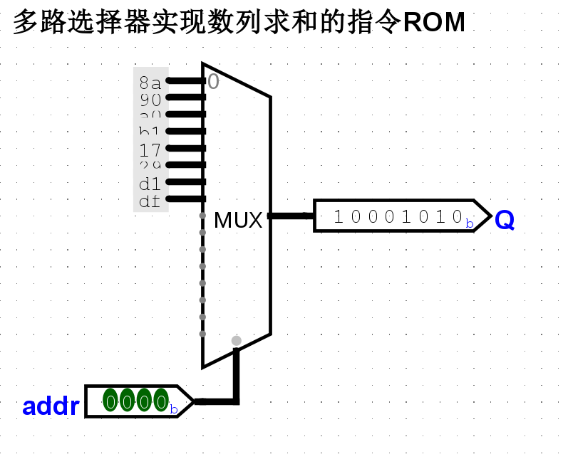

### 译码

译码的目的是根据指令的编码识别指令的功能. 我们在ISA的状态机上执行指令时, 是通过指令的汇编表示直接识别其功能(如`li r0, 10`), 或者给出指令的二进制表示(如`10001010`), 然后查阅指令的功能说明来了解其功能, 本质上来说都是属于人工进行译码操作. 但现在我们需要用电路来实现这一操作, 注意电路中存放的指令是其二进制表示, 因此我们需要在二进制层面对指令进行译码.

译码的工作进一步分为操作码译码和操作数译码, 前者是根据指令的操作码来识别指令的功能, 后者是从指令的编码中识别出相应的操作数. 对于操作码译码, 由于目前只需要实现一条`li`指令, 因此我们可以认为取到的指令就是`li`, 不存在其他情况. 对于操作数译码, 我们只需要解析出`li`指令中的`rd`和`imm`字段即可. 从电路的角度上看, 这只是一些位抽取操作, 并不难实现.

### 执行

`li`指令的功能是将立即数`imm`写入`rd`寄存器中, 因此我们需要考虑如何实现ISA的GPR.

GPR通常包含多个寄存器, 一次访问通常只访问其中的几个寄存器, 因此GPR也应该支持寻址. 可以看到, GPR的电路本质也是一个存储器. 不过GPR需要作为目的寄存器被指令写入, 因此GPR是一个支持写入的存储器, 即RAM.

#### 读操作

考虑一个`2x3`的RAM, 其读操作涉及的结构如下图所示. 可以看到, 除了存储单元采用了D触发器之外, 其余结构与ROM基本一致, 因此RAM的读出操作的工作过程可参考上文ROM相关的部分.

也就是存储的信息在D触发器的D输入端

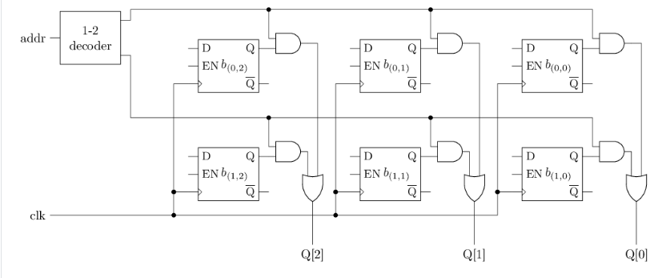

#### 写操作

至于RAM的写操作, 涉及的结构如下图所示. 进行写操作除了需要提供地址外, 还需要提供待写入数据`D`. 对于RAM来说, 并非所有时刻都需要进行写入操作, 例如, 在执行`bner0`指令时, 就不需要写入GPR, 因此还需要一个写使能信号`EN`, 指示当前是否需要写入.

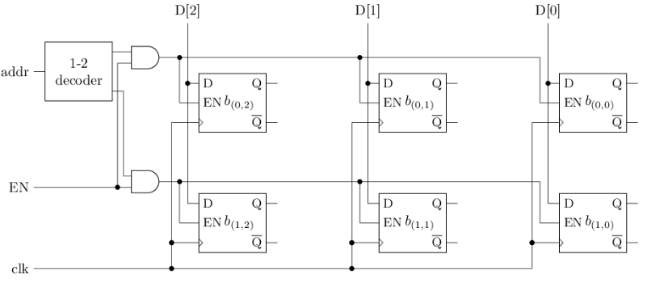

给定地址`addr`和待写入数据`D`, 在写使能`EN`有效时, 可以将数据`D`写入RAM中的相应存储字, 其工作过程如下. 待写入数据`D`通过位线将每一位分别连接到每一个存储字中相应位的`D`端, 写使能`EN`通过与门对地址译码器输出的独热码进行过滤, 并与字线连接, 因此在`EN`有效的情况下, 只有地址`addr`对应的字线有效, 其余行因字线无效. 将每一行的字线分别连接到对应存储器中相应的`EN`端, 被选中的存储字将更新为待写入数据`D`, 从而完成写入操作.

但是要注意，传入数据信息和使能信号至少要持续1个周期，不然是保存不下来的。

#### 整个RAM的实现

将读操作和写操作的结构合并, 得到RAM的结构如下图所示. 这种RAM在同一时刻只能通过一个地址访问其中的一个存储字, 称为"单端口RAM"(single port RAM). 相应地, 有的RAM在同一时刻可以通过多个地址访问其中的多个存储字, 称为"多端口RAM"(multi-port RAM). 可见, 增加RAM的"端口", 需要添加额外的电路逻辑, 从而使得多个端口的电路逻辑可以同时工作.

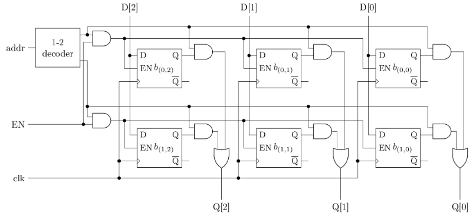

和ROM类似, 图中的地址译码器, 读操作通路上的与门和或门, 在功能上共同构成了一个3位的2选1多路选择器. 因此对于RAM的读取功能, 也可以看作是数据端为寄存器的多路选择器, 但写入功能需要在寄存器的基础上额外实现.

> #### 实现GPR及其写入功能
>
> 在寄存器的基础上搭建一个RAM, 从而实现GPR的写入功能. 你需要根据你的理解来确定RAM的规格.
>
> 由于通用寄存器组是4个8位的，为了实现写入，需要8位的寄存器，地址需要2位，所以为了读信息，只需要1个8位数据的4选1选择器即可；为了实现数据写入，需要增加1个译码器，也是输入地址进行译码，写使能信号写入这个译码器的使能即可
>
> 具体实现如下
>
> 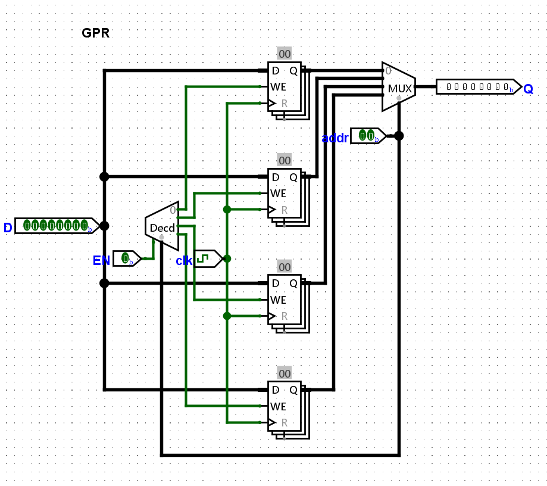

### 更新PC

更新PC的操作十分简单, 对PC寄存器加1即可, 这可以通过数字电路中的计数器来实现.

好了，所有需要的部件都好了，下面就可以实现li指令了

> 实现仅支持li指令的sCPU
>
> 根据上文, 用数字电路实现`li`的指令周期涉及的各个部件, 并将它们连接起来. 实现后, 尝试让sCPU执行数列求和程序中的前几条`li`指令, 并观察电路中GPR的状态是否与ISA的状态一致.
>
> 实现结果如下
>
> 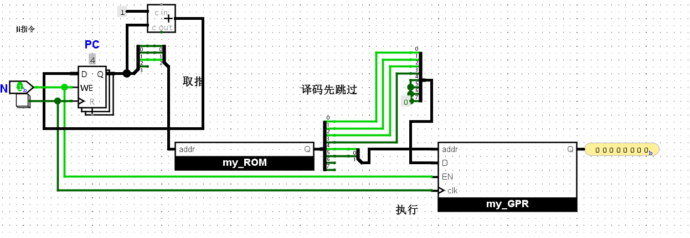
>
> 使用按钮代替时钟，PC+1使用加法器实现，由于PC是3位，但是我之前设计的ROM是3位的，暂时需要修改一下线路的位宽，之后ROM还是应该是4位的。。
>
> 由于目前只有li指令，所以不需要译码，只需要4,5两位去GPR寻址，0-3位写入GPR即可
>
> 执行前4条li指令后，寄存器结果如下
>
> 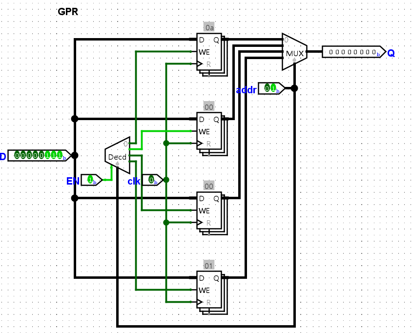
>
> 10，0，0，1符合要求

> 修正了ROM后，li指令

## 实现完整的sCPU

上面只支持li的sCPU是实现不了求和的程序的，实现也比较简陋，下面还需要增加add和bner0指令，并且具体实现译码操作才可以，只需要增加一个2-4译码器即可

### 添加add指令

此外，为了实现add指令，需要修改GPR，使其能够至少再增加两个同时读的端口，具体如下

考虑操作数. 和`li`指令相比, `add`指令除了需要写入`rd`, 还需要读出`rs1`和`rs2`作为源操作数, 需要同时通过两个读端口和一个写端口访问GPR. 因此, 我们还需要为GPR添加两个读口, 添加后, GPR模块应至少包含如下端口信号:

- 第1个读端口: `raddr1`(读地址), `rdata1`(读数据)
- 第2个读端口: `raddr2`, `rdata2`
- 写端口: `waddr`(写地址), `wdata`(写数据), `wen`(写使能), `clk`(时钟)

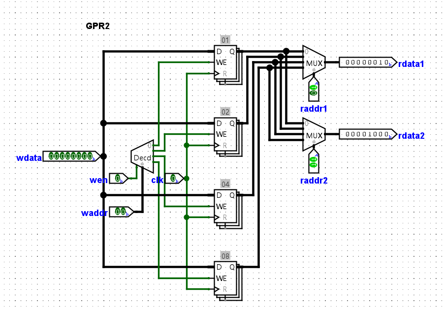

> #### 添加add指令
>
> 根据上文, 在sCPU中添加`add`指令. 实现后, 尝试让sCPU继续执行数列求和程序中的几条`add`指令, 并观察电路中GPR的状态是否与ISA的状态一致
>
> 首先，先封装一下add指令获取操作数和执行的电路
>
> 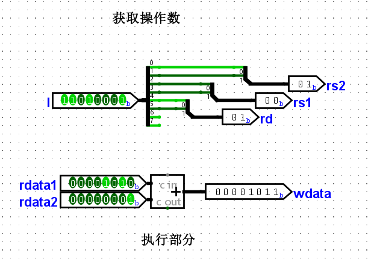
>
> li指令的也封装一下
>
> 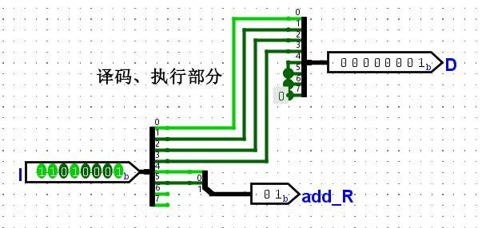
>
> 然后就可以根据译码结果选择不同的指令执行了
>
> 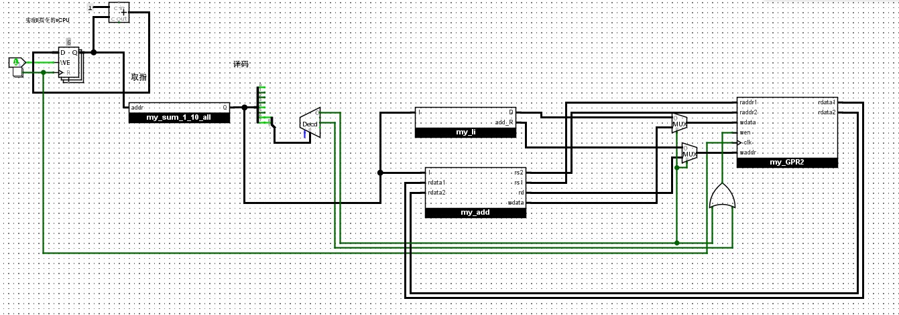
>
> 左侧取指部分与PC+1部分还没有变化，主要是右边
>
> 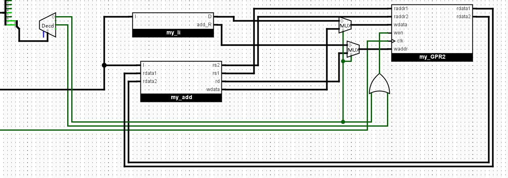
>
> 首先将地址码译码，先不论结果，将指令都传入封装好的部分
>
> 目前，读数据只有add指令使用，所以说传入对应位置即可
>
> 写数据有冲突，要根据译码结果进行选择，我使用多路选择器来实现，li指令的写入都在0处，add的写入都在1处，然后将译码器中add的结果(10)传入多路选择器即可，写使能wen，使用两指令译码结果的或即可
>
> 执行前6条指令，GPR结果如下，符合预期(10,1,1,1)
>
> 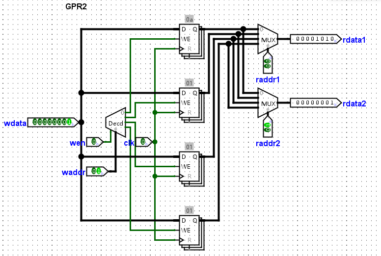

### 添加bner0指令

最后是`bner0`指令. 为了识别`bner0`指令, 我们可以复用指令译码器的功能. 至于操作数, 除了指令中的`rs2`和`addr`, 还有一个隐含的`R[0]`. 由于`bner0`指令中`rs2`字段的位置和`add`指令中`rs2`字段的位置一样, 因此可以复用`add`指令中读出`rs2`寄存器的逻辑. 但`bner0`还需要读出`R[0]`, 因此可以把`0`作为GPR的`raddr1`端口的输入. 不过这个端口已经被`add`指令的`rs1`占用, 但也同样可以通过多路选择器的解决问题.

读出源操作数后, `bner0`指令需要比较两数是否相等, 这可以通过比较器来实现. 若比较结果不相等, 需要将PC更新为`addr`字段. 换句话说, 只有当前指令为`bner0`指令, 且比较结果不相等, 才将PC更新为`addr`字段, 其余情况应将PC更新为PC加1. 同样地, 我们可以借助多路选择器对PC寄存器的输入端进行选择.

最后, `bner0`指令不会写入GPR, 因此需要将GPR的`wen`置为无效.

> 添加
>
> 首先将其获取操作数和功能的实现封装成子电路，如下
>
> 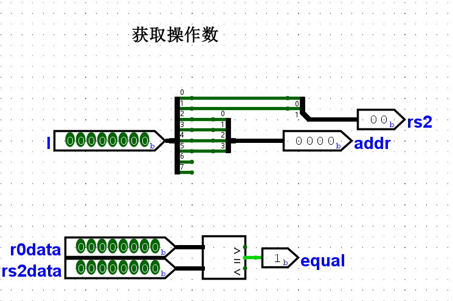
>
> 然后在电路上加上就可以了，先看PC部分
>
> 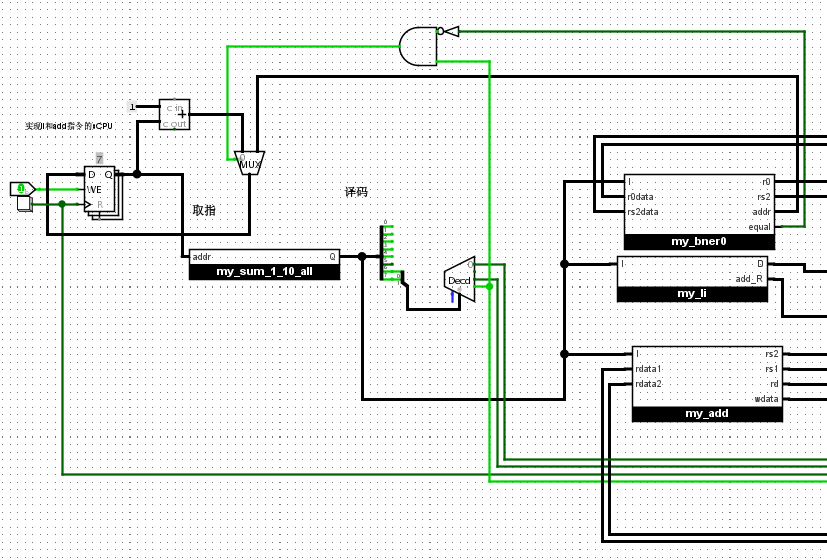
>
> 在选中benr0指令，并且值不相等的时候，pc变为addr的值，其余情况依旧加一
>
> 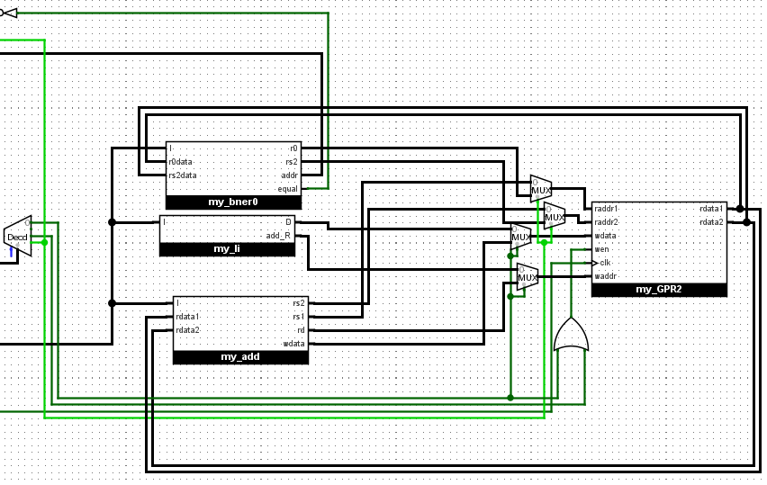
>
> 关于右侧，由于bner0需要获取r0和rs2里的数据进行比较，所以在读指令处需要一个多路选择器，当译码结果为bner0的时候，选中对应输入即可
>
> 最终结果也符合，为0x37，也即55
>
> 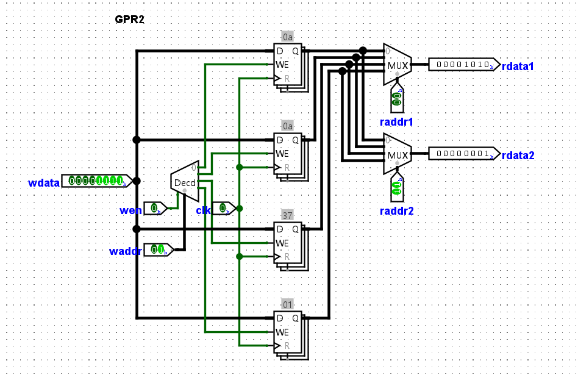

> #### 和数列求和电路进行对比
>
> 在学习数字电路时, 有一道必做题要求你通过寄存器和加法器, 计算出`1+2+...+10`的结果. 现在你用sCPU完成了同样的计算, 尝试对比两个方案各有什么优点和缺点.
>
> ##### 使用寄存器和加法器实现的电路
>
> 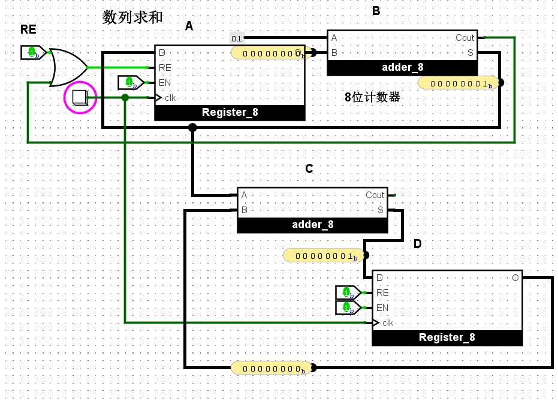
>
> 使用寄存器和加法器实现的电路更简单，需要手动点击10次按钮，或者10个时钟周期暂停，即可得到结果，但是不太好修改，就只能顺序的加，当然也能修改，但是电路也需要进行一些修改，除了常数外，还需要人工记录几个周期出结果
>
> 虽然sCPU的更复杂，但是它更通用，也不用担心没有记录时钟周期数得不出结果，修改也只需要改ROM里的指令即可