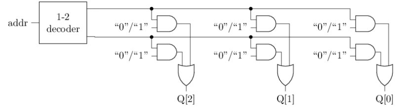
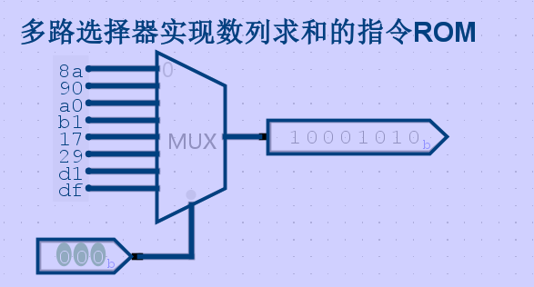

# 支持数列求和的简单处理器

通过ISA和状态机模型, 我们已经了解程序如何执行. 此外, 我们也已经学习了数字逻辑电路的基础知识. 现在是时候用数字电路实现一个CPU了!

在此之前, 我们需要再次明确需要实现的指令集sISA的细节. 和上一小节相比, 此处还约定了一些寄存器的位宽:

- PC位宽为4位, 初值为`0`

- GPR有4个, 位宽均为8位

- 支持如下3条指令

  ```text
   7  6 5  4 3   2 1   0
  +----+----+-----+-----+
  | 00 | rd | rs1 | rs2 | R[rd]=R[rs1]+R[rs2]       add指令, 寄存器相加
  +----+----+-----+-----+
  | 10 | rd |    imm    | R[rd]=imm                 li指令, 装入立即数, 高位补0
  +----+----+-----+-----+
  | 11 |   addr   | rs2 | if (R[0]!=R[rs2]) PC=addr bner0指令, 若不等于R[0]则跳转
  +----+----------+-----+
  ```

我们将这个用数字电路实现的sISA指令集的CPU称为sCPU. 要实现sCPU, 我们需要用数字电路实现sISA中的每一个概念. 为了简单起见, 我们先从最简单的`li`指令开始考虑, 也即, 先实现一个只支持`li`指令的sCPU

## 只有一条指令的sCPU

我们先从ISA的状态机模型回顾执行一条`li`指令的具体过程. 事实上, 无论是执行什么指令, 其步骤都是类似的, 有一个叫"指令周期"(instruction cycle)的概念专门描述这些步骤:

1. 取指(fetch): 根据当前PC, 在存储器中找到一条指令
2. 译码(decode): 看这条指令具体是什么指令, 操作数是哪些
   - 以`li`指令为例, 操作数需要看立即数是多少, 需要写入哪个目的寄存器
3. 执行(execute): 对操作数进行处理, 必要时更新指定的目的寄存器
4. 更新PC: 让PC指向下一条指令

因此, 我们的目标就是用数字电路实现上述过程的每一个步骤.

### 取指

存储器和寄存器都可以存储信息, 但存储器还支持寻址(addressing), 也即, 存储器中的内容按顺序进行排布, 给出一个地址, 存储器可以读出该地址对应的内容. 我们可以将存储器看成一个由比特构成的矩阵, 矩阵的每一行称为一个存储字(word), 地址就是行的编号, 行的数量也称为存储器的深度(depth). 通常一个存储字包含多位数据, 其位宽称为存储器的宽度(width). 通常用`深度x宽度`表示一个存储器的规格. 例如, 一个`2x3`的存储器排布如下, 其中$b_{(x,y)}$表示第$x$行第$y$列所存储的比特:

| 地址 |              存储字               |
| :--: | :-------------------------------: |
|  0   | $b_{(0,2)}$$b_{(0,1)}$$b_{(0,0)}$ |
|  1   | $b_{(1,2)}$$b_{(1,1)}$$b_{(1,0)}$ |

从功能上划分, 存储器可以分别只读存储器(Read-Only Memory, ROM) 和随机访问存储器(Random Access Memory, RAM), 前者不支持写入, 而后者支持. 对于sISA来说, 因为3条指令都不会访问存储器, 只有取指操作需要从存储器中读出指令, 因此这里可以采用ROM.

一个`2x3`的ROM的结构如下图所示. 左上方的译码器又称"地址译码器". 和地址译码器输出相连的导线称为"字线"(word line), 每条字线对应一个存储字. 和或门输出相连的导线称为"位线"(bit line), 每条位线对应存储字的一位.



给定地址`addr`, 可以读出ROM中的相应存储字, 其工作过程如下. 地址译码器将输入的地址转换成一组独热码, 由于独热码中只有一位有效, 故所有字线中, 只有地址`addr`对应的字线有效, 使得该行中存放的信息可以通过与门. 其余行因字线无效, 存放的信息均被与门过滤为`0`. 被选中的存储字的每一位经过或门传输到位线, 向存储器外部输出.

实际上, 图中的地址译码器, 与门和或门, 在功能上共同构成了一个3位的2选1多路选择器. 因此ROM的读操作也可以看作是从多个存储字中选择一个, 地址`addr`就是多路选择器的选择端, 所有存储字分别作为多路选择器的数据端. 特别地, ROM中存储的信息是直接通过高低电平编码的, 因此ROM从功能上也可以看作是数据端为常数的多路选择器.

> #### 实现取指功能
>
> 通过多路选择器实现一个ROM, 并在其中存放数列求和的指令序列, 然后通过PC寄存器取出指令. 你需要根据你的理解来确定ROM的规格.
>
> 由最上面的指令格式可知，一条指令8位，所以ROM应当有8位
>
> 我们在上一章可以看到数列求和的指令如下，共8条，所以ROM应当是8x8的
>
> ```
> 10001010    # 0: li r0, 10
> 10010000    # 1: li r1, 0
> 10100000    # 2: li r2, 0
> 10110001    # 3: li r3, 1
> 00010111    # 4: add r1, r1, r3
> 00101001    # 5: add r2, r2, r1
> 11010001    # 6: bner0 r1, 4
> 11011111    # 7: bner0 r3, 7
> ```
>
> 则实现如下，使用8位的8选1多路选择器即可，将指令2进制使用常数保存下来作为输入就好了，这样根据地址就可以实现取指了
>
> 