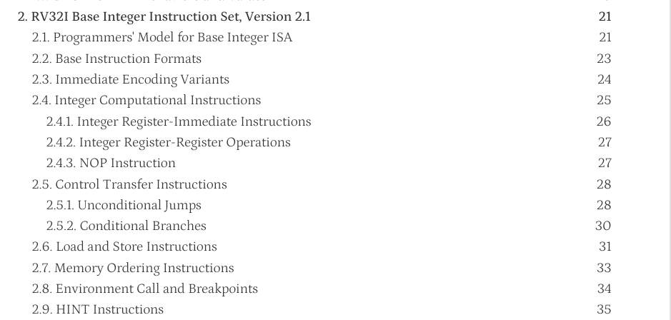
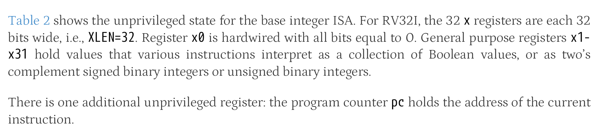
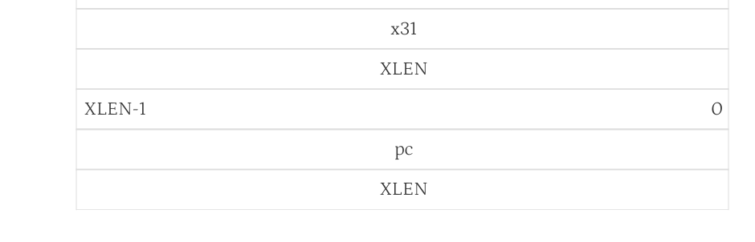
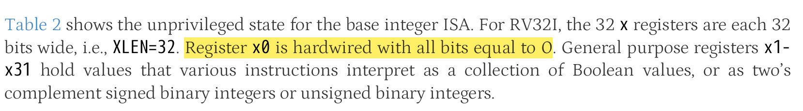
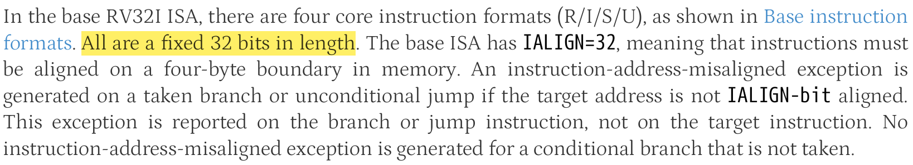
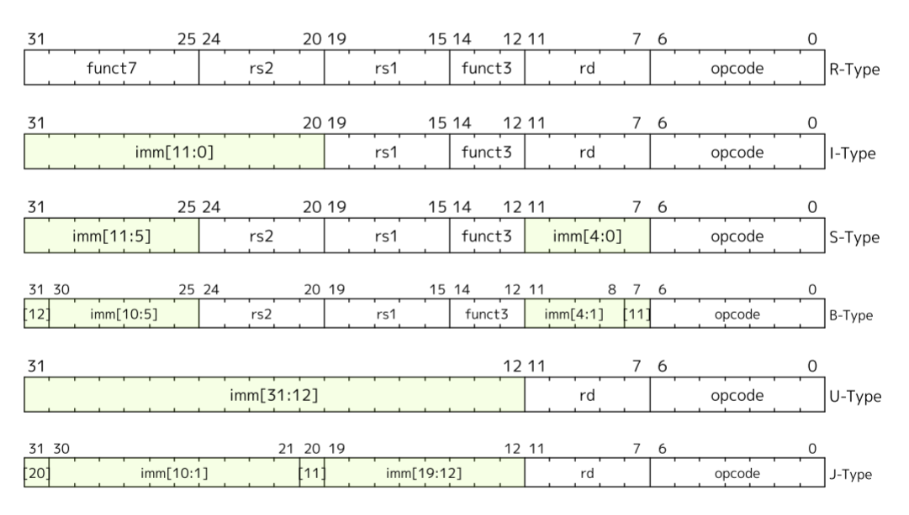
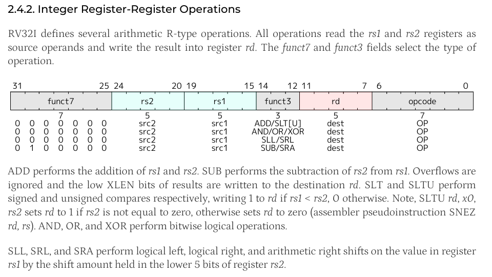
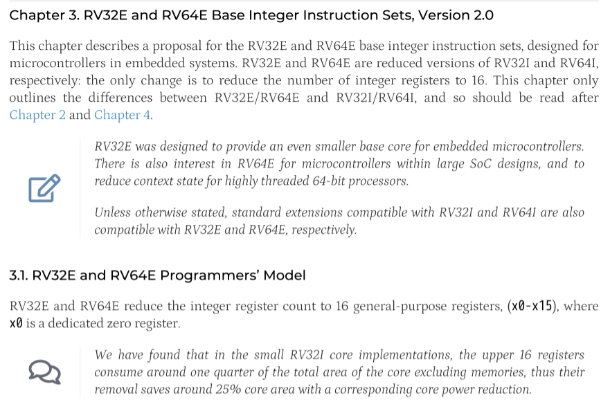

# 功能完备的迷你RISC-V处理器

## 迷你RISC-V指令集

RISC-V是近十年流行起来的开放指令集架构, 它采用模块化的思想, 把指令划分成不同模块, 除了基础指令集RV32I, 还有各种指令扩展, 包括乘除扩展, 浮点扩展, 原子操作扩展等. 开发者可以根据自身需求选择一个或多个扩展, 也可以一个扩展都不选, 这种灵活性受到了开发者的喜爱.

RV32I共有42条指令, 通过实现RV32I, 处理器已经足够完成绝大部分的计算工作. 不过为了进一步降低开发的工作量, 我们提出了一个"迷你RISC-V"指令集minirv, 从RV32I中选出了8条指令, 用它们来替代其他RV32I指令的功能, 使得RV32I能完成的工作, minirv也能完成. 这样, 我们就不必实现完整的42条RV32I指令, 也能让处理器运行更复杂的程序了.

作为一个真实的ISA, RISC-V规范的细节有相应的官方手册来描述. 我们希望大家能养成阅读官方手册的好习惯, 因此你需要下载[RISC-V的官方手册](https://github.com/riscv/riscv-isa-manual/releases/download/20240411/unpriv-isa-asciidoc.pdf). 如果你是第一次接触ISA和处理器设计的相关知识, 你可能会感到理解官方手册的每一处细节对你来说并不容易, 不过我们将引导你从手册中寻找一些RV32I相关的关键信息.

> ### 通过RTFM初步了解RISC-V指令集
>
> 查阅RISC-V手册的目录, 你发现RV32I在哪一章进行介绍? 尝试在该章节中查阅RV32I的相关内容, 回答下列问题:
>
> 1. PC寄存器的位宽是多少?
> 2. GPR共有多少个? 每个GPR的位宽是多少?
> 3. `R[0]`和sISA的`R[0]`有什么不同之处?
> 4. 指令编码的位宽是多少? 指令有多少种基本格式?
> 5. 在指令的基本格式中, 需要多少位来表示一个GPR? 为什么?
> 6. `add`指令的格式具体是什么?
> 7. 还有一种基础指令集称为RV32E, 它和RV32I有什么不同?
>
> RV32I在第2章介绍
>
> 
>
> #### 1.PC的位宽也是32位
>
> 
>
> 这里可以看出XLEN是32位
>
> 
>
> 这里可以看出通用寄存器和pc都是XLEN也就是32位
>
> #### 2.GPR共32个，每个32位
>
> 从上面的表可以知道，从x0-x31共32个通用寄存器
>
> #### 3.这里的R[0]是32位的，且每一位全为0，而sISA里的R[0]是8位，且没有设定初始状态
>
> 
>
> #### 4.指令位宽为32位，共6种基础类型指令
>
> 
>
> 这里说了位宽为32位，下面可以看到共6种基础类型的指令，分别为R,I,S,B,U,J
>
> 
>
> #### 5.需要5位表示一个GPR，因为有32个GPR，所以至少需要5位才能表示
>
> 上图中也可以看出来
>
> #### 6.格式如下图
>
> 
>
> 把rs2的值加上rs1的值求和，并且把低XLEN位放到rd，也就是不管溢出
>
> #### 7.RV32E是RV32I的精简版，寄存器减少到16个，面积也减少了
>
> 