# 功能完备的迷你RISC-V处理器

## 迷你RISC-V指令集

RISC-V是近十年流行起来的开放指令集架构, 它采用模块化的思想, 把指令划分成不同模块, 除了基础指令集RV32I, 还有各种指令扩展, 包括乘除扩展, 浮点扩展, 原子操作扩展等. 开发者可以根据自身需求选择一个或多个扩展, 也可以一个扩展都不选, 这种灵活性受到了开发者的喜爱.

RV32I共有42条指令, 通过实现RV32I, 处理器已经足够完成绝大部分的计算工作. 不过为了进一步降低开发的工作量, 我们提出了一个"迷你RISC-V"指令集minirv, 从RV32I中选出了8条指令, 用它们来替代其他RV32I指令的功能, 使得RV32I能完成的工作, minirv也能完成. 这样, 我们就不必实现完整的42条RV32I指令, 也能让处理器运行更复杂的程序了.

作为一个真实的ISA, RISC-V规范的细节有相应的官方手册来描述. 我们希望大家能养成阅读官方手册的好习惯, 因此你需要下载[RISC-V的官方手册](https://github.com/riscv/riscv-isa-manual/releases/download/20240411/unpriv-isa-asciidoc.pdf). 如果你是第一次接触ISA和处理器设计的相关知识, 你可能会感到理解官方手册的每一处细节对你来说并不容易, 不过我们将引导你从手册中寻找一些RV32I相关的关键信息.

> ### 通过RTFM初步了解RISC-V指令集
>
> 查阅RISC-V手册的目录, 你发现RV32I在哪一章进行介绍? 尝试在该章节中查阅RV32I的相关内容, 回答下列问题:
>
> 1. PC寄存器的位宽是多少?
> 2. GPR共有多少个? 每个GPR的位宽是多少?
> 3. `R[0]`和sISA的`R[0]`有什么不同之处?
> 4. 指令编码的位宽是多少? 指令有多少种基本格式?
> 5. 在指令的基本格式中, 需要多少位来表示一个GPR? 为什么?
> 6. `add`指令的格式具体是什么?
> 7. 还有一种基础指令集称为RV32E, 它和RV32I有什么不同?
>
> RV32I在第2章介绍
>
> 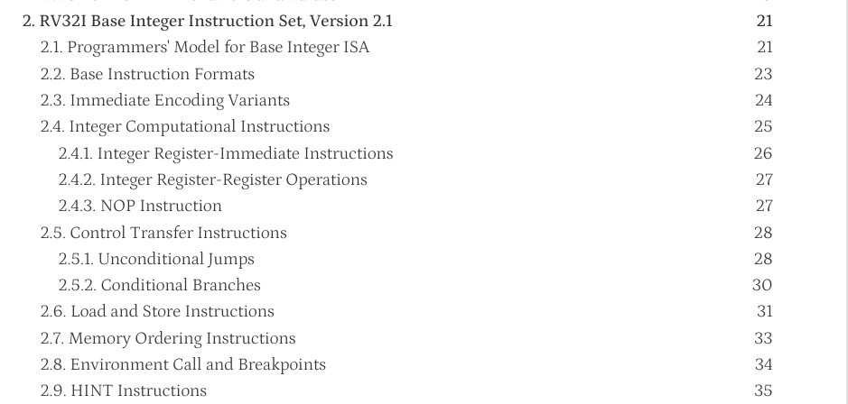
>
> #### 1.PC的位宽也是32位
>
> 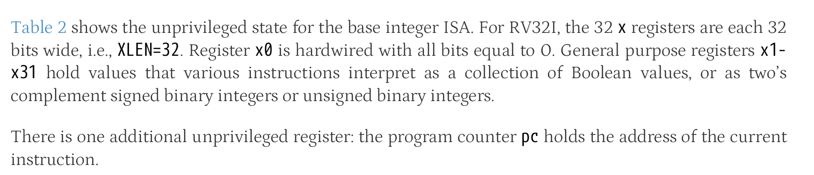
>
> 这里可以看出XLEN是32位
>
> 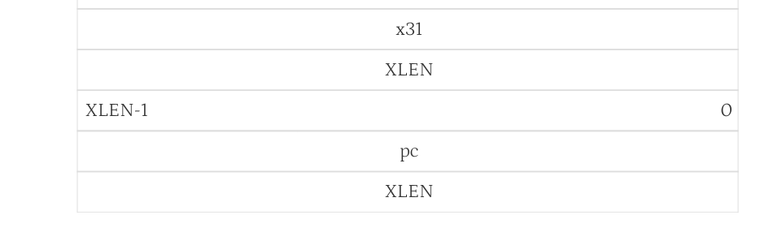
>
> 这里可以看出通用寄存器和pc都是XLEN也就是32位
>
> #### 2.GPR共32个，每个32位
>
> 从上面的表可以知道，从x0-x31共32个通用寄存器
>
> #### 3.这里的R[0]是32位的，且每一位全为0，而sISA里的R[0]是8位，且没有设定初始状态
>
> 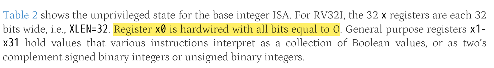
>
> #### 4.指令位宽为32位，共6种基础类型指令
>
> 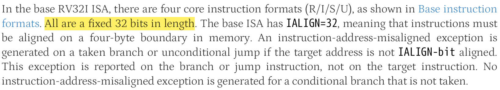
>
> 这里说了位宽为32位，下面可以看到共6种基础类型的指令，分别为R,I,S,B,U,J
>
> 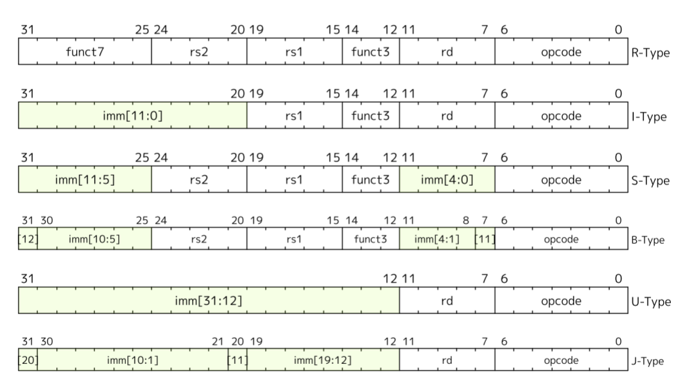
>
> #### 5.需要5位表示一个GPR，因为有32个GPR，所以至少需要5位才能表示
>
> 上图中也可以看出来
>
> #### 6.格式如下图
>
> 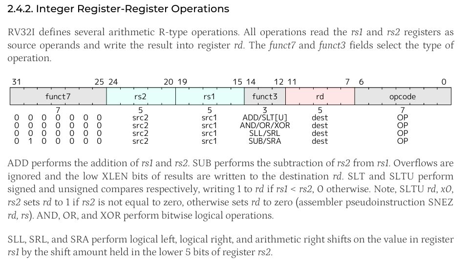
>
> 把rs2的值加上rs1的值求和，并且把低XLEN位放到rd，也就是不管溢出
>
> #### 7.RV32E是RV32I的精简版，寄存器减少到16个，面积也减少了
>
> 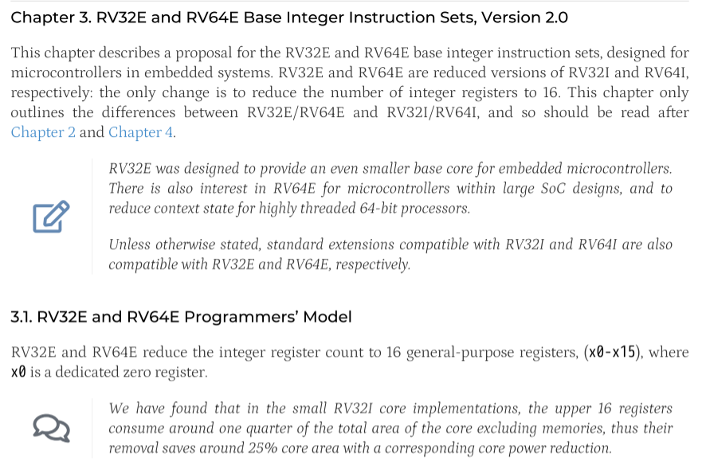

了解RISC-V指令集的一些细节之后, 我们就可以给出minirv这一ISA的规范了, 具体如下:

- PC初值为`0`
- GPR数量与RV32E中定义的GPR数量一致，为16个
- 支持如下8条指令: `add`, `addi`, `lui`, `lw`, `lbu`, `sw`, `sb`, `jalr`
- 其他的ISA细节与RV32I相同

## 只有两条指令的minirv处理器

minirv有8条指令, 我们先实现其中的两条: `addi`, `jalr`. 首先考虑`addi`指令.

### addi指令功能与格式

> #### RTFM(2)
>
> 查阅RISC-V手册, 找到`addi`指令的编码和相应的功能描述. 在第34章`RV32/64G Instruction Set Listings`中有一些指令表, 可以帮助你查阅`addi`指令的编码.
>
> 下面有addi指令的大致编码和功能描述，addi的功能为：首先将立即数进行符号拓展，与rs1中的值相加，不考虑溢出的把结果放入rd，也就是把结果的低32位放到rd
>
> 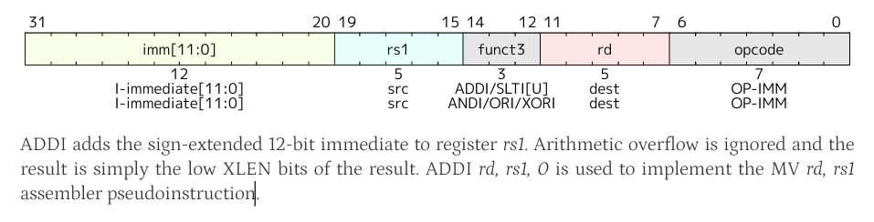
>
> 下面可以看到，0-6位是操作码共7位，7-11是rd共5位，12-14为000，15-19位为rs1，20-31为立即数。主要就是确定了funct3为000，opcode为0010011
>
> 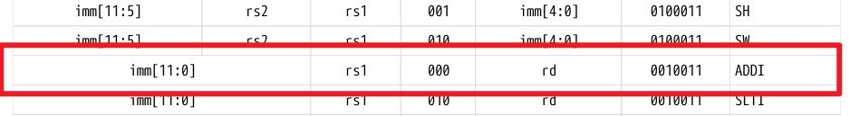

### 取指

针对取指过程, 你需要修改ROM的宽度和PC寄存器的位宽. 你之前使用门电路搭建多路选择器, 已经理解了多路选择器的电路结构, 而搭建更大的多路选择器只是工程上的重复劳动, 对学习并无明显帮助. 因此, 我们建议你使用Logisim提供的`Multiplexer(多路复用器)`组件, 你可以在元件库的`Plexers(复用器)`类别下找到它, 实例化后可以轻松地调整各种参数. 同样地, 你也可以在元件库的`Memory(存储库)`类别下找到`Register(寄存器)`, 用于方便地实现PC寄存器.

不过, 存储器的概念在电路层次和ISA层次都存在, 如何通过电路层次的存储器实现ISA层次的存储器, 就成了需要考虑的问题.


### 存储器规格

> #### RTFM(3)
>
> 为了了解RISC-V对存储器的若干约定, 你需要阅读RISC-V手册第1.4节的第一段, 从ISA的层面了解存储器的规格, 尤其是宽度的定义.
>
> 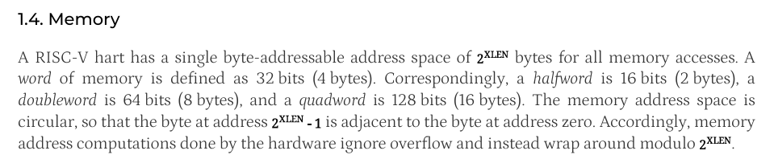
>
> 由于RV32I的XLEN为32，所以存储器的字长也为32为，最大能表示的数据就是$2^{32}-1$了

### 取指的PC寻址

为了便于描述, 我们称RISC-V手册中的定义的存储器宽度为$w_{ISA}$. 显然, 在ISA层面, PC寄存器是以$w_{ISA}$为单位寻址的. 而在电路层次, 如果ROM的宽度$w_{circuit}$和$w_{ISA}$不一致, 则不能直接用PC值对ROM进行寻址. 你需要思考如何在电路层面解决这个问题.

我当前的想法是，我也设计32位的ROM就没有这个问题了吧

或者还是8位的话，每条指令就让pc+4应该也可以

> 看到了jalr的具体指令结构之后，我发现地址还是按字节寻址的，所以pc得+4。那为了使用多路选择器直接译码，我们需要只将PC的高30位传入，相当于除以4了，便是1条指令一条指令执行了

### 译码

针对译码过程, 首先考虑操作码的译码. 虽然Logisim元件库中也有译码器, 但由于minirv中的指令并不多, 操作码编码较为稀疏, 使用译码器反而会带来一些不便. 因此, 我们建议你使用比较器, 直接比较指令中的操作码字段是否与`addi`指令的编码一致, 来进行译码操作. 例如, 可以通过以下操作判断一条指令是否为`addi`指令:

```text
is_addi = (inst[6:0] == ?) && (inst[14:12] == ?)
```

其中`inst`表示取出的指令, `?`需要根据你查阅手册的结果来决定. 你可以在元件库的`Arithmetic(运算器)`类别下找到`Comparator(比较器)`, 用于方便地实现比较功能.

对于addi，这里的？就是0010011

至于操作数的译码, 一个需要注意的是立即数. 由于指令中的立即数位宽较短, 要与位宽较长的GPR进行计算, 先要将立即数扩展成与GPR位宽一致的数据. 通常来说, 扩展方式有两种, 一种是零扩展(zero-extend), 这种方式总是在高位添加`0`, sISA中的`li`指令就是要求对立即数进行零扩展; 另一种是符号扩展(sign-extend), 这是方式是在高位添加补码的符号位. 你可以在元件库的`Wiring(线路)`类别下找到`Bit Extender(位扩展器)`, 可根据配置实现不同的扩展方式.

对于addi，就需要使用符号扩展来实现

### GPR设计

对于GPR, 其设计思路和之前类似, 不过你可以使用元件库中的`Register(寄存器)`, `Multiplexer(多路复用器)`和`Plexers(复用器)`类别下的`Decoder(译码器)`来帮助你节约设计的工作量. 特别地, 译码器中可将`Include Enable?(包含使能?)`属性配置为`Yes(是)`, 此时译码器将多出一个`Enable(启用)`端口, 你可以考虑如何使用它方便地实现写使能的功能. 此外, 在RISC-V中, `R[0]`的功能比较特殊, 你还需要考虑如何正确实现它.

对于R0,我看logisim中的寄存器有一个清除引脚，将其常置为1应该就好了

### jalr的指令格式与功能

> #### RTFM(4)
>
> 查阅RISC-V手册, 找到`jalr`指令的编码和相应的功能描述.
>
> jalr的格式如下，0-6位是操作码，为1100111，7-11是rd，12-14是000，15-19是rs1，20-31是立即数
>
> 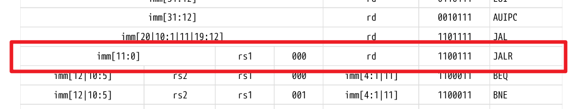
>
> 操作如下
>
> 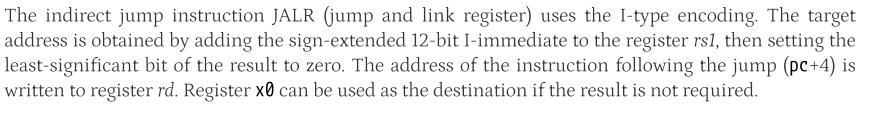
>
> 将立即数进行符号扩展，然后与rs1中的值相加得到跳转的目的地址，但是需要将目的地址的最低位置零
>
> > 虽然RV32I中指令为32位定长，但是也有扩展的16位指令，在1.5节可以看到，如下图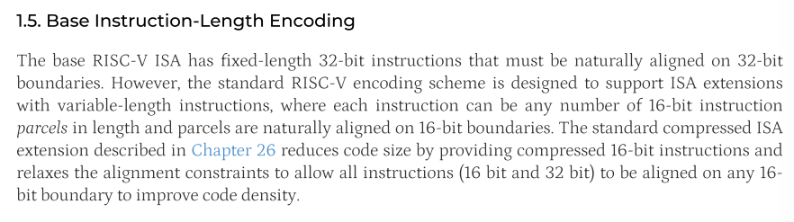
> >
> > 所以说正常情况下最低位只可能是0，将最低位置0就可以简化硬件，还可以让程序员在编码时记一个备注信息
> >
> > 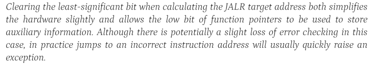
>
> 此外，如果rd不是R0的话，在跳转前会将自己的下一条指令位置(也就是当前PC+4)存入rd(其实R0也会存，但是R0一直是0，相当于没存)

### 实现两条指令的minirv处理器

> 理解`addi`和`jalr`指令的功能后, 根据你之前设计sISA处理器的经验, 尝试设计一个支持这两条RISC-V指令的处理器.
>
> 由于GPR需要进行较多的连线工作, 为了减轻大家的负担, 我们准备了一个预先完成大量连线工作的[GPR子模块](https://ysyx.oscc.cc/slides/2407/resources/code/logisim/GPR.circ). 下载后, 通过Logisim打开文件`GPR.circ`, 即可看到GPR的电路设计, 你可以整体选择这个电路后, 通过复制和粘贴将其加入到你工程中. 不过, 这个电路并没有实现GPR的完整功能, 你需要根据你对GPR的理解完善它.
>
> 为了帮助你对处理器进行简单的测试, 我们准备了如下测试程序. 在下面的汇编指令中, GPR采用了ABI助记符(mnemonic), 名称更能反映其功能, 例如, 用`zero`表示编号为`0`的GPR. 汇编指令中还有`a0`和`ra`, 你可以通过解析相应的指令编码得知对应的GPR编号.
>
> ```text
> 00000000 <_start>:
>    0:	01400513          	addi	a0,zero,20
>    4:	010000e7          	jalr	ra,16(zero) # 10 <fun>
>    8:	00c000e7          	jalr	ra,12(zero) # c <halt>
> 
> 0000000c <halt>:
>    c:	00c00067          	jalr	zero,12(zero) # c <halt>
> 
> 00000010 <fun>:
>   10:	00a50513          	addi	a0,a0,10
>   14:	00008067          	jalr	zero,0(ra)
> ```
>
> 尝试通过指令集的状态机理解这个程序的功能. 理解后, 将程序其放置在ROM中, 并尝试运行你的处理器, 然后检查处理器的运行结果是否符合预期.

#### GPR实现

首先先下载讲义里给的GPR.circ，然后实现读写功能

首先是增加读写端口，虽然我们采用了RV32E的16个寄存器，但是由于指令中寄存器依旧是5位，所以传入依旧是5位，需要进行分线处理，将最高位空出来即可

写端口一个waddr一个wen

读端口分别位raddr1，rdata1和raddr2，radata2

然后由于R0必须一直置为0，所以在R0的清除端接一个常数1即可

具体如下图

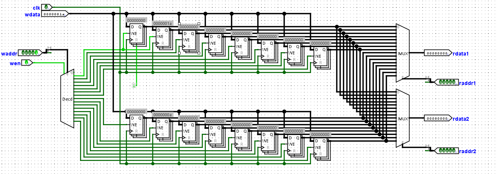

#### ROM_t1

```
00000000 <_start>:
   0:	01400513          	addi	a0,zero,20
   4:	010000e7          	jalr	ra,16(zero) # 10 <fun>
   8:	00c000e7          	jalr	ra,12(zero) # c <halt>

0000000c <halt>:
   c:	00c00067          	jalr	zero,12(zero) # c <halt>

00000010 <fun>:
  10:	00a50513          	addi	a0,a0,10
  14:	00008067          	jalr	zero,0(ra)
```

将以上指令存入ROM，如下

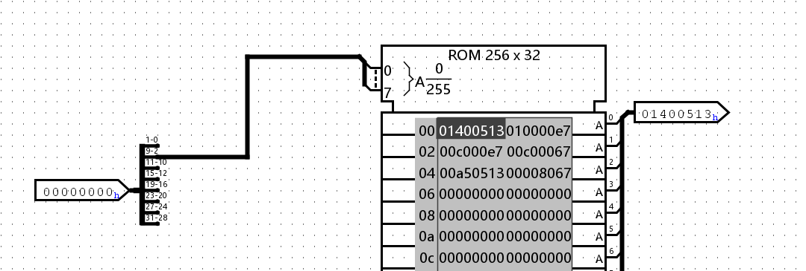

由于一条指令4个字节，所以地址的低2位不用考虑

由于logisim中最多只有24位的ROM，且当前指令不多，只需要一部分地址线就好了

#### addi的取数和执行

这部分封装成了一个子电路，根据指令格式获得rd和rs1以及立即数

传入读到的rs1的数据加上拓展后的立即数，输出结果rddata

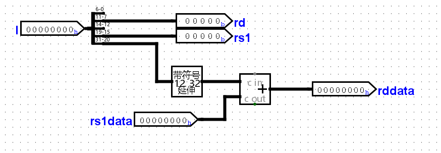

#### jalr的取数和执行

依照格式获取rd，rs1和立即数

获取读到rs1的数据rsdata1与立即数相加，作为新的pc输出为newpc

并将当前的下一条指令的值计算出来，记为rddata，之后存入rd

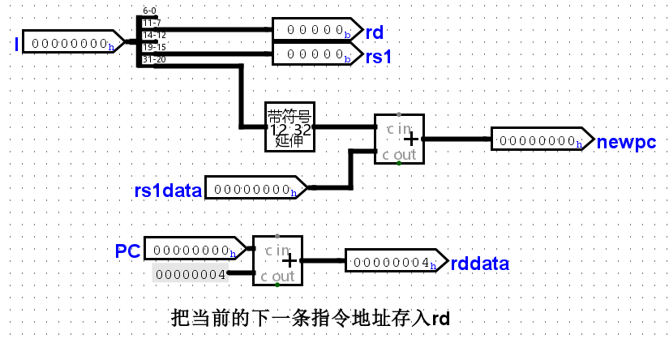

#### PC的更新

为了简化电路，采用了通道来简化

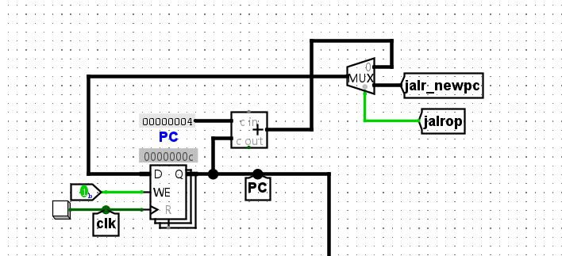

当指令为jalr时，PC更新为newpc，其它情况pc+4即可

#### 取指和译码

根据PC去ROM_t1取出指令，并且拿opcode(0-6)和funct3(12-14)去和手册比较，都匹配了就知道是哪个指令了，分别记为jalrop和addiop，哪个为1代表当前是哪个指令

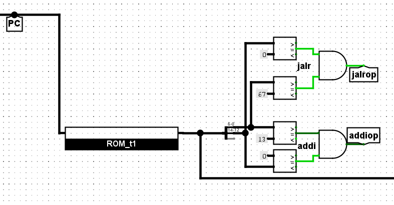

#### 使用通道传出数据

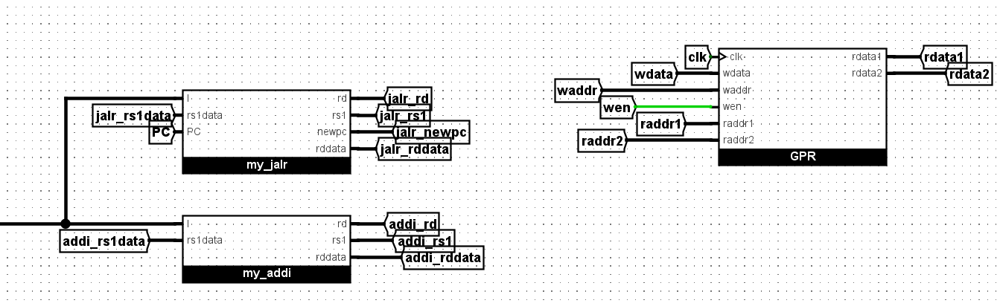

如图，封装好的子电路以及GPR的所有输入都用通道记录下来，便于实现写和读

#### 写端口

当前两条指令都可能会写如，需要写使能，用或门即可实现

写地址waddr，需要判断是那一条指令的rd，所以需要先与再或

写的数据wdata，同理

以上都是传入到GPR，所以是往右传

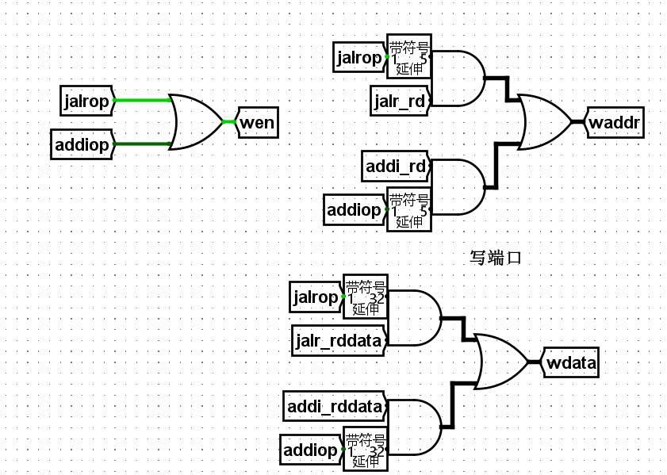

#### 读端口

读地址的处理和写地址相同，主要看写数据的区别

由于我们是从GPR读到数据，传入指令的子电路，所以数据是一样的，我们需要根据当前指令传入，使用多路分离器实现即可

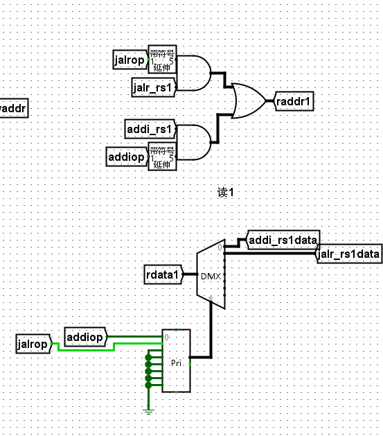

#### 指令执行结果

> 为了帮助你对处理器进行简单的测试, 我们准备了如下测试程序. 在下面的汇编指令中, GPR采用了ABI助记符(mnemonic), 名称更能反映其功能, 例如, 用`zero`表示编号为`0`的GPR. 汇编指令中还有`a0`和`ra`, 你可以通过解析相应的指令编码得知对应的GPR编号.
>
> ```text
> 00000000 <_start>:
>    0:	01400513          	addi	a0,zero,20
>    4:	010000e7          	jalr	ra,16(zero) # 10 <fun>
>    8:	00c000e7          	jalr	ra,12(zero) # c <halt>
> 
> 0000000c <halt>:
>    c:	00c00067          	jalr	zero,12(zero) # c <halt>
> 
> 00000010 <fun>:
>   10:	00a50513          	addi	a0,a0,10
>   14:	00008067          	jalr	zero,0(ra)
> ```
>
> 尝试通过指令集的状态机理解这个程序的功能. 理解后, 将程序其放置在ROM中, 并尝试运行你的处理器, 然后检查处理器的运行结果是否符合预期.

可以看出指令先让a0(R10)加20，也就0x16

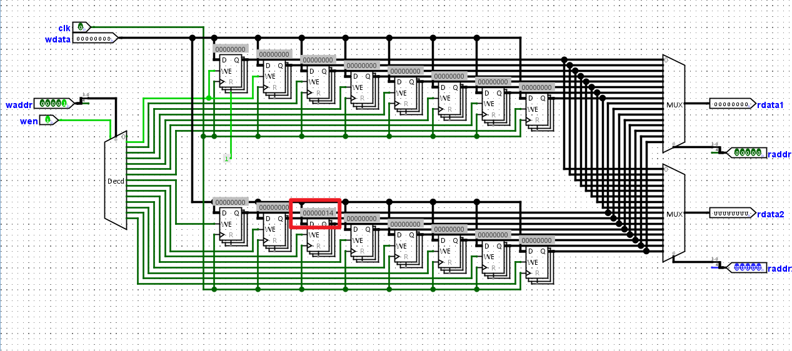

然后跳转到16，也即0x10，把跳转前的下一条地址存入ra(R0)

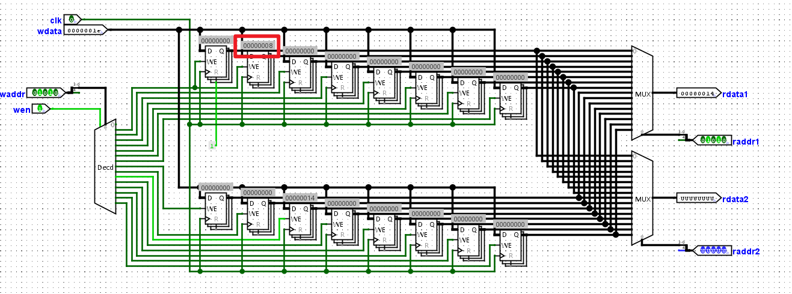

执行0x10，给a0(R10)再加10，即为0x1e

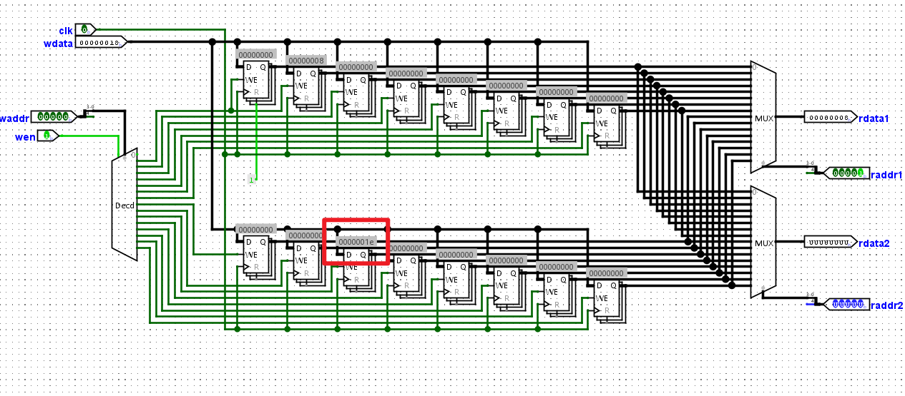

执行0x14，跳到ra(R1)存的地址8，zero(R0)不用存

执行0x8，跳到0xc，c存入ra(R1)

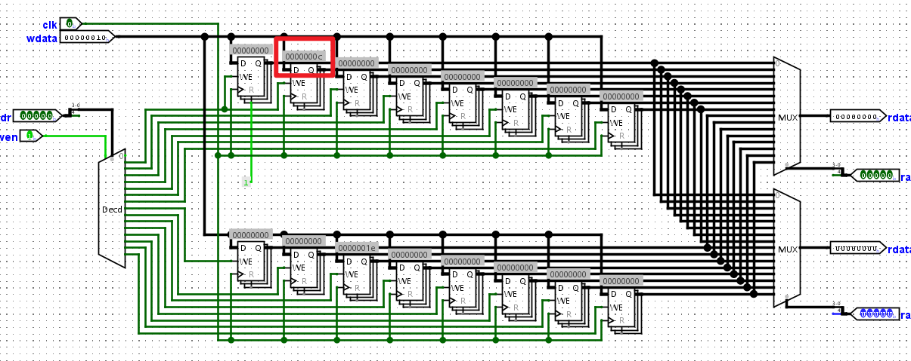

然后就一直执行0xc，停住了,也不存数据了

#### 测试addi指令

在上述测试程序中, `addi`指令的立即数比较小. 为了测试符号扩展的实现是否正确, 你需要让处理器执行一些立即数为负数的`addi`指令. 尝试编写若干条这种类型的`addi`指令, 并放置到ROM中, 检查你的实现是否正确.

把指令改为下面的

```
00000000 <_start>:
   0:	ffe00513          	addi	a0,zero,-2
   4:	010000e7          	jalr	ra,16(zero) # 10 <fun>
   8:	00c000e7          	jalr	ra,12(zero) # c <halt>

0000000c <halt>:
   c:	00c00067          	jalr	zero,12(zero) # c <halt>

00000010 <fun>:
  10:	00a50513          	addi	a0,a0,10
  14:	00008067          	jalr	zero,0(ra)
```

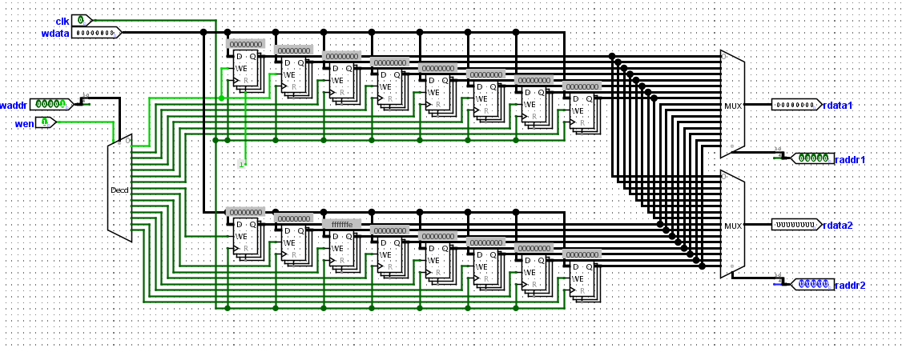

R10第一条执行后变为-2，执行0x10后最终变为8

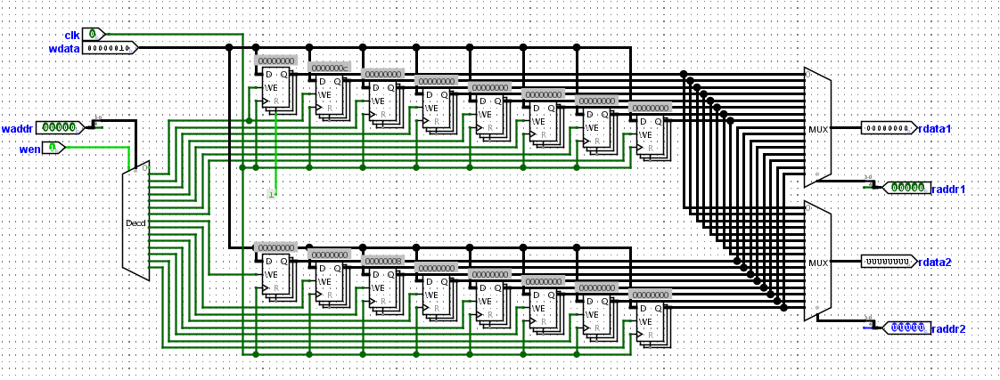

## 实现完整的minirv处理器


###  add和lui

接下来, 我们考虑如何实现minirv的剩余6条指令. RTFM后你会发现, `add`指令的功能与sISA中的`add`指令非常类似, 因此不难实现. 而对于`lui`指令, 则和sISA中的`li`指令很相似, 只不过要考虑不同类型的立即数格式.

实现`add`和`lui`指令. 实现后, 尝试编写一些简单的指令序列放置到ROM中, 来初步检查你的实现是否正确.

#### add

指令格式如下

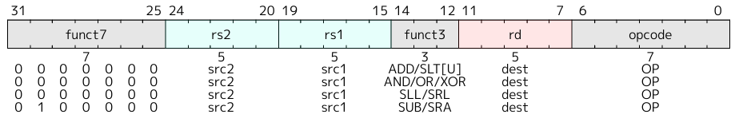


funct7为7个0，funct3为3个0，opcode为0110011

指令的功能为将rs1和rs2的结果求和后存入rd

译码和实现的子电路如下

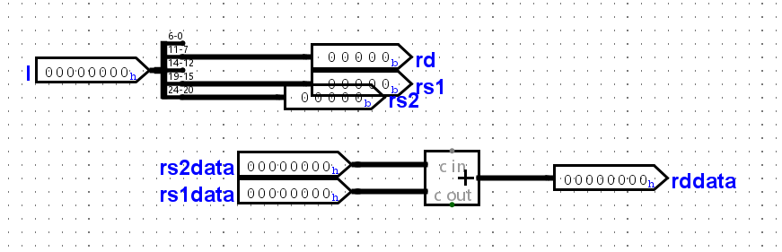

#### lui

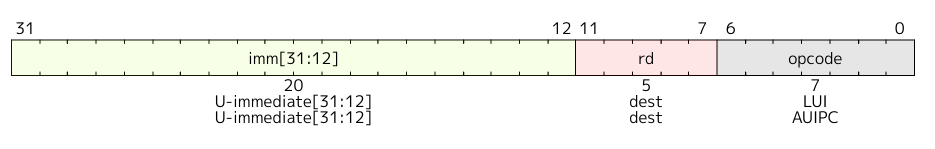


20位的立即数，5位的rd，opcode为0110111

指令的功能是将立即数作为高20位，给其低位12位补0即可

译码和实现的子电路如下00010010001101000101 000010110111

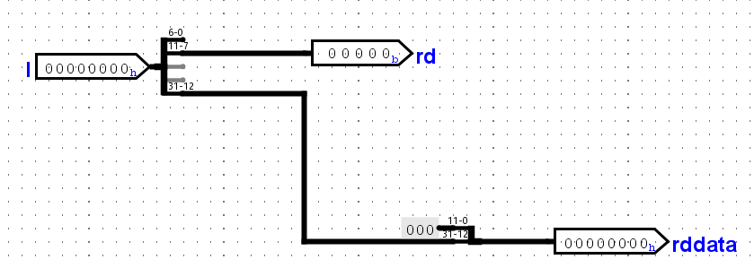

#### 整体实现

如下图，使用通道就很好拓展

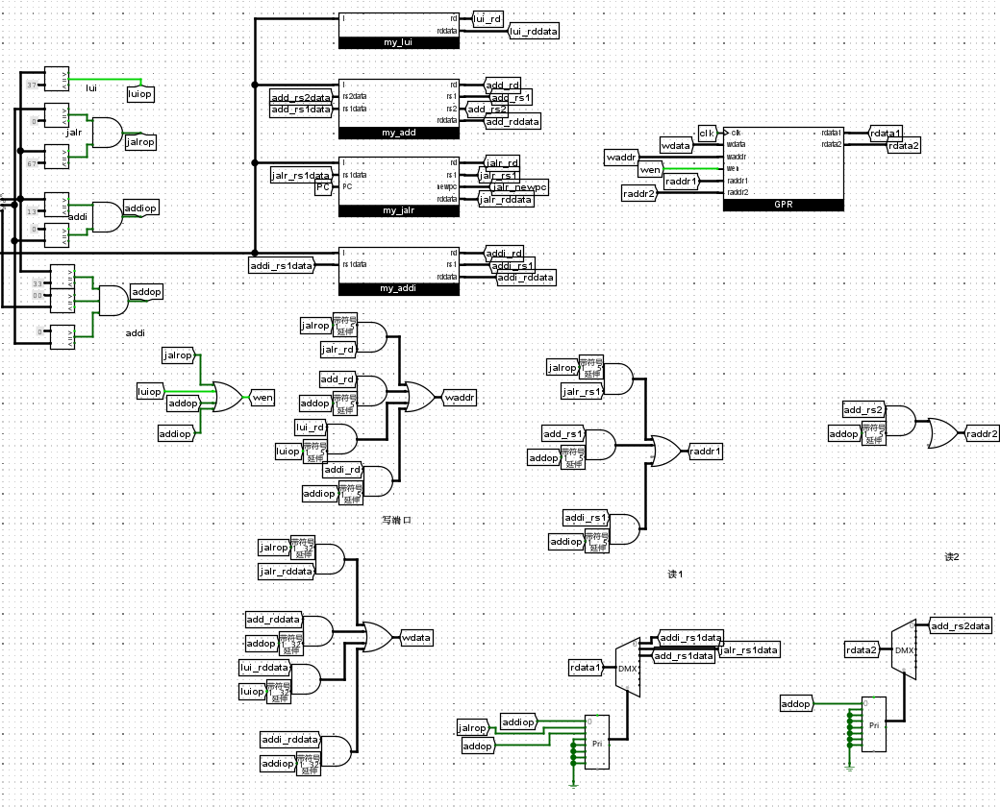

在写端口增加add和lui

读1端口增加add

增加读2端口，加入add的信息

#### 程序测试

```
0:    123450B7    lui r1, 0x12345
4:    67808093    addi r1, r1, 0x678
8:    01000113    addi r2, r0, 16
c:    002081b3    add r3, r1, r2
10:   00010067    jalr r0, 0(r2)
```

123450B7：00010010001101000101 00001 0110111

将0x12345作为高20位存入R1

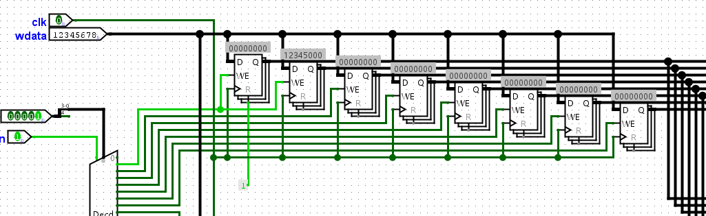

67808093：011001111000 00001 000 00001 0010011

将R1与0x678与R1相加，此时R1为0x12345678

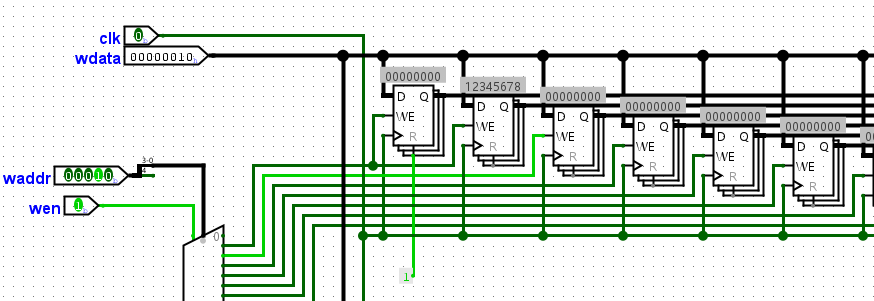

01000113：000000010000 00000 000 00010 0010011

将R0与16(0x10)的和存入R2

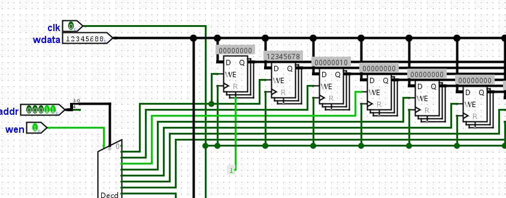

002081b3：0000000 00010 00001 000 00011 0110011

把R1和R2的值相加，存入R3

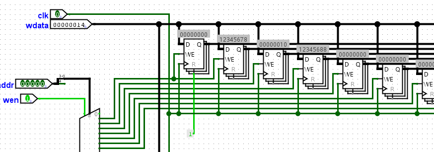

00010067：000000000000 000010 000 00000 1100111

跳转到R2存储的位置，也即当前位置，并不保存到寄存器，实际上实现了停机


### 存储器实现

剩余的4条指令都是访存指令, 它们都需要访问存储器. 访存操作分为读内存(load)和写内存(store)两种. 由于store指令需要写入内存, 因此ROM无法满足这一要求, 我们需要采用RAM.

你之前已经学习过RAM的工作原理了, 但为了方便支持更大的程序, 我们还是使用Logisim提供的`RAM`组件, 你可以在元件库的`Memory(存储库)`类别下找到它. 实例化后, 你需要按照以下配置修改其中的一些关键参数:

- Address Bit Width(地址位宽) - 根据后续的程序大小和你的理解进行配置
- Data Bit Width(数据位宽) - 32
- Enables(启用方式) - Use byte enables(使用字节启用)
- Ram type(RAM型) - non volatile(非易失性)
- Use clear pin(使用清除销) - No(否)
- Trigger(触发器) - Rising Edge(上升沿)
- Asynchronous read(异步读取) - Yes(是)
- Read write control(读写控制) - Use byte enables(使用字节启用)
- Data bus implementation(数据总线实现) - Separate data bus for read and write(用于读写的独立数据总线)

完成上述配置工作后, RAM组件的端口包括: 读写地址`A`, 写使能`WE`, 读使能`OE`, 字节写使能`BE0`, `BE1`, `BE2`, `BE3`, 写数据`D`(输入), 读数据`D`(输出), 以及时钟. 在进一步考虑如何将RAM接入处理器的数据通路前, 你还需要了解RISC-V对存储器的约定, 以及相应访存指令的具体行为.

### lw,  lbu,  sw和sb的指令格式与功能


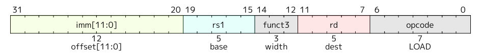

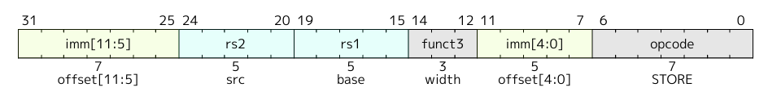

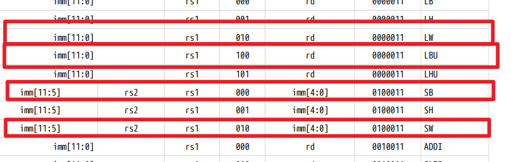


> **Load and store instructions transfer a value between the registers and memory. Loads are encoded in** *the I-type format and stores are S-type. The effective address is obtained by adding register rs1 to the sign-extended 12-bit offset. Loads copy a value from memory to register rd. Stores copy the value in register rs2 to memory.*
>
> *The LW instruction loads a 32-bit value from memory into rd. LH loads a 16-bit value from memory, then sign-extends to 32-bits before storing in rd. LHU loads a 16-bit value from memory but then zero extends to 32-bits before storing in rd. LB and LBU are defined analogously for 8-bit values. The SW, SH, and SB instructions store 32-bit, 16-bit, and 8-bit values from the low bits of register rs2 to* **memory.**

#### lw

操作码0000011，funct3为010

它从内存中直接复制一个32位的值并存入目标寄存器rd

#### LBU

操作码0000011，funct3为100

从内存中读取一个8位的无符号数的数据出来，并且进行0拓展到32位

> 这两个是load指令，获取目的地址都是直接将offset(也即指令的高12位)进行符号拓展，与rs1相加得到

#### SW

操作码为0100011，funct3为010

把寄存器的rs2的值的32位读入内存

#### SB

操作码为0100011，funct3为000操作码

把寄存器的rs2的值的低8位读入内存

> 这两个是store指令，获取目的地址都是直接将offset(也即指令的高7位与7-11位组合而成)进行符号拓展，与rs1相加得到